## Prerequisites  
 - **Proficiency:** Intermediate
 - **Tutorials:** [Creating OData based on CDS Views. ](http://sap.com/developer/tutorials/s4hana-cds-creating-odata-service.html)

## Next Steps
 [Building simple tiles](http://sap.com/developer/tutorials/s4hana-cds-building-simple-tile.html)

## Details
### You will learn  
How to create a tile within Fiori Launchpad

### Time to Complete
**15 Min**.

---

[ACCORDION-BEGIN [Step 1: ](Access the Fiori Launchpad Designer)]

Access the Fiori Launchpad Designer by opening the welcome page that came with S/4HANA trial landscape.

From the above welcome page, click on the link (1 in the screenshot above) to access the Login screen of the Fiori Launchpad Designer.

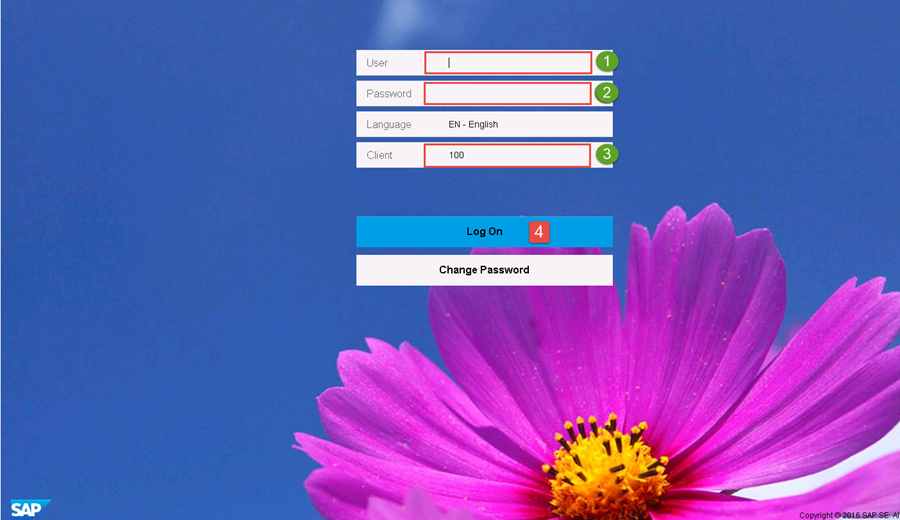

Start the Fiori Launchpad Logon and log on to the preconfigured system with the following:
- User:     `S4H`
- Password: `Welcome1`
- Client:   `100`

Then click the **Log On** button.

Now you have to append the URL to the Fiori Launchpad Designer to SAP Launchpad URL. The part that needs to be appended is this:

`/sap/bc/ui5_ui5/sap/arsrvc_upb_admn/main.html`

Click **Enter**.

You will now see many tiles because new profiles were already assigned to the user `S4H`.

    

You can open the customization scope by appending  the following to the URL :
`?scope=CUST`

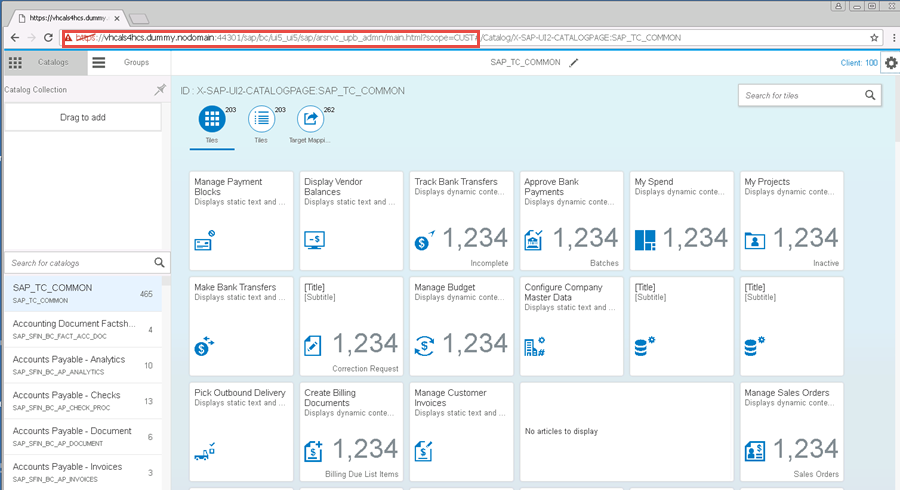

The Configuration scope can be accessed by appending `?scope=CONF` to the URL. It is for system-specific settings.

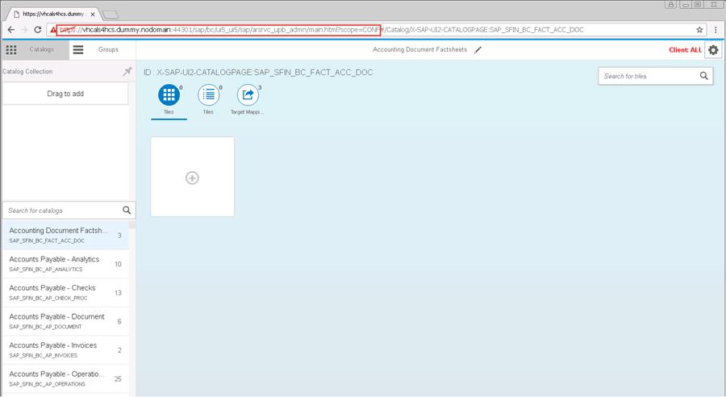

[DONE]
[ACCORDION-END]

[ACCORDION-BEGIN [Step 2: ](Assign roles)]

Now let's assign some roles to the Business user. To achieve this you have to log in in the SAP GUI (User: `SH4`, Client: `100`, Password:`Wecome1`)

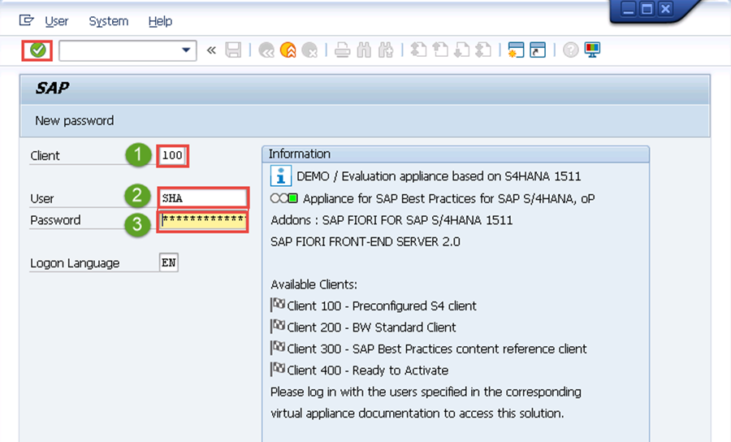
After successful login, enter the ABAP transaction `su01` (1 in the next screenshot) for user maintenance and click **Enter**.

While in the transaction `su01` maintain the field User with `SH4` (1 in the screenshot)

Now click on the **Change** button (2 in the screenshot) to maintain fields and add the roles `SAP_BR_PURCHASER` and `SAP_BR_PURCHASING_MANAGER` in the tab Roles:

Tab Roles

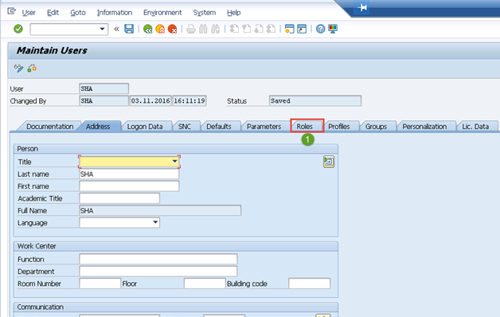

Status Roles

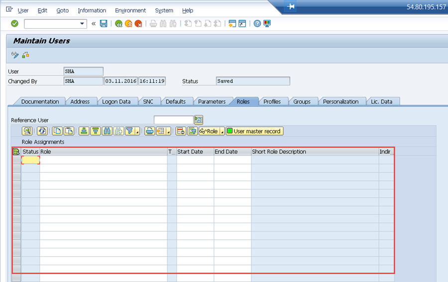

Press the F4 help

[DONE]
[ACCORDION-END]

[ACCORDION-BEGIN [Step 3: ](Role Name window)]

Here switch to the tab Roles (1) and maintain the field Single Role

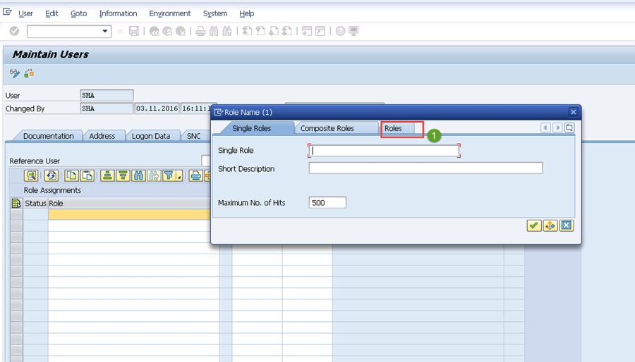   

Maintain the field single role with `SAP_BR*` (1) and click  **OK** button (see number 2 in the following screenshot).   

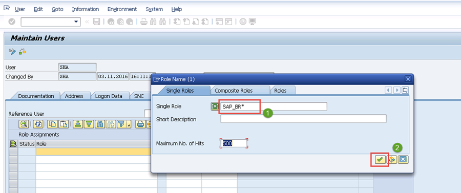

On the Tab Single Roles of the window Roles Name, check the lines (see 1 in the screenshot):
  `SAP_BR_PURCHASER`
  `SAP_BR_PURCHASING_MANAGER`
and click on the OK button (2 in the screenshot)

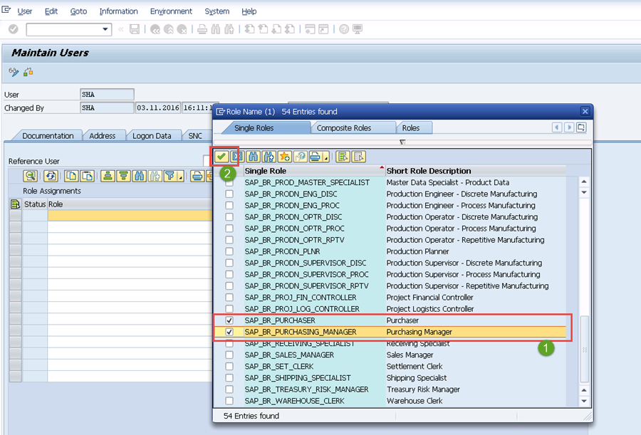

You should have something like this

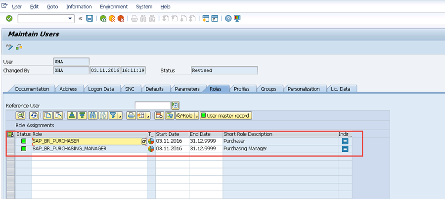

[DONE]
[ACCORDION-END]

[ACCORDION-BEGIN [Step 4: ](Add more roles)]

Add additional role following the steps described above: `SAP_BR_ANALYTICS_SPECIALIST`

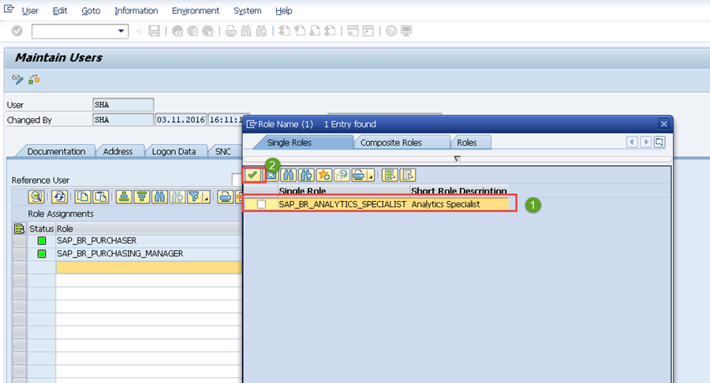

Add additional role following the steps described above : `SAP_BR_EMPLOYEE`

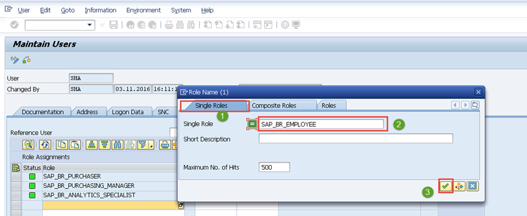

The following screen shows the role added.

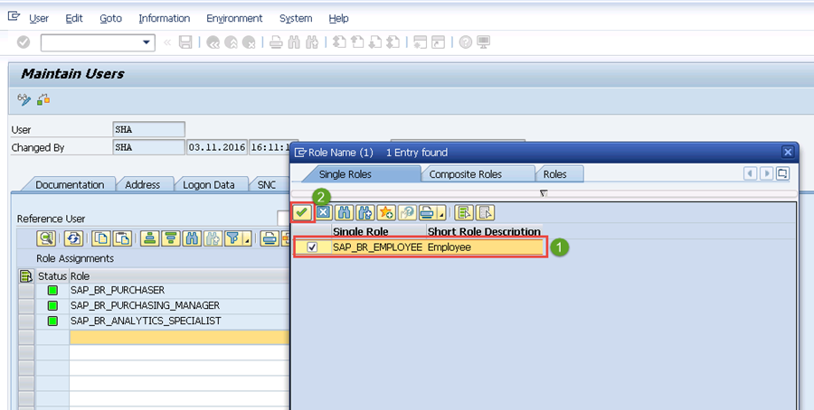

Add additional role following the steps described above : `ZSAP_UI2_ADMIN_700`

The following screen shows the role added.

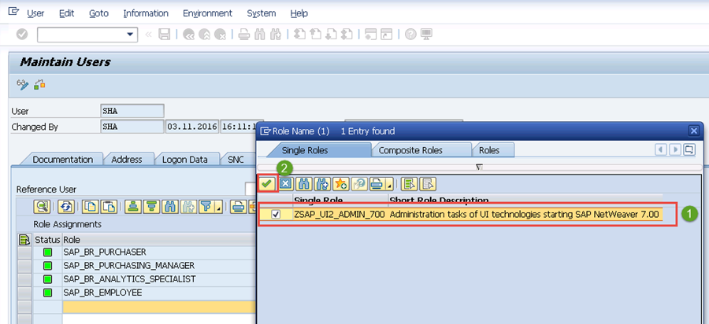

Add additional role following the steps described above: `ZSAP_UI2_USER_700`

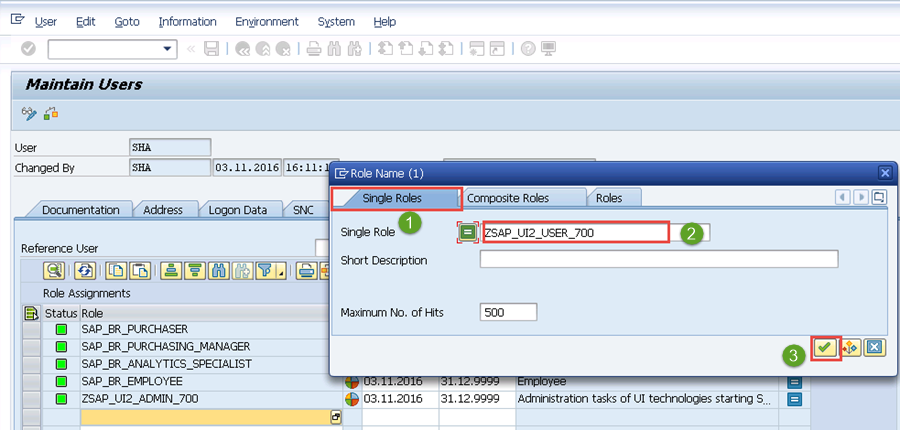                                                                            
The following screen shows the role added.

Add additional role following the steps described above : `Z_RDS_BR`

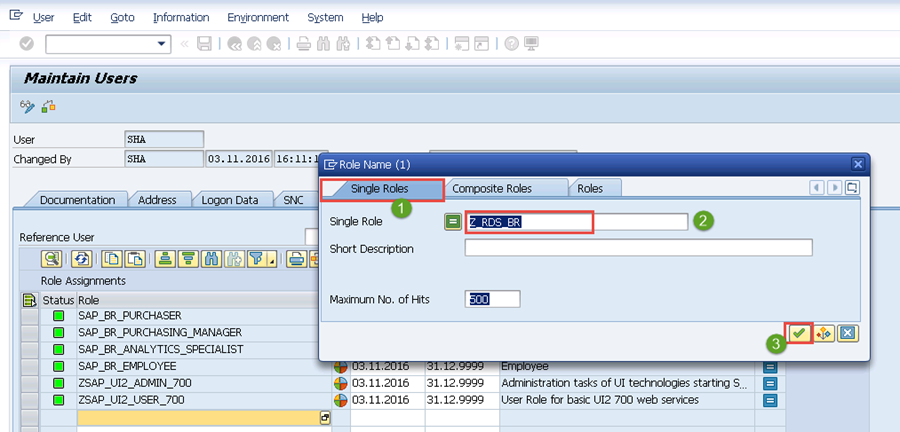

The following screen shows the role added.

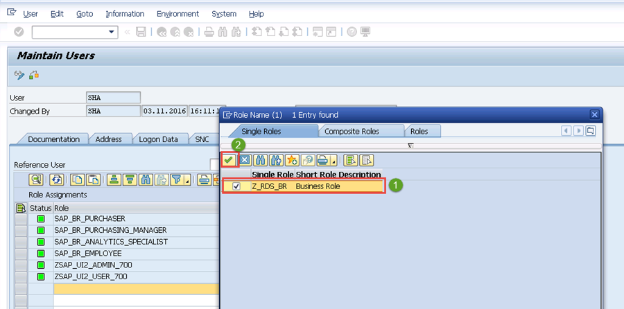

Add additional role following the steps described above: `Z_RT_ADMIN`

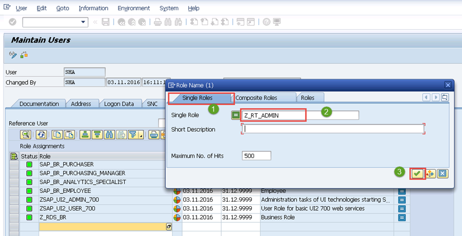  

The following screen shows the role added.

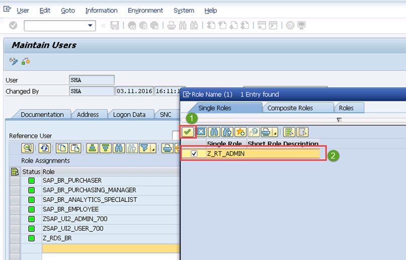  

Save the changes you made and close the SAP Logon.

[DONE]
[ACCORDION-END]

[ACCORDION-BEGIN [Step 5: ](Make final checks)]

Go back to Fiori Launchpad  Designer, restart, and log in by clicking on the link (1) to access the Login screen of the Fiori Launchpad Designer.

While in the Fiori Launchpad Designer you will see several groups related to purchasing Business Roles as well as some groups for creating KPI.

You will also see the group `Z_RDS_BCG`.

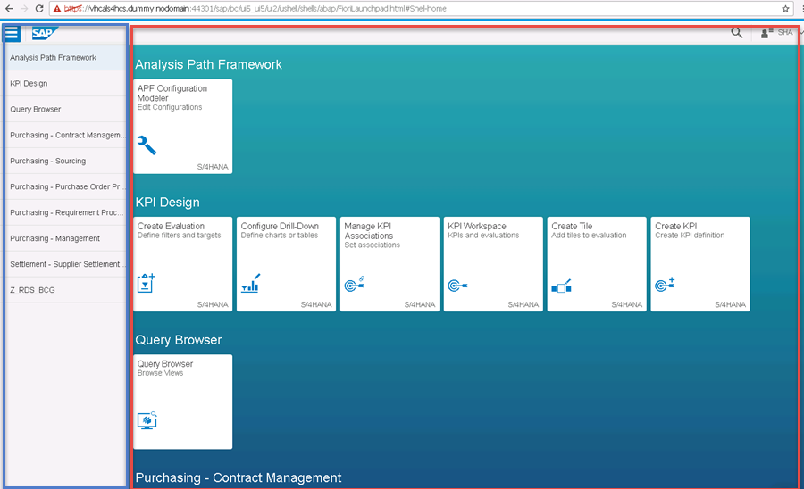

[DONE]
[ACCORDION-END]

## Next Steps

[Building simple tile](http://go.sap.com/developer/tutorials/s4hana-cds-building-simple-tile.html)
