## Prerequisites  
 - **Tutorials:**
 - [Creating basic view](https://www.sap.com/developer/tutorials/s4hana-cds-creating-basic-view.html)  
 - [Creating consumption view](https://www.sap.com/developer/tutorials/s4hana-cds-creating-consumption-view.html)

## Next Steps
[Creating views association](https://www.sap.com/developer/tutorials/s4hana-cds-associations.html)


## Details
### You will learn  
  - How to prepare a basic view for Association; in other words, for joining with other views

---

[ACCORDION-BEGIN [Step 1: ](Prepare the ABAP perspective)]

Make sure that your Eclipse Framework from the S/4HANA instance is opened in the ABAP perspective and that the basic view (`ZXSHI_AIRLINE`) from the previous S/4HANA tutorials is available:

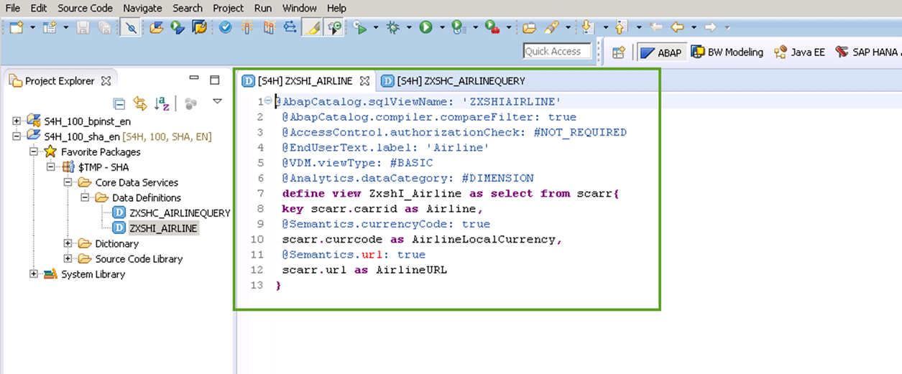

You are now in the ABAP Eclipse perspective. Make sure you are in the Project Explorer tab. Here you will create in the `TMP-SHA` Package a new ABAP object for type DDL source.

Select the package **`TMP-SHA`** and expand it. Then expand the  **Code Data Services** folder as well. From there select the subfolder **Data Definitions** (1 in the screenshot below).  Right-click on the subfolder **Data Definitions** (2 in the screenshot),  select **DDL Source** and press **Finish**.  


[ACCORDION-END]

[ACCORDION-BEGIN [Step 2: ](Create a DDL source)]

In the new window DDL Source (Create a DDL Source), the Project is called `S4H_100_sha_en` and the Package is called `$TMP`. Enter `Airline text, private view, VDM interface view`  as the Description and `ZXSH_I_AIRLINETEXT` as the Name and click **Finish**.

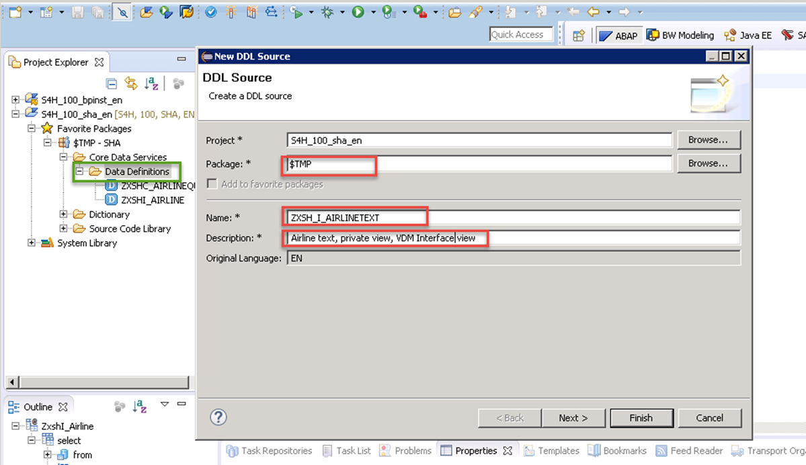

Edited fields:

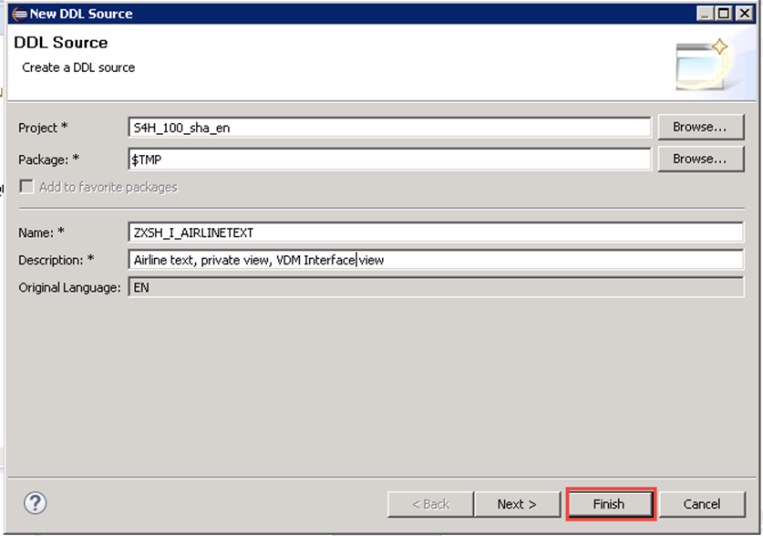

Code for the newly created view named `ZXSH_I_AIRLINETEXT` is generated:

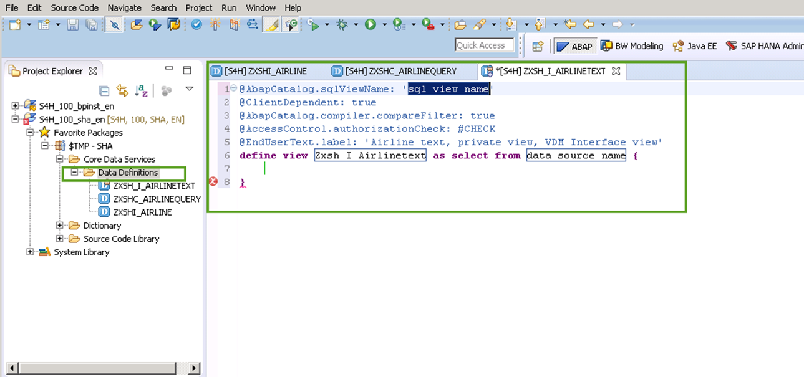


[ACCORDION-END]

[ACCORDION-BEGIN [Step 3: ](Edit the generated code)]

In the generated code, replace these values:

Line | Property                    | Current value  | New value
:--- | :-------------------------- | :------------- | :------------
1 | `@AbapCatalog.sqlViewName:`  | '`sql view name`' | '`ZXSH_IAIRLINET`'
3 | delete entire line 3         |                 |          |
4 | `@AccessControl.authorizationCheck:` | `#CHECK` | `#NOT_REQUIRED`
5 | `@EndUserText.label:` | `Airline text, private view, VDM Interface view` | `Airline Name`
6 | select from | `data source name` | `scarr`


Edited code:


[ACCORDION-END]

[ACCORDION-BEGIN [Step 4: ](Add annotations)]

Now consider the generated code again. You will enhance the code by inserting new annotations after line 4:
``` abap

@ObjectModel.dataCategory: #TEXT
```
This is shown in number 1 in the screenshot (2 shows the drop-down choices)

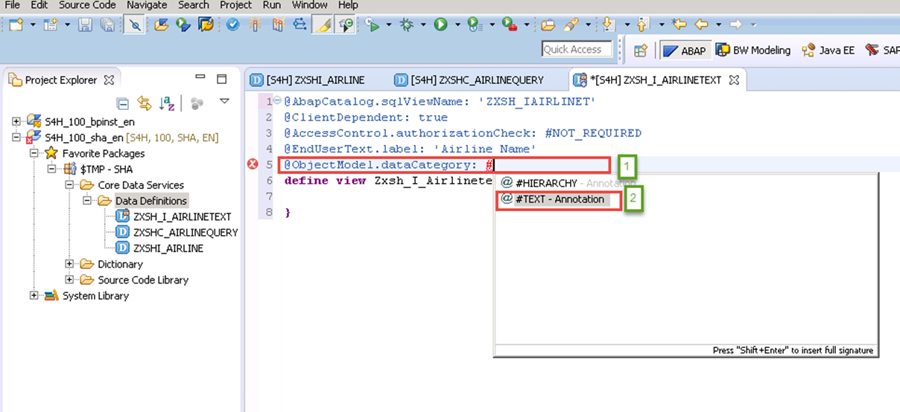

Drop-down choices:

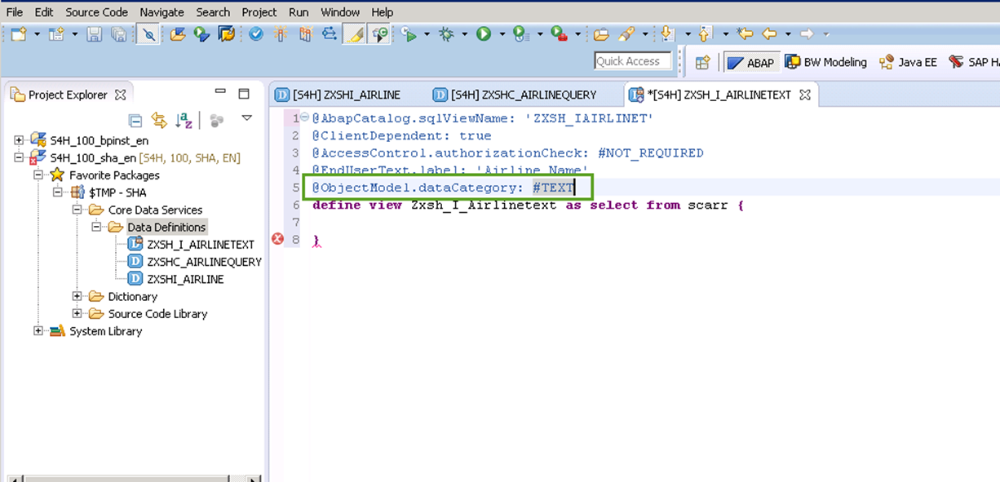

``` abap
@Analytics.dataExtraction.enabled: true
```

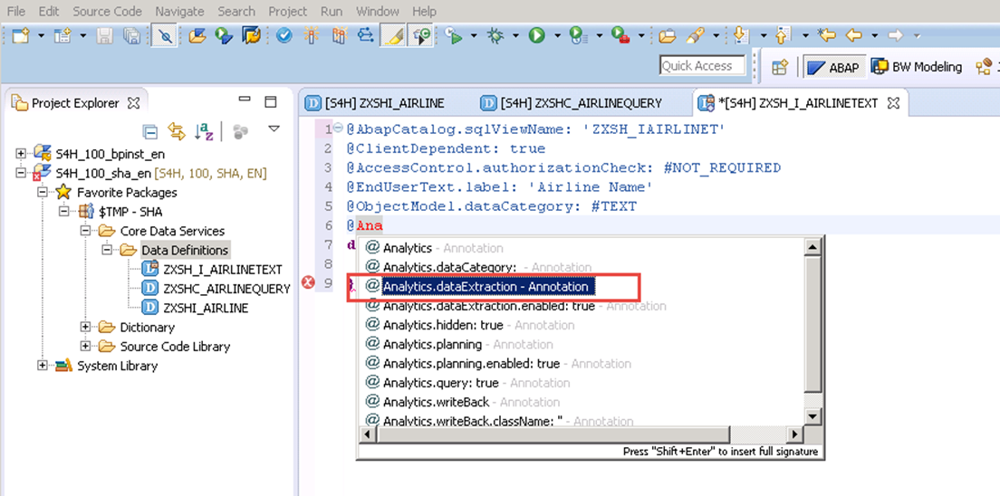

Annotation:

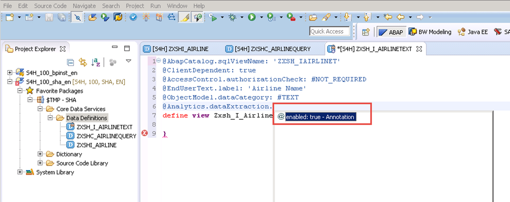

``` abap
@VDM.viewType: #BASIC
```
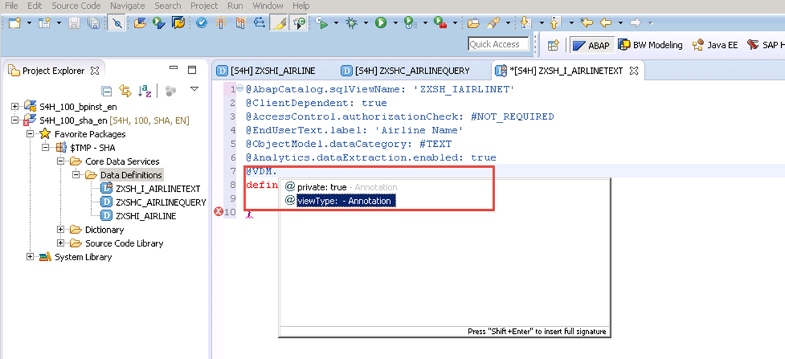

View type:

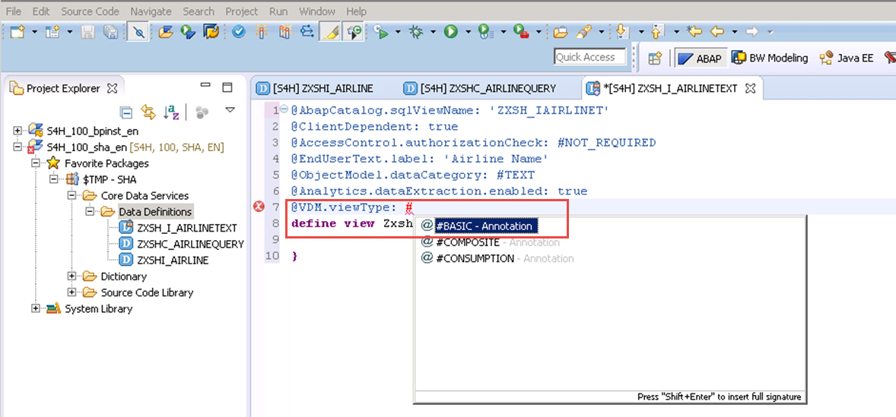

In the generated code, you will modify the view name after the `define view`statement as follows:  

Change `Zxsh_I_Airlinetext` with `ZXSH_I_AirlineText`

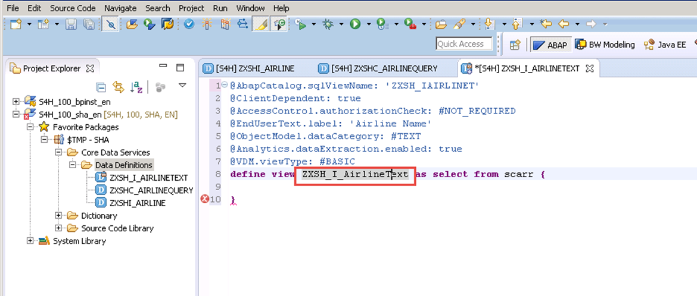

Next, enhance the generated code with the assignment of the following key columns:

``` abap
key carrid as Airline,
key spras as Language,
```    

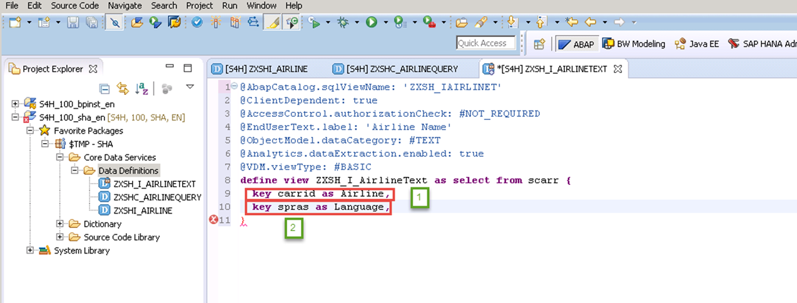


[ACCORDION-END]

[ACCORDION-BEGIN [Step 5: ](Add annotations to the select statement)]

Now, enhance your generated code again by inserting following new annotations:

In the line after the expression `key carrid...` insert:
``` abap
@Semantics.language: true
```


In the line after the expression   `key spras ...` insert:
``` abap
@Semantics.text: true
@Semantics.text: true
```


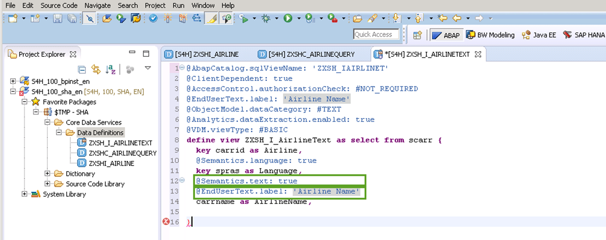


[ACCORDION-END]

[ACCORDION-BEGIN [Step 6: ](Prefix the column names with the table name)]

Next, prefix the column names with the ERP table name `scarr`:

  - Line 9 should read: `key scarr.carrid as Airline,`
  - Line 14 should read: `scarr.carrname as AirlineName,`

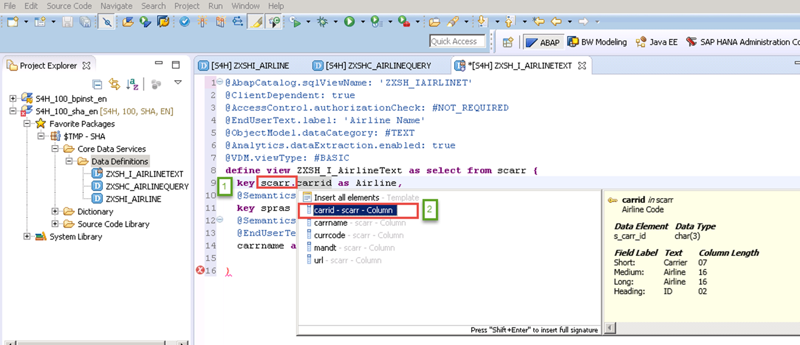

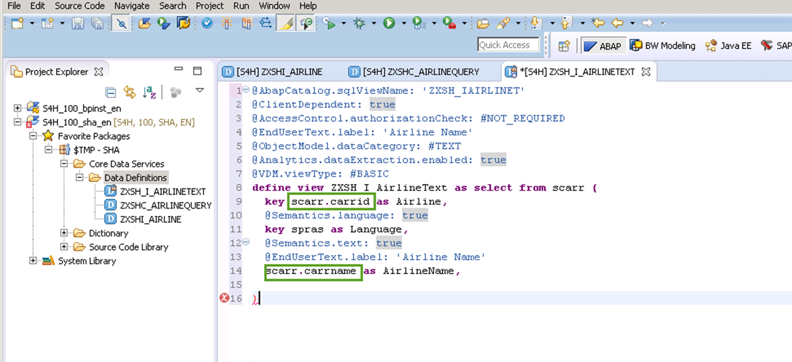


[ACCORDION-END]

[ACCORDION-BEGIN [Step 7: ](Add Annotation for Object representative key)]

Insert after line 7 an additional annotation for object representative key:

 `@ObjectModel.representativeKey: 'Airline'`

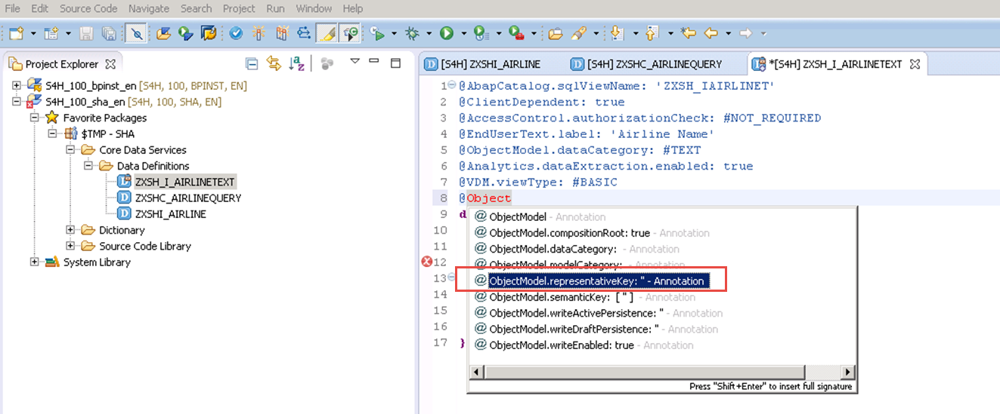

Inserting an annotation for the language was done to demonstrate the possibilities available with annotations. Since here there is only one language it does not make sense to use this annotation. Therefore, comment out lines 11 (`@Semantics.language: true`) and 12 (`key spras as language`). Save, and activate the generated enhanced code. The final version should be identical to this:


[ACCORDION-END]

[ACCORDION-BEGIN [Step 8: ](Display the content of the text view)]

You can now preview the content of the created text view, `ZXSH_I_AIRLINETEXT`. In the left panel, select and right-click on the view `ZXSH_I_AIRLINETEXT`, select `Open Data Preview` and then press `Enter`.

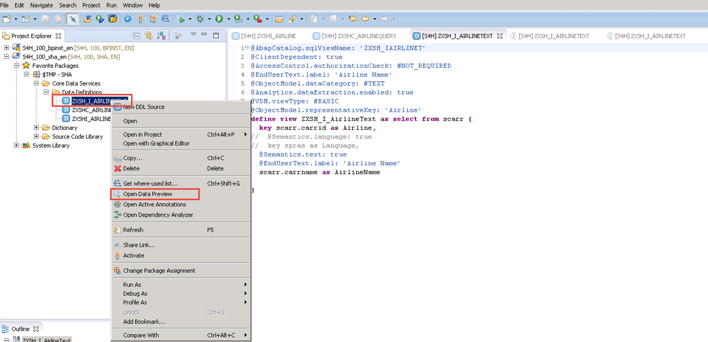

> You can copy this content from here and paste it to the code editor of your ABAP perspective as well instead of enhancing the generated code on your own by typing:

``` abap
@AbapCatalog.sqlViewName: 'ZXSH_IAIRLINET'
@ClientDependent: true
@AccessControl.authorizationCheck: #NOT_REQUIRED
@EndUserText.label: 'Airline Name'
@ObjectModel.dataCategory: #TEXT
@Analytics.dataExtraction.enabled: true
@VDM.viewType: #BASIC
@ObjectModel.representativeKey: 'Airline'
define view ZXSH_I_AirlineText as select from scarr {
 key scarr.carrid as Airline,
//  @Semantics.language: true
//  key spras as Language,  
 @Semantics.text: true
 @EndUserText.label: 'Airline Name'
 scarr.carrname as AirlineName
}
```


[ACCORDION-END]


### Notes

Although SAP offers trial editions for free you will still have to cover the costs for running these trial editions on AWS.

This tutorial is part of the S/4HANA Core Data Services. More information is available here:

- [Amazon Web Services](http://aws.amazon.com/)
- [SAP Cloud Appliance Library (CAL)](https://scn.sap.com/community/cloud-appliance-library)
- [Alternative AWS Deployment for SAP Trials provided as Virtual Appliance](https://scn.sap.com/docs/DOC-46908)
- [Virtual Private Cloud with VPN Access for SAP Trials provided as Virtual Appliance](https://scn.sap.com/docs/DOC-46629)
