## Details
### You will learn  
- How to create a KPI to analyze a specific key figure
- How to display a specific key figure on the SAP Fiori launchpad

---

[ACCORDION-BEGIN [Step 1: ](Log into SAP Fiori launchpad)]
First you need to log into the SAP Fiori launchpad.

1. Open the Windows Start Menu and search for **Remote Desktop Connection** and start the Desktop app

    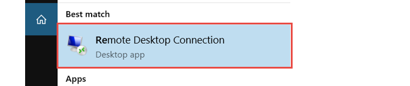

2. In the **Remote Desktop Connection** maintain the field Computer with the alias `techedappspace` and click on the **Connect** button.

    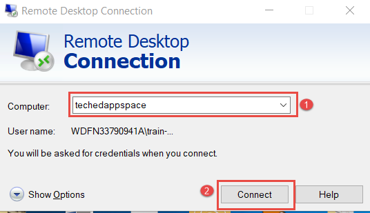

3. The Windows Security screen opens. On the Security screen click on the field labeled with **More choices**.

    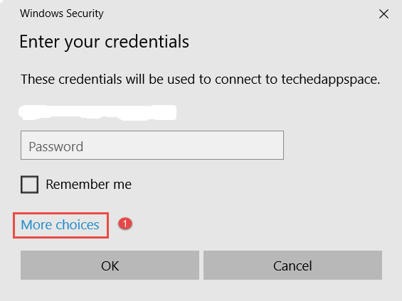

4. On the Security windows select **Use a different account** and maintain the fields as follow:

    > Please be aware that you should replace **xx** with your desktop number.

    |  Field Name                | Value
    |  :-------------------------| :-------------
    |  User Name                 | `.\train-xx`
    |  Password                  | `The password will be given to you by your instructor`
    afterwards click on the **OK** button.

    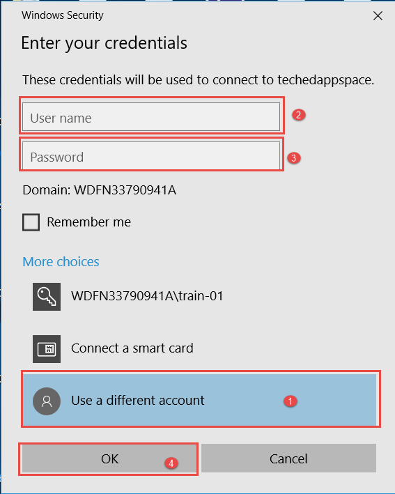  

5. You are now redirected to the SAP FIORI Launchpad.

    You should see this page:

    

6. Login now with your user and password

> Your user is `S4HANAPUT-XX` where **XX** is your desktop number. Your password will be given to you by your instructors.

[DONE]
[ACCORDION-END]

[ACCORDION-BEGIN [Step 2: ](Execute the KPI Workspace)]

In the Fiori Launchpad, from the group KPI Design select the App KPI Workspace and double click on it as on the below picture:

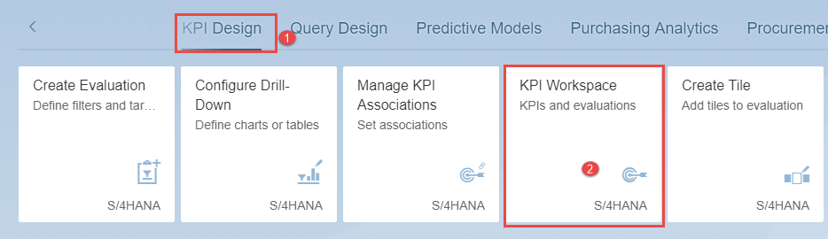

[DONE]
[ACCORDION-END]

[ACCORDION-BEGIN [Step 3: ](Get started with KPI Creation)]

1. After you have successfully executed the App KPI Workspace, the below window gets open.

    

2. In the KPI Workplace window, click on the + Add on the bottom left toolbar to create a KPI as depicted below:

    

[DONE]
[ACCORDION-END]

[ACCORDION-BEGIN [Step 4: ](Maintain parameters of KPI)]

1. In the create KPI window maintain the relevant field from Parameters as follow:

    |  Field Name         | Value
    |  :------------------| :-------------
    |  Title              | `XXXX_ APSEMTAGSTATISTIC`
    |  Description        | `XXXX_ APSEMTAGSTATISTIC`

    > Replace **`XXXX`** with your initials !
    

2. In the create KPI window maintain all the relevant fields for Data Source as follow:

    - CDS View:  In the search button for the CDS view, enter `APSEM`. The List of CDS views for which the user has access permissions and starting with `APSEM` are shown.

3. Select the CDS view: `ZC_APSEMTAGSTATISTICAL`  as shown on the below picture.

    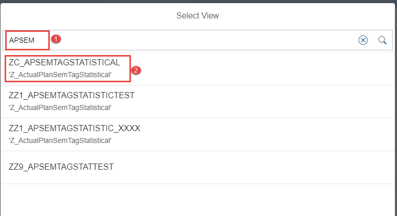

4. `OData` Service: In the search fields for the selected `OData` CDS  view the list of `OData` services available is displayed. Select the `OData` Service `/sap/opu/odata/sap/ZC_APSEMTAGSTATISTICAL_CDS`

    

5. After selecting the CDS View and the OData select the Entity Set which you would use for defining the KPI. In the search field, open the list of available Entity set and select the relevant one as shown on the below picture.

    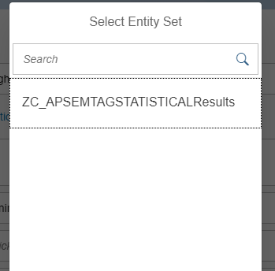

6. The Selection of the Entity Set would bring all the measures available in the set in the search view. Here chooses the measure **`NetIncomeAmtByNumberofEmpl`**

    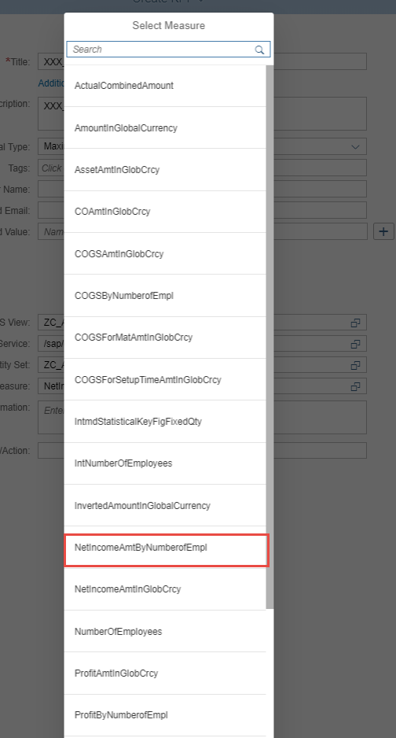

7. At the end of the measure selection, you should have the following selections complete for creating the KPI:
 CDS view, associated OData, Entity Set contained in the OData and finally the measure with which you would create the KPI. To continue click **Activate and add Evaluation** button.

    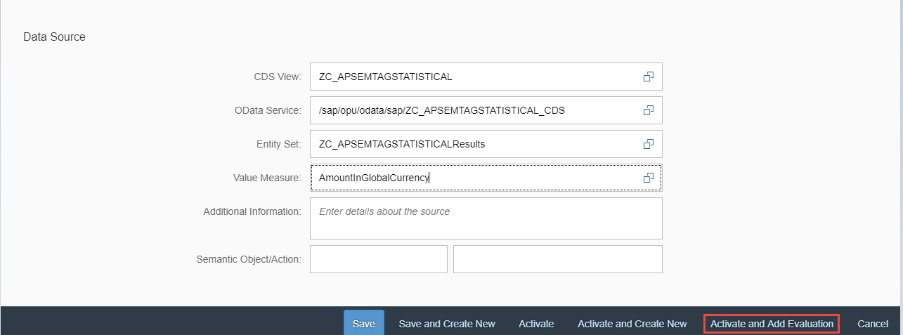

8. On the Save Transport screen, select and click on the **Local Object** button.

    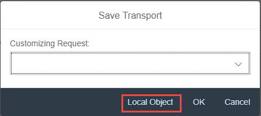

[VALIDATE_1]
[ACCORDION-END]

[ACCORDION-BEGIN [Step 5: ](Create evaluation for the KPI)]

The **Evaluation window** gets open with `prefilled` data.

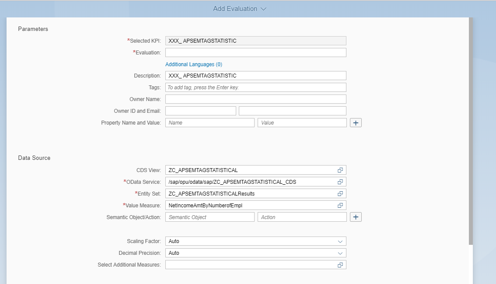

The evaluation would define the KPI based on **`NetIncomeAmtByNumberofEmpl`**, or any other dimensions.

1. Maintain:

    |  Field Name          | Value
    |  :-------------------| :-------------
    |  Evaluation          | `Evaluation_XXXX`

    >Replace XXXX with your initials !

    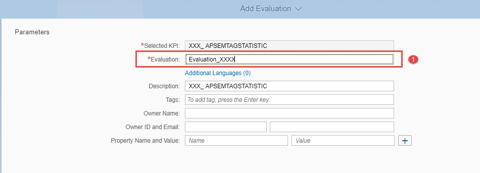

2. Maintain the field **Scaling Factor** with **`Auto`** and **Decimal Precision** with **`Auto`**

    

3. Maintain the Input for the mandatory Parameters as define in the CDS view as follow:

    |  Field Name                | Value
    |  :-------------------------| :-------------
    |  To-Period                 | `007`
    |  Category                  | `ATC01`
    |  Fin Statement Version     | `L000`
    |  Fiscal Year               | `2018`
    |  Controlling Area          | `A000`

    

5. Define the Target and the threshold values. To achieve this you need to maintain input values for the Target, Warning and the critical values as follow:

    |  Field Name         | Value
    |  :------------------| :-------------
    |  Target             | `525000`
    |  Warning            | `500000`
    |  Critical           | `50000`

    

6. After the maintenance of the Target, Thresholds and Trend, click **Activate and Configure Tile** to define a visual representation **Tile** for the Evaluation you have defined.

    

[DONE]
[ACCORDION-END]

[ACCORDION-BEGIN [Step 6: ](Choose visualization option and configure )]

In this step you would choose from the various visualization options for the evaluation. You could choose from a Numeric Tile, Comparison Tile, Trend Tile, Actual vs. Target Tile, Comparison Tile Multiple Measures, Blank Tile and Dual Tile

1. Maintain the Tile configuration by selecting Tile Format, Catalog, to which the Tile will be attached with, the Semantic Object  and the Action as follow:

    |  Field Name         | Value
    |  :------------------| :-------------
    |  Title Format       | `Numeric Tile`
    |  Title              | `XXX_ APSEMTAGSTATISTIC`
    |  Subtile            | `Evaluation_XXXX`
    |  Catalog            | `X-SAP-UI2-CATALOGPAGE:Z_MONJE_TEC`
    |  Cache Duration     | `5 Minutes`
    |  Select Drill-Down  | `Generic`
    |  Semantic Object    | `CostCenter`
    |  Action             | `analyze_xxxx`

    > Select the right catalogue by pushing the drill-down menu for **Catalog**.
    Enter `Z_MONJE_TEC` in the search line and press the magnifying glass button.

    

2.  Press **Save and Configure Drill Down** to create a generic **Smart Business Drill-Down** for the KPI Tile you previously created.

    

[VALIDATE_2]
[ACCORDION-END]

[ACCORDION-BEGIN [Step 7: ](Configure Smart Business drill-down)]

1. In the **Configure KPI Drill-Down Window**, select the KPI Evaluation you worked on in the previous steps.

    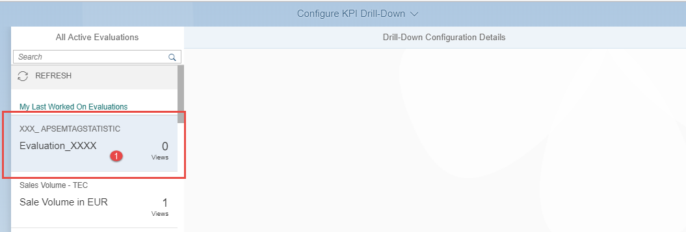

2. Press **Configure** to create a generic Smart Business Drill Down for the KPI Tile you created.
In the Select screen, chooses from the Tab **Dimension** the dimensions for which you would love to configure the Drill-Down report e.g.:

    -	`Cost Center`
    - `Fiscal Period`
    - `Fiscal Year`

    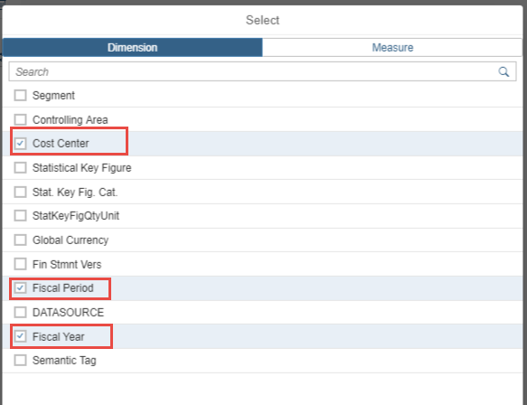

3. Afterwards click on the OK button

    

4. Maintain the Drill-Down Chart details as follow:

    |  Field Name         | Value
    |  :------------------| :-------------
    |  View Title         | `XXXX_KPIChart`

    >Replace `XXXX` with your initials !

    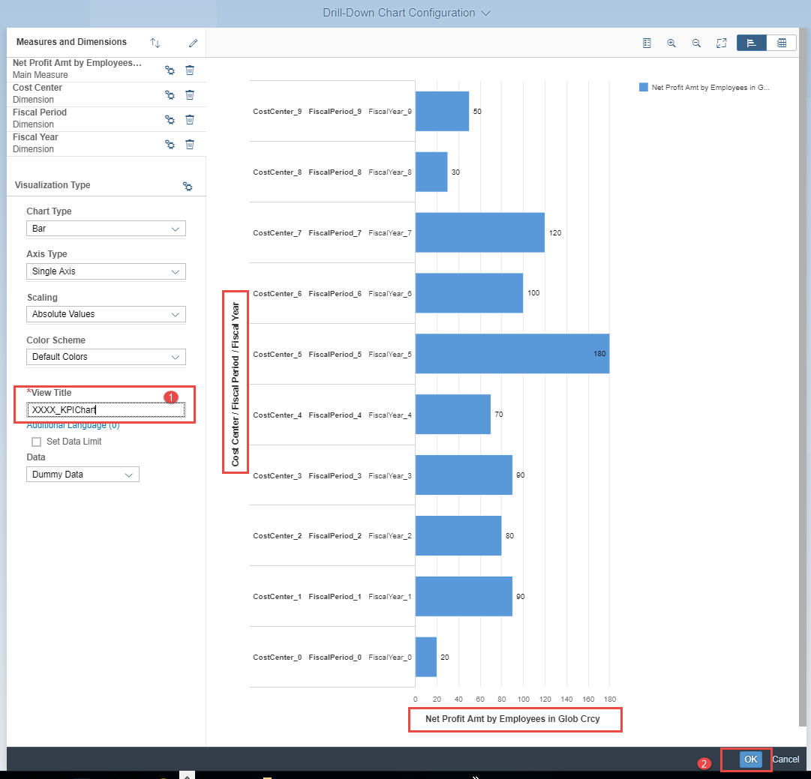

5. Afterwards click on the OK button.

6. On the **SAP Smart Business Generic Drill-Down** screen, click on the **Save Configuration** button
as it is shown on the similar picture below.

    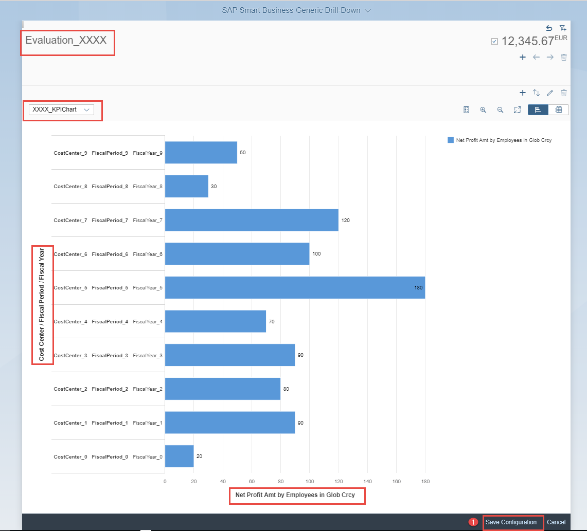

[DONE]
[ACCORDION-END]

[ACCORDION-BEGIN [Step 8: ](Execute report)]

1. Return to the Fiori Launchpad, click on the Me Icon (top left corner next to the SAP logo). The Me Area opens on the left  similar to the one shown below:

    

2. Click on the App Finder to get it open ...

    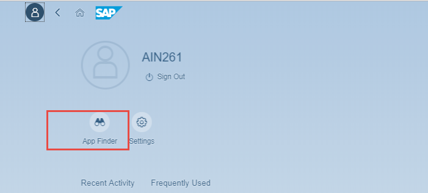

    ... and afterwards click on the catalog  name `Catalog TechEd AppSpace` similar to the picture below.

    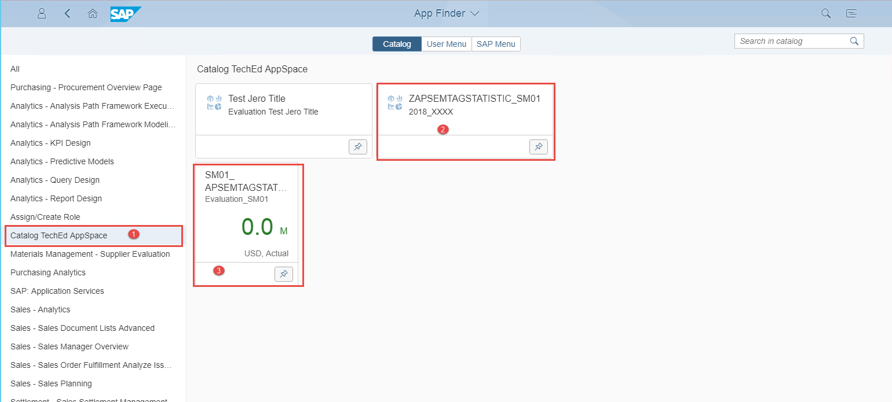

3. Search for  the Tile labeled with **`XXX_ APSEMTAGSTATISTIC`**. The Tile for your report will be displayed.

4. Click on the Tile you found to start the Report.

    

5. The KPI Report shows up with a chart or table  depending on how you have configured in the previous step. You should have a Report similar to the one below.

    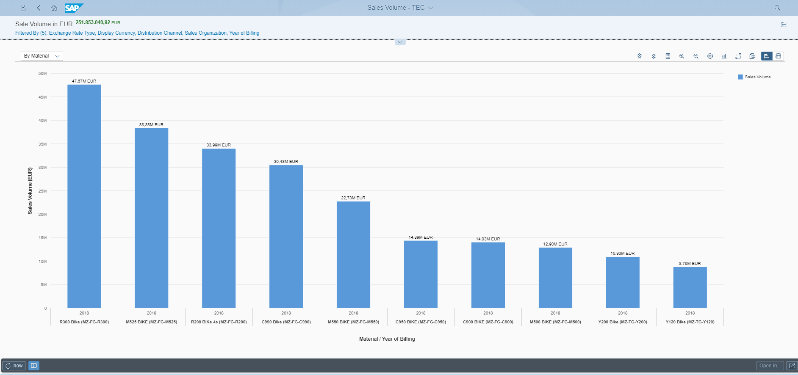

[DONE]
[ACCORDION-END]
