## Prerequisites
 - Before you start developing, the Eclipse environment and ADT has to be installed. The documentation on `https://tools.hana.ondemand.com/#abap` provides the steps to setup your development environment.
 - You would need your user to have the Developer role (Business role template 'SAP-BR-DEVELOPER') assigned to it.
 - You have created an ABAP Package under the ZCUSTOM-DEVELOPMENT 'super package' and has a Transport Layer attached to it.

## Details
In this tutorial, we will look into one of the capabilities of developer extensibility which is to create a custom Inbound API based on released business objects. In a scenario where a released remote API is not available, but the business object was released for developer extensibility, you could use the approach mentioned below to create a custom API which can prove valuable in extracting data from the system or to integrate with other applications.
While the blog focuses on the inbound scenario, these capabilities are also available for outbound scenarios.

Refer to the following information for more details:

[Developing External Service Consumption](https://help.sap.com/docs/SAP_S4HANA_CLOUD/6aa39f1ac05441e5a23f484f31e477e7/f871712b816943b0ab5e04b60799e518.html)

[Developing APIs for Inbound Communication](https://help.sap.com/docs/SAP_S4HANA_CLOUD/6aa39f1ac05441e5a23f484f31e477e7/94ebfa045c75426ea32045f6bbba3be5.html)

### You will learn
  - How to identify objects to be consumed
  - How to create a projection view
  - How to create a behavior definition for the CDS projection
  - How to create a service definition
  - How to create a service binding  
  - How to create a communication scenario and to test the API
  - Test your knowledge

---

[ACCORDION-BEGIN [Step 1: Identify objects to be consumed](Identify objects to be consumed)]

Use the API Hub (api.sap.com) to identify the business object you need. API Hub provides a list of all the APIs, CDS views, Events and Business Objects and Add-Ins exposed for developer extensibility. For my example, I am looking for Sales Order business object even though there are multiple Sales Order APIs released by SAP. Sales Order is used purely for illustration purpose.

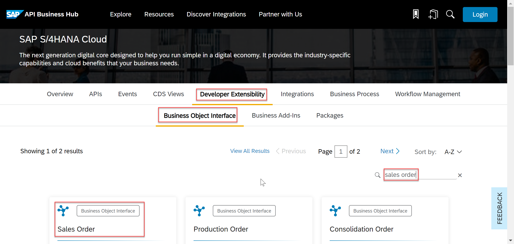

[DONE]
[ACCORDION-END]

[ACCORDION-BEGIN [Step 2: Create a Projection View](Create a Projection View)]
The business object projection allows you expose just the subset of the business object based on the needs of the service being built and to provide the persona using it the right amount of data. It also helps the business object itself remain service agnostic.

In order to create the projection view, right Click on the package, choose New > Other Repository Objects and look for Data Definition as shown below.
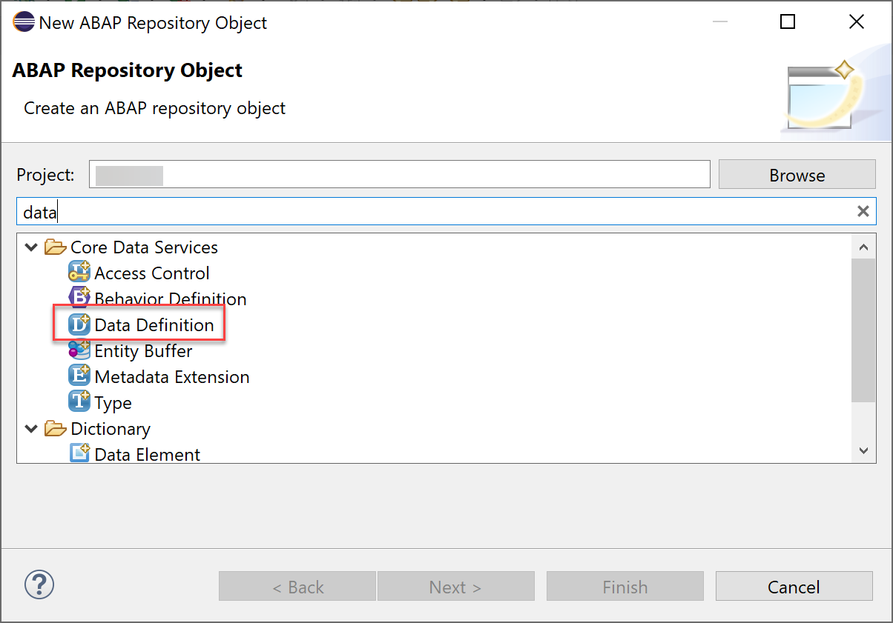

Choose the reference business object you identified in the API Hub as shown below. The system automatically generates the projection code for you.
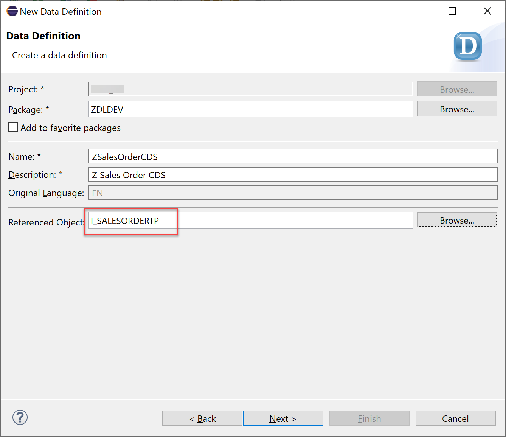

Depending on the base business object that was selected, you might have to provide the root attribute and define the provide contract as shown below.

Once these changes are done, go ahead and save it (CTRL + S) and then activate it either using the keyboard shortcut (CTRL + F3) or via the activate option under the right click menu.

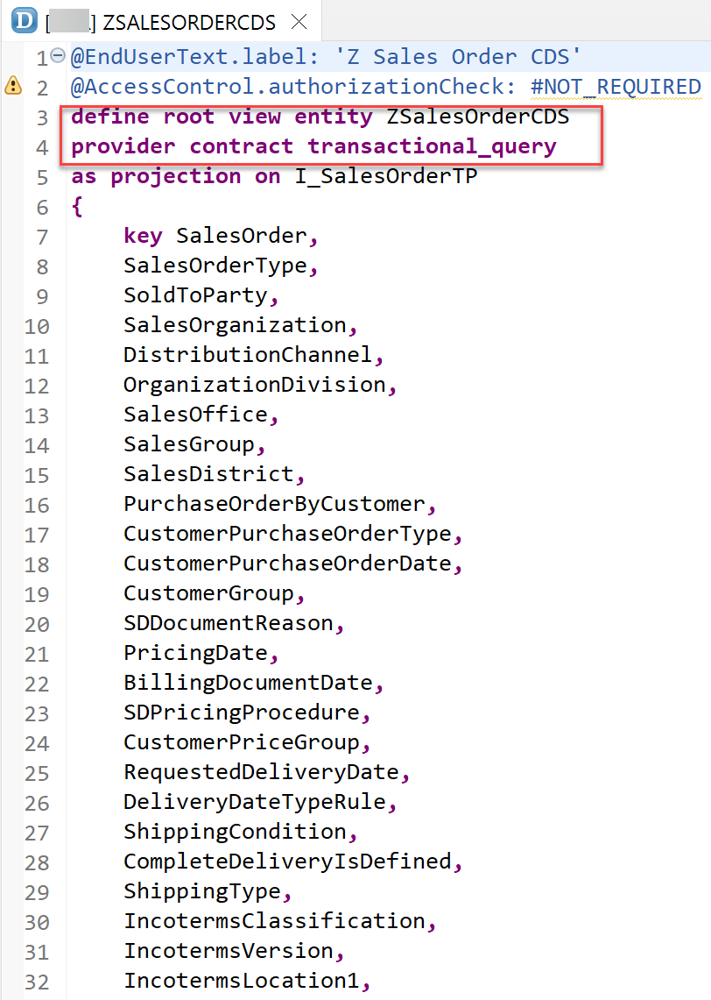
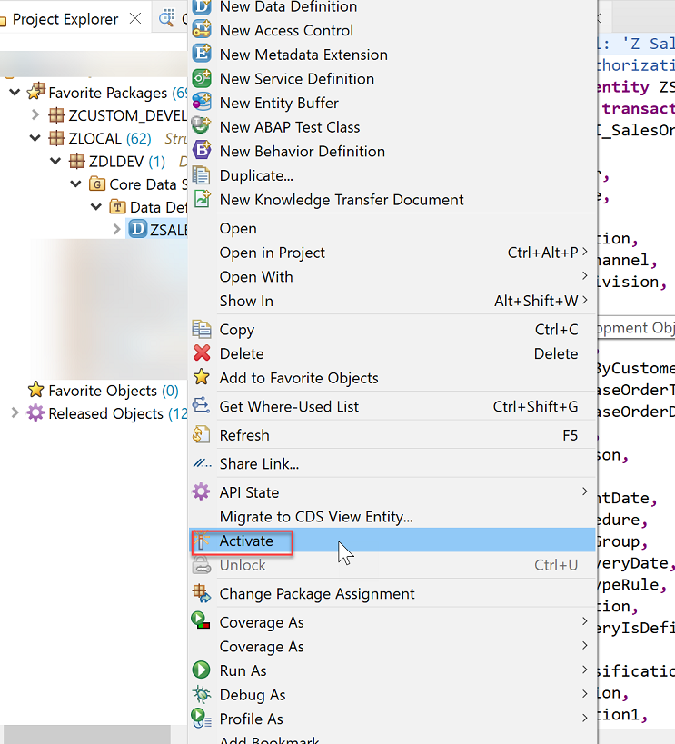

[DONE]
[ACCORDION-END]

[ACCORDION-BEGIN [Step 3: Create a Behavior Definition for the CDS projection](Create a Behavior Definition for the CDS projection)]
In order for your service to be able to create or update, you will need to define a behavior definition as well. Without this, the service can act as a read only service. This object provides a way to define service specific behavior for the business object projection.

In order to create the behavior definition, right Click on the package, choose New > Other Repository Objects and look for Behavior Definition or right click on the projection view you create and create the Behavior Definition as shown below. The system will automatically generate the code for the Behavior Definition as shown below which you can change if required.
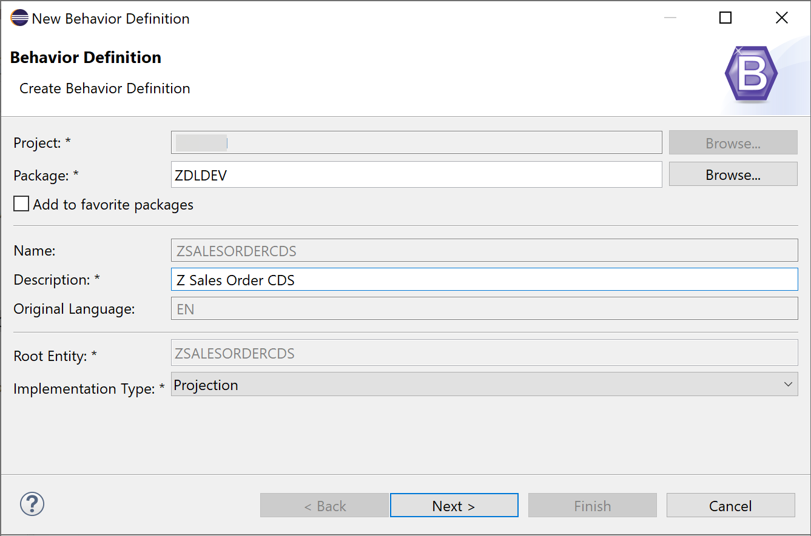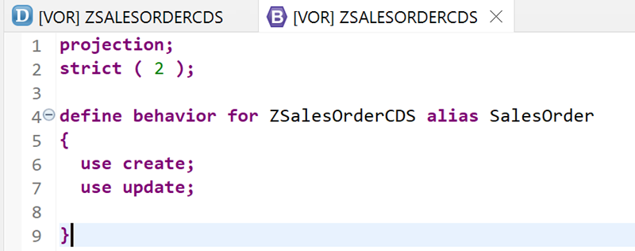

Once you are done editing the code, go ahead and save it (CTRL + S) and then activate it either using the keyboard shortcut (CTRL + F3) or via the activate option under the right click menu.

[DONE]
[ACCORDION-END]

[ACCORDION-BEGIN [Step 4: Create a Service definition](Create a Service definition)]
The ABAP Object helps you define the scope of the service by allowing you to specify CDS entities of your data model that you want to expose. It is agnostic of the protocol used in the service and the version of the service.

In order to create the service definition, right click on the package, choose New > Other Repository Objects and look for Service Definition under the Business Services section and create a service definition for the source type definition and for your projection as shown below.

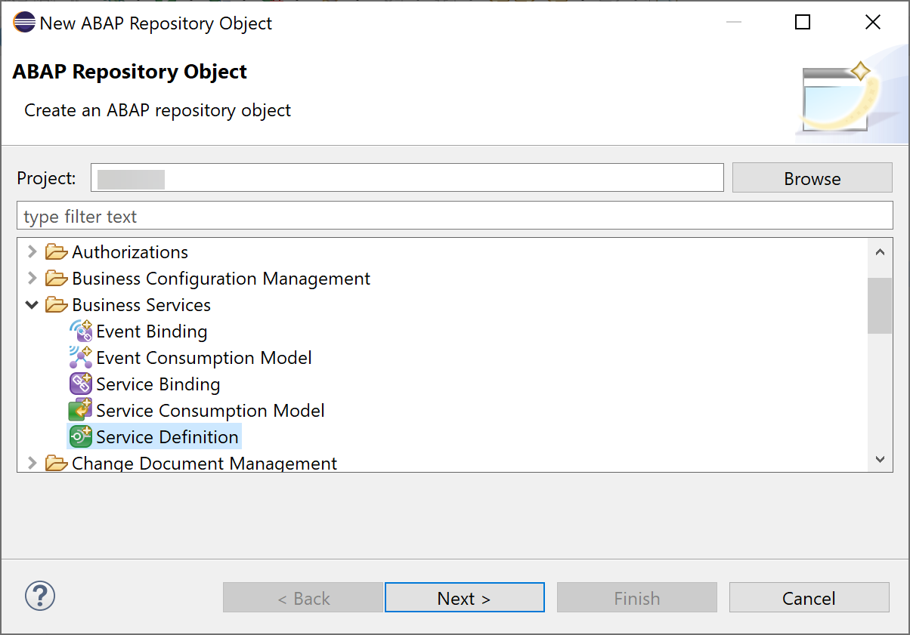

In this case, there is only one entity but if there were multiple entities then you could choose which entities to expose.
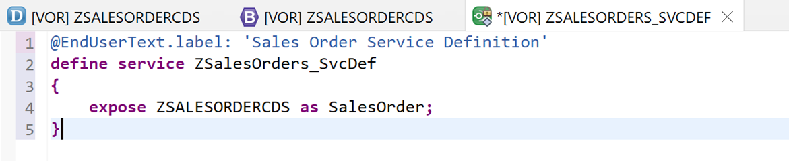

Once you are done editing the code, go ahead and save it (CTRL + S) and then activate it either using the keyboard shortcut (CTRL + F3) or via the activate option under the right click menu.

[DONE]
[ACCORDION-END]

[ACCORDION-BEGIN [Step 5: Create a Service Binding](Create a Service Binding)]
The service binding allows you to bind a service definition to a client-server communication protocol such as OData and etc. The separation between the service definition and the service binding helps you export the service a variety of service protocols.

In order to create the service definition, right click on the package, choose New > Other Repository Objects and look for Service Binding or right click on the service definition and choose the option to create the binding. Define the binding type to identify the service protocol and identify the service definition created in the previous step. For more information on the supported binding types, review the information on the  [help](https://help.sap.com/docs/SAP_S4HANA_CLOUD/6aa39f1ac05441e5a23f484f31e477e7/94ebfa045c75426ea32045f6bbba3be5.html) portal.
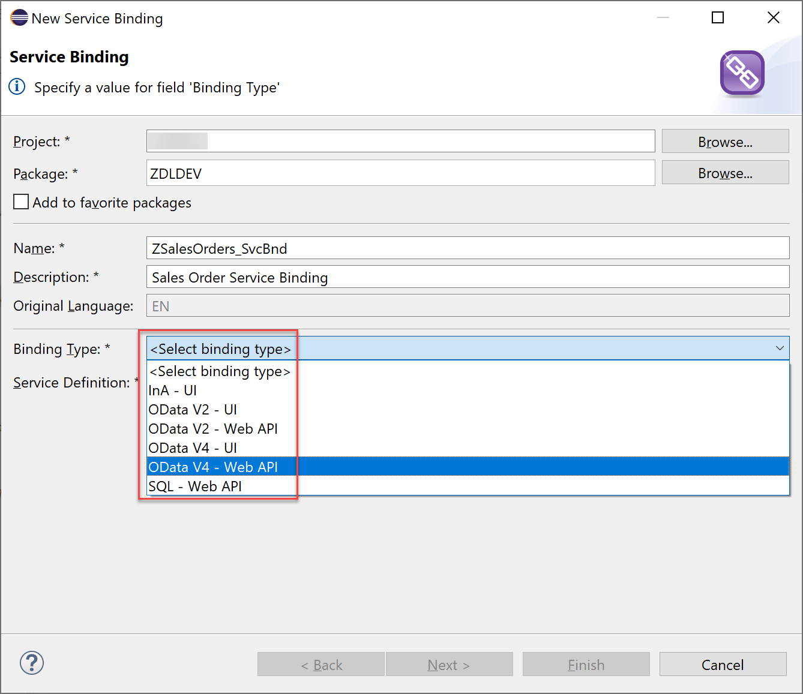

The system shows you a screen like the one below. Go ahead and save it (CTRL + S) and then activate it either using the keyboard shortcut (CTRL + F3) or via the activate option under the right click menu.

After activating the service binding, click on the 'Publish' button to locally publish the service. The service URL displayed after the service is published allows you perform a GET operation via a browser.

This screen also allows you to define a ABAP Test Class for unit testing.
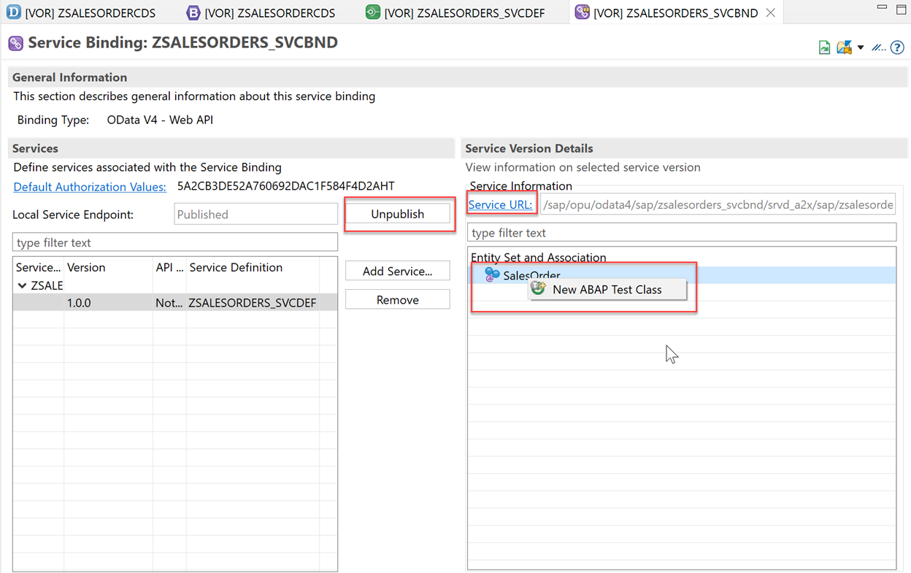

[DONE]
[ACCORDION-END]

[ACCORDION-BEGIN [Step 6: Create a Communication Scenario](Create a Communication Scenario)]
In order for you to be able to consume the API from external applications like SAP Business Application Studio, postman or your middleware, you will need to create a communication arrangement for the service that you created.

In order to create the communication scenario, right click on the package, choose New > Other Repository Objects and look for communication scenario under the cloud communication management section. You can then identify the type of authentication it allows, the service you want to provide (under the inbound section). Based on the type of service that is exposed, you will have to provide authorization for the service to be able to alter the corresponding business object. Use the Authorization tab to define the authorizations.
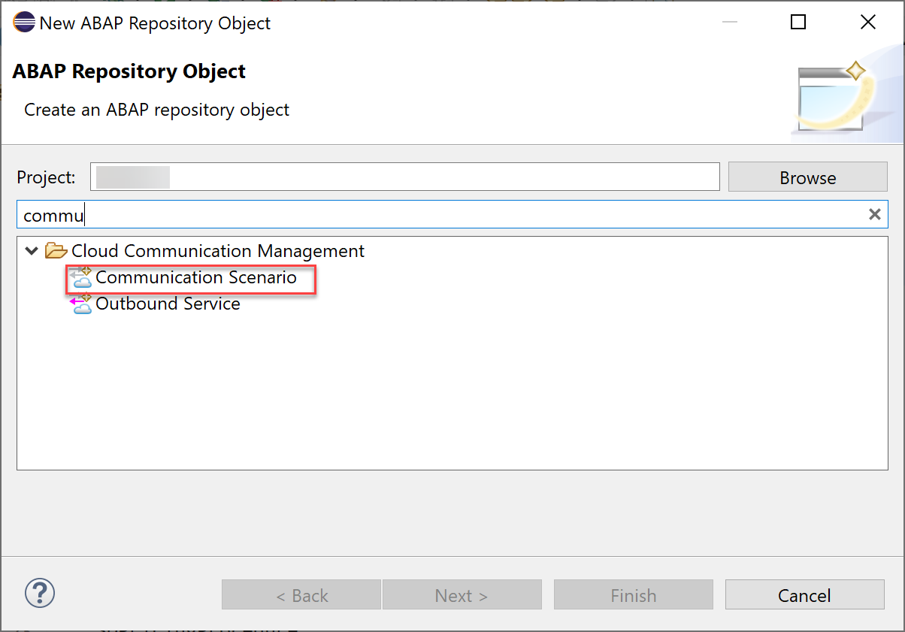
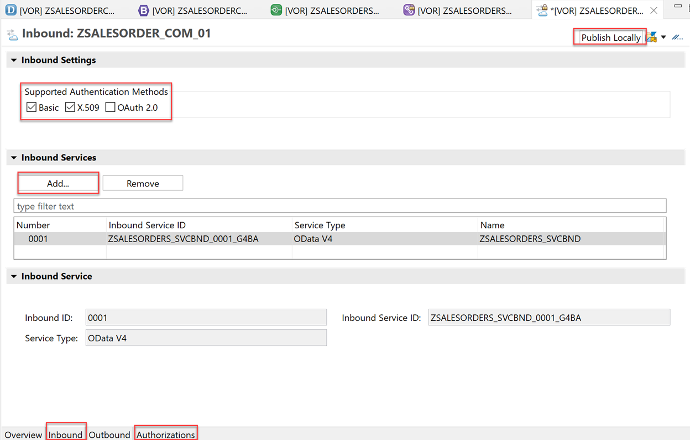

Once these settings are performed, save it (CTRL + S) and then activate it using the keyboard shortcut (CTRL + F3). Click on the publish locally button to then publish the communication scenario.

The communication scenario is now available in the S/4HANA Cloud Fiori UI (front end) in the 'Communication Arrangements' app. In the front end, define a communication system and create a communication arrangement for this communication scenario. The URL displayed in the communication arrangement inbound section and the User/password can be used to read (GET) or write(POST) via external tools. SAP recommends using the SAP Business Application Studio to consume the services which allows you to quickly create a Fiori application or report as shown below.
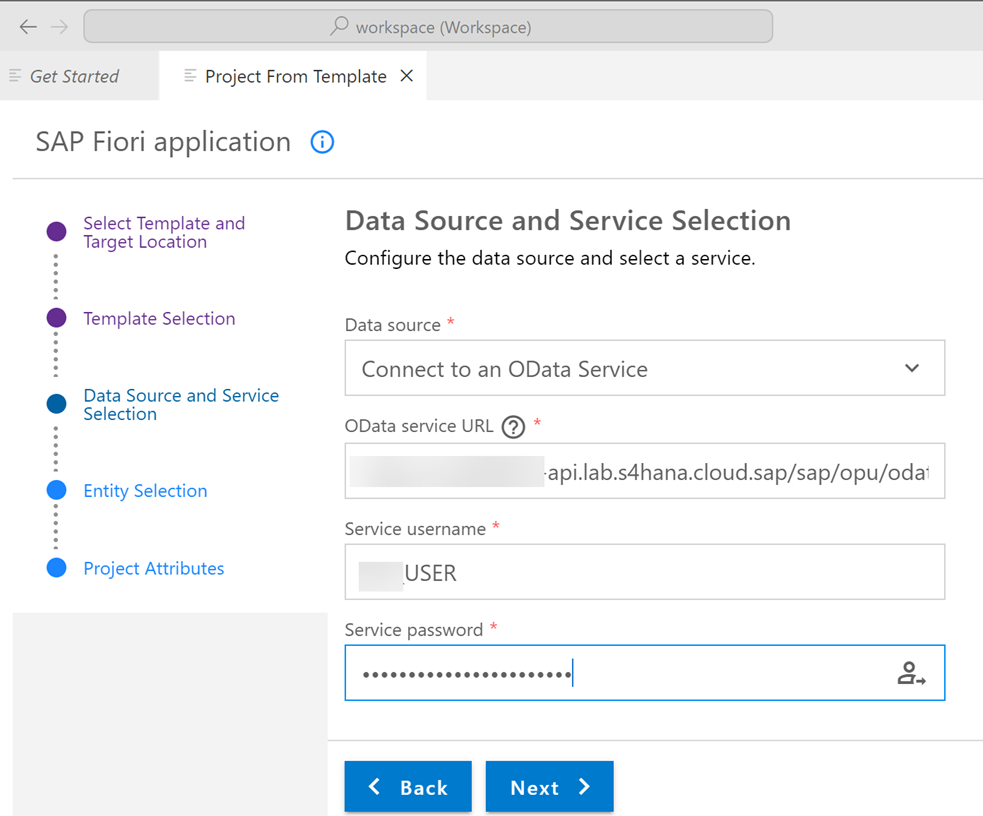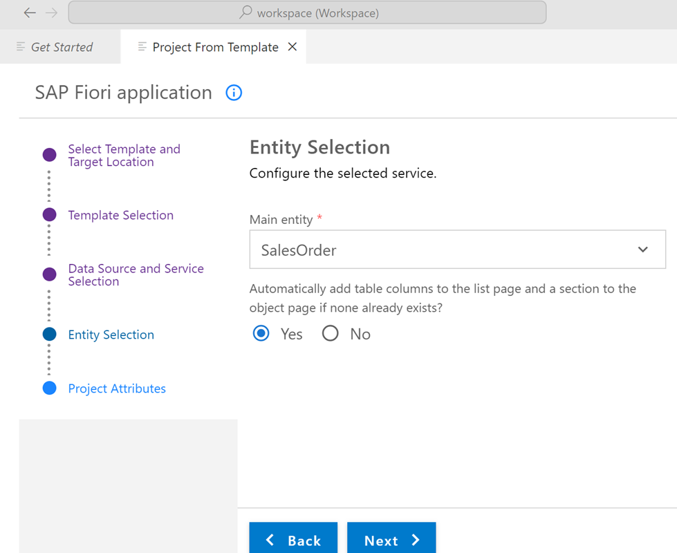
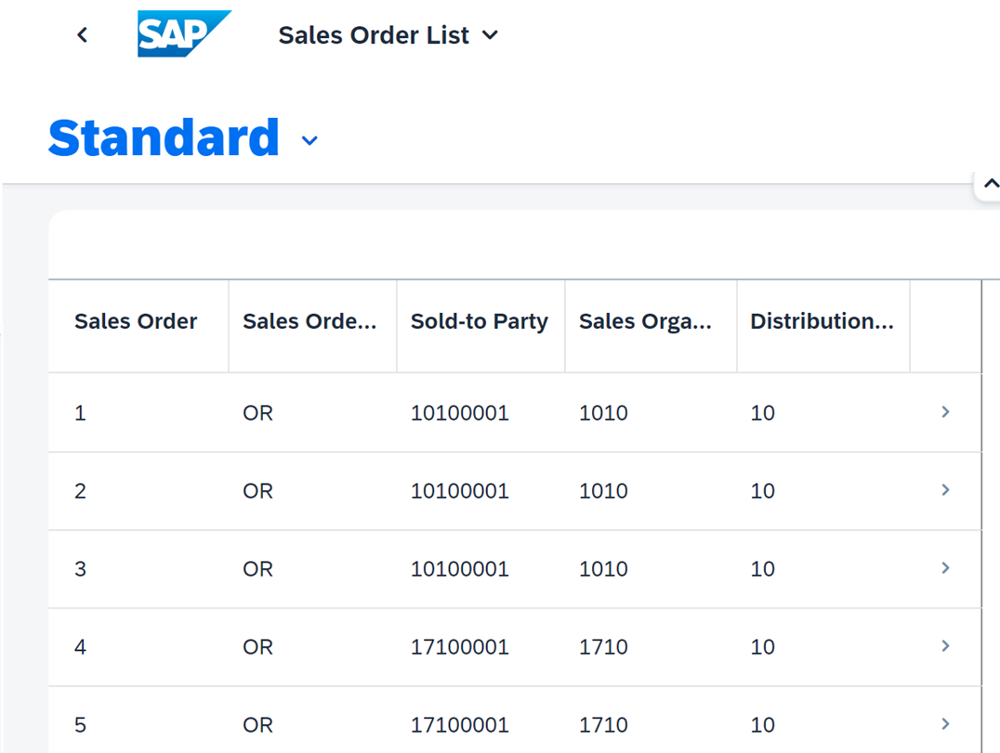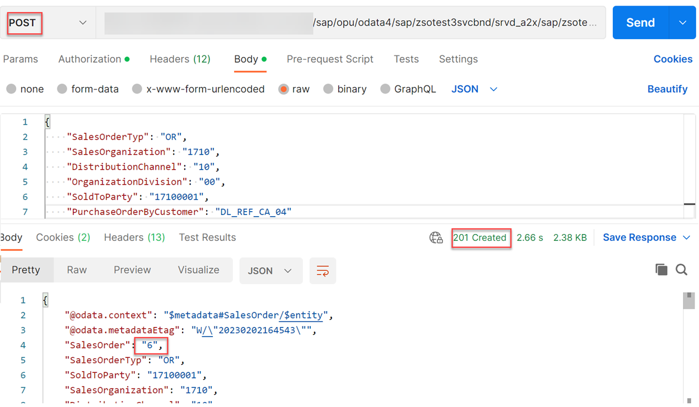

[DONE]
[ACCORDION-END]

[ACCORDION-BEGIN [Step 7: Test your knowledge](Test your knowledge)]

[VALIDATE_7]
[ACCORDION-END]

---
