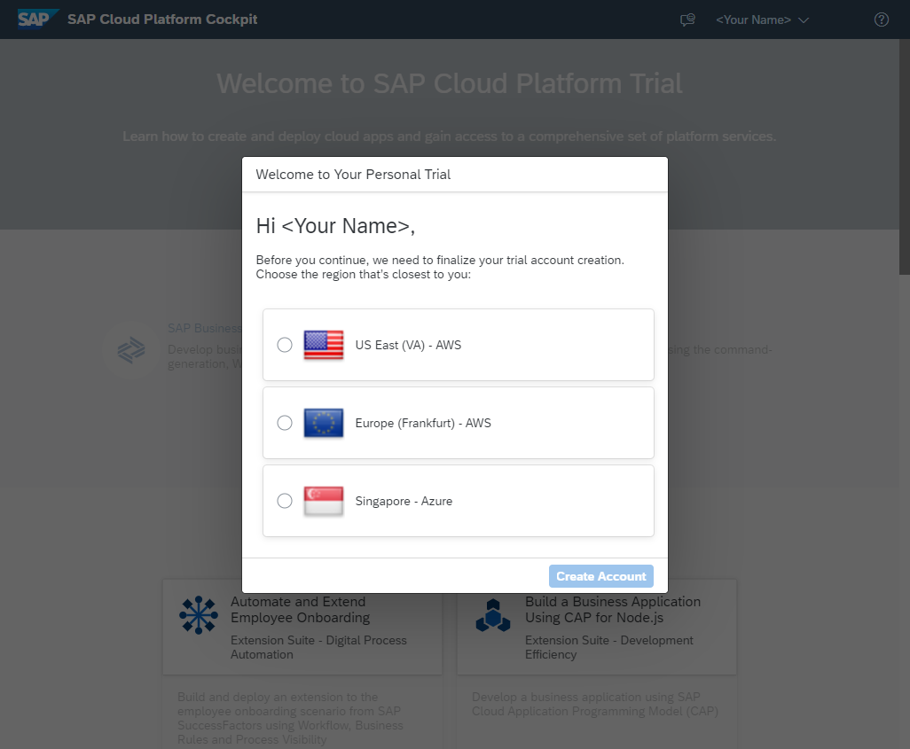
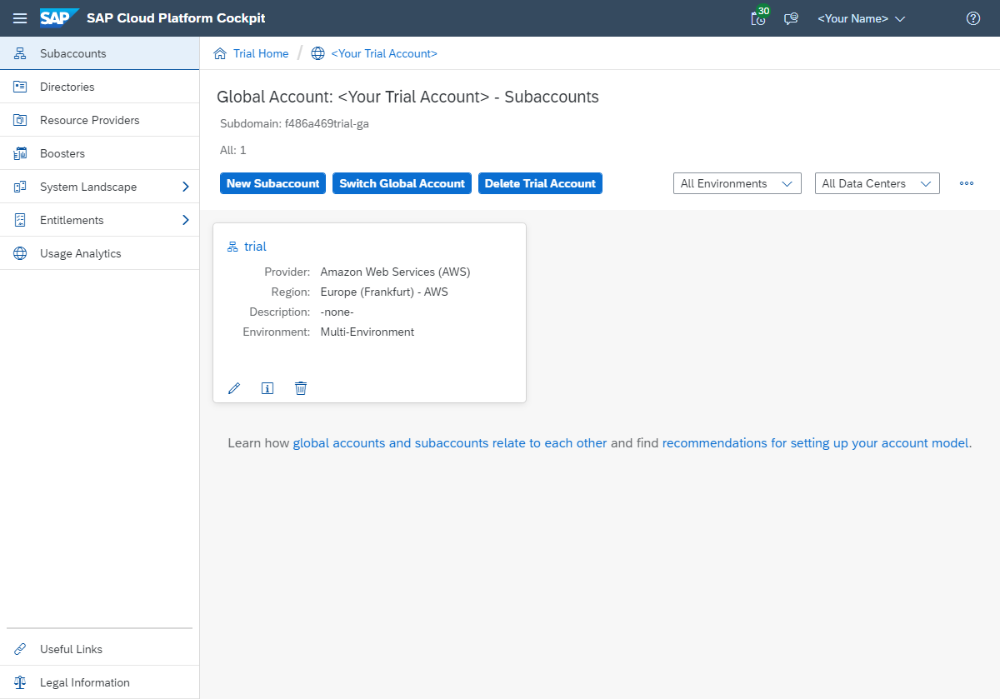

### You will learn  
This tutorial will cover your first steps when developing applications for SAP Cloud Platform (SCP) Cloud Foundry using SAP Cloud SDK. You will create an account for SCP Cloud Foundry and setup the Cloud Foundry command line interface for deploying and managing Cloud Foundry applications. Then you will generate your first project using the SAP Cloud SDK Maven archetype and deploy your first application to SCP Cloud Foundry.

---

[ACCORDION-BEGIN [Step 1: ](Setup for Cloud Foundry)]

In order to deploy applications to `SCP Cloud Foundry`, you need to create a free trial account. You can create your account by visiting <https://cloudplatform.sap.com/try.html>

After creating your account and activating it via email, you can log in to your personal `Cloud Cockpit`. For your first visit, it should look like this:



After selecting your region, your account will be automatically set up for development with `Cloud Foundry`.

Clicking on "Enter Your Trial Account" will lead you to your account overview:



Now that your account is activated and configured, you will need the `Cloud Foundry` command line interface (CF CLI) to deploy and manage your `Cloud Foundry` applications.

To install the CLI, you can either grab the latest release on the [official release page](https://github.com/cloudfoundry/cli/releases) or use your favorite [package manager](https://github.com/cloudfoundry/cli#installing-using-a-package-manager).

In order to deploy applications on `SAP Cloud Foundry` you need to provide the CF CLI with an API endpoint. The API endpoint depends on the region you chose for your account:

  - for EU: `https://api.cf.eu10.hana.ondemand.com`
  - for US EAST: `https://api.cf.us10.hana.ondemand.com`
  - for US CENTRAL: `https://api.cf.us20.hana.ondemand.com`


Now enter the following commands (in this case for the EU region):

```bash
cf api https://api.cf.eu10.hana.ondemand.com
cf login
```

The CLI will ask you for your mail and your password. After entering these, you should be successfully logged in.

**Note**: The CF CLI stores the information locally in a `~/.cf/config.json` file. Further authentication relies on a JWT that expires after some time, so you don't have to login every time you want to push your app to the cloud.

[DONE]
[ACCORDION-END]

[ACCORDION-BEGIN [Step 2: ](Generate project from archetype)]

To generate your first project from the Maven archetype, run the following command:

[OPTION BEGIN [On Windows]]

```bash
mvn archetype:generate "-DarchetypeGroupId=com.sap.cloud.sdk.archetypes" "-DarchetypeArtifactId=scp-cf-tomee" "-DarchetypeVersion=RELEASE"
```

[OPTION END]

[OPTION BEGIN [On Mac]]

```bash
mvn archetype:generate -DarchetypeGroupId=com.sap.cloud.sdk.archetypes -DarchetypeArtifactId=scp-cf-tomee -DarchetypeVersion=RELEASE
```

[OPTION END]

During the generation process, Maven will require additional parameters to form your project:

  -  **`groupId`** - An identifier representing your group, company or organization (e.g. `com.sap.cloud.sdk.tutorial`)
  -  **`artifactId`** - An identifier for your application (e.g. `firstapp`)
  -  **`version`** - The version of your application (e.g. `1.0-SNAPSHOT`)
  -  **`package`** - The name of the top-level package your source code will reside in (typically equal to your **`groupId`**, e.g. `com.sap.cloud.sdk.tutorial`). Please pay attention to package and directory names in any upcoming source code when using a different package name than suggested here.

After providing these values, Maven will generate your project from the archetype.


**Note**: Here you have created an application which is based on the [`TomEE runtime`](http://tomee.apache.org/) which is a `Java EE 6` compliant open-source runtime that is available in the `Cloud Foundry` platform if your goal is to create a `Java EE` application. You may also initialize the project with [`Spring Boot`](https://spring.io/projects/spring-boot). To adapt the archetype simply change the `artifactId` to `scp-cf-spring`. Our tutorial series will be primarily based on the `TomEE` runtime. Nonetheless, the SAP Cloud SDK is compatible with these popular `runtimes` too.

[DONE]
[ACCORDION-END]

[ACCORDION-BEGIN [Step 3: ](Understand the project structure and its artifacts)]

Now you can open your favorite IDE and import the project as `Maven Project`. After importing the project into your IDE, the project structure should look like this:

```
firstapp
 /-- .pipeline
 |    |-- config.yml
 +-- application [firstapp-application]
 +-- cx-server
 +-- integration-tests [firstapp-integration-tests]
 |-- Jenkinsfile
 |-- manifest.yml
 |-- pom.xml
```

The first thing you will notice is the different directories:

  - `.pipeline`
  - `application [firstapp-application]`
  - `cx-server`
  - `integration-tests [firstapp-integration-tests]`

There are two Maven sub-modules `application [firstapp-application]` and `integration-tests [firstapp-integration-tests]`, which serve different aspects of your code application, test and deployment environment. The following separation of modules makes it possible to run dedicated unit tests and sensitive integration tests without deploying the application.
Additionally, there are utility scripts within the `cx-server` directory that can be used for local deployment and testing as well as a configuration file for your `Jenkins` build pipeline in `.pipeline`.

#### Multiple modules project

The advantage of operating a multiple modules project for your application becomes apparent as soon as the software complexity rises. Then it gets convenient to dedicate code distribution and responsibility to developers for either application or test environment. In terms of reliability and continuance, you will see that front-end testing and test automation are as important as classic back-end testing of your project. These fields of expertise require different programming paradigms, as well as different kinds of development life cycles. To ensure the overall software stability and reliability, a multiple modules setup is the best practice solution.
To get you started, we take a look into the conventional application project, as well as the classic unit tests. Then the integration tests follow, used for code tests with external servers and resources. Once software testing is covered, we briefly introduce the `Cx server` for continuous integration and delivery.

**`application`** contains the source code, unit tests, and configuration of your actual web application.

```
application [firstapp-application]
 /-- src
 |    /-- main
 |    |    /-- java
 |    |    |    /-- com.sap.cloud.sdk.tutorial
 |    |    |         |-- HelloWorldServlet.java
 |    |    /-- resources
 |    |    |    |-- application.properties
 |    |    /-- webapp
 |    |         /-- WEB-INF
 |    |              |-- beans.xml
 |    |              |-- web.xml
 |    /-- test
 |         /-- java
 |              /-- com.sap.cloud.sdk.tutorial
 |                   |-- UnitTest.java
 |-- pom.xml
```

  - **`src/main/java`** - Here goes your production code, nothing else. As you can see, there's already the `HelloWorldServlet`, which we will look at in more detail soon.
  - **`src/main/resources`** - Anything that you require in your production code but is not compilable code goes here (typically things like API definition files for `RAML` or `OpenAPI`, `Database Migration Files` for `Flyway` or `Liquibase`).
  - **`src/main/webapp`** - Contains the deployment descriptor for your web application `web.xml`.
  - **`src/test/java`** - Contains the unit tests for your application. The purpose of classes in here is to test and validate single aspects of data flow and computational operations of your application project.
  - **`pom.xml`** - This is your project management file for Maven where you can maintain other open source dependencies or use plugins that simplify your build environment.

**`integration-tests`** contains the integration tests for your application. Its structure is similar to **`application`**.

```
integration-tests [firstapp-integration-tests]
 /-- src
 |    /-- test
 |         /-- java
 |         |    /-- com.sap.cloud.sdk.tutorial
 |         |         |-- HelloWorldServletTest.java
 |         |         |-- TestUtil.java
 |         /-- resources
 |              |-- arquillian.xml
 |-- pom.xml    
```

  - **`src/test/java`**	- Here you can put all your integration tests. As you can see, it already contains `HelloWorldServletTest` corresponding to the `HelloWorldServlet`.
  - **`src/test/resources`** - Here are all the resources needed for the integration tests to run or validate.

**`cx-server`** contains the script and configuration file to manage your best practice continuous integration and delivery software environment (`Cx`). The included files allow users to simply create your very own `Cx server` as part of a `Docker` deployment. `Jenkins` is the server which will be run. This automation server helps to manage all technical steps of a software development process.

```
cx-server
 |-- cx-server
 |-- cx-server.bat
 |-- server.cfg
```

  - **`cx-server`**	- This `Unix` bash script allows you to start and stop the `Jenkins` server on your local machine as part of a `Docker` container.
  - **`cx-server.bat`** - This batch script is the counter part to the `cx-server` script for `Windows` users.
  - **`server.cfg`** - This is the configuration file for the server parameters.

Once a Jenkins server is configured for your personal needs, the files in the project root directory become useful:

- **`Jenkinsfile`** - This text file contains the definition of a `Jenkins Pipeline` and stays part of your project source code. It defines what steps are run specifically for your application.
- **`.pipeline/config.yml`** - This is the configuration file for your specific application.
- **`manifest.yml`** is the deployment descriptor for `Cloud Foundry`. This file will be covered in more detail later in this tutorial.

#### Unit tests and integration tests

This separation of test modules makes it possible to just run unit tests and integrations test without deploying, as well as deploying the application without running time consuming tests. Unit tests can either be kept publicly inside the application module `application/src/test`, or in a separate `unit-tests` module that is not part of the archetype. For that topic we highly recommend the articles and educational videos by Martin Fowler. For a start we advise reading his post about [Unit Tests](https://martinfowler.com/bliki/UnitTest.html).

During development it becomes important to test the code newly implemented to external services, i.e. logic running in a distributed environment. This is where the integration tests are an important tool to ensure correctness and stability over the whole internal and external deployment. Since the integration tests may contain confidential information, like business logic and test access tokens, it can be helpful to maintain their operation inside a dedicated Maven sub-module. That way the runnable application itself can be later shipped without tests and their dependency.

[DONE]
[ACCORDION-END]

[ACCORDION-BEGIN [Step 4: ](HelloWorldServlet)]

Now that you understand the structure of the project, let's take a closer look at the `HelloWorldServlet`.

```java
@WebServlet("/hello")
public class HelloWorldServlet extends HttpServlet
{
    private static final long serialVersionUID = 1L;
    private static final Logger logger = LoggerFactory.getLogger(HelloWorldServlet.class);

    @Override
    protected void doGet( final HttpServletRequest request, final HttpServletResponse response )
        throws ServletException, IOException
    {
        logger.info("I am running!");
        response.getWriter().write("Hello World!");
    }
}
```

The `HelloWorldServlet` extends `HttpServlet`, so this will be a HTTP endpoint that customers can visit. It is mapped to the `/hello` route using `@WebServlet("/hello")`. By overriding the function `doGet`, you define what happens when a client performs an HTTP GET request on the `/hello` route. In this case the endpoint simply writes a response containing **`Hello World!`**

**Note**: The application code runs seamlessly in `SCP Neo` as well as `SCP Cloud Foundry`. The `SAP Cloud SDK` is compatible with both versions and provides mechanisms to seamlessly transfer code between both environments.

[DONE]
[ACCORDION-END]

[ACCORDION-BEGIN [Step 5: ](Deployment)]

In order to deploy the application, you first need to assemble your project into a deployable artifact – a `.war` file. Open your command line and change into the `firstapp` directory, the root directory of your project and run the following command:

```bash
cd /path/to/firstapp
mvn clean package
```

This tells Maven to remove any files from previous assemblies (clean) and to assemble your project (package). The project is set up so that Maven automatically runs your unit and integration tests for you. After running the command, there should be a directory target inside of the `application` directory, containing a file called `firstapp-application.war`. This is the file that you will deploy to `Cloud Foundry` (or locally).

**Deploy to Cloud Foundry**

Now the previously mentioned `manifest.yml` comes into play – it's the deployment descriptor used by `Cloud Foundry`.


```yaml

---
applications:

- name: firstapp
  memory: 1024M
  timeout: 300
  random-route: true
  path: application/target/firstapp-application.war
  buildpacks:
    - sap_java_buildpack
  env:
    TARGET_RUNTIME: tomee7
    SET_LOGGING_LEVEL: '{ROOT: INFO, com.sap.cloud.sdk: INFO}'
    JBP_CONFIG_SAPJVM_MEMORY_SIZES: 'metaspace:128m..'
```

The manifest contains a list of applications that will be deployed to `Cloud Foundry`. In this example, there is only one application, `firstapp`, with the following parameters:

  - **`name`**	- This is the identifier of your application within your organization and your space in `SCP Cloud Foundry`.
  - **`memory`** -	The amount of memory allocated for your application.
  - **`random-route`** -	Determines the URLs of your application after deploying it, where it will be publicly reachable. Thus it needs to be unique across your `Cloud Foundry` region. For now, you can let the Cloud Platform generate a random route for your application by leaving this option unchanged.
  - **`path`** -	The relative path to the artifact to be deployed.
  - **`buildpack`** -	A `buildpack` is what `Cloud Foundry` uses to build and deploy your application. Since this is a Java application, `sap_java_buildpack` is used.
  - **`env`**	- Here you can provide additional application specific environment variables. By default, for example, your application is configured to use the `TomeEE` container as its target runtime.

In case you want to deploy an application using _Java 11_, please add an additional line under `env`:

```YAML
JBP_CONFIG_COMPONENTS: "jres: ['com.sap.xs.java.buildpack.jdk.SAPMachineJDK']"
```

Now you can deploy the application by entering the following command:

```bash
cf push
```

`cf push` is the command used to deploy applications. The `-f` flag provides the CLI with the deployment descriptor.

  _Hint: If you omit the `-f` flag,  the CLI will check whether there is a file named `manifest.yml` in the current directory. If so, it will use this file as deployment descriptor. Else, it will fail._

After the deployment is finished, the output should look like this:


Now you can visit the application under its corresponding URL. Take the value from the CLI's `urls: ...` and append the `hello` path:


_Hello World!_

That's it.

**Run the Application on a Local Server**

[Since version 1.1.1 of the SAP S/4HANA Cloud SDK](https://sap.github.io/cloud-s4-sdk-examples/release-notes/), the generated projects can also be run locally out-of-the-box. To do so, first assemble the project using the `mvn clean package` command (see above).

Then, run the following commands to start the local server:

```bash
mvn tomee:run -pl application
```

Visit `http://localhost:8080/hello` on your local machine to view the response of our application. You can stop the server by pressing Ctrl + C.

Now you have a strong basis for developing your own cloud application for `SCP Cloud Foundry` using the `SAP Cloud SDK`. In the following tutorials you will learn about more advanced uses of the `SAP Cloud SDK`.

[DONE]
[ACCORDION-END]

[ACCORDION-BEGIN [Appendix: ](Test yourself)]

[VALIDATE_1]

[ACCORDION-END]

[ACCORDION-BEGIN [Appendix: ](Test yourself)]

[VALIDATE_2]

[ACCORDION-END]
