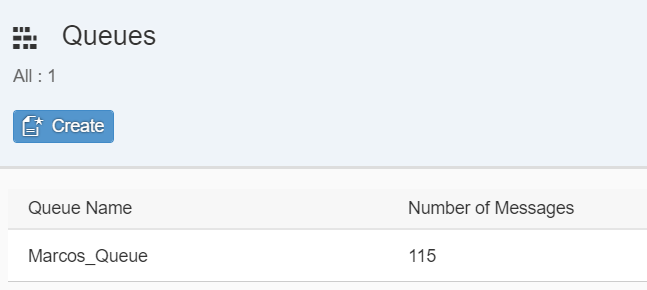

## Details
### You will learn
  - How to do something
  - Why this technology is helpful

- This deep dive is part of a series. For a complete overview visit the [SAP Cloud SDK Overview](https://blogs.sap.com/2017/05/10/first-steps-with-sap-s4hana-cloud-sdk/).
- This tutorial requires access to an SAP S/4HANA system.
- This tutorial requires access to the [Enterprise Messaging Service](https://cloudplatform.sap.com/capabilities/product-info.SAP-Cloud-Platform-Enterprise-Messaging.dc3dcc84-cd9c-477c-ba1c-862340abd874.html) on SAP Cloud Platform, Cloud Foundry.


---

[ACCORDION-BEGIN [Step 1: ](Goal of this tutorial)]

The architecture of modern cloud solutions requires all involved systems to be loosely coupled and isolated in order to ease horizontal scalability and increase fault tolerance. This can be achieved by using asynchronous communication based on events. In the context of `SAP S/4HANA` extensibility, we can realize such scenarios by connecting our side-by-side extension (`SbS`) app with `SAP S/4HANA` using the Enterprise Messaging Service in between. In [version 2.11.1 of the `SAP S/4HANA Cloud SDK`] (https://blogs.sap.com/2019/02/14/sap-s4hana-cloud-sdk-version-2.11.1-is-available/), we introduced the Message VDM which simplifies the event consumption in our side-by-side extension

In this deep dive, we elaborate on the event-driven asynchronous communication and introduce the Enterprise Messaging Service and the business event capability of `SAP S/4HANA`. The consumption of business events in your app with the SAP Cloud SDK is demonstrated using an example application.

For better understanding of this deep dive and as preparation for the implementation part, we suggest to work through the following tutorials beforehand:

 - [Setup] (https://blogs.sap.com/2017/05/15/step-1-with-sap-s4hana-cloud-sdk-set-up/)
 - [`HelloWorld` on SCP `CloudFoundry`] (https://blogs.sap.com/2017/05/19/step-3-with-sap-s4hana-cloud-sdk-helloworld-on-scp-cloudfoundry/)
 - [Quick reference to communication management] (https://blogs.sap.com/2017/09/15/what-is-what-your-quick-reference-to-communication-management-and-identity-access-management-artifacts-in-s4hana/)

 Note the distinction between an event and a message:

 - A (business) event in `SAP S/4HANA` that is triggered as part of a business process. Example: The master data of a business partner gets changed.
 - A message being sent from `SAP S/4HANA` to the Enterprise Messaging Service. The message consists of metadata and its payload.

Typically, an event happens and thereafter leads to the creation of a message that informs subscribed applications about this event.

[DONE]
[ACCORDION-END]

[ACCORDION-BEGIN [Step 2: ](Benefits of message-based asynchronous communication)]

Synchronous communication between software systems commonly relies on the existence of a request and a response. The client issues a request to the server, whereas the server replies with a response after processing the request. That is, the processing of the request typically happens upon its reception. Furthermore, client and server are tightly coupled in such scenarios. For instance, the client has to know the server's target address.

In contrast, message-based asynchronous communication does not involve the notions of client and server. Instead, we refer to the related systems as message producers and message consumers. The message producer creates and issues messages to the messaging service. The message consumer may subscribe and consume the message from the messaging service. As a consequence, both the message producer and consumer do not interact directly with each other, but are connected with the messaging service as intermediate component. This leads to loose coupling and isolation of the message sender and recipient.

Return to [this help page] (https://help.sap.com/viewer/bf82e6b26456494cbdd197057c09979f/Cloud/en-US/e87534178ff448139efa93d639f13299.html) about messaging concepts for further reference.

[DONE]
[ACCORDION-END]

[ACCORDION-BEGIN [Step 3: ](Example use case: Change of business partner)]

**Use case overview**

Let's apply above theory to a practical example considering the change of business partner master data. Imagine that you build a `SbS` extension to SAP S/4HANA that enables business users to validate business partner master data. Every change to a business partner requires a corresponding confirmation by a knowledgeable business user to ensure that the master data is consistent and reasonable.

The `SbS` extension notifies the business user about the change and presents the updated business partner master data. The user can then proceed with confirming or rejecting the change. This last step is not further considered throughout this deep dive, to keep the example application as simple as possible.


**Communication flow**

Business partner data can be changed in different ways, such as in the app Maintain Business Partner in the Fiori launchpad or via the [corresponding OData API](https://api.sap.com/api/API_BUSINESS_PARTNER/resource).

In any of these cases, SAP S/4HANA notices this business event and issues a message to the [Enterprise Messaging Service](https://cloudplatform.sap.com/capabilities/product-info.SAP-Enterprise-Messaging.dc3dcc84-cd9c-477c-ba1c-862340abd874.html). This message consists of metadata (e.g., the timestamp of its occurrence) and the payload (e.g., the business partner key) and belongs to the topic BO/`BusinessPartner`/Changed. Note that BO means business object and is a generic prefix for all topics in SAP S/4HANA. The Enterprise Messaging Service stores this message in all the message queues that are subscribed to the given topic.

The `SbS` extension is continuously connected to the Enterprise Messaging Service and gets notified once new messages are available in the message queue it is considering. Through the Message VDM of the Cloud SDK and the XBEM library that follows the [Java Message Service (JMS) specification](https://javaee.github.io/jms-spec/) the `SbS` extension app gets access to this message and can start processing it.

As the message payload contains the key of the changed business partner, the OData API for the business partner should be invoked by the `SbS` extension in order to retrieve its full master data. The business user sees a notification in the `SbS` extension user interface which presents the updated master data.

[DONE]
[ACCORDION-END]

[ACCORDION-BEGIN [Step 4: ](Introduction into all involved components)]

**Business Eventing in SAP S/4HANA**

SAP S/4HANA can issue business events to registered consumers. While SAP S/4HANA can also consume events, this is out of scope in this deep dive. Each message is issued under a specific topic which corresponds to the respective event type. For instance, the topic BO/`BusinessPartner`/Change relates to the change of a business partner.

Each message consists of metadata (e.g., the timestamp the event occurred) and a payload containing identifiers of the related business entities, such as the business partner key. Note that the payload does not contain the full business partner data or the changed field(s) in order to keep the payload as small as possible.

**Enterprise Messaging Service on SAP Cloud Platform**

The [Enterprise Messaging Service](https://cloudplatform.sap.com/capabilities/product-info.SAP-Enterprise-Messaging.dc3dcc84-cd9c-477c-ba1c-862340abd874.html) is a platform service on the Cloud Foundry environment on SAP Cloud Platform. It allows to connect to SAP S/4HANA and acts as a messaging service towards the `SbS` extension. It establishes a continuous connection to your `SbS` in order to ensure message notifications on time.

Events are stored in message queues whereas each queue is subscribed to at least one topic. Asynchronous communication is achieved by retaining events in the queue until the `SbS` extension has acknowledged the reception of an event. That is, in case the message was forwarded to the `SbS` extension, but not acknowledged, it can be retrieved again at a later point in time.


[DONE]
[ACCORDION-END]

[ACCORDION-BEGIN [Step 5: ](The Side-by-Side Extension on SAP Cloud Platform)]

The `SbS` extension is a Java application that uses the [`XBEM library`](https://github.com/SAP/enterprise-messaging-client-java-samples) to gain access to the Enterprise Messaging Service. On top of that, is uses the Message VDM provided by Cloud SDK in order to achieve type-safe access to received events.

[DONE]
[ACCORDION-END]

[ACCORDION-BEGIN [Step 6: ](XBEM Library of the SAP Cloud Platform SDK for service development)]

The [XBEM library](https://github.com/SAP/enterprise-messaging-client-java-samples) comes as part of the [SAP Cloud Platform SDK for service development](https://blogs.sap.com/2018/03/01/sap-cloud-platform-sdk-for-service-development-overview-of-blogs/). It follows the [Java Message Service (JMS) 2.0 specification](https://javaee.github.io/jms-spec/) and allows to get programmatic access to the Enterprise Messaging Service. You may check out their [example application](https://github.com/SAP/enterprise-messaging-client-java-samples) to gain more understanding how it works.

[DONE]
[ACCORDION-END]

[ACCORDION-BEGIN [Step 7: ](Message VDM of the Cloud SDK)]

In [version 2.11.1 of the SAP S/4HANA Cloud SDK, we introduced the Message VDM](https://blogs.sap.com/2019/02/14/sap-s4hana-cloud-sdk-version-2.11.1-is-available/) in an experimental state. Note that the usage in productive scenarios is not yet recommended. You are invited to play around with it and we are eager to improve the Message VDM further based on your feedback. In later versions of the SDK we will eventually announce the general availability of the Message VDM.

The Message VDM provides Java abstractions for all available event types in SAP S/4HANA and enables type-safe access to the message instance in your application code. You simply need to develop a listener class implementing the right interface that suits your use case. The Cloud SDK takes care of parsing the message payload and invoking your listener class(es) in case the respective event occurred.

Furthermore, you may leverage other SDK capabilities in conjunction with the Message VDM, such as the [Virtual Data Model for OData](https://blogs.sap.com/2017/09/11/step-10-with-sap-s4hana-cloud-sdk-virtual-data-model-for-odata/). The example application we present later on will demonstrate this combination.

Overall, you benefit from the SDK simplifications as it abstracts the technical aspects from you and enables the developer to focus on implementing the real business logic of the application use case.

[DONE]
[ACCORDION-END]

[ACCORDION-BEGIN [Step 8: ](Configuration in SAP S/4HANA and SAP Cloud Platform)]

In this section we outline the configuration steps one needs to conduct in both SAP S/4HANA Cloud and on SAP Cloud Platform to enable such a messaging scenario. The configuration on SAP Cloud Platform is split into two parts, as the logical sequence requires the SAP S/4HANA Cloud configuration to happen in between.

While the following deep dive focuses on SAP S/4HANA Cloud, note that the configuration in SAP S/4HANA, on-premise takes place in the respective ABAP transactions. Refer to the [official documentation for Enterprise Event Enablement](https://help.sap.com/viewer/810dfd34f2cc4f39aa8d946b5204fd9c/1809.000/en-US/c200f98fadb64ff1828ed5696c86fca2.html) in SAP S/4HANA for further reference.

Note that the configuration steps outlined below are not part of the SAP Cloud SDK itself, but rather reflect generic concepts for the message consumption using SAP S/4HANA and the Enterprise Messaging Service. Check the [official documentation on `help.sap.com`](https://help.sap.com/viewer/bf82e6b26456494cbdd197057c09979f/Cloud/en-US/df532e8735eb4322b00bfc7e42f84e8d.html) for further reference.

Note that the configuration steps outlined below are not part of the SAP Cloud SDK itself, but rather reflect generic concepts for the message consumption using SAP S/4HANA and the Enterprise Messaging Service. Check the [official documentation on `help.sap.com`](https://help.sap.com/viewer/bf82e6b26456494cbdd197057c09979f/Cloud/en-US/df532e8735eb4322b00bfc7e42f84e8d.html) for further reference.

[DONE]
[ACCORDION-END]

[ACCORDION-BEGIN [Step 9: ](Configuration in SAP Cloud Platform – Part 1)]

**Manage entitlement for Enterprise Messaging Service**

You can only create an instance of the Enterprise Messaging Service if you have the required entitlement. For this purpose, we assign the needed quota to the subaccount in which our `SbS` extension shall be deployed.

From within your global account, click on Entitlements in the left-hand menu and scroll down to Enterprise Messaging. Ensure that you have the necessary quota available. If so, click on Edit on top of the page and increase the quota assigned to your subaccount. Click Save.

**Create service instance in your Cloud Foundry space**

Navigate to your Cloud Foundry space. Click on Service Marketplace in the left-hand menu. Choose the Enterprise Messaging tile and click on Instances in the left-hand menu. Select New Instance with service plan dev and the following parameters as JSON:

```
{
	"emname": "messaging"
}
```

Do not bind it to any application yet and provide a service instance name. In this example we use my-ems.

**Create service key for service instance**

Once the service instance is existent, open it and click on Service Keys in the left-hand menu. Choose Add Service Key and give it a name. Specify the following configuration parameters:

```
{
	"type": "external"
}
```
Choose Save.

View the created service key and extract the following piece of JSON from it. Look for the entry where the protocol equals `mqtt311ws`:

```
{
	"oa2": {
		"clientid": "<clientid>",
		"clientsecret": "<clientsecret>",
		"tokenendpoint": "<tokenendpoint>",
		"granttype": "client_credentials"
	},
	"protocol": [
		"mqtt311ws"
	],
	"broker": {
		"type": "sapmgw"
	},
	"uri": "<uri>"
}
```

We will use the placeholders, such as <clientid>, in the remainder. So have this data at hand.

[DONE]
[ACCORDION-END]

### Configuration in SAP S/4HANA Cloud

[ACCORDION-BEGIN [Step 10: ](Create Communication System and Arrangement)]

The connection between SAP S/4HANA and the Enterprise Messaging Services requires that SAP S/4HANA exposes an OData API that allows the Enterprise Messaging Service to obtain information about available topic channels and event types. Besides, we also need to specify the URL and the credentials for the Enterprise Messaging Service in SAP S/4HANA.

For the aforementioned purposes, we leverage the concept of the communication arrangement in SAP S/4HANA.


[DONE]
[ACCORDION-END]

[ACCORDION-BEGIN [Step 11: ](Create Communication System)]

In the Fiori launchpad of SAP S/4HANA, launch the app for maintaining communication systems. Start to create a new communication system and provide an appropriate name.

As Host Name enter the value <uri> from the service key, whereas you remove the protocol `wss`:// from the URI.

As Token Endpoint, use the value <tokenendpoint> of the service key.

As Auth. Endpoint, use the value <tokenendpoint> of the service key, whereas you adjust it to end on /`oauth`/authorize instead of /`oauth`/token.

Furthermore, create an inbound user with user ID and password and remember its credentials.

In addition, create an outbound user and utilize <clientid> as OAuth 2.0 Client ID and <clientsecret> as the Client Secret. Click Create.

Save your communication system.

[DONE]
[ACCORDION-END]

[ACCORDION-BEGIN [Step 12: ](Create Communication Arrangement)]

From the Fiori launchpad, open the tile for maintaining communication arrangements.

Create a new communication arrangement based on the communication scenario `SAP_COM_0092` and provide an appropriate name.

Choose the communication system you created in the previous step. For outbound communication, choose the newly created outbound user.

Maintain the additional properties as follows:

|  Property Name        | Property Value
|  Channel              | Provide a meaningful name for your channel which relates to the use case or name of your `SbS` extension.
|  Description          | Provide a meaningful description for your topic channel.
|  Topic Space          | Use an value that identifies your SAP S/4HANA system, such as the system ID when connecting to SAP S/4HANA, on-premise edition.
|  Keep Alive           | 60
|  QoS                  | 1
|  Reconnect Attempts   | 3
|  Reconnect wait time (sec) | 10

Under Outbound Services, activate the Service Status and enter /protocols/`mqtt311ws` as path.

Note the full path of the inbound service in your communication arrangement. We will need this value in a configuration step later on.

Save your communication arrangement. Thereafter, choose Check Connection to conduct a connection test. The result should show the messages Connection test successful and Channel is active.

[DONE]
[ACCORDION-END]

[ACCORDION-BEGIN [Step 13: ](Enable event topics for your channel)]

In order to enable the event topics that fit to your application use case, an administrator has to enable them in the SAP S/4HANA implementation cockpit. This requires to use a business user that has the business catalog `SAP_CA_BC_IC_LND` assigned.

In the Fiori launchpad, open the tile Manage Your Solution and proceed by choosing Configure Your Solution.

In the search field above table named Configuration Items, enter messaging as search term and press Return. Choose the search result with Item Name as Event Handling.

Switch to the event topic maintenance by clicking on the Configure button of the second configuration step on the screen. In the appearing dialogue, use the input help to select your event channel that was created beforehand in the communication arrangement. Confirm the dialogue.

Enter the topic BO/`BusinessPartner`/Changed and click Save.

[DONE]
[ACCORDION-END]

### Configuration in SAP Cloud Platform – Part 2

[ACCORDION-BEGIN [Step 14: ](Create destination)]

Navigate to your SCP subaccount and create a new destination using the following parameters:

|  Property Name           | Property Value
:-------------- | :-------------
|  Name                    | You may choose an arbitrary name. It must not contain hyphens.
|  Type                    | HTTP
|  Description             | Provide a meaningful description.
|  URL                     | Specify the URL of the inbound service from your communication arrangement.
|  Proxy Type              | Internet
|  Authentication          | `BasicAuthentication`
|  User                    | Use the user name of your inbound user from your communication arrangement.
|  Password                | Use the password of your inbound user from your communication arrangement.

As additional property, enter the following:

|  Property Name             | Property Value
:-------------- | :-------------
|  `EnterpriseMessaging`     | True

Note that there is no space in the property name.

[DONE]
[ACCORDION-END]

[ACCORDION-BEGIN [Step 15: ](Subscribe to Enterprise Messaging Service)]

In your SCP subaccount, navigate to Subscriptions in the left-hand menu.

If not done yet, subscribe to the Enterprise Messaging service.

[DONE]
[ACCORDION-END]


### Create role collection and assign to user

[ACCORDION-BEGIN [Step 16: ](Create role collection)]

In your SCP subaccount, choose Role Collections under Security in the left-hand menu.

Create new role collection with the name `XBEMUser`.

[DONE]
[ACCORDION-END]

[ACCORDION-BEGIN [Step 17: ](Assign role collection to user)]

Open the Trust Configuration from the left-hand menu and choose the `SAP ID service`.

Enter the mail address of the administrator who is in charge to administer the event channel groups.

Click on Show Assignments to check for existing role collection assignments. If not present yet, assign the newly created role collection to this mail address.

In your SCP subaccount, navigate to Subscriptions and click the tile Enterprise Messaging which brings you to its service cockpit. Under Roles, locate the role name `ManageRole` and choose the + symbol under Actions. Add the newly created role collection here.

[DONE]
[ACCORDION-END]

[ACCORDION-BEGIN [Step 18: ](Create event channel group)]

In your `SCP` subaccount, navigate to Subscriptions and choose Go to Application on the Enterprise Messaging tile which brings you to the Event Hub UI.

In the Event Hub UI, go to Manage Event Channel Groups and create new event channel group by providing a meaningful name, such as the name of your `SbS` extension, description and choosing the newly created SCP destination as Event System. Wait until the available topic channels are retrieved from SAP S/4HANA and select the one that relates to your `SbS` extension.

Under Explore Events in the left-hand menu, you can choose the newly created event channel group and collapse the displayed topic space until you see all subordinated event topics.

[DONE]
[ACCORDION-END]

[ACCORDION-BEGIN [Step 19: ](Create a queue and subscribe to topic)]

In your SCP subaccount, open the space where your `SbS` extension will be deployed and choose Service Instances in the left-hand menu under Services. Locate the service instance of the Enterprise Messaging Service and choose the icon with the explanation Open Dashboard under Actions.

In the left-hand menu, choose Queues and create a new queue by providing a meaningful name, such as `BUPA_CHANGED_QUEUE`. Remember that queue name as we need it in the application source code later on.

Open Queue Subscriptions in the left-hand menu and create a queue subscription by choosing the newly created queue and entering the event topic(s) fully or with a pattern. For instance, you can subscribe to both <TopicSpace>/BO/`BusinessPartner`/Created and <TopicSpace>/BO/`BusinessPartner`/Changed by entering <TopicSpace>/BO/`BusinessPartner`/*.

Remember to replace <TopicSpace> with the value specified in the communication arrangement.

[DONE]
[ACCORDION-END]

### Implement your Side-by-Side Extension

After conducting all necessary configuration steps in SAP S/4HANA and on the SAP Cloud Platform, we continue by implementing a sample `SbS` extension. Note that this example is based on the sample application available [here](https://github.com/SAP/enterprise-messaging-client-java-samples).

In the following, we will create a plain project skeleton based on the Cloud SDK Maven archetypes and include the XBEM library in order to establish the connection to the Enterprise Messaging Service on the SAP Cloud Platform. Thereafter, we enrich the example project by introducing the Message VDM and the OData VDM to react on events according to our use case.

[ACCORDION-BEGIN [Step 20: ](Create a project structure)]

Execute the following Maven command on your machine:

```
mvn archetype:generate -DarchetypeGroupId=com.sap.cloud.s4hana.archetypes -DarchetypeArtifactId=scp-cf-spring -DarchetypeVersion=LATEST
```
Enter group id, artifact id and package according to your needs and open the created project structure in your favourite `IDE`.

[DONE]
[ACCORDION-END]

[ACCORDION-BEGIN [Step 21: ](Integrate the XBEM library)]

Open the `pom.xml` located in the project's root folder. Under <properties>, specify the XBEM client version as follows:

```
<xbem-client.version>2.0.1</xbem-client.version>
```
At the time of writing, version 2.0.1 has been the current version.

Open the `pom.xml` located in the application folder and enter the following dependencies:

```
<!-- Messaging client related dependencies -->
<dependency>
  <groupId>com.sap.cloud.servicesdk.xbem</groupId>
  <artifactId>emjapi-connector-sap-cp</artifactId>
  <version>${xbem-client.version}</version>
</dependency>

<dependency>
  <groupId>com.sap.cloud.servicesdk.xbem</groupId>
  <artifactId>emjapi-core</artifactId>
  <version>${xbem-client.version}</version>
</dependency>

<dependency>
  <groupId>com.sap.cloud.servicesdk.xbem</groupId>
  <artifactId>emjapi-extension-sap-cp-jms</artifactId>
  <version>${xbem-client.version}</version>
</dependency>
```
Note that the version specified in the root `pom.xml` is inherited to the application pom by referencing the respective property with ${`xbem-client.version`}.

Continue by creating a new class `SampleMessagingService` in the same package where your Application class resides.

Annotate this class with @Service:

```
@Service
public final class SampleMessagingService {
```
Instantiate a logger instance and define some constants we will use later on:

```
private static final Logger logger = CloudLoggerFactory.getLogger(SampleMessagingService.class);

public static final int INITIAL_RECONNECT_DELAY = 3000;
public static final int RECONNECT_DELAY = 3000;
public static final int UNLIMITED_CONNECT_ATTEMPTS = -1;

private static final String QUEUE_PREFIX = "queue:";
private static final String QUEUE_NAME = "BUPA_CHANGED_QUEUE";

```
Note that you have to specify the correct queue name.

Add a private method and a corresponding static field as follows:

```
private static final MessagingService messagingService = getMessagingService();

private static MessagingService getMessagingService() {
    final Cloud cloud = new CloudFactory().getCloud();
    return cloud.getSingletonServiceConnector(MessagingService.class, null);
}
```
Add the methods `grantConnection` and `grantConsumer`:

```
private Connection grantConnection() throws MessagingException, JMSException {
    final MessagingServiceJmsSettings settings = new MessagingServiceJmsSettings();

    settings.setMaxReconnectAttempts(UNLIMITED_CONNECT_ATTEMPTS);
    settings.setInitialReconnectDelay(INITIAL_RECONNECT_DELAY);
    settings.setReconnectDelay(RECONNECT_DELAY);

    final MessagingServiceFactory messagingServiceFactory = MessagingServiceFactoryCreator.createFactory(messagingService);
    final MessagingServiceJmsConnectionFactory connectionFactory = messagingServiceFactory.createConnectionFactory(MessagingServiceJmsConnectionFactory.class, settings);

    return connectionFactory.createConnection();
}

private MessageConsumer getConsumer(final Session session) throws JMSException {
    final Queue queue = session.createQueue(QUEUE_PREFIX + QUEUE_NAME);
    return session.createConsumer(queue);
}
```
The entry point of our application will be the public method `startReceiving`. Implement it as follows:

```
public void startReceiving() throws MessagingException {
    try {
        final Connection connection = grantConnection();

        final Session session = connection.createSession(false, Session.CLIENT_ACKNOWLEDGE);

        final MessageConsumer messageConsumer = getConsumer(session);

        //final JmsMessageDelegator delegator = new JmsMessageDelegator(new DefaultMessageDelegator());

        //delegator.addListener(new MyBusinessPartnerChangedLookupListener());

        //messageConsumer.setMessageListener(delegator);

        connection.start();
    } catch (final JMSException e) {
        throw new MessagingException(e);
    }
}
```
Note that the Connection and Session objects are part of the JMS specification. The XBEM library allows us to communicate with the Enterprise Messaging Service by programming again the JMS standard.

The `JmsMessageDelegator` and the `DefaultMessageDelegator` originate from the Message VDM of the `SAP Cloud SDK`. The delegator instance is used to register own listener classes that react on incoming messages of the respective topic. The delegator object acts as a JMS message listener and is registered at the JMS Message Consumer.

[DONE]
[ACCORDION-END]

[ACCORDION-BEGIN [Step 22: ](Integrate the Virtual Data Model (VDM) for Messages)]

Open the application pom and add the following dependencies:

```
<dependency>
  <groupId>com.sap.cloud.s4hana.datamodel</groupId>
   <artifactId>messaging-jms</artifactId>
</dependency>

<dependency>
  <groupId>com.sap.cloud.s4hana.datamodel</groupId>
  <artifactId>messaging-core</artifactId>
</dependency>

<dependency>
  <groupId>com.sap.cloud.s4hana.datamodel</groupId>
  <artifactId>messaging-api</artifactId>
</dependency>
```
Thereafter, uncomment the three lines in the method `startReceiving`.

Let's consider the class `MyBusinessPartnerChangedLookupListener` and add it to the class `SampleMessagingService` as inner class:

```
class MyBusinessPartnerChangedLookupListener implements BusinessPartnerChangedMessageListener {
    @Override
    public void onMessage(@Nonnull final BusinessPartnerChangedMessage message) {
        if (!message.getBusinessPartner().isPresent()) {
            logger.error("Received Business Partner changed message w/o Business Partner key.");
            return;
        }

        logger.info("Received change of business partner " + message.getBusinessPartner().get());

        lookupBusinessPartner(message.getBusinessPartner().get())
                .onFailure(cause -> logger.error("Exception during Business Partner lookup.", cause))
                .onSuccess(businessPartner -> logger.info("Fetched Business Partner " + businessPartner.getBusinessPartner() + " from S/4HANA"));
    }
}
```
Note that this listener class implements the interface `BusinessPartnerChangedMessageListener` and, therefore, includes the method `onMessage` with an argument of type `BusinessPartnerChangedMessage`. Here we see the benefits of the Message VDM, as it relieves us from parsing the message payload and takes care of invoking the corresponding listener class.

This argument named message provides us type-safe access to the message metadata and payload. We conduct a safety check for the presence of the business partner key and log an error if the key is missing. Otherwise, we invoke the method `lookupBusinessPartner` (we'll implement that in a second) and pass the business partner key retrieved from the message object as parameter.

[DONE]
[ACCORDION-END]

[ACCORDION-BEGIN [Step 23: ](Integrate the Virtual Data Model (VDM) for OData)]

The method `lookupBusinessPartner` uses the [Virtual Data Model for OData](https://blogs.sap.com/2017/09/11/step-10-with-sap-s4hana-cloud-sdk-virtual-data-model-for-odata/) provided by the `SAP Cloud SDK` that enables us to program a type-safe OData call to SAP S/4HANA. We can add the OData VDM using this dependency in the application pom:

```
<dependency>
  <groupId>com.sap.cloud.s4hana.datamodel</groupId>
  <artifactId>odata-api</artifactId>
</dependency>
```
The implementation of this method looks as follows:

```
private Try<BusinessPartner> lookupBusinessPartner(final String businessPartnerKey) {
    return Try.of(() -> new JwtBasedRequestContextExecutor()
           .withXsuaaServiceJwt()
           .execute(() -> {
               final BusinessPartner businessPartner =  businessPartnerService.getBusinessPartnerByKey(businessPartnerKey).execute();

               logger.info("Business partner: " + businessPartner);

               return businessPartner;
           }));
}
```
We invoke the method `getBusinessPartnerByKey` and retrieve an instance of the `OData` VDM class `BusinessPartner`. For demonstration purposes we use the application log to inspect the obtained business partner key and the fetched business partner master data.

Add the business partner service instantiation at the top of the class:

```
private static final BusinessPartnerService businessPartnerService = new DefaultBusinessPartnerService();
```
On a side note, this implementation leverages the method `withXsuaaServiceJwt` introduced in version 2.11.1 of the `SAP Cloud SDK` in order to execute code using the SDK outside of an HTTP request.

[DONE]
[ACCORDION-END]

[ACCORDION-BEGIN [Step 24: ](Create destination to SAP S/4HANA for OData Call)]

In order to retrieve business partner data, the OData VDM requires a destination pointing to your `SAP S/4HANA` system.

At first, you require a communication arrangement for the business partner OData API. Refer to [this deep dive](https://blogs.sap.com/2017/09/15/step-12-with-sap-s4hana-cloud-sdk-consuming-business-api-from-s4hana-via-odata/) for further reference. Note that for simplicity an inbound user with basic credentials suffices, i.e., there is no need to configure the OAuth 2.0 communication.

Once the communication arrangement and the inbound user have been created, we can maintain the destination.

For this purpose, navigate to your `SCP` subaccount and choose Destinations under Connectivity in the left-hand menu.

Click on New Destination and maintain the destination properties as follows:

|  Property Name           | Property Value
|  :------------- | :-------------
|  Name                    | `ErpQueryEndpoint`
|  Type                    | HTTP
|  Description             | Provide meaningful description here.
|  URL                     | Hostname of your SAP S/4HANA system. Example: `https://myXXXXXX-api.s4hana.ondemand.com`
|  Proxy Type              | Internet
|  Authentication          | Basic Authentication
|  User                    | User name of your inbound user. Note: Do not use CC*, but the user name.
|  Password                | Password of your inbound user.

Click Save.

[DONE]
[ACCORDION-END]

[ACCORDION-BEGIN [Step 25: ](Adjust the Spring controller class)]

Rename the class `HelloWorldController` to `MessageController` and adjust it so that it exposes the endpoint /listen and invokes the method `startReceiving` of the `SampleMessagingService` class:

```Java
@RestController
@RequestMapping("/")
public class MessageController{
    private final SampleMessagingService messagingService;
    public MessageController(SampleMessagingService messagingService) {
        this.messagingService = messagingService;
    }
    @GetMapping("/listen")
    public void startReceiving() throws MessagingException {
        messagingService.startReceiving();
    }
}
```

[DONE]
[ACCORDION-END]

[ACCORDION-BEGIN [Step 26: ](Create and bind to application to service instances)]

Create service instances of the following Cloud Foundry services:

- Authorization & Trust Management (`XSUAA`) with service name `my-xsuaa`
- Destination Service with service name my-destination
- Connectivity Service with service name my-connectivity

Check out [this blog post](https://blogs.sap.com/2017/05/21/step-4-with-sap-s4hana-cloud-sdk-calling-an-odata-service/)
starting from the headline Using the Destination Service on Cloud Foundry in SAP Cloud Platform and [this deep dive](https://blogs.sap.com/2018/01/19/deep-dive-7-with-sap-s4hana-cloud-sdk-s4hana-connectivity-made-simple/) starting at **Step 2**. Create service instances in Cloud Foundry Account.

Given that the correct service instance names are configured, extend the `manifest.yml` in the project root folder so that app binds to these service instances:

```
services:
  - my-ems
  - my-destination
  - my-xsuaa
  - my-connectivity
```

[DONE]
[ACCORDION-END]

[ACCORDION-BEGIN [Step 27: ](Deploy the example application)]

In order to deploy this example application to SAP Cloud Platform, Cloud Foundry, follow the instructions under Deployment in the [Hello World blog post of the SAP S/4HANA Cloud SDK for Cloud Foundry](https://blogs.sap.com/2017/05/19/step-3-with-sap-s4hana-cloud-sdk-helloworld-on-scp-cloudfoundry/).

[DONE]
[ACCORDION-END]

[ACCORDION-BEGIN [Step 28: ](Consume events with the example application)]
Once you changed a business partner in your SAP S/4HANA system, you will find corresponding events in your message queue.



Given that, invoke the endpoint /listen of the example application and download the application log from the cloud cockpit.

You will see corresponding log messages that indicate the business event consumption in your `SbS` extension.

Example:

```
   Business partner: BusinessPartner(super=VdmObject(customFields={TradingPartner=}, changedOriginalFields={}), businessPartner=1739787, customer=, supplier=, academicTitle=, authorizationGroup=, businessPartnerCategory=1, businessPartnerFullName=Moritz Mustermann,…
```
```
   Fetched Business Partner 1739787 from S/4HANA
```

[DONE]
[ACCORDION-END]

[ACCORDION-BEGIN [Step 29: ](Summary and Conclusion)]

In this deep dive we elaborated on the distinction between synchronous and asynchronous communication between software systems and presented the realization of the latter one based on events.

After presenting an example use case, we introduced all relevant components, such as the Enterprise Messaging Service on SAP Cloud Platform, the business eventing capability of SAP S/4HANA and the related development libraries (XBEM and the Message VDM of the SAP Cloud SDK). Afterwards, we outlined all configuration steps needed in both the SAP Cloud Platform and SAP S/4HANA and concluded by showing the implementation of an example application based on the use case introduced in the beginning.

We invite you to play around with the Message VDM and are eager to receive your feedback.

[DONE]
[ACCORDION-END]

[ACCORDION-BEGIN [Appendix: ](Test yourself)]

[VALIDATE_1]

[ACCORDION-END]

[ACCORDION-BEGIN [Appendix: ](Test yourself)]

[VALIDATE_2]

[ACCORDION-END]

[ACCORDION-BEGIN [Appendix: ](Test yourself)]

[VALIDATE_3]

[ACCORDION-END]

---
