## Prerequisites  
 - **Proficiency:** Beginner

### You will learn
The SAP S/4HANA Cloud SDK helps developers in building cloud-native extensions to SAP's S/4HANA. For this, it offers a Java library, project archetypes, and an attuned Continuous Delivery Toolkit. In this tutorial, you will see how to set up a scalable SAP S/4HANA Cloud SDK CI/CD server on Google Kubernetes Engine within a few minutes. you will also build an SAP S/4HANA Cloud SDK-based example application using the out-of-the-box pipeline.

### Time to Complete
**20 Min**

[ACCORDION-BEGIN [Step 1: ](Prepare the infrastructure)]

Use the credentials provided by one of the experts at the booth at Google Next '18 to log into the [Google Cloud Platform console](https://console.cloud.google.com).


Once there, use the menu on the top left corner to navigate a new Kubernetes cluster from the `Kubernetes Engine` menu.


Click **Create cluster**.

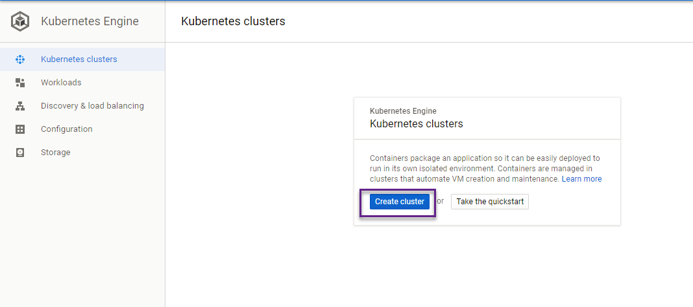

Change **Machine type** to use 2 `vCPUs`.


Click on **Create**. This will create a cluster named `cluster-1` with 3 nodes.  The creation of the cluster might take a few minutes. Once it's created, you should see it in your cluster overview.

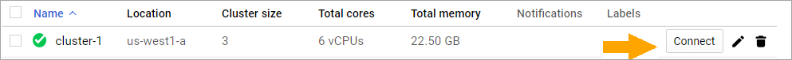

Click **Connect** next to the cluster name. This opens a dialogue. Click **Run in Cloud Shell**. This opens a browser-based shell and you can open the connection from there.

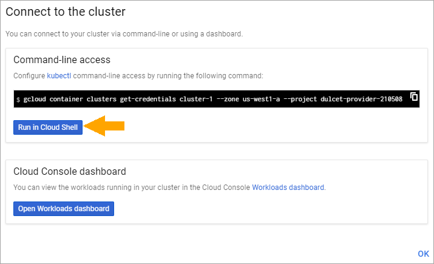

Once the Cloud Shell is open, press **Enter**.

[ACCORDION-END]

[ACCORDION-BEGIN [Step 2: ](Set up Jenkins)]

SAP S/4HANA Cloud SDK CI/CD Toolkit makes use of a pre-configured Jenkins to run the Continuous Delivery Pipeline. Next, you will start the Jenkins server with auto-scaling capabilities on our Kubernetes cluster. Thanks to the helm package manager tool, setting up the Jenkins on your Kubernetes cluster is super simple.

In order to make the installation even more convenient, the installation is wrapped in a small `setup_jenkins` shell script.

To run it, execute the below commands in the cloud shell that is open. The `setup_jenkins` script will execute a `helm` command with custom values. This will create the service account that is required to run the Jenkins and agents along with the services to cater internal and external traffic to Jenkins.

```
wget -O setup_jenkins https://raw.githubusercontent.com/SAP/cloud-s4-sdk-book/google-next/cx-server/setup_jenkins
chmod 700 setup_jenkins
./setup_jenkins
```

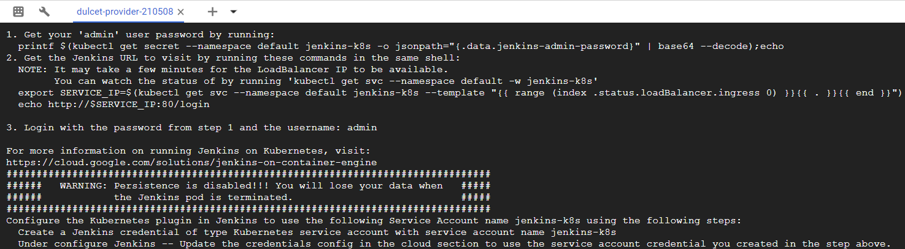

The Jenkins that you have deployed is preconfigured with the libraries and the plugins that are required to execute the SAP S/4HANA Cloud SDK Pipeline.
In order to examine the deployment status, please navigate to `Workloads` menu and please wait until the deployment status turns to green. This will take a few minutes.

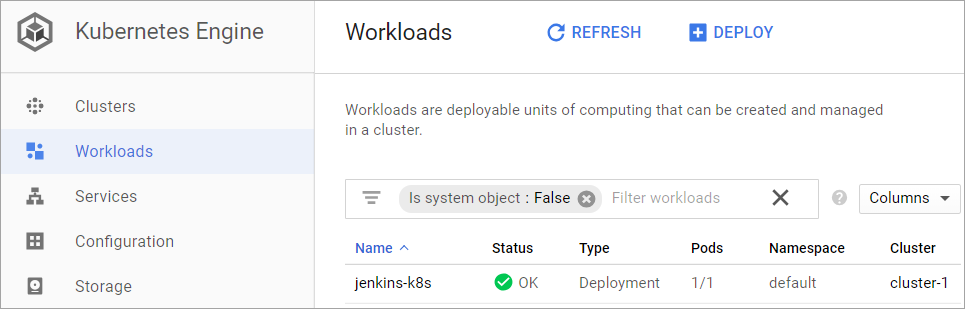

[ACCORDION-END]

[ACCORDION-BEGIN [Step 3: ](Connect to Jenkins)]

Once the setup is completed, it is time to build our first application with SAP S/4HANA Cloud SDK Pipeline. Navigate to Services menu under Kubernetes Engine and click on the endpoint of the `LoadBalancer` service.


### Login to Jenkins

Now you should see the Jenkins login page, which looks like the screenshot below:
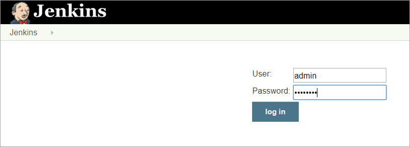

In the login screen please key-in `admin` as the user. The password can be found in the Jenkins installation log in the cloud shell.


[ACCORDION-END]

[ACCORDION-BEGIN [Step 4: ](Set up SAP S/4HANA Cloud SDK pipeline)]

Once the login is successful you will see a Jenkins dashboard.


Click on create new jobs. In the following page choose a name of your choice for the item name field.  Choose a `Multibranch Pipeline`. Click on OK.


In the following page, choose the source location. For this demo, you have created an example application that you can make use of. Please select `Git` from the dropdown in `Add source` option.

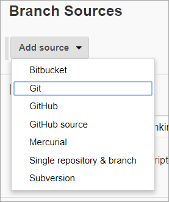

Please provide [https://github.com/SAP/cloud-s4-sdk-book.git](https://github.com/SAP/cloud-s4-sdk-book.git) as the location for the `Project Repository`.

Our example repository has multiple branches and contains the example application for this tutorial in the branch `google-next`. If you do not limit the build job to this branch, Jenkins will start building dozens of branches. This might be too much work - even for our powerful Kubernetes cluster. In order to configure Jenkins to only build the branch of interest, let's configure this behavior by clicking on `add` in the `Behaviors` section.

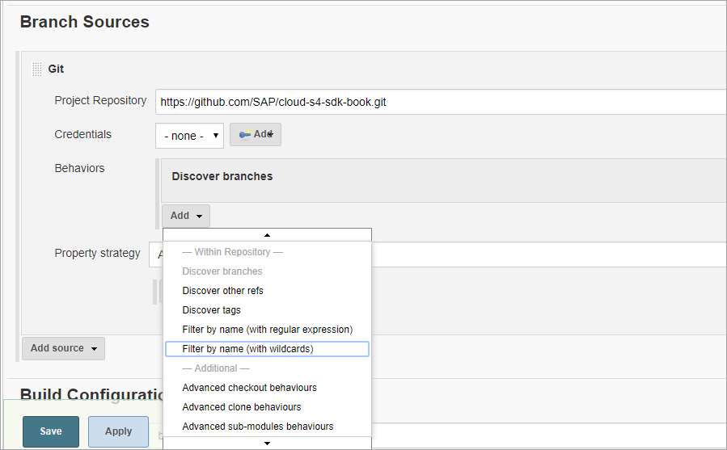

Choose `Filter By Name (with wildcards)`. This will expand the options. Please use `google-next` as a value for the `include` field.  This will build only the branch `google-next`.

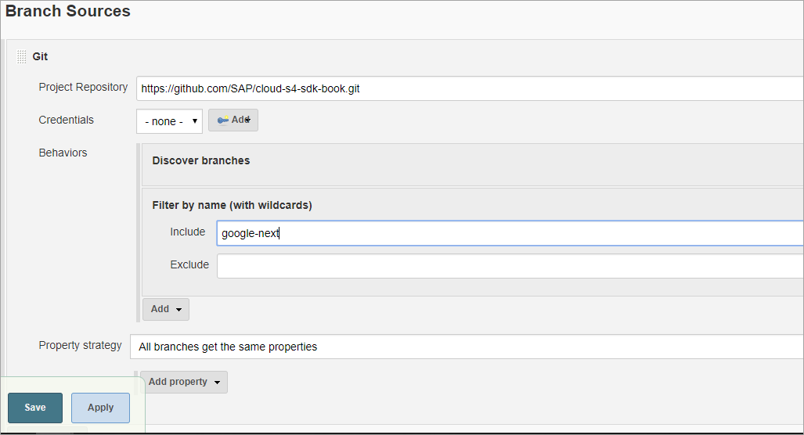

Save the configuration.

That's All. You are done.

Congratulations! You have successfully setup your CI/CD infrastructure on Google Kubernetes Engine and started building the application from the `google-next` branch using SAP S/4HANA Cloud SDK Pipeline.

You can check the status of the pipeline execution in the Jenkins dashboard. Navigate to Jenkins dashboard and click on the `Open Blue Ocean` in the left hand side of the menu.

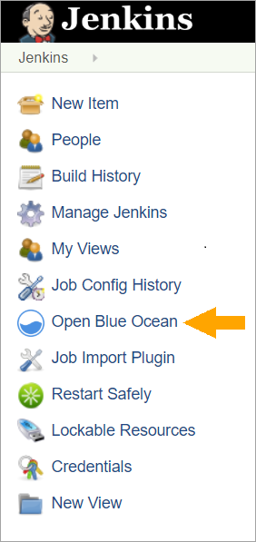

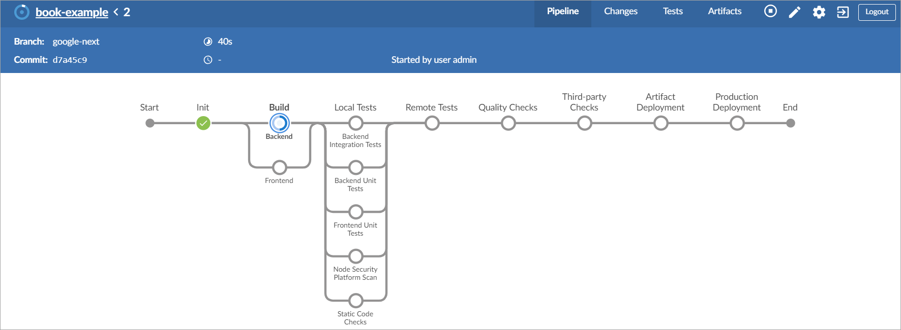

To switch to classic view of the Jenkins dashboard from Blue ocean view, you can click on the `Go to Classic` button on the right hand side.


[ACCORDION-END]

[ACCORDION-BEGIN [Step 5: ](Show us the code)]

Click on the branch name `google-next`. In the following window, click on the build number of the job.

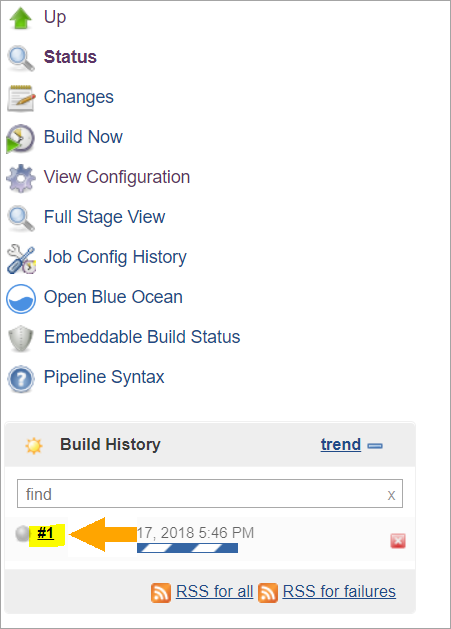

Now click on the `Console Output` menu and scroll down to the bottom of the log.

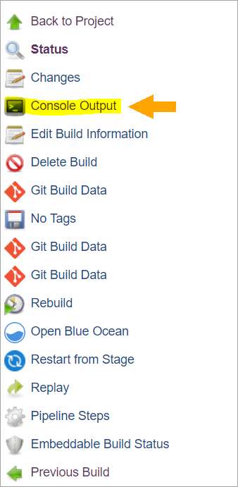

You will find a code for the goodie once the job is successfully completed.

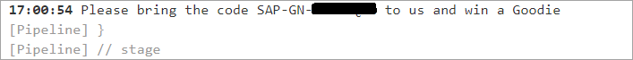

[ACCORDION-END]

[ACCORDION-BEGIN [Step 6: ](Cleanup)]

Once you have successfully executed the job on Jenkins, kindly open the Google Cloud Platform console and navigate to the Kubernetes Engine. Click on *clusters*. In the following page. Click on the bin icon that is displayed next to the cluster. Please note that, the deletion of the Kubernetes cluster will also delete the Jenkins instance that you have created as part of this exercise.


Click on the `Delete` button.

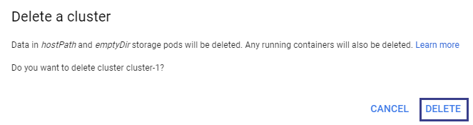

[ACCORDION-END]

[ACCORDION-BEGIN [Step 7: ](Conclusion and further reading)]

Unlike the standalone Jenkins instance, the Jenkins instance which is deployed on the Kubernetes cluster gives us the flexibility to scale it based on the load. In addition, Kubernetes will ensure the availability of the service by regular health check of the containers.

To get detailed insight into SAP S/4HANA Cloud SDK, please go through our [blog posts](https://blogs.sap.com/2017/05/10/first-steps-with-sap-s4hana-cloud-sdk/).  

[DONE]
[ACCORDION-END]
