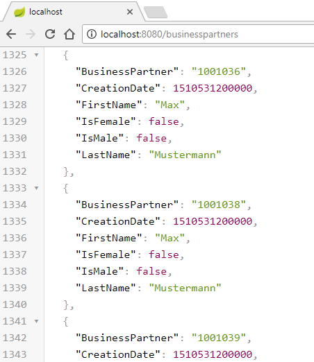
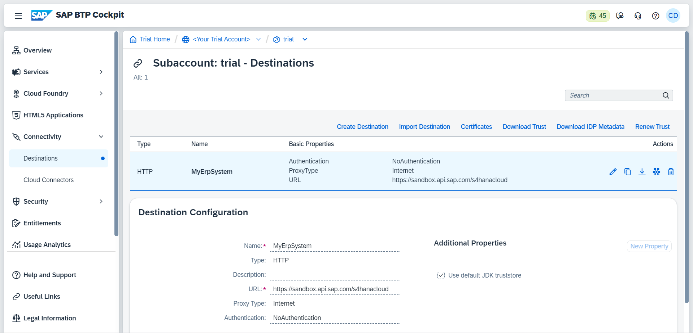
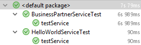

## Prerequisites  
In order to follow this tutorial successfully, you need a working and reachable system of `SAP S/4HANA on-premise` or `S/4HANA Cloud`. You may substitute the business partner service introduced here with any other API published on the SAP API Business Hub.
&nbsp;
If you do not have an S/4HANA system available, you may use a public service, such as the [Northwind OData Service](http://services.odata.org/V2/Northwind/Northwind.svc) as a fallback solution.
&nbsp;
This tutorial requires access to an SAP ERP system or, as a fallback, a mock server providing the [Business Partner OData V2](https://api.sap.com/api/API_BUSINESS_PARTNER/resource) service.

## Details
### You will learn
In this tutorial, you will enhance the `HelloWorld` project stub to call an existing `OData` service, deploy the project on `SAP Cloud Platform` based on `Cloud Foundry`, and write an integration test.

If you want to follow this tutorial, it is highly recommended to check out the previous tutorials in the series. You will not need any additional software besides the setup explained in the first part of the series as the server will run on your local machine.

Please note that depending on the platform you are using (`Neo` or `Cloud Foundry`), the configuration to the respective `S/4HANA` system might be different. In this tutorial, you will find the methods using which you can access your system on `Cloud Foundry`. For `SAP Cloud Platform Cloud Foundry`, the following `S/4HANA` connection capabilities exist.

|  | `SAP Cloud Platform, Cloud Foundry`
:-------------- | :-------------
S/4HANA on-premise |	Information will be provided in the [extended tutorial series](https://blogs.sap.com/2017/05/10/first-steps-with-sap-s4hana-cloud-sdk/)
S/4HANA Cloud | Direct Connection with `BASIC Auth` (Technical User, see below)

Note that your application code is not dependent on the platform you are using. Using the `SAP Cloud SDK`, you can write your code once, and it will be capable of dealing with all different authentication and connectivity options.


---

[ACCORDION-BEGIN [Step 1: ](Set up mock server or get access to Business Hub sandbox (optional))]

>If you have access to an SAP S/4HANA Cloud system with a technical user, you can skip this part.

In order to make a call to an `OData` service, there needs to be a service to call. You can setup a local mock server that mimics the [Business Partner OData V2](https://api.sap.com/api/API_BUSINESS_PARTNER/resource) service by following the instructions [here](https://sap.github.io/cloud-s4-sdk-book/pages/mock-odata.html). This mock server does not support all the features of the actual `OData` service, but it suffices to try it out locally.

Once it is up and running you should see the list of services at `http://localhost:3000/`.

Alternatively, many APIs can also be tested using the sandbox of the SAP API Business Hub. To use the sandbox, you need an API key. Go to [https://api.sap.com](https://api.sap.com) and click "Log On" in the top right corner. If you do not have an account, you will need to register first. When you are logged in, click on the [Business Partner OData V2 API reference](https://api.sap.com/api/API_BUSINESS_PARTNER/resource) and find you API key under "Show API Key". You will use your API key later in this tutorial.

[DONE]
[ACCORDION-END]


[ACCORDION-BEGIN [Step 2: ](Virtual Data Model)]

This section explains the concepts of the S/4HANA Virtual Data Model. If you would like to first implement the S/4HANA integration, jump ahead to [the next section](https://blogs.sap.com/2017/05/21/step-4-with-sap-s4hana-cloud-sdk-calling-an-odata-service/#WriteBusinessPartnerServlet) and revisit the content of this section later.

The data stored in an S/4HANA system is inherently complexly structured and therefore difficult to query manually. Therefore, HANA introduced a Virtual Data Model (VDM) that aims to abstract from this complexity and provide data in a semantically meaningful and easy to consume way. The preferred way to consume data from an S/4HANA system is via the OData protocol. While BAPIs are also supported for compatibility reasons, OData should always be your first choice. You can find a list of all the available OData endpoints for S/4HANA Cloud systems in [SAP's API Business Hub](https://api.sap.com/shell/discover/contentpackage/SAPS4HANACloud?section=ARTIFACTS).

The SAP Cloud SDK now brings the VDM for OData to the Java world to make the type-safe consumption of OData endpoints even more simple! The VDM is generated using the information from SAP's [API Business Hub](https://api.sap.com/shell/discover/contentpackage/SAPS4HANACloud?section=ARTIFACTS). This means that its compatible with every API offered in the API Business Hub and therefore also compatible with every S/4HANA Cloud system.


[DONE]

[ACCORDION-END]

[ACCORDION-BEGIN [Step 3: ](The manual way to OData)]

Let's take a look at typical code you could write to access any OData service using the [SAP Cloud Platform SDK for service development](https://blogs.sap.com/2017/10/17/introducing-the-sap-cloud-platform-sdk-for-service-development/). Here, a list of business partners is retrieved from an S/4HANA system:

```Java
final ErpHttpDestination destination = DestinationAccessor.getDestination("MyErpSystem").asHttp().decorate(DefaultErpHttpDestination::new);
final List<MyBusinessPartnerType> businessPartners = ODataQueryBuilder
        .withEntity("/sap/opu/odata/sap/API_BUSINESS_PARTNER",
                "A_BusinessPartner")
        .select("BusinessPartner",
                "LastName",
                "FirstName",
                "IsMale",
                "IsFemale",
                "CreationDate")
        .build()
        .execute(destination)
        .asList(MyBusinessPartnerType.class);
```

The `ODataQueryBuilder` represents a simple and generic approach to consuming OData services in your application and is well suited to support arbitrary services. It is a big step forward from manually building up an HTTP request to an OData service and processing the results in your code, and is used internally by the SAP Cloud SDK. In turn, the `ODataQueryBuilder` also uses concepts of the SAP Cloud SDK to simplify communication with systems, which are referenced by an `ErpConfigContext`.

Nevertheless, there are quite a few pitfalls you can fall into when using the plain `ODataQueryBuilder` approach to call OData services:

- For `.withEntity("/sap/opu/odata/sap/API_BUSINESS_PARTNER", "A_BusinessPartner")` you already need to know three things: the OData endpoints service path `(/sap/opu/odata/sap)`, the endpoints name `(API_BUSINESS_PARTNER)` and the name of the entity collection `(A_BusinessPartner)` as defined in the metadata of the endpoint.
- Then, when you want to select specific attributes from the `BusinessPartner` entity type with the `select()` function, you need to know how these fields are named. But since they are only represented as strings in this code, you need to look at the metadata to find out how they're called. The same also applies for functions like `order()` and `filter()`. And of course using strings as parameters is prone to spelling errors that your IDE most likely won't be able to catch for you.
- Finally, you need to define a class such as `MyBusinessPartnerType` with specific annotations that represents the properties and their types of the result. For this you again need to know a lot of details about the OData service.

[DONE]

[ACCORDION-END]

[ACCORDION-BEGIN [Step 4: ](Virtual Data Model: The new way to OData)]

Now that you have seen some of the possible pitfalls of the current approach, let's take a look at how the OData VDM of the SAP Cloud SDK simplifies the same task, as the SDK is able to incorporate more knowledge about the system that is being called.

```Java
final ErpHttpDestination destination = DestinationAccessor.getDestination("MyErpSystem").asHttp().decorate(DefaultErpHttpDestination::new);

final List<BusinessPartner> businessPartners =
        new DefaultBusinessPartnerService()
                .getAllBusinessPartner()
                .select(BusinessPartner.BUSINESS_PARTNER,
                        BusinessPartner.LAST_NAME,
                        BusinessPartner.FIRST_NAME,
                        BusinessPartner.IS_MALE,
                        BusinessPartner.IS_FEMALE,
                        BusinessPartner.CREATION_DATE)
                .executeRequest(destination);
```

Using the OData VDM you now have access to an object representation of a specific OData service, in this case the `DefaultBusinessPartnerService` (default implementation of the interface `BusinessPartnerService`). So now there's no more need to know the endpoint's service path, service name or entity collection name. You can call this service's `getAllBusinessPartner()` function to retrieve a list of all the business partners from the system. The system the service will use is passed as a destination in the `executeRequest()` call. In this tutorial the destination is called `MyErpSystem` and you will learn a little later where it is set up.

Now take a look at the `select()` function. Instead of passing strings that represent the field of the entity, you can simply use the static fields provided by the `BusinessPartner` class. Hereby, not only the risk of spelling errors is eliminated, it is also type-safe! Again, the same applies for `filter()` and `orderBy()`. For example, filtering to male business partners becomes as easy as `.filter(BusinessPartner.IS_MALE.eq(true))`– note the type-safe comparison.

An additional benefit of this approach is discoverability. Since everything is represented as code, you can simply use your IDE's autocompletion features to see which functions a service supports and which fields an entity consists of: start by looking at the different services that are available in the package `com.sap.cloud.sdk.s4hana.datamodel.odata.services`, instantiate the default implementation of the service you need (class name prefixed with `Default`), and then look for the methods of the service class that represent the different available operations. Based on this, you can choose the fields to select and filters to apply using the fields of the return type.

Each service is described by a Java interface, for example, `BusinessPartnerService`. The SDK provides a default, complete implementation of each service interface. The corresponding implementation is available in a class whose name is the name of the interface prefixed with `Default`, for example, `DefaultBusinessPartnerService`. You can either simply instantiate that class, or use dependency injection with a corresponding Java framework (covered in [Step 22 of our tutorial series](https://blogs.sap.com/2018/01/02/step-22-with-the-sap-s4hana-cloud-sdk-extensibility-type-safe-expand-and-dependency-injection-with-the-virtual-data-model-for-odata/)). The benefit of the interfaces is better testing and extensibility support.

To sum up the advantages of the OData VDM:

- No more hard-coded strings
- No more spelling errors
- Type safety for functions like `filter`, `select` and `orderBy`
- Java data types for the result provided out of the box, including appropriate conversions
- Discoverability by autocompletion
- SAP S/4HANA services can be easily mocked during testing based on the service interface in Java (see tutorial [Step 19: Mocking S/4HANA calls](https://blogs.sap.com/2017/12/07/step-19-with-s4hana-cloud-sdk-mocking-s4hana-calls-or-how-to-develop-an-s4hana-extension-without-an-s4hana-system/))

The VDM supports retrieving entities by key and retrieving lists of entities along with `filter()`, `select()`, `orderBy()`, `top()` and `skip()`. You can also resolve navigation properties on demand or eagerly (expand, see [Step 22](https://blogs.sap.com/2018/01/02/step-22-with-the-sap-s4hana-cloud-sdk-extensibility-type-safe-expand-and-dependency-injection-with-the-virtual-data-model-for-odata/)). The VDM also gives easy access to create (see [Step 20](https://blogs.sap.com/2017/12/07/step-20-with-s4hana-cloud-sdk-create-and-deep-insert-with-the-virtual-data-model-for-odata/)), update, and delete operations as well as function imports.

For any OData service not part of SAP's API Business Hub, the `ODataQueryBuilder` still is the go to approach for consumption.

[DONE]

[ACCORDION-END]

[ACCORDION-BEGIN [Step 5: ](Write the BusinessPartnerServlet)]

The `SAP Cloud SDK` provides simple and convenient ways to access your ERP systems out of the box. In this example you will implement an endpoint that performs an `OData` query to `SAP S/4HANA` in order to retrieve a list of **business partners** from your ERP system. More specifically, in this example, you will retrieve all persons (a specific kind of business partner) with their name and a few additional properties.

To get started, open your previously created `Hello World` project (e.g. **`firstapp`**) and **`create a new file`** called `BusinessPartnerServlet.java` in the following location:

`./application/src/main/java/com/sap/cloud/sdk/tutorial/BusinessPartnerServlet.java`


```Java
package com.sap.cloud.sdk.tutorial;

import com.google.gson.Gson;
import org.slf4j.Logger;
import org.slf4j.LoggerFactory;

import javax.servlet.ServletException;
import javax.servlet.annotation.WebServlet;
import javax.servlet.http.HttpServlet;
import javax.servlet.http.HttpServletRequest;
import javax.servlet.http.HttpServletResponse;
import java.io.IOException;
import java.util.List;

import com.sap.cloud.sdk.cloudplatform.connectivity.DestinationAccessor;
import com.sap.cloud.sdk.datamodel.odata.client.exception.ODataException;
import com.sap.cloud.sdk.datamodel.odata.helper.Order;

import com.sap.cloud.sdk.s4hana.connectivity.DefaultErpHttpDestination;
import com.sap.cloud.sdk.s4hana.connectivity.ErpHttpDestination;
import com.sap.cloud.sdk.s4hana.datamodel.odata.namespaces.businesspartner.BusinessPartner;
import com.sap.cloud.sdk.s4hana.datamodel.odata.services.DefaultBusinessPartnerService;

@WebServlet("/businesspartners")
public class BusinessPartnerServlet extends HttpServlet {

    private static final long serialVersionUID = 1L;
    private static final Logger logger = LoggerFactory.getLogger(BusinessPartnerServlet.class);

    private static final String CATEGORY_PERSON = "1";
    // TODO: uncomment the lines below and insert your API key, if you are using the sandbox service
    // private static final String APIKEY_HEADER = "apikey";
    // private static final String SANDBOX_APIKEY = "";
    private final ErpHttpDestination destination = DestinationAccessor.getDestination("MyErpSystem").asHttp().decorate(DefaultErpHttpDestination::new);

    @Override
    protected void doGet(final HttpServletRequest request, final HttpServletResponse response)
            throws ServletException, IOException {
        try {
            final List<BusinessPartner> businessPartners =
                    new DefaultBusinessPartnerService()
                            .getAllBusinessPartner()
                            .select(BusinessPartner.BUSINESS_PARTNER,
                                    BusinessPartner.LAST_NAME,
                                    BusinessPartner.FIRST_NAME,
                                    BusinessPartner.IS_MALE,
                                    BusinessPartner.IS_FEMALE,
                                    BusinessPartner.CREATION_DATE)
                            .filter(BusinessPartner.BUSINESS_PARTNER_CATEGORY.eq(CATEGORY_PERSON))
                            .orderBy(BusinessPartner.LAST_NAME, Order.ASC)
                            .top(200)
                            // TODO: uncomment the line below, if you are using the sandbox service
                            // .withHeader(APIKEY_HEADER, SANDBOX_APIKEY)
                            .executeRequest(destination);

            logger.info(String.format("Found %d business partner(s).", businessPartners.size()));

            response.setContentType("application/json");
            response.getWriter().write(new Gson().toJson(businessPartners));
        } catch (final ODataException e) {
            logger.error(e.getMessage(), e);
            response.setStatus(HttpServletResponse.SC_INTERNAL_SERVER_ERROR);
            response.getWriter().write(e.getMessage());
        }
    }
}
```

In the servlet's GET method, an instance of the `BusinessPartnerService` is initialized in order to prepare the query to S/4HANA with the help of the SDK's Virtual Data Model. The method `getAllBusinessPartners` is called, which represents the operation of the OData service that returns all available business partners. With the fluent query helper returned by this method, you can gradually build up the query:

- This example selects some fields of the `BusinessPartner` (if you omit this part, all fields will be returned),
- filters for business partners of category Person (code `"1"`),
- orders by the last name of the business partner,
- limits the amount of results to a maximum of 200.

**Note:** If you would like to use the SAP Business Hub sandbox service for testing, please uncomment lines 32, 33, and 53 and insert your API key in line 33.

Finally, having prepared the query, you can call the `executeRequest` method. This method does a lot of the heavy lifting necessary to connect to an S/4HANA system and relieves you as a developer from dealing with complex aspects such as:

- the connectivity to this system, which may reside on-premise behind a corporate firewall, – by means of the connectivity service and the optional Cloud Connector, and
- the authentication to this system using potentially vastly different authentication flows (basic authentication, principal propagation, OAuth2).

The SAP Cloud SDK provides all of these capabilities with a simple interface and allows customers (tenants) of your application to configure the connection to their system. You will learn more about the configuration below when deploying the project.

The `executeRequest` method of the VDM returns the query result as a `navigatable` list of type `BusinessPartner`, which represents the entity type of the response in a type-safe manner. The example declares the servlet's response as JSON content and transform the result into a JSON response.

Any `ODataException` thrown by the OData call is caught and logged, before returning an error response.

[DONE]

[ACCORDION-END]

[ACCORDION-BEGIN [Step 6: ](Deploy the Project)]

Depending on your chosen archetype and SAP Cloud Platform setup you can deploy the project on either *SAP Cloud Platform Neo* or *SAP Cloud Platform Cloud Foundry*.

**Provide Destinations for your Application**

In order for your application to run you need to provide it with information about your S/4HANA system. Your `BusinessPartnerService` needs an URL. Depending on the system you would like to use, you might need to define an authentication method as well. This information is provided in the form of a destination which we retrieve (in a multi-tenant environment) by transparently accessing the destination service of SAP Cloud Platform. This is done by retrieving the destination via the `DestinationAccessor` by name, in your case `MyErpSystem`. There are multiple ways to create such a destination. For now you will provide it to our application by creating an environment variable that holds the information. You will create such a variable now both for a local deployment and a deployment on SCP Cloud Foundry.

**Run on a Local Server**

[OPTION BEGIN [Windows]]

As mentioned in the Tutorial `Create a sample application on Cloud Foundry using SAP Cloud SDK` of this tutorial series, you can run the project on a local `TomEE` server. Here, you need to supply the destinations as an environment variable on your local machine. How you set an environment variable depends on your OS. The following instructions target Windows. If you are using a Mac please select Mac OS at the switch above.

```Shell
set destinations=[{name: "MyErpSystem", url: "https://URL"}]
```

**Note:** Some services, other than the sandbox service and the mock server, may require user credentials for the request execution.
If you would like to connect to such a service, use the following snippet instead:
```Shell
set destinations=[{name: "MyErpSystem", url: "https://URL", "username": "USER", "password": "PASSWORD"}]
```
Please change the values URL, USER and PASSWORD accordingly.

You may use any name you like. If you do decide to change it though, remember to also adapt it in the code above. Make sure the variable has been properly set:

```Shell
set destinations
```

_Note: You can also add more ERP endpoints to this JSON representation, following the same schema._

Be aware that the variable is only available in your current terminal session. If you are having trouble settings the variable, take a look at the troubleshooting section. Once the variable has been set, re-build and start the server as follows:

```Shell
cd /path/to/firstapp
mvn clean install
mvn tomee:run -pl application
```

Visit `http://localhost:8080/businesspartners` to see your new feature in action. It should look similar to this web page:



**Connecting to SAP S/4HANA from SAP Cloud Platform Cloud Foundry**

On SCP Cloud Foundry, you can either supply the same environment variable `destinations` that you used for the local deployment above to the Cloud Foundry application, or use the [destination service](https://help.sap.com/viewer/cca91383641e40ffbe03bdc78f00f681/Cloud/en-US/7e306250e08340f89d6c103e28840f30.html) of SAP Cloud Platform Cloud Foundry. Using the destination service is the recommended approach, because it already handles important aspects related to multi-tenancy, connectivity and security and is transparently integrated into the SAP Cloud SDK. Therefore, the usage of the destination service is explained in detail below.

Nevertheless, there may be circumstances that make the approach via the environment variable easier to use or otherwise preferable for initial testing. To set the environment variable using the Cloud Foundry command line interface (CLI), execute the following command:


```Shell
cf set-env firstapp destinations "[{name: \"MyErpSystem\", url: \"https://URL\"}]"
```

Again, supply the correct values for your S/4HANA system. Afterwards, rebuild and deploy the application to Cloud Foundry (see below). Be aware that depending on your command line interface (for example, on Windows command prompt), you may need to use double quotes instead of single quotes and escape the double quotes.

Whenever this environment variable is set, the SAP Cloud SDK will use it to determine destinations. Make sure to delete it with `cf unset-env firstapp destinations` as soon as you are done with the initial testing and when you want to use the real destination service. You can now push the application to CF and test it if you like.

[OPTION END]

[OPTION BEGIN [Mac OS]]

As mentioned in the Tutorial `Create a sample application on Cloud Foundry using SAP Cloud SDK` of this tutorial series, you can run the project on a local `TomEE` server. Here, you need to supply the destinations as an environment variable on your local machine.

```Bash
export destinations='[{name: "MyErpSystem", url: "https://URL"}]'
```

**Note:** Some services, other than the sandbox service and the mock server, may require user credentials for the request execution.
If you would like to connect to such a service, use the following snippet instead:

```Bash
export destinations='[{name: "MyErpSystem", url: "https://URL", username: "USER", password: "PASSWORD"}]'
```
Please change the values URL, USER and PASSWORD accordingly.

You may use any name you like. If you do decide to change it though, remember to also adapt it in the code above. Make sure the variable has been properly set:

```Bash
echo $destinations
```

_Note: You can also add more ERP endpoints to this JSON representation, following the same schema._

Be aware that the variable is only available in your current terminal session. If you are having trouble settings the variable, take a look at the troubleshooting section. Once the variable has been set, re-build and start the server as follows:

```Bash
cd /path/to/firstapp
mvn clean install
mvn tomee:run -pl application
```

Visit `http://localhost:8080/businesspartners` to see your new feature in action. It should look similar to this web page:


**Connecting to SAP S/4HANA from SAP Cloud Platform Cloud Foundry**

On SCP Cloud Foundry, you can either supply the same environment variable `destinations` that we used for the local deployment above to the Cloud Foundry application, or use the [destination service](https://help.sap.com/viewer/cca91383641e40ffbe03bdc78f00f681/Cloud/en-US/7e306250e08340f89d6c103e28840f30.html) of SAP Cloud Platform Cloud Foundry. Using the destination service is the recommended approach, because it already handles important aspects related to multi-tenancy, connectivity and security and is transparently integrated into the SAP Cloud SDK. Therefore, the usage of the destination service is explained in detail below.

Nevertheless, there may be circumstances that make the approach via the environment variable easier to use or otherwise preferable for initial testing. To set the environment variable using the Cloud Foundry command line interface (CLI), execute the following command:

```Bash
cf set-env firstapp destinations '[{name: "MyErpSystem", url: "https://URL"}]'
```

Again, supply the correct values for your S/4HANA system. Afterwards, rebuild and deploy the application to Cloud Foundry (see below).

Whenever this environment variable is set, the SAP Cloud SDK will use it to determine destinations. Make sure to delete it with `cf unset-env firstapp destinations` as soon as you are done with the initial testing and when you want to use the real destination service. You can now push the application to CF and test it if you like.

[OPTION END]

**Using the Destination Service on SAP Cloud Platform Cloud Foundry**

For the recommended approach of using the destination service to configure the connection to your SAP S/4HANA system, proceed as follows. If you have just set the destination variable on Cloud Foundry please remove it again as described above.

**Subscribe to Services**
The destination handling is available as a service on Cloud Foundry. You need to create an instance of that service and bind it to your application in order to use the destination service. Additionally, you need an instance of the [Authorization and Trust Management](https://help.sap.com/viewer/65de2977205c403bbc107264b8eccf4b/Cloud/en-US/6373bb7a96114d619bfdfdc6f505d1b9.html) (`xsuaa`) service.

Use the Cloud Foundry CLI to create the two required service instances:

```Bash
cf create-service xsuaa application my-xsuaa
cf create-service destination lite my-destination
```

This creates two service instances in your space: one instance named `my-xsuaa` for the `xsuaa` service with service plan `application`, and a second instance named `my-destination` for the `destination` service (plan `lite`).

To bind the two newly created service instances to your application when it is deployed, adapt the `manifest.yml` file by adding the two instances to the services section at the end. The remainder of the file remains as before:

```YAML

---
applications:

- name: firstapp
  memory: 1024M
  timeout: 300
  random-route: true
  path: application/target/firstapp-application.war
  buildpacks:
    - sap_java_buildpack
  env:
    TARGET_RUNTIME: tomee7
    SET_LOGGING_LEVEL: '{ROOT: INFO, com.sap.cloud.sdk: INFO}'
    JBP_CONFIG_SAPJVM_MEMORY_SIZES: 'metaspace:128m..'
  services:
  - my-xsuaa
  - my-destination
```

With this, the setup is complete and you can re-deploy the application. However, you still need to configure the destination to your SAP S/4HANA system. You will do this in the next section and then deploy the application to Cloud Foundry.

**Configure Destinations**

Customers of your application can use the Cloud Platform cockpit to configure destinations. You can use the cockpit to define your destination as well.

1. Navigate to the Cloud Foundry subaccount within your global account that you have used before to deploy the application (see Step 3). In case of a trial account, the subaccount will be called trial by default.
2. In the menu on the left, expand Connectivity and select **Destinations**.
3. Click **New Destination** and enter the following values into the input fields:
    - **Name:** `MyErpSystem`
    - **URL:** URL to your SAP S/4HANA system
    - **Authentication:** choose `NoAuthentication`
    - Leave the other fields unchanged.
4. Click **Save**.

**Note:** If the service you are trying to connect to requires user credentials, choose `BasicAuthentication` instead of `NoAuthentication` and provide the **username** and **password** in the corresponding fields.

Afterwards, the destination should look as follows.



Please note that the above settings represent the setup for a connection to SAP S/4HANA Cloud via a technical user (communication user). Depending on your setup and requirements, you may want to use a different `ProxyType` (`OnPremise` when using the Cloud Connector) or a different means of authentication. If you want to learn more about authorizing user access in a productive environment, please find [Secure Your Application on SAP Cloud Platform Cloud Foundry](s4sdk-secure-cloudfoundry).


**Deploy to Cloud Foundry**

Now you can deploy your application to `Cloud Foundry` using the `Cloud Foundry CLI` (command line interface):

```Bash
cd /path/to/firstapp
mvn clean install
cf push
```
Access the new servlet at `https://YOUR-ROUTE/businesspartners`.


If you change the destinations afterwards, you need to at least [restart (or restage)](https://docs.cloudfoundry.org/devguide/deploy-apps/start-restart-restage.html) your application to make sure that the changes become effective due to caching:

```Bash
cf restart firstapp
```

[DONE]

[ACCORDION-END]

[ACCORDION-BEGIN [Step 7: ](Integration test for BusinessPartnerServlet)]

To construct an extensible integration test for the newly created `BusinessPartnerServlet`, the following items will be prepared:

  - Adjustment: Maven pom file
  - New: test class
  - New: JSON Schema for servlet response validation
  - New: `systems.yml` and credentials

First, let's adjust the Maven pom file of the `integrations-tests` sub-module by adding a dependency for JSON schema validation:

`./integration-tests/pom.xml`

```XML
<dependency>
    <groupId>io.rest-assured</groupId>
    <artifactId>json-schema-validator</artifactId>
    <version>4.0.0</version>
    <scope>test</scope>
</dependency>
<dependency>
    <groupId>org.hamcrest</groupId>
    <artifactId>hamcrest-all</artifactId>
    <version>1.3</version>
    <scope>test</scope>
</dependency>
```

_Hint: Do not forget to reload your maven project in order to include the newly added dependencies._

[DONE]

[ACCORDION-END]

[ACCORDION-BEGIN [Step 8: ](Test class)]

Navigate to the integration-tests project and create a new class:

`./integration-tests/src/test/java/com/sap/cloud/sdk/tutorial/BusinessPartnerServletTest.java`

```Java
package com.sap.cloud.sdk.tutorial;

import io.restassured.RestAssured;
import io.restassured.http.ContentType;
import io.restassured.module.jsv.JsonSchemaValidator;
import org.jboss.arquillian.container.test.api.Deployment;
import org.jboss.arquillian.junit.Arquillian;
import org.jboss.arquillian.test.api.ArquillianResource;
import org.jboss.shrinkwrap.api.spec.WebArchive;
import org.junit.Before;
import org.junit.BeforeClass;
import org.junit.Test;
import org.junit.runner.RunWith;
import org.slf4j.Logger;
import org.slf4j.LoggerFactory;

import java.net.URI;
import java.net.URL;

import com.sap.cloud.sdk.testutil.MockDestination;
import com.sap.cloud.sdk.testutil.MockUtil;

import static io.restassured.RestAssured.when;

@RunWith(Arquillian.class)
public class BusinessPartnerServletTest {
    private static final MockUtil mockUtil = new MockUtil();
    private static final Logger logger = LoggerFactory.getLogger(BusinessPartnerServletTest.class);

    @ArquillianResource
    private URL baseUrl;

    @Deployment
    public static WebArchive createDeployment() {
        return TestUtil.createDeployment(BusinessPartnerServlet.class);
    }

    @BeforeClass
    public static void beforeClass() {
        mockUtil.mockDefaults();
    }

    @Before
    public void before() {
        RestAssured.baseURI = baseUrl.toExternalForm();
    }

    @Test
    public void testService() {
        // mock OData service
        // TODO: insert your service URL down below
        mockUtil.mockDestination(MockDestination.builder("MyErpSystem", URI.create("https://URL")).build());

        // JSON schema validation from resource definition
        final JsonSchemaValidator jsonValidator = JsonSchemaValidator
                .matchesJsonSchemaInClasspath("businesspartners-schema.json");

        // HTTP GET response OK, JSON header and valid schema
        when()
                .get("/businesspartners")
                .then()
                .statusCode(200)
                .contentType(ContentType.JSON)
                .body(jsonValidator);
    }
}
```

What you see here in the actual `testService` method, is the usage of `RestAssured` on a JSON service backend. The HTTP GET request is run on the local route `/businesspartners`, the result is validated with multiple assertions:

  - HTTP response status code: 200 (OK)
  - HTTP `ContentType` is `application/json`
  - HTTP body is valid JSON code, checked with `businesspartners-schema.json` definition

Make sure to replace the URL in line 52 with the one of your service (e.g. `http://localhost:3000` for a locally deployed mock server), or otherwise the test will fail.

[DONE]

[ACCORDION-END]

[ACCORDION-BEGIN [Step 9: ](Create JSON Schema for servlet response validation)]

Inside the `integration-tests` project, create a new resource file

`./integration-tests/src/test/resources/businesspartners-schema.json`

```JSON
{
  "$schema": "http://json-schema.org/draft-04/schema#",
  "title": "Business Partner List",
  "type": "array",
  "items": {
    "title": "Business Partner",
    "type": "object",
    "required": ["BusinessPartner", "LastName"]
  },
  "minItems": 1
}

```

As you can see, the properties `BusinessPartner` and `LastName` will be marked as requirement for every entry of the expected business partner list. The JSON validator would break the test if any of the items was missing a required value.

[DONE]

[ACCORDION-END]

[ACCORDION-BEGIN [Step 10: ](Systems.json and credentials (optional))]

>If you are testing your application using either the SAP API Business Hub sandbox service or the mock server (deployed locally or on SAP Cloud Foundry), you should skip this step.

If you run your application on SAP Cloud Platform, the SDK can simply read the ERP destinations from the destination service. However, since the tests should run locally, you need a way to supply your tests with an ERP destination.

Luckily, the SDK provides a utility class for such purposes – `MockUtil`. This class allows you to mock the ERP destinations you'd typically find on `CloudFoundry`. To provide `MockUtil` with the necessary information, you'll need to add a `systems.json` or `systems.yml` file to your test resources directory. `MockUtil` will read these files and provide your tests with the ERP destinations accordingly. Adapt the URL as before.

`./integration-tests/src/test/resources/systems.yml`

```YAML

---
erp:
  default: "ERP_001"
  systems:
    - alias: "ERP_001"
      uri: "https://my.erp.system"
      systemId: "MySystemId"           # optional, defaults to ""
      sapClient: "001"                 # optional, defaults to default SAP client
      locale: "en"                     # optional, defaults to English (US)
      erpEdition: "cloud"              # optional, defaults to "cloud"
```

Additionally, the `BusinessPartnerServletTest` needs to be changed in the following way:

```Java
@Test
public void testService() {
    // mock OData service
    mockUtil.mockDestination("MyErpSystem", "ERP_001");

    // JSON schema validation from resource definition
    final JsonSchemaValidator jsonValidator = JsonSchemaValidator
            .matchesJsonSchemaInClasspath("businesspartners-schema.json");

    // HTTP GET response OK, JSON header and valid schema
    when()
            .get("/businesspartners")
            .then()
            .statusCode(200)
            .contentType(ContentType.JSON)
            .body(jsonValidator);
}
```

That's it! You can now start all tests with the default Maven command:

`mvn test -Derp.username=USER -Derp.password=PASSWORD`

Please change the values `USER` and `PASSWORD` accordingly.



**Credentials file**

If you do not want to pass the ERP username and password all the time when executing tests or want to execute tests on a continuous delivery pipeline where more people could see the password in log outputs, you can also provide credentials in a `credentials.yml` file that the `SDK` understands.

To do this, create the following `credentials.yml` file in a save location (e.g., like storing your ssh keys in ~/.ssh), i.e., not in the source code repository.

`/secure/local/path/credentials.yml`

```YAML

---
credentials:
- alias: "ERP_001"
  username: "user"
  password: "pass"

```

Afterwards you may pass the credentials file as follows when running tests. Make sure to use the absolute path to the file:

`mvn test -Dtest.credentials=/secure/local/path/credentials.yml`

[DONE]

[ACCORDION-END]

[ACCORDION-BEGIN [Appendix: ](Troubleshooting)]

**Connecting to the `OData` service**

In case you are trying to connect to an OData service endpoint on a server without verifiable SSL certificate, you might see the following error message due to an untrustworthy signature:

`Failed to execute GET https://<URL>/$metadata`

- If you are using the environment variable approach, please adapt the destinations environment variable to additionally include the properties map:

`[{name: "MyErpSystem", url: "https://URL", username: "USER", password: "PASSWORD", trustAll: "true"}]`

- If you are using the destination service on Cloud Foundry, add a new additional property to your destination in the Cloud Platform cockpit. Enter `TrustAll` into the first input (dropdown) field and `TRUE` into the second field.

If you are still facing problems when connecting to the OData service, try the following to get more insights into what is happening and what can be logged:

  - Add a logger implementation to the test artifact's dependencies in order to get more detailed log output during tests: expand the dependencies section of `integration-tests/pom.xml` with:


```XML
<dependency>
    <groupId>ch.qos.logback</groupId>
    <artifactId>logback-classic</artifactId>
    <version>1.2.3</version>
    <scope>test</scope>
</dependency>

```

If you are behind a proxy and want to connect your app running locally with the Cloud Foundry archetype to an SAP S/4HANA system in your network, you can supply your proxy information as part of the destinations environment variable (see [Javadoc](https://help.sap.com/http.svc/rc/fe7d14ff3c3043aca2920cb72d725492/1.0/en-US/index.html?com/sap/cloud/sdk/cloudplatform/connectivity/AbstractDestinationFacade.html)):
`[{name: "MyErpSystem", url: "https://URL", username: "USER", password: "PASSWORD", properties: [{key: "TrustAll", value: "true"},{key: "proxyHost", value: "my-proxy.com"},{key: "proxyPort", value: "8080"}]}]`

[DONE]

[ACCORDION-END]

[ACCORDION-BEGIN [Appendix: ](Test yourself)]

[VALIDATE_1]

[ACCORDION-END]

[ACCORDION-BEGIN [Appendix: ](Test yourself)]

[VALIDATE_2]

[ACCORDION-END]

---
