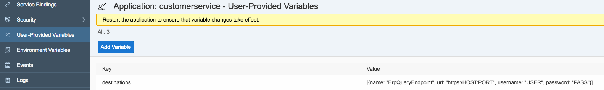

## Prerequisites  
 - **Proficiency:** intermediate
 - In order to follow this tutorial successfully, you need a working and reachable system of `SAP S/4HANA on-premise` or `S/4HANA Cloud`. You may substitute the cost center service introduced here with any other API published on the SAP API `BusinessHub`. If you do not have an `S/4HANA` system available, you may use a public service such as the [Northwind OData Service](http://services.odata.org/V2/Northwind/Northwind.svc) as a fallback solution.
 - **Tutorials:** [Create a sample application on Cloud Foundry using SAP S/4HANA Cloud SDK](https://www.sap.com/developer/tutorials/s4sdk-cloud-foundry-sample-application.html)

## Details
Please note that depending on the platform you are using (`Neo` or `Cloud Foundry`), the configuration to the respective `S/4HANA` system might be different. In this tutorial, you will find the methods using which you can access your system on `Cloud Foundry`. For `SAP Cloud Platform Cloud Foundry`, the following `S/4HANA` connection capabilities exist.

|  | `SAP Cloud Platform, Cloud Foundry`
:-------------- | :-------------
S/4HANA on-premise |	Information will be provided in the [extended tutorial series](https://blogs.sap.com/2017/05/10/first-steps-with-sap-s4hana-cloud-sdk/)
S/4HANA Cloud | Direct Connection with `BASIC Auth` (Technical User, see below)

Note that your application code is not dependent on the platform you are using. Using the `S/4HANA Cloud SDK`, you can write your code once, and it will be capable of dealing with all different authentication and connectivity options.

### You will learn
In this tutorial, you will enhance the `HelloWorld` project stub to call an existing `OData` service, deploy the project on `SAP Cloud Platform` based on `Cloud Foundry`, and write an integration test.
If you want to follow this tutorial, it is highly recommended to check out the previous tutorials in the series. You will not need any additional software besides the setup explained in the first part of the series as the server will run on your local machine.
**Note**: This tutorial requires access to an `SAP ERP` system or, as a fallback, any other `OData V2` service.


### Time to Complete
**20 Min**

---

[ACCORDION-BEGIN [Step 1: ](Write the CostCenterServlet)]

The `SAP S/4HANA Cloud SDK` provides simple and convenient ways to access your ERP systems out of the box. In this example you will implement an endpoint that performs an `OData` query to `SAP S/4HANA` in order to retrieve a list of cost centers from your ERP system.

To get started, open your previously created `Hello World` project (in this case, it is called `firstapp`) and create a new file called `CostCenterServlet.java` in the following location:

`./application/src/main/java/com/sap/cloud/sdk/tutorial/CostCenterServlet.java`

```java
package com.sap.cloud.sdk.tutorial;

import com.google.gson.Gson;
import org.slf4j.Logger;

import javax.servlet.ServletException;
import javax.servlet.annotation.WebServlet;
import javax.servlet.http.HttpServlet;
import javax.servlet.http.HttpServletRequest;
import javax.servlet.http.HttpServletResponse;
import java.io.IOException;
import java.util.List;

import com.sap.cloud.sdk.cloudplatform.logging.CloudLoggerFactory;
import com.sap.cloud.sdk.odatav2.connectivity.ODataException;
import com.sap.cloud.sdk.odatav2.connectivity.ODataQueryBuilder;
import com.sap.cloud.sdk.s4hana.connectivity.ErpEndpoint;

@WebServlet("/costcenters")
public class CostCenterServlet extends HttpServlet {

    private static final long serialVersionUID = 1L;
    private static final Logger logger = CloudLoggerFactory.getLogger(CostCenterServlet.class);

    @Override
    protected void doGet(final HttpServletRequest request, final HttpServletResponse response)
            throws ServletException, IOException
    {
        try {
            final ErpEndpoint endpoint = new ErpEndpoint();
            final List<CostCenterDetails> costCenters = ODataQueryBuilder
                    .withEntity("/sap/opu/odata/sap/FCO_PI_COST_CENTER", "CostCenterCollection")
                    .select("CostCenterID", "Status", "CompanyCode", "Category", "CostCenterDescription")
                    .build()
                    .execute(endpoint)
                    .asList(CostCenterDetails.class);

            response.setContentType("application/json");
            response.getWriter().write(new Gson().toJson(costCenters));

        } catch(final ODataException e) {
            logger.error(e.getMessage(), e);
            response.setStatus(HttpServletResponse.SC_INTERNAL_SERVER_ERROR);
            response.getWriter().write(e.getMessage());
        }
    }
}
```

The code is fairly simple. In the servlet GET method, an `ErpEndpoint` is initialized for the default destination, which you will define later during deployment. With the help of the `SDK's` `ODataQueryBuilder` a query is being prepared, build and executed to the endpoint. The query result gets wrapped to a navigable `List` of `CostCenterDetails` . Finally the servlet response is declared as JSON content and transformed as such.

In addition, you need a new class called `CostCenterDetails.java` which is required to read the `OData` query response in a type-safe manner. **Create** this new class in the following location:

`./application/src/main/java/com/sap/cloud/sdk/tutorial/CostCenterDetails.java`

```java
package com.sap.cloud.sdk.tutorial;

import lombok.Data;

import com.sap.cloud.sdk.result.ElementName;

@Data
public class CostCenterDetails
{
    @ElementName( "CostCenterID" )
    private String costCenterID;

    @ElementName( "CompanyCode" )
    private String companyCode;

    @ElementName( "Status" )
    private String status;

    @ElementName( "Category" )
    private String category;

    @ElementName( "CostCenterDescription" )
    private String costCenterDescription;
}
```

  - The `SDK` `@ElementName` annotation maps `OData` values to their corresponding object fields.
  - The `Lombok` `@Data` annotation automatically generates the boilerplate code for us:
    - getter and setter methods
    - constructor (for `@NonNull` fields)
`hashCode()`, `equals(...)` and `toString()`

You need to add `Lombok` to your provided dependencies. Add the following inside the dependencies section of the `application/pom.xml` file as an additional dependency:

```
<dependency>
    <groupId>org.projectlombok</groupId>
    <artifactId>lombok</artifactId>
    <scope>provided</scope>
</dependency>​
```

[ACCORDION-END]


[ACCORDION-BEGIN [Step 2: ](Set up connection to SAP S/4HANA)]

Depending on your chosen archetype and `SCP` setup you can deploy the project on either `SCP Neo` or `SCP CloudFoundry`. In this tutorial, you will deploy to `SAP Cloud Platform Cloud Foundry`.
Before you can deploy the new version to `Cloud Foundry`, you need to supply the destination of your `SAP S/4HANA` system.
In order to perform queries against your ERP system, you have to inform `Cloud Foundry` about the location of your ERP endpoint. To do this, you need to provide an environment variable with the destination configuration. Currently, you have two ways of accomplishing this.

#### Setting destination as environment variable using CF CLI

```
cf set-env firstapp destinations '[{name: "ErpQueryEndpoint", url: "https://URL", username: "USER", password: "PASSWORD"}]'
```

Please change the values `URL`, `USER` and `PASSWORD` accordingly.

Note: You can also add more ERP endpoints to this JSON representation, following the same schema. However, please note that `ErpQueryEndpoint` corresponds to the default destination used to create our `ErpEndpoint`.

#### Setting destination as user-provided variables using the Cockpit

Alternatively, you can directly set the destination variable using the `Cockpit`. For this, find your application in the `SCP Cockpit` and provide the variable as user-provided variable:



[ACCORDION-END]


[ACCORDION-BEGIN [Step 3: ](Deploying the project: SAP Cloud Platform CloudFoundry)]

Now you can deploy your application to `Cloud Foundry` using the `Cloud Foundry CLI` (command line interface):

```
cd /path/to/firstapp
mvn clean install
cf push
```

If you change the destinations afterwards with one of the two methods outlined above, you need to at least [restart (or restage)](https://docs.cloudfoundry.org/devguide/deploy-apps/start-restart-restage.html) your application so that the environment setting becomes effective:

```
cf restart firstapp
```

[ACCORDION-END]

[ACCORDION-BEGIN [Step 4: ](Integration test: Project preparation)]

To construct an extensible integration test for the newly created `CostCenterServlet`, the following items will be prepared:

  - Adjustment: Maven pom file
  - New: test class
  - New: JSON Schema for servlet response validation

First, let's adjust the Maven pom file of the `integrations-tests` `submodule` by adding a dependency for JSON schema validation:

`./integration-tests/pom.xml`

```
<dependency>
    <groupId>io.rest-assured</groupId>
    <artifactId>json-schema-validator</artifactId>
    <version>3.0.3</version>
    <scope>test</scope>
</dependency>
```

[ACCORDION-END]

[ACCORDION-BEGIN [Step 5: ](Integration test: Servlet response validation)]

Navigate to the integration-tests project and create a new class:

`./integration-tests/src/test/java/com/sap/cloud/sdk/tutorial/CostCenterServiceTest.java`

```java
package com.sap.cloud.sdk.tutorial;

import com.jayway.restassured.RestAssured;
import com.jayway.restassured.http.ContentType;
import io.restassured.module.jsv.JsonSchemaValidator;
import org.jboss.arquillian.container.test.api.Deployment;
import org.jboss.arquillian.junit.Arquillian;
import org.jboss.arquillian.test.api.ArquillianResource;
import org.jboss.shrinkwrap.api.spec.WebArchive;
import org.junit.Before;
import org.junit.BeforeClass;
import org.junit.Test;
import org.junit.runner.RunWith;
import org.slf4j.Logger;

import java.net.URI;
import java.net.URL;
import java.net.URISyntaxException;

import com.sap.cloud.sdk.cloudplatform.logging.CloudLoggerFactory;
import com.sap.cloud.sdk.testutil.ErpSystem;
import com.sap.cloud.sdk.testutil.MockUtil;

import static com.jayway.restassured.RestAssured.given;

@RunWith( Arquillian.class )
public class CostCenterServiceTest
{
    private static final MockUtil mockUtil = new MockUtil();
    private static final Logger logger = CloudLoggerFactory.getLogger(CostCenterServiceTest.class);

    @ArquillianResource
    private URL baseUrl;

    @Deployment
    public static WebArchive createDeployment()
    {
        return TestUtil.createDeployment(CostCenterServlet.class);
    }

    @BeforeClass
    public static void beforeClass() throws URISyntaxException
    {
        mockUtil.mockDefaults();

        mockUtil.mockErpDestination(ErpSystem.builder(
            "ERP_TEST_SYSTEM",
            new URI("https://URL")).build());
    }

    @Before
    public void before()
    {
        RestAssured.baseURI = baseUrl.toExternalForm();
    }

    @Test
    public void testService()
    {
        // JSON schema validation from resource definition
        final JsonSchemaValidator jsonValidator = JsonSchemaValidator.matchesJsonSchemaInClasspath("costcenters-schema.json");

        // HTTP GET response OK, JSON header and valid schema
        given().
                get("/costcenters").
            then().
            assertThat().
                statusCode(200).
                contentType(ContentType.JSON).
                body(jsonValidator);
    }
}
```

Please change the value `URL` accordingly.

What you see here, is the usage of `RestAssured` on a JSON service backend. The HTTP GET request is run on the local route `/costcenters`, the result is validated with multiple assertions:

  - HTTP response status code: 200 (OK)
  - HTTP `ContentType`: `application/json`
  - HTTP body is valid JSON code, checked with `costcenters-schema.json` definition

[ACCORDION-END]

[ACCORDION-BEGIN [Step 6: ](Integration test: JSON Schema resource)]

Inside the `integration-tests` project, create a new resource file

`./integration-tests/src/test/resources/costcenters-schema.json`

```json-schema
{
  "$schema": "http://json-schema.org/draft-04/schema#",
  "title": "Simple CostCenter List",
  "type": "array",
  "items": {
    "title": "CostCenter Item",
    "type": "object",
    "javaType": "com.sap.cloud.sdk.tutorial.CostCenterDetails",
    "required": ["id", "companyCode"]
  }
}
```

As you can see, the properties `id` and `companyCode` will be marked as requirement for every entry of the expected cost center list. The JSON validator would break the test if any of the items were missing a required value.

That's it! You can now start all tests with the default Maven command:

`mvn test -Derp.username=USER -Derp.password=PASSWORD`

Please change the values `USER` and `PASSWORD` accordingly.

If you want to run the tests without Maven, please remember to also include the parameters.


[ACCORDION-END]

[ACCORDION-BEGIN [Appendix: ](credentials file and connecting to OData service)]

**Integration test: `credentials.yml`**

Since you do not want to pass the ERP username and password all the time when executing tests or want to execute tests on a CI where more people could see the password in log outputs, you can also provide credentials in `credentials.yml` file that the `SDK` understands.

To do this, create the following `credentials.yml` file inside `./integration-tests/src/main/resources` directory. When applicable, please keep in mind to set the file to be ignored for version control and source sharing.


```

---
credentials:
- alias: "ERP_TEST_SYSTEM"
  username: "user"
  password: "pass"

```

Now you can validate your application against your ERP system without having secrets on command line level: `mvn test`.

**Please note**: For development, we recommend to move the `credentials.yml` file to a safe location on your computer (like storing your ssh keys in ~/.ssh, i.e. not in the source code repository).

Afterwards you may pass the credentials file using its absolute path:

`mvn test -Dtest.credentials=/secure/local/path/credentials.yml`


**Connecting to OData service**

If you are having trouble connecting to the `OData` service, try the following to get more insights into what is happening:

  - Add a logger implementation to the test artifact's dependencies in order to get more detailed log output during tests: expand the dependencies section of `integration-tests/pom.xml` with:


```
    <dependency>
        <groupId>ch.qos.logback</groupId>
        <artifactId>logback-classic</artifactId>
        <version>1.2.3</version>
        <scope>test</scope>
    </dependency>​

```

  - Supply a custom error handler to the `OData` query execution. For example, use the following class:

```
  ./application/src/main/java/com/sap/cloud/sdk/tutorial/ODataV2SimpleErrorHandler.java
```


```java

  package com.sap.cloud.sdk.tutorial;

  import org.slf4j.Logger;

  import com.sap.cloud.sdk.cloudplatform.logging.CloudLoggerFactory;
  import com.sap.cloud.sdk.odatav2.connectivity.ErrorResultHandler;
  import com.sap.cloud.sdk.odatav2.connectivity.ODataException;

  public class ODataV2SimpleErrorHandler implements ErrorResultHandler<ODataException> {
      private static final Logger logger = CloudLoggerFactory.getLogger(ODataV2SimpleErrorHandler.class);

  	public ODataException createError(String content, Object origin, int httpStatusCode) {
  		String msg = String.format(
  				"OData V2 Simple Error Handler received backend OData V2 service response with status %s, full response was %s",
  				httpStatusCode,
  				content);
  		logger.error(msg);

  		ODataException e = new ODataException();
  		e.setMessage(msg);
  		e.setCode(String.valueOf(httpStatusCode));

  		return e;
  	}
  }
```

  and in `CostCenterServlet`, add the following to the `ODataQueryBuilder` chain:

```java
  ODataQueryBuilder...
    .errorHandler(new ODataV2SimpleErrorHandler())
    .build()...
```

[ACCORDION-END]

---
