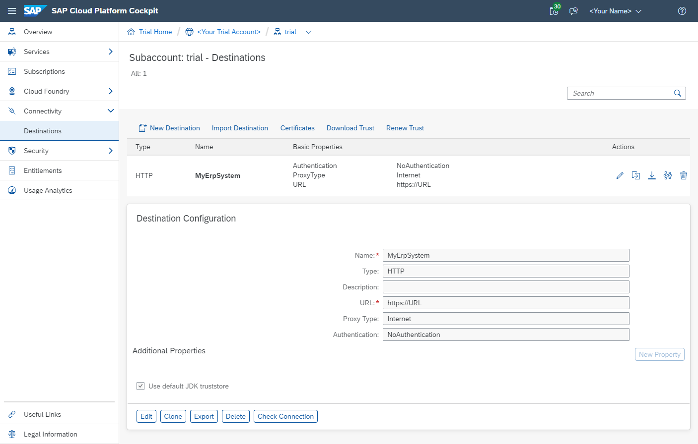

# Connect to OData Service on Cloud Foundry Using SAP Cloud SDK
<!-- description --> Create a basic Java project to call OData services using the SAP Cloud SDK on Cloud Foundry.

## Prerequisites
In order to follow this tutorial successfully, you need a working and reachable system of `SAP S/4HANA on-premise` or `S/4HANA Cloud`. You may substitute the business partner service introduced here with any other API published on the [SAP Business Accelerator Hub](https://api.sap.com/).
&nbsp;
If you do not have an S/4HANA system available, you may use a public service, such as the [Northwind OData Service](http://services.odata.org/V2/Northwind/Northwind.svc) as a fallback solution.
&nbsp;
This tutorial requires access to an SAP ERP system or, as a fallback, a mock server providing the [Business Partner OData V2](https://api.sap.com/api/API_BUSINESS_PARTNER/resource) service.
&nbsp;
Alternatively, you can also use the Sandbox service provided by the [SAP Business Accelerator Hub](https://api.sap.com/api/API_BUSINESS_PARTNER/tryout).

## You will learn
In this tutorial, you will enhance the `HelloWorld` project stub to call an existing `OData` service, deploy the project on `SAP Business Technology Platform` (BTP) based on `Cloud Foundry`, and write an integration test.

## Intro
If you want to follow this tutorial, it is highly recommended to check out the previous tutorials in the series. You will not need any additional software besides the setup explained in the first part of the series.

Please note that depending on the platform you are using, the configuration to the respective `S/4HANA` system might be different.
In this tutorial, you will be using `BASIC Auth` with which you can access your `S/4HANA Cloud` system on `Cloud Foundry`.

Note that your application code is not dependent on the platform you are using. Using the `SAP Cloud SDK`, you can write your code once, and it will be capable of dealing with all different authentication and connectivity options.


---

### Get access to Business Hub sandbox (optional)


>If you have access to an SAP S/4HANA Cloud system with a technical user, you can skip this part.

In order to make a call to an `OData` service, there needs to be a service to call.

Many OData APIs can be tested using the sandbox of the SAP Business Accelerator Hub. To use the sandbox, you need an API key. Go to [https://api.sap.com](https://api.sap.com) and click "Log On" in the top right corner. If you do not have an account, you will need to register first. When you are logged in, click on the [Business Partner OData V2 API reference](https://api.sap.com/api/API_BUSINESS_PARTNER/tryout) and find you API key under "Show API Key". You will use your API key later in this tutorial. The sandbox service URL can be found in _Try Out > Code Snippet > Java > URL (in the code)_:

>Make sure to use **only** the part before `/sap/opu/odata/...`.


### Virtual Data Model

This section explains the concepts of the S/4HANA Virtual Data Model. If you would like to first implement the S/4HANA integration, jump ahead to the next section and revisit the content of this section later.

The data stored in an S/4HANA system is inherently complexly structured and therefore difficult to query manually. Therefore, HANA introduced a Virtual Data Model (VDM) that aims to abstract from this complexity and provide data in a semantically meaningful and easy to consume way. The preferred way to consume data from an S/4HANA system is via the OData protocol. While BAPIs are also supported for compatibility reasons, OData should always be your first choice. You can find a list of all the available OData endpoints for S/4HANA Cloud systems in [SAP's Business Accelerator Hub](https://api.sap.com) ([OData V2](https://api.sap.com/products/SAPS4HANACloud/apis/ODATA), [OData V4](https://api.sap.com/products/SAPS4HANACloud/apis/ODATAV4)).

The SAP Cloud SDK now brings the VDM for OData to the Java world to make the type-safe consumption of OData endpoints even more simple! The VDM can be generated using the information from SAP's [Business Accelerator Hub](https://api.sap.com). This means that its compatible with every API offered in the Business Accelerator Hub and therefore also compatible with every S/4HANA Cloud system.


### Generate an OData client

The first step is to generate the VDM for the OData service you want to consume. The SAP Cloud SDK provides an OData Generator that can be used via a Maven plugin.

Note: If you are not using `maven` in your project you could still run the maven plugin from command line to generate the VDM and then copy the generated files to your project. Refer [here](https://sap.github.io/cloud-sdk/docs/java/features/odata/vdm-generator#using-the-plugin-from-the-command-line) for more details.

Before you can generate the VDM, add some dependencies to your application `pom.xml` for the generated code to compile:

```XML
<dependency>
    <groupId>com.sap.cloud.sdk.datamodel</groupId>
    <artifactId>odata-core</artifactId>
</dependency>
<dependency>
    <groupId>org.projectlombok</groupId>
    <artifactId>lombok</artifactId>
    <scope>provided</scope>
</dependency>
```

Next, copy the specification of the Business Partner service to your project. You can find the [specification](https://api.sap.com/api/API_BUSINESS_PARTNER/overview) in the Business Accelerator Hub. Click on the "API Specification" button and download the EDMX version and save the file in a new folder: `application/src/main/resources/edmx`.


To use the OData Generator Maven Plugin, add the following plugin to the application `pom.xml` of your project:

```XML
<plugin>
   <groupId>com.sap.cloud.sdk.datamodel</groupId>
   <artifactId>odata-generator-maven-plugin</artifactId>
   <version>${cloud-sdk.version}</version>
   <executions>
      <execution>
         <id>generate-consumption</id>
         <phase>generate-sources</phase>
         <goals>
            <goal>generate</goal>
         </goals>
         <configuration>
            <inputDirectory>${project.basedir}/src/main/resources/edmx</inputDirectory>
            <outputDirectory>${project.build.sourceDirectory}</outputDirectory>
            <packageName>com.sap.cloud.sdk.tutorial.datamodel.odata</packageName>
            <serviceNameMappingFile>${project.basedir}/src/main/resources/serviceNameMappings.properties</serviceNameMappingFile>
            <compileScope>COMPILE</compileScope>
            <overwriteFiles>true</overwriteFiles>
         </configuration>
      </execution>
   </executions>
</plugin>
```

Adapt the `<inputDirectory>` to point to the location of where you saved the Business Partner EDMX file(In the example above, the edmx file is stored in `application/src/main/resources/edmx` folder).
Download the `serviceNameMappings.properties` from [here](https://sap.github.io/cloud-sdk/assets/files/SDKv4-ODatav2-serviceNameMappings-34740cba84ef539e1fc9ad72d9c9bdc9.properties), (remember to rename it to `serviceNameMappings.properties`) and add it to the `application/src/main/resources` folder of your project. This file has entries that allows you to customise the parts of the package name and class name of the generated `Service` classes.

More parameters could also be configured for the plugin, you can read about them [here](https://sap.github.io/cloud-sdk/docs/java/features/odata/vdm-generator#available-parameters).

Now maven will run the generator within the process-sources phase which is executed before compile. The `<compileScope>` option instructs maven to add the generated code as sources for the compile phase.

The generated files are also being added to the project's source directory. This means that you can use the generated code in your application without any further configuration in your IDE.

Run `mvn compile` to generate the VDM and compile the project. You can now see the generated files in the `application/src/main/java` folder.

### Use the generated OData client

Now let's take a look at how to use the generated OData VDM of the SAP Cloud SDK to fetch a list of Business Partners.

```Java
final Destination destination = DestinationAccessor.getDestination("MyErpSystem");

final List<BusinessPartner> businessPartners =
        new DefaultBusinessPartnerService()
                .getAllBusinessPartner()
                .select(BusinessPartner.BUSINESS_PARTNER,
                        BusinessPartner.LAST_NAME,
                        BusinessPartner.FIRST_NAME,
                        BusinessPartner.CREATED_ON,
                .filter(BusinessPartner.MALE.eq(true))
                .executeRequest(destination);
```

Using the OData VDM you now have access to an object representation of a specific OData service, in this case the `DefaultBusinessPartnerService` (default implementation of the interface `BusinessPartnerService`). So now there's no need to know the endpoint's service path, service name or entity collection name. You can call this service's `getAllBusinessPartner()` function to retrieve a list of all the business partners from the system. The system the service will use is passed as a destination in the `executeRequest()` call. In this tutorial the destination is called `MyErpSystem` and you will learn a little later where it is set up.

Now take a look at the `select()` function. Instead of passing strings that represent the field of the entity, you can simply use the static fields provided by the `BusinessPartner` class. Hereby, not only the risk of spelling errors is eliminated, it is also type-safe! Again, the same applies for `filter()` and `orderBy()`. For example, filtering to male business partners becomes as easy as `.filter(BusinessPartner.IS_MALE.eq(true))`– note the type-safe comparison.

An additional benefit of this approach is discoverability. Since everything is represented as code, you can simply use your IDE's autocompletion features to see which functions a service supports and which fields an entity consists of. If you look at the default implementation of the service which was generated, in this case the `DefaultBusinessPartnerService` you can discover the various different available operations that the service supports. Based on this, for read operations for example, you can then choose the fields to select and filters to apply using the fields of the return type.

Each service is described by a Java interface, for example, `BusinessPartnerService`. The SDK also generates a default, complete implementation of each service interface. The corresponding implementation is available in a class whose name is the name of the interface prefixed with `Default`, for example, `DefaultBusinessPartnerService`. You can either simply instantiate that class for running requests against the service. The benefit of the interfaces is better testing and extensibility support.

To sum up the advantages of the generated OData VDM:

- No more hard-coded strings
- No more spelling errors
- Type safety for functions like `filter`, `select` and `orderBy`
- Java data types for the result provided out of the box, including appropriate conversions
- Discoverability by autocompletion
- SAP S/4HANA services can be easily mocked during testing based on the service interface in Java
  The VDM supports retrieving entities by key and retrieving lists of entities along with `filter()`, `select()`, `orderBy()`, `top()` and `skip()`. You can also retrieve navigation properties. The VDM also gives easy access to create, update, and delete operations as well as function imports.

You could use the generator to generate an OData client for any OData service.


### Write the BusinessPartnerController


The `SAP Cloud SDK` provides simple and convenient ways to access your ERP systems out of the box. In this example you will implement an endpoint that performs an `OData` query to `SAP S/4HANA` in order to retrieve a list of **business partners** from your ERP system. More specifically, in this example, you will retrieve all persons (a specific kind of business partner) with their name and a few additional properties.

To get started, open your previously created `Hello World` project (e.g. **`firstapp`**) and **`create a new file`** called `BusinessPartnerController.java` in the following location:

`./application/src/main/java/com/sap/cloud/sdk/tutorial/controllers/BusinessPartnerController.java`

```Java
package com.sap.cloud.sdk.tutorial.controllers;

import com.google.gson.Gson;
import org.slf4j.Logger;
import org.slf4j.LoggerFactory;
import org.springframework.http.MediaType;
import org.springframework.http.ResponseEntity;
import org.springframework.web.bind.annotation.RequestMapping;
import org.springframework.web.bind.annotation.RequestMethod;
import org.springframework.web.bind.annotation.RestController;

import java.util.List;

import com.sap.cloud.sdk.cloudplatform.connectivity.Destination;
import com.sap.cloud.sdk.cloudplatform.connectivity.DestinationAccessor;
import com.sap.cloud.sdk.cloudplatform.connectivity.exception.DestinationAccessException;
import com.sap.cloud.sdk.datamodel.odata.client.exception.ODataException;
import com.sap.cloud.sdk.datamodel.odata.helper.Order;

import com.sap.cloud.sdk.tutorial.datamodel.odata.namespaces.businesspartner.BusinessPartner;
import com.sap.cloud.sdk.tutorial.datamodel.odata.services.DefaultBusinessPartnerService;

@RestController
@RequestMapping( "/businesspartners" )
public class BusinessPartnerController
{
   private static final Logger logger = LoggerFactory.getLogger(BusinessPartnerController.class);
   // TODO: uncomment the lines below and insert your API key, if you are using the sandbox service
   // private static final String APIKEY_HEADER = "apikey";
   // private static final String SANDBOX_APIKEY = "";
   private static final String CATEGORY_PERSON = "1";
   private static final String DESTINATION_NAME = "MyErpSystem";

   @RequestMapping( method = RequestMethod.GET , produces = MediaType.APPLICATION_JSON_VALUE)
   public ResponseEntity<?> getBusinessPartner()
   {
      try {
         final Destination destination = DestinationAccessor.getDestination(DESTINATION_NAME);

         final List<BusinessPartner> businessPartners =
                 new DefaultBusinessPartnerService()
                         .getAllBusinessPartner()
                         .select(BusinessPartner.BUSINESS_PARTNER,
                                 BusinessPartner.LAST_NAME,
                                 BusinessPartner.FIRST_NAME,
                                 BusinessPartner.MALE,
                                 BusinessPartner.FEMALE,
                                 BusinessPartner.CREATED_ON
                         )
                         .filter(BusinessPartner.BP_CATEGORY.eq(CATEGORY_PERSON))
                         .orderBy(BusinessPartner.LAST_NAME, Order.ASC)
                         .top(200)
                         // TODO: uncomment the line below, if you are using the sandbox service
                         // .withHeader(APIKEY_HEADER, SANDBOX_APIKEY)
                         .executeRequest(destination);

         return ResponseEntity.ok( new Gson().toJson(businessPartners));
      } catch (final DestinationAccessException e) {
         logger.error(e.getMessage(), e);
         return ResponseEntity.internalServerError().body("Failed to fetch destination.");
      } catch (final ODataException e) {
         logger.error(e.getMessage(), e);
         return ResponseEntity.internalServerError().body("Failed to fetch business partners.");
      } catch (final Exception e) {
         logger.error(e.getMessage(), e);
         return ResponseEntity.internalServerError().body("Unexpected error occurred while fetching business partners.");
      }
   }

}
```

In the `getBusinessPartner` method, an instance of the `BusinessPartnerService` is initialized in order to prepare the query to S/4HANA with the help of the SDK's Virtual Data Model. The method `getAllBusinessPartners` is called, which represents the operation of the OData service that returns all available business partners. With the fluent query helper returned by this method, you can gradually build up the query:

- This example selects some fields of the `BusinessPartner` (if you omit this part, all fields will be returned)
- filters for business partners of category Person (code `"1"`),
- orders by the last name of the business partner,
- limits the amount of results to a maximum of 200.

**Note:** If you would like to use the SAP Business Hub sandbox service for testing, please uncomment lines where the Todos are added and fill in with your API key.

Finally, having prepared the query, you can call the `executeRequest` method. This method does a lot of the heavy lifting necessary to connect to an S/4HANA system and relieves you as a developer from dealing with complex aspects such as:

- the connectivity to this system, which may reside on-premise behind a corporate firewall, – by means of the connectivity service and the optional Cloud Connector, and
- the authentication to this system using potentially vastly different authentication flows (basic authentication, principal propagation, OAuth2).

The SAP Cloud SDK provides all of these capabilities with a simple interface and allows customers (tenants) of your application to configure the connection to their system. You will learn more about the configuration below when deploying the project.

The `executeRequest` method of the VDM returns the query result as a `navigatable` list of type `BusinessPartner`, which represents the entity type of the response in a type-safe manner. The example transform the list obtained into a String JSON response.

Any `ODataException`, `DestinationAccessException` or other `Exception` thrown by the code is caught and logged, before returning an error response.


### Deploy the Project


Let's now learn to deploy the project to *SAP Cloud Platform Cloud Foundry*.

**Provide Destinations for your Application**

In order for your application to run you need to provide it with information about your S/4HANA system. Your `BusinessPartnerService` needs an URL. Depending on the system you would like to use, you might need to define an authentication method as well. This information is provided in the form of a destination which is retrieved (in a multi-tenant environment) by transparently accessing the destination service of the BTP. This is done by retrieving the destination via the `DestinationAccessor` by name, in your case `MyErpSystem`. There are multiple ways to create such a destination. For now you will provide it to your application by creating an environment variable that holds the information. You will create such a variable now both for a local deployment and a deployment on the SAP BTP Cloud Foundry.

**Run on a Local Server**

[OPTION BEGIN [Windows (PowerShell)]]

As mentioned in the Tutorial `Create a sample application on Cloud Foundry using SAP Cloud SDK` of this tutorial series, you can run the project locally. Here, you need to supply the destinations as an environment variable on your local machine. How you set an environment variable depends on your OS. The following instructions target Windows. If you are using a Mac please select Mac OS at the switch above.

```Shell
$env:destinations='[{name: "MyErpSystem", url: "https://URL"}]'
```

**Note:** Some services, other than the sandbox service, may require user credentials for the request execution.
If you would like to connect to such a service, use the following snippet instead:
```Shell
$env:destinations='[{name: "MyErpSystem", url: "https://URL", "user": "USER", "password": "PASSWORD"}]'
```
Please change the values URL, USER and PASSWORD accordingly.

You may use any name you like. If you do decide to change it though, remember to also adapt it in the code above. Make sure the variable has been properly set:

```Shell
echo $env:destinations
```

_Note: You can also add more ERP endpoints to this JSON representation, following the same schema._

Be aware that the variable is only available in your current terminal session. If you are having trouble setting the variable, take a look at the troubleshooting section. Once the variable has been set, re-build and start the server as follows:

```Shell
cd /path/to/firstapp/application
mvn spring-boot:run
```

Visit `http://localhost:8080/businesspartners` to see your new feature in action. It should look similar to this web page:


[OPTION END]

[OPTION BEGIN [Windows (CMD)]]

As mentioned in the Tutorial `Create a sample application on Cloud Foundry using SAP Cloud SDK` of this tutorial series, you can run the project locally. Here, you need to supply the destinations as an environment variable on your local machine. How you set an environment variable depends on your OS. The following instructions target Windows. If you are using a Mac please select Mac OS at the switch above.

```Shell
set destinations=[{name: "MyErpSystem", url: "https://URL"}]
```

**Note:** Some services, other than the sandbox service, may require user credentials for the request execution.
If you would like to connect to such a service, use the following snippet instead:
```Shell
set destinations=[{name: "MyErpSystem", url: "https://URL", "user": "USER", "password": "PASSWORD"}]
```
Please change the values URL, USER and PASSWORD accordingly.

You may use any name you like. If you do decide to change it though, remember to also adapt it in the code above. Make sure the variable has been properly set:

```Shell
set destinations
```

_Note: You can also add more ERP endpoints to this JSON representation, following the same schema._

Be aware that the variable is only available in your current terminal session. If you are having trouble setting the variable, take a look at the troubleshooting section. Once the variable has been set, re-build and start the server as follows:

```Shell
cd /path/to/firstapp/application
mvn spring-boot:run
```

Visit `http://localhost:8080/businesspartners` to see your new feature in action. It should look similar to this web page:


[OPTION END]

[OPTION BEGIN [Mac OS]]

As mentioned in the Tutorial `Create a sample application on Cloud Foundry using SAP Cloud SDK` of this tutorial series, you can run the project locally. Here, you need to supply the destinations as an environment variable on your local machine.

```Bash
export destinations='[{name: "MyErpSystem", url: "https://URL"}]'
```

**Note:** Some services, other than the sandbox service, may require user credentials for the request execution.
If you would like to connect to such a service, use the following snippet instead:

```Bash
export destinations='[{name: "MyErpSystem", url: "https://URL", user: "USER", password: "PASSWORD"}]'
```
Please change the values URL, USER and PASSWORD accordingly.

You may use any name you like. If you do decide to change it though, remember to also adapt it in the code above. Make sure the variable has been properly set:

```Bash
echo $destinations
```

_Note: You can also add more ERP endpoints to this JSON representation, following the same schema._

Be aware that the variable is only available in your current terminal session. If you are having trouble settings the variable, take a look at the troubleshooting section. Once the variable has been set, re-build and start the server as follows:

```Bash
cd /path/to/firstapp/application
mvn spring-boot:run
```

Visit `http://localhost:8080/businesspartners` to see your new feature in action. It should look similar to this web page:


[OPTION END]

**Using the Destination Service on SAP BTP Cloud Foundry**

For the recommended approach of using the destination service to configure the connection to your SAP S/4HANA system, proceed as follows. If you have just set the destination variable on Cloud Foundry please remove it again as described above.

**Subscribe to Services**
The destination handling is available as a service on Cloud Foundry. You need to create an instance of that service and bind it to your application in order to use the destination service.
Use the Cloud Foundry CLI to create the required service instance:

```Bash
cf create-service destination lite my-destination
```

This creates a service instance named `my-destination` for the `destination` service (plan `lite`).

To bind the newly created service instance to your application when it is deployed, adapt the `manifest.yml` file by adding the instance to the services section at the end. The remainder of the file remains as before:

```YAML

---
applications:

- name: firstapp
  memory: 1500M
  timeout: 300
  random-route: true
  path: application/target/firstapp-application.jar
  buildpacks:
    - sap_java_buildpack
  env:
    TARGET_RUNTIME: main
    SPRING_PROFILES_ACTIVE: 'cloud'
    JBP_CONFIG_SAPJVM_MEMORY_SIZES: 'metaspace:128m..'
    JBP_CONFIG_COMPONENTS: 'jres: [''com.sap.xs.java.buildpack.jre.SAPMachineJRE'']'
    JBP_CONFIG_SAP_MACHINE_JRE: '{ use_offline_repository: false, version: 17.+ }'     
  services:
  - my-destination
```

With this, the setup is complete and you can re-deploy the application. However, you still need to configure the destination to your SAP S/4HANA system. You will do this in the next section and then deploy the application to Cloud Foundry.

**Configure Destinations**

Customers of your application can use the BTP cockpit to configure destinations. You can use the cockpit to define your destination as well.

1. Navigate to the Cloud Foundry subaccount within your global account that you have used before to deploy the application (see Step 3). In case of a trial account, the subaccount will be called trial by default.
2. In the menu on the left, expand Connectivity and select **Destinations**.
3. Click **New Destination** and enter the following values into the input fields:
   - **Name:** `MyErpSystem`
   - **URL:** URL to your SAP S/4HANA system
   - **Authentication:** choose `NoAuthentication`
   - Leave the other fields unchanged.
4. Click **Save**.

**Note:** If the service you are trying to connect to requires user credentials, choose `BasicAuthentication` instead of `NoAuthentication` and provide the **username** and **password** in the corresponding fields.

Afterwards, the destination should look as follows.



Please note that the above settings represent the setup for a connection to SAP S/4HANA Cloud via a technical user (communication user). Depending on your setup and requirements, you may want to use a different `ProxyType` (`OnPremise` when using the Cloud Connector) or a different means of authentication. If you want to learn more about authorizing user access in a productive environment, please find [Secure Your Application on SAP Business Technology Platform Cloud Foundry](s4sdk-secure-cloudfoundry).


**Deploy to Cloud Foundry**

Now you can deploy your application to `Cloud Foundry` using the `Cloud Foundry CLI` (command line interface):

```Bash
cd /path/to/firstapp
mvn clean install
cf push
```
Access the new Rest endpoint at `https://YOUR-ROUTE/businesspartners`.


If you change the destinations afterwards, you need to at least [restart (or restage)](https://docs.cloudfoundry.org/devguide/deploy-apps/start-restart-restage.html) your application to make sure that the changes become effective due to caching:

```Bash
cf restart firstapp
```


### Integration test for BusinessPartnerServlet


To construct an extensible integration test for the newly created `BusinessPartnerController`, the following items will be prepared:

- Adjustment: Maven pom file
- New: test class


First, let's adjust the Maven pom file of the `application` sub-module by adding a dependency for Wiremock:

`./application/pom.xml`

```XML
<dependency>
   <groupId>org.wiremock</groupId>
   <artifactId>wiremock</artifactId>
   <version>3.3.1</version>
   <scope>test</scope>
</dependency>
```

_Hint: Do not forget to reload your maven project in order to include the newly added dependencies._


### Test class


Navigate to the application project and create a new class:

`./application/src/test/java/com/sap/cloud/sdk/tutorial/BusinessPartnerControllerTest.java`

```Java
package com.sap.cloud.sdk.tutorial;

import com.github.tomakehurst.wiremock.junit5.WireMockRuntimeInfo;
import com.github.tomakehurst.wiremock.junit5.WireMockTest;
import org.junit.jupiter.api.BeforeEach;
import org.junit.jupiter.api.Test;
import org.junit.jupiter.api.extension.ExtendWith;
import org.springframework.beans.factory.annotation.Autowired;
import org.springframework.boot.test.autoconfigure.web.servlet.AutoConfigureMockMvc;
import org.springframework.boot.test.context.SpringBootTest;
import org.springframework.test.context.junit.jupiter.SpringExtension;
import org.springframework.test.web.servlet.MockMvc;
import org.springframework.test.web.servlet.request.MockMvcRequestBuilders;
import org.springframework.test.web.servlet.result.MockMvcResultMatchers;

import com.sap.cloud.sdk.cloudplatform.connectivity.DefaultDestinationLoader;
import com.sap.cloud.sdk.cloudplatform.connectivity.DefaultHttpDestination;
import com.sap.cloud.sdk.cloudplatform.connectivity.Destination;
import com.sap.cloud.sdk.cloudplatform.connectivity.DestinationAccessor;

import static com.github.tomakehurst.wiremock.client.WireMock.anyUrl;
import static com.github.tomakehurst.wiremock.client.WireMock.get;
import static com.github.tomakehurst.wiremock.client.WireMock.okJson;
import static com.github.tomakehurst.wiremock.client.WireMock.stubFor;

@WireMockTest
@ExtendWith(SpringExtension.class)
@SpringBootTest
@AutoConfigureMockMvc
public class BusinessPartnerControllerTest {

    private static final String DESTINATION_NAME = "MyErpSystem";
    private Destination destination;


    @Autowired
    private MockMvc mockMvc;

    private static final String ODATA_RESPONSE_JSON = """
            {
              "d": {
                "results": [
                  {
                    "__metadata": {
                      "id": "https://127.0.0.1/path/to/service(100)",
                      "uri": "https://127.0.0.1/path/to/service(100)",
                      "type": "API_BUSINESS_PARTNER.A_BusinessPartnerType"
                    },
                    "BusinessPartner": "100",
                    "CreationDate": "/Date(1662336000000)/",
                    "FirstName": "John",
                    "LastName": "Peter",
                    "IsMale": "true",
                    "IsFemale": "false"
                  }
                ]
              }
            }
            """;

    private static final String RESPONSE_JSON = """
            [{
              "BusinessPartner":"100",
              "FirstName":"John",
              "IsMale":false,
              "IsFemale":false,
              "LastName":"Peter",
              "CreationDate":"/Date(1662336000000)/"
            }]""";
   
    @BeforeEach
    void before( final WireMockRuntimeInfo wm ){
        destination = DefaultHttpDestination.builder(wm.getHttpBaseUrl()).name(DESTINATION_NAME).build();
        final DefaultDestinationLoader defaultDestinationLoader = new DefaultDestinationLoader().registerDestination(destination);
        DestinationAccessor.prependDestinationLoader(defaultDestinationLoader);
    }

    @Test
    public void testService() throws Exception {
        stubFor(get(anyUrl())
                .willReturn(okJson(ODATA_RESPONSE_JSON)));
        mockMvc.perform(MockMvcRequestBuilders.get("/businesspartners"))
                .andExpect(MockMvcResultMatchers.status().isOk())
                .andExpect(MockMvcResultMatchers.content().json(RESPONSE_JSON));


    }

}

```

To ensure that the destination is pointing to the WireMock server, we are using `WireMockRuntimeInfo` to get the WireMock server's URL and set it as the destination's URL.
We are also ensuring that the `DestinationAccessor` picks up the destination we created by registering the destination with `DefaultDestinationLoader` and pre-appending it to the `DestinationAccessor`.

What you see in `testService` method is we are trying to mock the OData server's response using WireMock's `stubFor` method which ensures that any get requested for the destination URL will return the JSON we have defined in `ODATA_RESPONSE_JSON` variable.

We are then using `MockMvc` to perform a `GET` request to the `/businesspartners` endpoint and asserting that the response is as expected.
- HTTP response status code: 200 (OK)
- HTTP `Content` is the expected json.

### Troubleshooting

**Connecting to the `OData` service**

In case you are trying to connect to an OData service endpoint on a server without verifiable SSL certificate, you might see the following error message due to an untrustworthy signature:

`Failed to execute GET https://<URL>/$metadata`

- If you are using the environment variable approach, please adapt the destinations environment variable to additionally include the properties map:

`[{name: "MyErpSystem", url: "https://URL", username: "USER", password: "PASSWORD", trustAll: "true"}]`

- If you are using the destination service on Cloud Foundry, add a new additional property to your destination in the BTP cockpit. Enter `TrustAll` into the first input (dropdown) field and `TRUE` into the second field.

If you are still facing problems when connecting to the OData service, try the following to get more insights into what is happening and what can be logged:

- Add a logger implementation to the test artifact's dependencies in order to get more detailed log output during tests: expand the dependencies section of `application/pom.xml` with:


```XML
<dependency>
    <groupId>ch.qos.logback</groupId>
    <artifactId>logback-classic</artifactId>
    <scope>test</scope>
</dependency>

```

If you are behind a proxy and want to connect your app running locally with the Cloud Foundry archetype to an SAP S/4HANA system in your network, you can supply your proxy information as part of the destinations environment variable:
`[{name: "MyErpSystem", url: "https://URL", username: "USER", password: "PASSWORD", properties: [{key: "TrustAll", value: "true"},{key: "proxyHost", value: "my-proxy.com"},{key: "proxyPort", value: "8080"}]}]`


### Test yourself


### Test yourself


---
