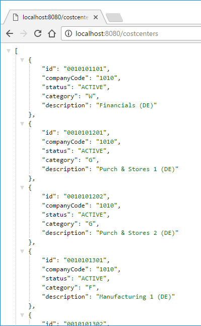
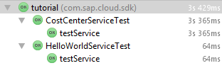

## Prerequisites  
 - In order to follow this tutorial successfully, you need a working and reachable system of `SAP S/4HANA on-premise` or `S/4HANA Cloud`. You may substitute the cost center service introduced here with any other API published on the SAP API `BusinessHub`. If you do not have an `S/4HANA` system available, you may use a public service such as the [Northwind OData Service](http://services.odata.org/V2/Northwind/Northwind.svc) as a fallback solution.

## Details
Please note that depending on the platform you are using (`Neo` or `Cloud Foundry`), the configuration to the respective `S/4HANA` system might be different. In this tutorial, you will find the methods using which you can access your system on `Neo`. For `SAP Cloud Platform Neo`, the following `S/4HANA` connection capabilities exist.

|  | `SAP Cloud Platform, Neo`
:-------------- | :-------------
S/4HANA on-premise |	[SAP Cloud Connector required with HTTP Destination](https://help.sap.com/viewer/cca91383641e40ffbe03bdc78f00f681/Cloud/en-US/e6c7616abb5710148cfcf3e75d96d596.html)
S/4HANA Cloud | [Direct Connection with BASIC Auth (technical user)](https://help.sap.com/viewer/cca91383641e40ffbe03bdc78f00f681/Cloud/en-US/e5c9867dbb571014957ef9d7a8846b1c.html); [Direct Connection with `SAMLOAuthBearer` (`PrincipalPropagation` with `BusinessUser`)](https://help.sap.com/viewer/cca91383641e40ffbe03bdc78f00f681/Cloud/en-US/e5c9867dbb571014957ef9d7a8846b1c.html)

Note that your application code is not dependent on the platform you are using. Using the `SAP Cloud SDK`, you can write your code once, and it will be capable of dealing with all different authentication and connectivity options.

### You will learn
In this tutorial, you will enhance the `HelloWorld` project stub to call an existing `OData` service, deploy the project on `SAP Cloud Platform` based on `Neo`, and write an integration test.
If you want to follow this tutorial, it is highly recommended to check out the previous tutorials in the series. You will not need any additional software besides the setup explained in the first part of the series as the server will run on your local machine.
**Note**: This tutorial requires access to an `SAP ERP` system or, as a fallback, any other `OData V2` service.


---

[ACCORDION-BEGIN [Step 1: ](Virtual Data Model)]

This section explains the concepts of the S/4HANA Virtual Data Model. If you would like to first implement the S/4HANA integration, jump ahead to [the next section](https://blogs.sap.com/2017/05/21/step-4-with-sap-s4hana-cloud-sdk-calling-an-odata-service/#WriteBusinessPartnerServlet) and revisit the content of this section later.

The data stored in an S/4HANA system is inherently complexly structured and therefore difficult to query manually. Therefore, HANA introduced a Virtual Data Model (VDM) that aims to abstract from this complexity and provide data in a semantically meaningful and easy to consume way. The preferred way to consume data from an S/4HANA system is via the OData protocol. While BAPIs are also supported for compatibility reasons, OData should always be your first choice. You can find a list of all the available OData endpoints for S/4HANA Cloud systems in [SAP's API Business Hub](https://api.sap.com/shell/discover/contentpackage/SAPS4HANACloud?section=ARTIFACTS).


The SAP Cloud SDK now brings the VDM for OData to the Java world to make the type-safe consumption of OData endpoints even more simple! The VDM is generated using the information from SAP's [API Business Hub](https://api.sap.com/shell/discover/contentpackage/SAPS4HANACloud?section=ARTIFACTS). This means that it's compatible with every API offered in the API Business Hub and therefore also compatible with every S/4HANA Cloud system.


[DONE]

[ACCORDION-END]

[ACCORDION-BEGIN [Step 2: ](The manual way to OData)]

Let's take a look at typical code we could write to access any OData service using the [SAP Cloud Platform SDK for service development](https://blogs.sap.com/2017/10/17/introducing-the-sap-cloud-platform-sdk-for-service-development/).
Here, we retrieve a list of business partners from an S/4HANA system:

```Java
final ErpConfigContext configContext = new ErpConfigContext();
final List<MyBusinessPartnerType> businessPartners = ODataQueryBuilder
        .withEntity("/sap/opu/odata/sap/API_BUSINESS_PARTNER",
                "A_BusinessPartner")
        .select("BusinessPartner",
                "LastName",
                "FirstName",
                "IsMale",
                "IsFemale",
                "CreationDate")
        .build()
        .execute(configContext)
        .asList(MyBusinessPartnerType.class);
```

The `ODataQueryBuilder` represents a simple and generic approach to consuming OData services in your application and is well suited to support arbitrary services. It is a big step forward from manually building up an HTTP request to an OData service and processing the results in your code, and is used internally by the SAP Cloud SDK. In turn, the `ODataQueryBuilder` also uses concepts of the SAP Cloud SDK to simplify communication with systems, which are referenced by an `ErpConfigContext`.

Nevertheless, there are quite a few pitfalls you can fall into when using the plain `ODataQueryBuilder` approach to call OData services:

- For `.withEntity("/sap/opu/odata/sap/API_BUSINESS_PARTNER", "A_BusinessPartner")` you already need to know three things: the OData endpoints service path `(/sap/opu/odata/sap)`, the endpoints name `(API_BUSINESS_PARTNER)` and the name of the entity collection `(A_BusinessPartner)` as defined in the metadata of the endpoint.
- Then, when you want to select specific attributes from the `BusinessPartner` entity type with the `select()` function, you need to know how these fields are named. But since they are only represented as strings in this code, you need to look at the metadata to find out how they're called. The same also applies for functions like `order()` and `filter()`. And of course using strings as parameters is prone to spelling errors that your IDE most likely won't be able to catch for you.
- Finally, you need to define a class such as `MyBusinessPartnerType` with specific annotations that represents the properties and their types of the result. For this you again need to know a lot of details about the OData service.

[DONE]

[ACCORDION-END]

[ACCORDION-BEGIN [Step 3: ](Virtual Data Model: The new way to OData)]

Now that we have explained the possible pitfalls of the current approach, let's take a look at how the OData VDM of the SAP Cloud SDK simplifies the same task, as the SDK is able to incorporate more knowledge about the system that is being called.

```Java
final List<BusinessPartner> businessPartners =
        new DefaultBusinessPartnerService()
                .getAllBusinessPartner()
                .select(BusinessPartner.BUSINESS_PARTNER,
                        BusinessPartner.LAST_NAME,
                        BusinessPartner.FIRST_NAME,
                        BusinessPartner.IS_MALE,
                        BusinessPartner.IS_FEMALE,
                        BusinessPartner.CREATION_DATE)
                .execute();
```

Using the OData VDM we now have access to an object representation of a specific OData service, in this case the `DefaultBusinessPartnerService` (default implementation of the interface `BusinessPartnerService`). So now there's no more need to know the endpoint's service path, service name or entity collection name. We can call this service's `getAllBusinessPartner()` function to retrieve a list of all the business partners from the system.

Now take a look at the `select()` function. Instead of passing strings that represent the field of the entity, we can simply use the static fields provided by the `BusinessPartner` class. So not only have we eliminated the risk of spelling errors, we also made it type-safe! Again, the same applies for `filter()` and `orderBy()`. For example, filtering to male business partners becomes as easy as `.filter(BusinessPartner.IS_MALE.eq(true))`– note the type-safe comparison.

An additional benefit of this approach is discoverability. Since everything is represented as code, you can simply use your IDE's autocompletion features to see which functions a service supports and which fields an entity consists of: start by looking at the different services that are available in the package `com.sap.cloud.sdk.s4hana.datamodel.odata.services`, instantiate the default implementation of the service you need (class name prefixed with `Default`), and then look for the methods of the service class that represent the different available operations. Based on this, you can choose the fields to select and filters to apply using the fields of the return type.

Each service is described by a Java interface, for example, `BusinessPartnerService`. The SDK provides a default, complete implementation of each service interface. The corresponding implementation is available in a class whose name is the name of the interface prefixed with `Default`, for example, `DefaultBusinessPartnerService`. You can either simply instantiate that class, or use dependency injection with a corresponding Java framework (covered in [Step 22 of our tutorial series](https://blogs.sap.com/2018/01/02/step-22-with-the-sap-s4hana-cloud-sdk-extensibility-type-safe-expand-and-dependency-injection-with-the-virtual-data-model-for-odata/)). The benefit of the interfaces is better testing and extensibility support.

To sum up the advantages of the OData VDM:

- No more hard-coded strings
- No more spelling errors
- Type safety for functions like filter, select and `orderBy`
- Java data types for the result provided out of the box, including appropriate conversions
- Discoverability by autocompletion
- SAP S/4HANA services can be easily mocked during testing based on the service interface in Java (see tutorial [Step 19: Mocking S/4HANA calls](https://blogs.sap.com/2017/12/07/step-19-with-s4hana-cloud-sdk-mocking-s4hana-calls-or-how-to-develop-an-s4hana-extension-without-an-s4hana-system/))

The VDM supports retrieving entities by key and retrieving lists of entities along with `filter()`, `select()`, `orderBy()`, `top()` and `skip()`. You can also resolve navigation properties on demand or eagerly (expand, see [Step 22](https://blogs.sap.com/2018/01/02/step-22-with-the-sap-s4hana-cloud-sdk-extensibility-type-safe-expand-and-dependency-injection-with-the-virtual-data-model-for-odata/)). The VDM also gives easy access to create (see [Step 20](https://blogs.sap.com/2017/12/07/step-20-with-s4hana-cloud-sdk-create-and-deep-insert-with-the-virtual-data-model-for-odata/)), update, and delete operations as well as function imports.

For any OData service not part of SAP's API Business Hub, the `ODataQueryBuilder` still is the go to approach for consumption.

[DONE]

[ACCORDION-END]

[ACCORDION-BEGIN [Step 4: ](Write the BusinessPartnerServlet)]

The `SAP Cloud SDK` provides simple and convenient ways to access your ERP systems out of the box. In this example you will implement an endpoint that performs an `OData` query to `SAP S/4HANA` in order to retrieve a list of **business partners** from your ERP system. More specifically, we want to retrieve all persons (a specific kind of business partner) with their name and a few additional properties.

To get started, open your previously created `Hello World` project (in our case, it is called **`firstapp`**) and **`create a new file`** called `BusinessPartnerServlet.java` in the following location:

`./application/src/main/java/com/sap/cloud/sdk/tutorial/BusinessPartnerServlet.java`

```java
package com.sap.cloud.sdk.tutorial;

import com.google.gson.Gson;
import org.slf4j.Logger;

import javax.servlet.ServletException;
import javax.servlet.annotation.WebServlet;
import javax.servlet.http.HttpServlet;
import javax.servlet.http.HttpServletRequest;
import javax.servlet.http.HttpServletResponse;
import java.io.IOException;
import java.util.List;

import com.sap.cloud.sdk.cloudplatform.logging.CloudLoggerFactory;
import com.sap.cloud.sdk.odatav2.connectivity.ODataException;

import com.sap.cloud.sdk.s4hana.datamodel.odata.helper.Order;
import com.sap.cloud.sdk.s4hana.datamodel.odata.namespaces.businesspartner.BusinessPartner;
import com.sap.cloud.sdk.s4hana.datamodel.odata.services.DefaultBusinessPartnerService;

@WebServlet("/businesspartners")
public class BusinessPartnerServlet extends HttpServlet {

    private static final long serialVersionUID = 1L;
    private static final Logger logger = CloudLoggerFactory.getLogger(BusinessPartnerServlet.class);

    private static final String CATEGORY_PERSON = "1";

    @Override
    protected void doGet(final HttpServletRequest request, final HttpServletResponse response)
            throws ServletException, IOException {
        try {
            final List<BusinessPartner> businessPartners =
                    new DefaultBusinessPartnerService()
                            .getAllBusinessPartner()
                            .select(BusinessPartner.BUSINESS_PARTNER,
                                    BusinessPartner.LAST_NAME,
                                    BusinessPartner.FIRST_NAME,
                                    BusinessPartner.IS_MALE,
                                    BusinessPartner.IS_FEMALE,
                                    BusinessPartner.CREATION_DATE)
                            .filter(BusinessPartner.BUSINESS_PARTNER_CATEGORY.eq(CATEGORY_PERSON))
                            .orderBy(BusinessPartner.LAST_NAME, Order.ASC)
                            .execute();

            response.setContentType("application/json");
            response.getWriter().write(new Gson().toJson(businessPartners));

        } catch (final ODataException e) {
            logger.error(e.getMessage(), e);
            response.setStatus(HttpServletResponse.SC_INTERNAL_SERVER_ERROR);
            response.getWriter().write(e.getMessage());
        }
    }
}
```

The code is fairly simple. In the servlet GET method, we initialize an instance of the `BusinessPartnerService` to prepare the query to S/4HANA with the help of the SDK's Virtual Data Model. We call the method `getAllBusinessPartners`, which represents the operation of the OData service that we want to call. With the fluent query helper returned by this method, we can gradually build up the query:

- we select the fields of the `BusinessPartner` that we want to retrieve (if we leave out this part, all fields will be returned),
- filter for business partners of category Person (code `"1"`), and
- order by the last name of the business partner.

Finally, having prepared the query, we call the `execute` method. This method does a lot of the heavy lifting necessary to connect to an S/4HANA system and relieves us as developers from dealing with complex aspects such as:

- the configuration which system to connect to (in a multi-tenant environment) – by transparently accessing the destination service of SAP Cloud Platform,
- the connectivity to this system, which may reside on-premise behind a corporate firewall, – by means of the connectivity service and the optional Cloud Connector, and
- the authentication to this system using potentially vastly different authentication flows (basic authentication, principal propagation, OAuth2).

The SAP Cloud SDK provides all of these capabilities with a simple interface and allows customers (tenants) of your application to configure the connection to their system. We will discuss the configuration below when deploying the project.

The `execute` method of the VDM returns the query result as a `navigatable` list of type `BusinessPartner`, which represents the entity type of the response in a type-safe manner. We declare the servlet's response as JSON content and transform the result into a JSON response.

Any `ODataException` thrown by the OData call is caught and logged, before returning an error response.

[DONE]

[ACCORDION-END]

[ACCORDION-BEGIN [Step 5: ](Deploying the Project)]

Depending on your chosen archetype and SAP Cloud Platform setup you can deploy the project on either `SAP Cloud Platform Neo` or `SAP Cloud Platform CloudFoundry`.


Now you can deploy your application to your local `SAP Cloud Platform Neo` using the following maven goals:

```bash
cd /path/to/firstapp
mvn clean install
mvn scp:clean scp:push -pl application -Derp.url=https://URL
```

Replace `URL` with the URL to your SAP ERP system (host and, if necessary, port).
**Note**: the `-pl` argument defines the location in which the Maven goals will be executed.

Maven will then prompt you for your username and password that is going to be used to connect to `SAP S/4HANA`. Alternatively, you can also set these values as command parameters: `-Derp.username=USER -Derp.password=PASSWORD`

If you now deploy the project and visit the page `http://localhost:8080/businesspartners` you should be seeing a list of cost centers that was retrieved from the ERP system. **Please login with `test` / `test`**.



[DONE]

[ACCORDION-END]

[ACCORDION-BEGIN [Step 6: ](Integration Test for BusinessPartnerServlet)]

To construct an extensible integration test for the newly created `BusinessPartnerServlet`, the following items will be prepared:

  - Adjustment: Maven pom file
  - New: test class
  - New: JSON Schema for servlet response validation
  - New: `systems.json` and credentials

First, let's adjust the Maven pom file of the `integrations-tests` `submodule` by adding a dependency for JSON schema validation:

`./integration-tests/pom.xml`

```
<dependency>
    <groupId>io.rest-assured</groupId>
    <artifactId>json-schema-validator</artifactId>
    <version>3.0.6</version>
    <scope>test</scope>
</dependency>
```

[DONE]

[ACCORDION-END]

[ACCORDION-BEGIN [Step 7: ](test class)]

Navigate to the integration-tests project and create a new class:

`./integration-tests/src/test/java/com/sap/cloud/sdk/tutorial/BusinessPartnerServletTest.java`

```java
package com.sap.cloud.sdk.tutorial;

import io.restassured.RestAssured;
import io.restassured.http.ContentType;
import io.restassured.module.jsv.JsonSchemaValidator;
import org.jboss.arquillian.container.test.api.Deployment;
import org.jboss.arquillian.junit.Arquillian;
import org.jboss.arquillian.test.api.ArquillianResource;
import org.jboss.shrinkwrap.api.spec.WebArchive;
import org.junit.Before;
import org.junit.BeforeClass;
import org.junit.Test;
import org.junit.runner.RunWith;
import org.slf4j.Logger;

import java.net.URL;

import com.sap.cloud.sdk.cloudplatform.logging.CloudLoggerFactory;
import com.sap.cloud.sdk.testutil.MockUtil;

import static io.restassured.RestAssured.when;

@RunWith(Arquillian.class)
public class BusinessPartnerServletTest {
    private static final MockUtil mockUtil = new MockUtil();
    private static final Logger logger = CloudLoggerFactory.getLogger(BusinessPartnerServletTest.class);

    @ArquillianResource
    private URL baseUrl;

    @Deployment
    public static WebArchive createDeployment() {
        return TestUtil.createDeployment(BusinessPartnerServlet.class);
    }

    @BeforeClass
    public static void beforeClass() {
        mockUtil.mockDefaults();
        mockUtil.mockErpDestination();
    }

    @Before
    public void before() {
        RestAssured.baseURI = baseUrl.toExternalForm();
    }

    @Test
    public void testService() {
        // JSON schema validation from resource definition
        final JsonSchemaValidator jsonValidator = JsonSchemaValidator
                .matchesJsonSchemaInClasspath("businesspartners-schema.json");

        // HTTP GET response OK, JSON header and valid schema
        when()
                .get("/businesspartners")
        .then()
                .statusCode(200)
                .contentType(ContentType.JSON)
                .body(jsonValidator);
    }
}
```

Please change the value `URL` accordingly.

What you see here, is the usage of `RestAssured` on a JSON service backend. The HTTP GET request is run on the local route `/costcenters`, the result is validated with multiple assertions:

  - HTTP response status code: 200 (OK)
  - HTTP `ContentType`: `application/json`
  - HTTP body is valid JSON code, checked with `costcenters-schema.json` definition

[DONE]

[ACCORDION-END]

[ACCORDION-BEGIN [Step 8: ](JSON Schema for servlet response validation)]

Inside the `integration-tests` project, create a new resource file

`./integration-tests/src/test/resources/businesspartners-schema.json`

```json-schema
{
  "$schema": "http://json-schema.org/draft-04/schema#",
  "title": "Business Partner List",
  "type": "array",
  "items": {
    "title": "Business Partner",
    "type": "object",
    "required": ["BusinessPartner", "LastName"]
  },
  "minItems": 1
}

```

As you can see, the properties `BusinessPartner` and `LastName` will be marked as requirement for every entry of the expected business partner list. The JSON validator would break the test if any of the items was missing a required value.

[DONE]

[ACCORDION-END]

[ACCORDION-BEGIN [Step 9: ](Systems.json and credentials)]

If you run your application on SAP Cloud Platform, the SDK can simply read the ERP destinations from the destination service. However, since the tests should run locally, we need a way to supply our tests with an ERP destination.

Luckily, the SDK provides a utility class for such purposes – `MockUtil`. This class allows us to mock the ERP destinations we'd typically find on `CloudFoundry`. To provide `MockUtil` with the necessary information, you'll need to add a `systems.json` or `systems.yml` file to your test resources directory. `MockUtil` will read these files and provide your tests with the ERP destinations accordingly. Adapt the URL as before.

`./integration-tests/src/test/resources/systems.json`

```json-schema
{
  "erp": {
    "default": "ERP_TEST_SYSTEM",
    "systems": [
      {
        "alias": "ERP_TEST_SYSTEM",
        "uri": "https://URL"
      }
    ]
  }
}
```

That's it! You can now start all tests with the default Maven command:

`mvn test -Derp.username=USER -Derp.password=PASSWORD`

Please change the values `USER` and `PASSWORD` accordingly. If you do not want to pass the ERP username and password, checkout the appendix below for an alternative.

If you want to run the tests without Maven, please remember to also include the parameters.



[DONE]

[ACCORDION-END]

[ACCORDION-BEGIN [Appendix: ](Supplying credentials as a file: credentials.yml)]

**Credentials file**

If you do not want to pass the ERP username and password all the time when executing tests or want to execute tests on a continuous delivery pipeline where more people could see the password in log outputs, you can also provide credentials in a `credentials.yml` file that the `SDK` understands.

To do this, create the following `credentials.yml` file in a save location (e.g., like storing your ssh keys in ~/.ssh), i.e., not in the source code repository.

`/secure/local/path/credentials.yml`

```

---
credentials:
- alias: "ERP_TEST_SYSTEM"
  username: "user"
  password: "pass"

```

Afterwards you may pass the credentials file as follows when running tests. Make sure to use the absolute path to the file:

`mvn test -Dtest.credentials=/secure/local/path/credentials.yml`

[DONE]

[ACCORDION-END]

[ACCORDION-BEGIN [Appendix: ](Troubleshooting)]

In case you are trying to connect to an OData service endpoint on a server without verifiable SSL certificate, you might see the following error message due to an untrustworthy signature:

`Failed to execute GET https://<URL>/$metadata`

- To manually override the chain of trust, you can set a special flag on the destination configuration. To avoid any further issues with untrusted certificates in your local Neo deployment environment, please change the TrustAll flag in your destinations configuration file
`./config_master/service.destinations/destinations/ErpQueryEndpoint`
`
```
...
TrustAll=TRUE
...​
```


**Connecting to the `OData` service**
If you are still facing problems when connecting to the OData service, try the following to get more insights into what is happening and what can be logged:

  - Add a logger implementation to the test artifact's dependencies in order to get more detailed log output during tests: expand the dependencies section of `integration-tests/pom.xml` with:


```
<dependency>
    <groupId>ch.qos.logback</groupId>
    <artifactId>logback-classic</artifactId>
    <version>1.2.3</version>
    <scope>test</scope>
</dependency>

```

If you are behind a proxy and want to connect your app running locally with the Cloud Foundry archetype to an SAP S/4HANA system in your network, you can supply your proxy information as part of the destinations environment variable (see [Javadoc](https://help.sap.com/http.svc/rc/fe7d14ff3c3043aca2920cb72d725492/1.0/en-US/index.html?com/sap/cloud/sdk/cloudplatform/connectivity/AbstractDestinationFacade.html)):
`[{name: "`ErpQueryEndpoint`", `url`: "https://URL", username: "USER", password: "PASSWORD", properties: [{key: "TrustAll", value: "true"},{key: "`proxyHost`", value: "my-proxy.com"},{key: "`proxyPort`", value: "8080"}]}]`

[DONE]

[ACCORDION-END]

[ACCORDION-BEGIN [Appendix: ](Test yourself)]

[VALIDATE_1]

[ACCORDION-END]

[ACCORDION-BEGIN [Appendix: ](Test yourself)]

[VALIDATE_2]

[ACCORDION-END]

---
