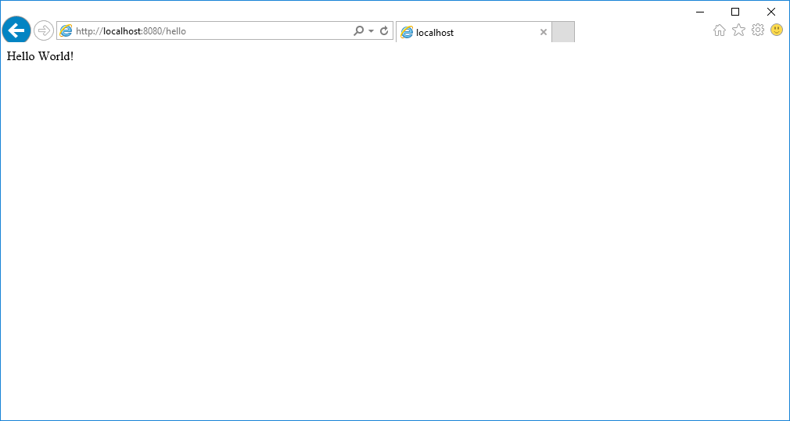
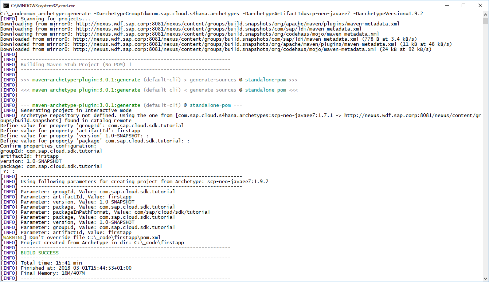
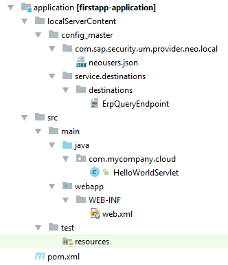
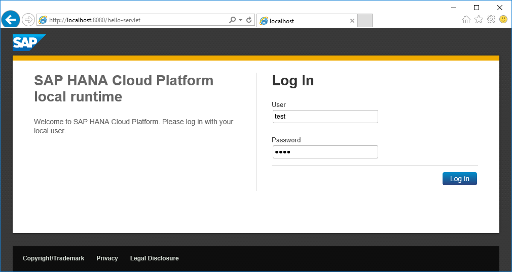
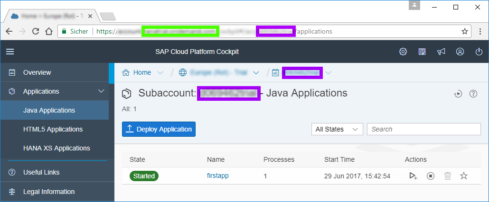
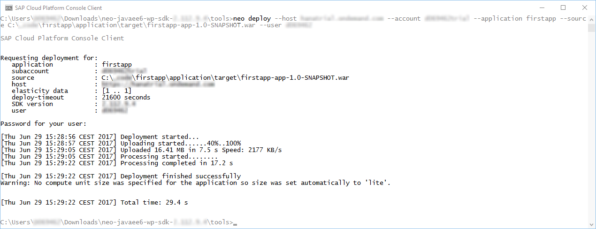
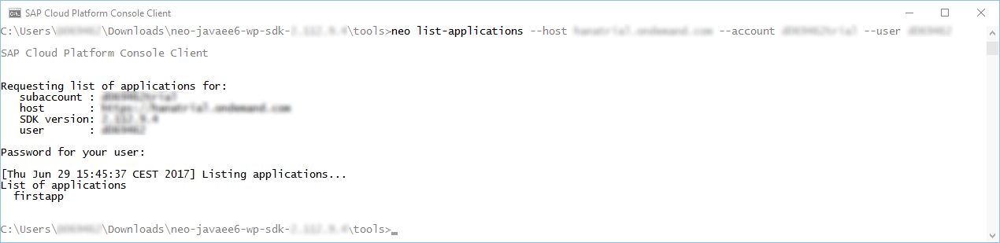
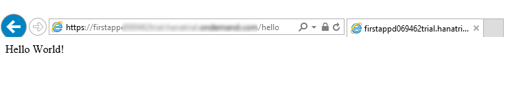

## Prerequisites  
 - **Tutorials:** [Set Up Your Local Infrastructure to Develop with SAP Cloud SDK](s4sdk-setup)

## Details  
### You will learn
 - How to generate a project stub using a Maven Archetype
 - How to understand the project structure and its artifacts
 - How to implement and understand the Hello World Servlet
 - How to implement and understand the integration test
 - How to deploy the project

This tutorial shows you the first steps when developing applications for the SCP Neo using the SAP Cloud SDK.



>If you want to follow this tutorial, it is highly recommended checking out the first tutorial in the series. You will not need any additional software as the server will run on your local machine.

---

[ACCORDION-BEGIN [Step 1: ](Generate project from archetype)]

Since you have already installed Maven, you can use it to generate a project stub from the `SAP Cloud SDK`  Maven archetype. Just use your console (IDE or OS), navigate to the parent directory for your project and run the following command.

```Shell
mvn archetype:generate -DarchetypeGroupId=com.sap.cloud.sdk.archetypes -DarchetypeArtifactId=scp-neo-javaee7 -DarchetypeVersion=RELEASE
```

Once the generation process has started, Maven will ask you for the usual module parameters. For this tutorial, choose `firstapp` as `artifactId` / project name.

  - `groupId` - an identifier representing your group, company or organization (e.g. `com.mycompany.cloud`)
  - `artifactId` - an identifier for your application (e.g. `firstapp`)
  - `version` - the version of your application (e.g. `1.0-SNAPSHOT`)
  - `package` - the name of the top-level package your source code will reside in (typically equal to your `groupId`, e.g. `com.mycompany.cloud`)


After the required values are provided, Maven will generate the new project from the Cloud SDK archetype:



Now you can work with it just like any other Maven project.

```Shell
cd /path/to/firstapp
mvn clean install
```

[DONE]

[ACCORDION-END]

[ACCORDION-BEGIN [Step 2: ](Understand project structure and artifacts)]
Once the Maven project is generated, you can open your favorite IDE and load the project as `Maven Project`. After importing the project into your IDE, the overall structure will look like this:


The first thing you will notice, are the different directories:

  - `application`
  - `cx-server`
  - `integration-tests`
  - `unit-tests`

These are Maven `submodules`, and they serve different aspects of your code application, test and deployment environment. The following separation of modules makes it possible to run dedicated unit tests and integration tests without deploying the application.

#### Multiple-modules project

The advantage of operating a multiple-modules project for your application becomes apparent as soon as the software complexity rises. Then it gets convenient to dedicate code distribution and responsibility to developers for either application or test environment. In terms of reliability and continuance, you will see that front-end testing and test automation are as important as classic backend-testing of your project. These fields of expertise require different programming paradigms, and thus different kinds of development life cycles. To ensure the overall software stability and reliability, a multiple module setup is the best practice solution.

To get you started, let's take a look into the conventional application project, as well as the classic unit tests. Then the integration tests follow, used for code tests with external servers and resources. Once software testing is covered, you'll be briefly introduced to the `Cx server` for continuous integration and delivery.


**`application`** contains the source code and configuration of your actual web application.



  - `src/main/java` - Here goes your production code, nothing else. As you can see, there's already the `HelloWorldServlet`, which you will look at in more detail soon.
  - `src/main/resources` - Anything that you require in your production code but is not compilable code goes here (typically things like API definition files for `RAML` or `OpenAPI`, database migration files for `Flyway` or `Liquibase`).
  - `src/main/webapp` - contains the deployment descriptor for your web application, `web.xml`.
  - `src/test/resources` - Additional resources for attached test classes.
  - `pom.xml` - This is your project management file for Maven where you can maintain other open source dependencies or use plugins that simplify your build environment.


**`unit-tests`** contains the unit tests for your application. Its structure is similar to `application` but it exclusively holds test classes and resources. The purpose of this module is to test and validate single aspects of data flow and computational operations in the `application` project.


  - `src/test/java` - This is the place for your automated tests.
  - `src/test/resources` - Tests may also require additional resources to work properly such as configuration files. This is their place.


**`integration-tests`** contains the integration tests for your application. Its structure is similar to **`application`**.


  - `src/test/java ` - Here you can put all your integration tests. As you can see, there's already the `HelloWorldServiceTest` corresponding to the `HelloWorldServlet`.
  - `src/test/resources` - Here are all the resources needed for the integration tests to run or validate.


**`cx-server`** contains the script and configuration file to manage your best practice continuous integration and delivery software environment (`Cx`). The included files allow `Linux` users to simply create their very own `Cx` server as part of `Docker` deployment. `Jenkins` is the server that will be run. This automation server helps to manage all technical steps of a software development process.


  - `cx-server` - This `Unix` bash script allows you to start and stop the `Jenkins` server on your local machine, as part of a `Docker` container.
  - `server.cfg` - This is the configuration file for the server parameters.

Once a `Jenkins` server is configured for your personal needs, the files in the project root directory become useful:

  - `Jenkinsfile` - This text file contains the definition of a `Jenkins` `pipeline` and stays part of your project source code. It defines what steps are run specifically for your application.
  - `pipeline_config.yml` - This is the configuration file for your specific application.

#### Unit tests and integration tests

This separation of test modules makes it possible to just run unit tests and integrations test without deploying, as well as deploying the application without running time consuming tests. Unit tests can either be kept publicly inside the application module, or in the separate `unit-tests` folder that is a part of the archetype. For that topic, the articles and educational videos by Martin Fowler are highly recommended. For a start, consider reading his post about [Unit Tests](https://martinfowler.com/bliki/UnitTest.html).

During development it becomes important to test newly implemented code on the external services, i.e. logic running in a distributed environment. This is where an integration test is an important tool to ensure correctness and stability over the whole internal and external deployment. Since the integration tests may contain confidential information, like business logic and test access tokens, it can be helpful to maintain its operation inside a dedicated Maven `submodule`. That way the runnable application itself can be later shipped without tests and their dependency.

[DONE]

[ACCORDION-END]


[ACCORDION-BEGIN [Step 3: ](HelloWorldServlet)]

Now that you understand the project structure, take a closer look at the `HelloWorldServlet.java`

```Java
package com.sap.cloud.sdk.tutorial;

import org.slf4j.Logger;

import javax.servlet.ServletException;
import javax.servlet.annotation.WebServlet;
import javax.servlet.http.HttpServlet;
import javax.servlet.http.HttpServletRequest;
import javax.servlet.http.HttpServletResponse;
import java.io.IOException;

import com.sap.cloud.sdk.cloudplatform.logging.CloudLoggerFactory;

@WebServlet("/hello")
public class HelloWorldServlet extends HttpServlet
{
    private static final long serialVersionUID = 1L;
    private static final Logger logger = CloudLoggerFactory.getLogger(HelloWorldServlet.class);

    @Override
    protected void doGet( final HttpServletRequest request, final HttpServletResponse response )
        throws ServletException, IOException
    {
        logger.info("I am running!");
        response.getWriter().write("Hello World!");
    }
}
```

The `HelloWorldServlet` extends `HttpServlet`, so this will be an `HTTP` endpoint that you can visit. You map this endpoint to the `/hello` route using `@WebServlet("/hello")`.

By overriding the function `doGet`, you define what happens when a client performs an `HTTP GET` request on the `/hello` route. In this case it simply writes a response containing **`Hello World!`**

[DONE]

[ACCORDION-END]

[ACCORDION-BEGIN [Step 4: ](Integration test)]
Let's take a look into the integration test project. It already contains a test for our simple `HelloWorldServlet`:

```Java
package com.sap.cloud.sdk.tutorial;

import com.jayway.restassured.RestAssured;
import org.jboss.arquillian.container.test.api.Deployment;
import org.jboss.arquillian.junit.Arquillian;
import org.jboss.arquillian.test.api.ArquillianResource;
import org.jboss.shrinkwrap.api.spec.WebArchive;
import org.junit.Before;
import org.junit.BeforeClass;
import org.junit.Test;
import org.junit.runner.RunWith;
import java.net.URL;

import com.sap.cloud.sdk.testutil.MockUtil;

import static com.jayway.restassured.RestAssured.given;
import static org.assertj.core.api.Assertions.assertThat;

@RunWith( Arquillian.class )
public class HelloWorldServiceTest
{
    private static final MockUtil mockUtil = new MockUtil();

    @ArquillianResource
    private URL baseUrl;

    @Deployment
    public static WebArchive createDeployment()
    {
        return TestUtil.createDeployment(HelloWorldServlet.class);
    }

    @BeforeClass
    public static void beforeClass()
    {
        mockUtil.mockDefaults();
    }

    @Before
    public void before()
    {
        RestAssured.baseURI = baseUrl.toExternalForm();
    }

    @Test
    public void testService()
    {
        final String body = given().get("/hello").body().asString();
        assertThat(body).isEqualToIgnoringCase("Hello World!");
    }
}
```

As you can see, `HelloWorldServiceTest` uses `JUnit` to define the test.

- It declares `BeforeClass` and `Deployment` for the general test setup.
- The `MockUtil` provides easy access to mocked backend systems, e.g. preconfigured ERP connections for the test cases.
- A `WebArchive` is deployed as a test run setup, including predefined additional classes, here `HelloWorldServlet.class` .
- The integration test features `RestAssured` to easily run `WebService` calls over `HTTP`. Later you will see the advantages of having this library on hand when dealing with more sophisticated examples. Here it runs an assertion test on the result of a `GET` request to the local `/hello` route.

[DONE]

[ACCORDION-END]

[ACCORDION-BEGIN [Step 5: ](Local deployment)]

To run all required Maven goals, you can use the following commands in the project root path, i.e. parent module:

```Shell
mvn clean install
mvn scp:clean scp:push -pl application
```

The first command will cascade the goal execution of `clean` and `install` to both Maven `submodules`. It will break in case of any compilation errors or test failures.

The second command will run a cleanup and startup for the `SCP Neo` application. The `-pl` argument defines the project location in which the Maven goals are being executed. If there is already a previously started instance of the application running, the goal `scp:clean` will try to stop it on `localhost:8080` and will remove the cached server files of the application. `scp:push` will start the application on `localhost:8080`. The web server is started as background process and will take additional seconds to initialize.

The second command will also ask for URL, user and password for the destination `ErpQueryEndpoint`. Since this destination is not used at this point of the tutorial, any arbitrary value can be entered here, e.g. `dummy`.


Once a **couple of seconds** have passed, you can open a browser and go to `http://localhost:8080/firstapp-application/`

  - You will be greeted with a login screen.
  - Enter _test_ / _test_




_Hello World!_

That's it.

When you are done and want to close the local `SCP` deployment, please use the `scp:clean` command for the application project. It will close any connection and stop the server.

```Shell
mvn scp:clean -pl application
```

[DONE]

[ACCORDION-END]

[ACCORDION-BEGIN [Step 6: ](Remote deployment)]

As a requirement make sure to have the [`Neo CLI`](https://help.sap.com/viewer/65de2977205c403bbc107264b8eccf4b/Cloud/en-US/76132306711e1014839a8273b0e91070.html) for the `Java EE 6 Web Profile` available.

In case you are missing this tool, feel free to download it. A traditional installation is not required:


**Note:** The `Neo CLI` comes packaged with the `SAP Cloud Platform Neo Environment SDK`.

  - Go to <https://tools.hana.ondemand.com/#cloud>
  - Download and unzip the latest `neo-javaee7-wp-sdk-######.zip` alias `Java EE 7 Web Profile`
  - Go into the directory `tools` and find the `neo.bat` (Windows) or `neo.sh` (`Mac/Linux`)

Please consider the [`documentation`](https://help.sap.com/viewer/65de2977205c403bbc107264b8eccf4b/Cloud/en-US/7613dee4711e1014839a8273b0e91070.html) or `readme.txt` file in case you use a proxy server for connecting to the host. Also it is recommended adding the `tools` directory to your `PATH` variable in order to run its executables from any location.


Once you open your Neo platform website, you will see your <span style="color:purple">`account name`</span> as well as the <span style="color:green">`hostname`</span> of the service.



The hostname usually depends on your general location:

:------------- | :-------------
`Europe (Rot) - Trial`	| `hanatrial.ondemand.com`
`Europe (Rot)`	| `eu1.hana.ondemand.com`
`US West (Chandler)`	| `us2.hana.ondemand.com`
`US East (Ashburn)`	| `us1.hana.ondemand.com`
`US East (Sterling)`	| `us3.hana.ondemand.com`
`Japan (Tokyo)`	| `jp1.hana.ondemand.com`
`China (Shanghai)`	| `cn1.hana.ondemand.com`
`Australia (Sydney)`	| `ap1.hana.ondemand.com`


Now run the required Maven goals in the project root path and use `neo` to deploy the packaged application to the remote `Neo` instance.

```Shell
mvn clean install
/path/to/neo deploy --host HOST --account ACCOUNT --user USER --application firstapp --source application/target/firstapp-app-1.0-SNAPSHOT.war
/path/to/neo start --host HOST --account ACCOUNT --user USER --application firstapp
```



You can check the `status` of your deployment with the status command:

```Shell
/path/to/neo status --host HOST --account ACCOUNT --user USER --application firstapp
```


If you want to list all running applications use the `list-applications` command:

```Shell
/path/to/neo list-applications --host HOST --account ACCOUNT --user USER
```



On the `Neo` website you will find the corresponding URL where your application is reachable. It will be listed in the application's details page and might follow the following pattern: `<https://[application][subaccount].[host]/[application]-application/>` from the values above.



_Hello World!_

That's it.

To find additional Neo commands, e.g. for stopping and `undeploying` applications, please take a look into the official lists of `Neo` [Console Client Commands](https://help.sap.com/viewer/65de2977205c403bbc107264b8eccf4b/Cloud/en-US/56e309f496cc446ba441d862db94cb18.html).

[DONE]

[ACCORDION-END]

[ACCORDION-BEGIN [Appendix: ](Troubleshooting)]

**Force application shutdown**

In case the Maven `scp:clean` goal does not shut down the application background process, even after the second execution, it is recommended to terminate it by hand. First you need to determine the process id by the public port, and then terminate the process.

**On Windows:**

```Shell
netstat -o -n -a | findstr 0.0:8003
taskkill /F /PID <PID>
```

**On OS X:**

```Shell
lsof -i :8003
kill -9 <PID>
```

**`Windows PowerShell`**

If you are using `PowerShell` on Windows, always put Maven arguments (supplied with `-D`) in quotes, for example:

```Shell
mvn archetype:generate "-DarchetypeGroupId=com.sap.cloud.s4hana.archetypes" "-DarchetypeArtifactId=scp-neo-javaee6" "-DarchetypeVersion=RELEASE"
```

[DONE]

[ACCORDION-END]

[ACCORDION-BEGIN [Appendix: ](Test yourself)]

[VALIDATE_1]

[ACCORDION-END]

[ACCORDION-BEGIN [Appendix: ](Test yourself)]

[VALIDATE_2]

[ACCORDION-END]
