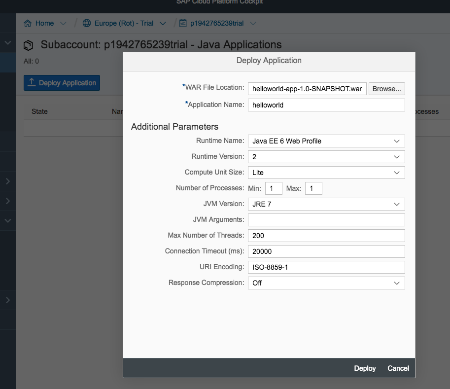
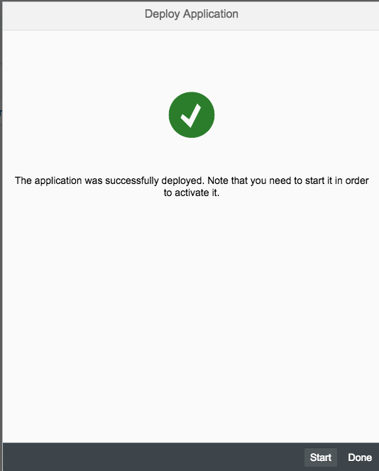
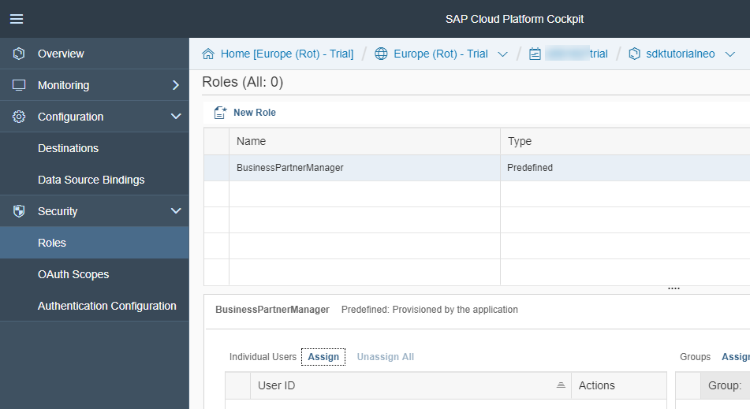
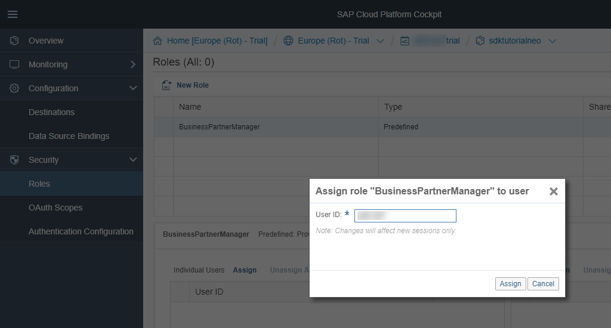
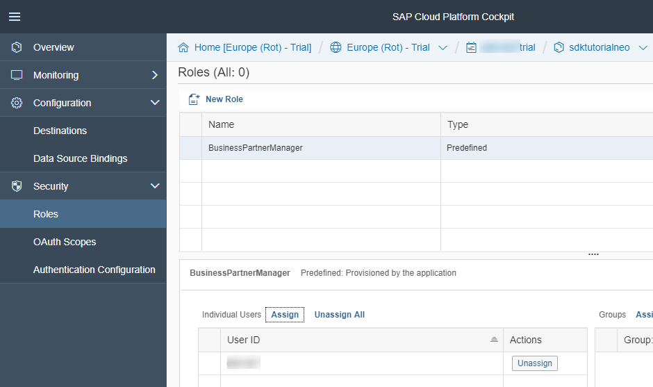
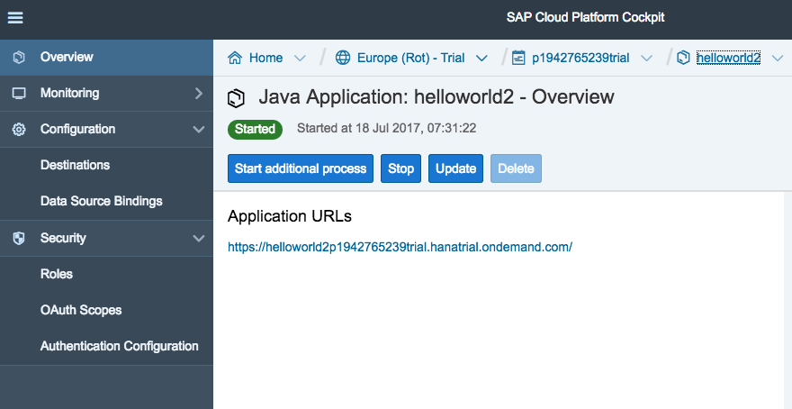
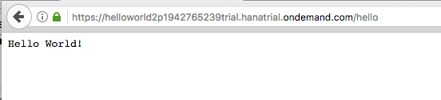

## Prerequisites
 - You did at least all steps until [Step 3 with SAP Cloud SDK: `HelloWorld` on SCP `CloudFoundry`] (https://blogs.sap.com/2017/05/19/step-3-with-sap-s4hana-cloud-sdk-helloworld-on-scp-cloudfoundry/).


## Details
### You will learn
  - Enhance your project with authentication and authorization metadata
  - Deploy the application with authentication information


---

[ACCORDION-BEGIN [Step 1: ](Enable authentication)]
In fact, if you have used the archetype to generate your project for SAP Cloud Platform, Neo, the application is already enabled for authentication by default. To review the authentication go to your **`application/src/main/webapp/WEB-INF`** directory and look at the **`web.xml`** file.

```
<login-config>
    <auth-method>FORM</auth-method>
</login-config>

<session-config>
    <session-timeout>20</session-timeout>
</session-config>

<security-role>
    <role-name>Everyone</role-name>
</security-role>

<security-constraint>
    <web-resource-collection>
        <web-resource-name>All SAP Cloud Platform users</web-resource-name>
        <url-pattern>/*</url-pattern>
    </web-resource-collection>
    <auth-constraint>
        <role-name>Everyone</role-name>
    </auth-constraint>
</security-constraint>
```
There you can see that the archetype uses the FORM authentication method (which will use the SAML configuration). In addition you find the session configuration as well as the definition of one security role for Everyone. Per definition every authenticated user has the role "Everyone". The entire model is based on the Java EE standard which is documented, for example, [here] (https://docs.oracle.com/cd/E19226-01/820-7627/bncav/index.html).

[DONE]
[ACCORDION-END]

[ACCORDION-BEGIN [Step 2: ](Introduce a new role)]
Introducing a new role is fairly simple. You can add into the **`web.xml`** something like the following to introduce the **`BusinessPartnerManager`** role.

```
<security-role>
    <role-name>BusinessPartnerManager</role-name>
</security-role>
```
Now the paths of the application can be protected and constrained to certain roles you define for me. For a more fine-grained access-control, please refer to the [standard `JavaEE` documentation] (https://docs.oracle.com/cd/E19226-01/820-7627/bncav/index.html).


[DONE]
[ACCORDION-END]


[ACCORDION-BEGIN [Step 3: ](Protect resources with roles)]

```
<security-constraint>
    <web-resource-collection>
        <web-resource-name>Only for business partner managers</web-resource-name>
        <url-pattern>/hello</url-pattern>
    </web-resource-collection>
    <auth-constraint>
        <role-name>BusinessPartnerManager</role-name>
    </auth-constraint>
</security-constraint>
```
After you made all changes you are ready to deploy the application to Neo.

[DONE]
[ACCORDION-END]

[ACCORDION-BEGIN [Step 4: ](Deploy to SAP Cloud Platform Neo)]

```
cd application
mvn clean install
```
You can use the cockpit on SAP Cloud Platform to deploy or update your application as follows. Alternatively, use the deploy and start commands for Neo introduced in [step 2 of this tutorial series] (https://blogs.sap.com/2017/05/21/step-2-with-sap-s4hana-cloud-sdk-helloworld-on-scp-classic/).



Go to your SCP account on `hanatrial.ondemand.com` and select **Applications / Java Applications / Deploy Application**. Select the recent build from your application/target directory:

Hit "Deploy" and wait for the assembly to be uploaded. Once uploaded click the start button so that the application is going to be started.



While the application is starting, select the application and go to the **Security / Roles** menu.



Click the **Assign** button and assign your user ID to the `BusinessPartnerManager` role.





Afterwards, go back to the application and select the URL to try it out yourself:






[DONE]
[ACCORDION-END]

[ACCORDION-BEGIN [Step 5: ](Local deployment)]
In order to assign roles to users of the local deployment you have to do the following.

First go in your project and open the `neousers.json` file, e.g., using:

```
cd application/localServerContent/config_master/com.sap.security.um.provider.neo.local/
open neousers.json
```
Then add the roles to the respective users in the corresponding attribute:

```
"Roles": [ "BusinessPartnerManager" ]
```
After that, redeploy the application using

```
mvn scp:clean scp:push -pl application/
```
If you then go to `http://localhost:8080/hello` you should see the application in action behind a protected resource.

[DONE]
[ACCORDION-END]

[ACCORDION-BEGIN [Step 6: ](Small tips and tricks)]
You may want to consider the following additional attributes in your `web.xml` to decrease the likelihood of XSS and similar attacks (e.g., stolen JSESSIONID).

```
<security-constraint>
    <web-resource-collection>
        <web-resource-name>Only for business partner managers</web-resource-name>
        <url-pattern>/hello</url-pattern>
    </web-resource-collection>
    <auth-constraint>
        <role-name>BusinessPartnerManager</role-name>
    </auth-constraint>
 	<user-data-constraint>
         <transport-guarantee>CONFIDENTIAL</transport-guarantee>
    </user-data-constraint>
</security-constraint>

<session-config>
	<session-timeout>20</session-timeout>
	<cookie-config>
		<secure>true</secure>
	</cookie-config>
</session-config>
```
That's it for today. Now you have learned the basics to protect your application on SAP Cloud Platform, Neo which are based on the SAP Cloud SDK. Stay tuned for upcoming blog posts about more advanced usages of the SAP Cloud SDK.

[DONE]
[ACCORDION-END]


[ACCORDION-BEGIN [Appendix: ](Test yourself)]

[VALIDATE_1]

[ACCORDION-END]

[ACCORDION-BEGIN [Appendix: ](Test yourself)]

[VALIDATE_2]

[ACCORDION-END]


---
