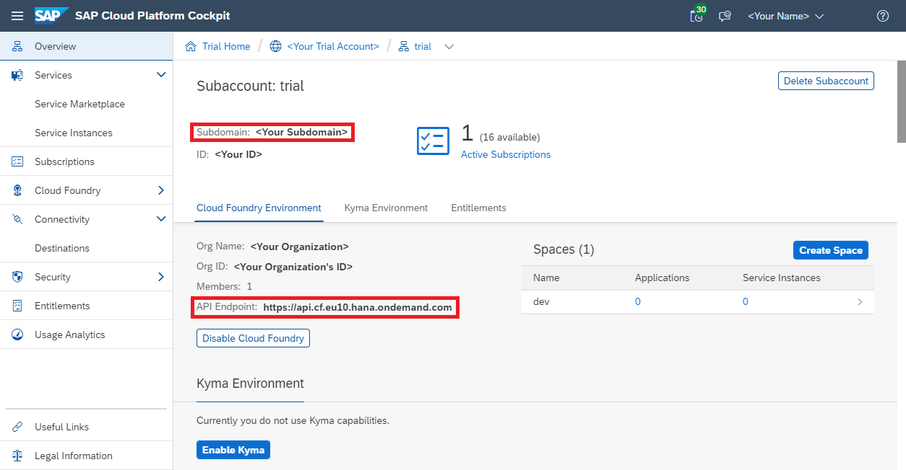
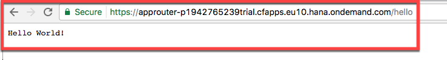

## Prerequisites
 - You completed all steps until [Create a Sample Application on Cloud Foundry Using SAP Cloud SDK](s4sdk-cloud-foundry-sample-application).

## Details
### You will learn
  - How to set up and configure the App Router component as a central entry point to your microservice landscape to handle authentication and authorization
  - How to protect your Java microservice so that it only accepts requests based on a valid JSON Web Token (JWT) that is received from the App Router
  - Assign roles and scopes to your application users and let your backend deal with authorization information

---

[ACCORDION-BEGIN [Step 1: ](Concepts)]

Before diving deeper into the real setup of the architecture, let's quickly review the architecture this tutorial intends to go for.

Figure 1 presents the final setup. First, there still is your existing "Hello World" or "Business Partner" Java-based microservice that you have created in the previous tutorials. However, instead of letting the customer access this application directly, you will use the so-called Application Router (App Router) that serves two purposes.

On the one hand, the App Router is a general entry point into the world of microservices. The main idea is that you can split an application into multiple microservices with independent deployability, polyglot `runtimes` & persistence, and independent teams. Therefore, a central entry component is required that hides the complexity of the microservice landscape from the end customer.

On the other hand, the App Router is mainly responsible for managing authentication flows. The App Router takes incoming, unauthenticated requests from users and initiates an OAuth2 flow with the [Extended Services for User Account and Authentication (XSUAA)](https://help.sap.com/viewer/65de2977205c403bbc107264b8eccf4b/Cloud/en-US/51ec15a8979e497fbcaadf80da9b63ba.html). The XSUAA service is an SAP-specific extension of [`CloudFoundry's` UAA](https://docs.cloudfoundry.org/concepts/architecture/uaa.html) service to deal with authentication and authorization (it may again delegate this aspect to other providers such as external Identity Providers, see later in this tutorial). If the user authenticates at the XSUAA, it will respond with a [JSON Web Token (JWT)](https://de.wikipedia.org/wiki/JSON_Web_Token) containing the authenticated users as well as all scopes that he or she has been granted.


**Figure 1: Authentication Flow during Runtime**

The JWT is passed by the App Router to the underlying microservices so that they are freed up from this task. At the same time, these microservices can only be accessed with a valid JWT, hence, are protected from unauthenticated traffic.

The JWT contains a signature that needs to be verifiable by every microservice to establish trust. Hence, every service require a key (client-secrets or public keys) to verify this signature and reject any requests with non-valid JWTs. Therefore, every service has to maintain a service binding to the XSUAA that provides this information for runtime verification (Figure 2). To enable this, every microservice binds to a dedicated XSUAA instance which writes this information into the `VCAP_SERVICES` environment variable which the microservices can use to verify any token's validity.


**Figure 2: Provisioning view with XSUAA binding**

With these basics in mind, let's create the picture of Figure 1 and Figure 2 by setting up the App Router, XSUAA and backend microservices to enable full application security.

[DONE]
[ACCORDION-END]

[ACCORDION-BEGIN [Step 2: ](Set up the App Router)]

You will let Cloud Foundry retrieve the App Router automatically on deployment. To achieve this, you will first set up the necessary structure.

1. Go to your favourite `<destLocation>` and create the `approuter` directory:

    ```Bash
    cd <destLocation>
    mkdir approuter
    cd approuter
    ```

2. Place the following `package.json` in your `approuter` directory:

    ```JSON
    {
      "name": "approuter",
      "dependencies": {
        "@sap/approuter": "*"
      },
      "scripts": {
        "start": "node node_modules/@sap/approuter/approuter.js"
      }
    }
    ```

3. Within `<destLocation>/approuter` create a new file called `xs-app.json` with the following content:

    ```JSON
    {
      "welcomeFile": "index.html",
      "routes": [{
        "source": "/",
        "target": "/",
        "destination": "app-destination"
        }]
    }
    ```

4. Last but not least create a new `manifest.yml` file within `<destLocation>` for the app router microservice with the following content:

    ```YAML

    ---
    applications:
    - name: approuter
      routes:
        - route: approuter-<subdomain>.cfapps.<region_id>.hana.ondemand.com
      path: approuter
      memory: 128M
      buildpacks:
        - nodejs_buildpack
      env:
        TENANT_HOST_PATTERN: 'approuter-(.*).cfapps.<region_id>.hana.ondemand.com'
        destinations: '[{"name":"app-destination", "url" :"<APPLICATION_URL>", "forwardAuthToken": true}]'
      services:
        - my-xsuaa
    ```

    Adapt the file as follows:

      - Replace `<subdomain>` with your subdomain. You will find your subdomain in the CF cockpit by heading to the overview page of your sub-account:

          

      - Swap out both instances of `<region_id>` with your specific region (e.g. `eu10`). You can find it for instance included in the API endpoint (also listed in the image above) just before `hana.ondemand.com`. More details on the region specific URLs can be found [here](https://help.sap.com/viewer/65de2977205c403bbc107264b8eccf4b/Cloud/en-US/350356d1dc314d3199dca15bd2ab9b0e.html).
      - In `destinations` replace `<APPLICATION_URL>` with the actual URL of your previously deployed app. Again you can find it in the CF cockpit or by listing all existing routes via `cf routes`. Note: The URI specified for `<APPLICATION_URL>` must be absolute, e.g. `https://<app-name>.cfapps.<region>.hana.ondemand.com`.

### Understanding the AppRouter's `manifest.yml`

On Cloud Foundry every sub-account is assigned exactly one subdomain which is associated to exactly one tenant. In a multi-tenant scenario the app router needs to know which tenant to forward to the XSUAA service. This is achieved by including the subdomain in the host, from which the app router will extract it. That is where the `TENANT_HOST_PATTERN` comes into play. It is a variable that declares the pattern how tenants in the URL are identified and handled. For this tutorial we expect the host to conform to `approuter-<subdomain>`. If you desire different URL patterns, you need to change the `route` and `TENANT_HOST_PATTERN` accordingly.

Note that the `TENANT_HOST_PATTERN` variable is only required in real multi-tenant application, i.e, applications where a physical deployment serves multiple clients from the same deployment. This tutorial series assumes that you want to build multi-tenant applications, as it is aimed towards cloud-native development. However, this variable is not necessary if you have a single-tenant application. To realize this, the `xs-security.json` security descriptor may declare `"tenant-mode": "dedicated"` (see step 5 below).

Moving on to the `destinations` entry. It is a variable that declares the internal routes from the App Router to the underlying backend microservices. As you have only one microservice yet, you may define only one destination called `app-destination` here. This `app-destination` is referenced by the previously created `xs-app.json` file.

Last but not least the `services` section declares to bind your own XSUAA service instance to the App Router. This binding will ensure a corresponding `VCAP_SERVICES` entry that holds the client ID, client secret and public key that is required to validate any incoming OAuth token/JWT from the XSUAA service:


### Bind the XSUAA Service

Now you need to create a service binding to the XSUAA service. As a prerequisite you require an `xs-security.json` (security descriptor) file that contains a declaration about authorization scopes you intend to use in your application. For example, simply declare a `DISPLAY` scope that will be used later on to authorize your users. In addition, a so-called role template called `Viewer` that references our `DISPLAY` scope is declared.

Put this file to `<destLocation>/xs-security.json`. For a more detailed explanation on scopes and role templates, see the appendix of this tutorial. More details on the syntax of the `xs-security.json` can be found [here](https://help.sap.com/viewer/4505d0bdaf4948449b7f7379d24d0f0d/2.0.01/en-US/df31a08a2c164520bb7e558103dd5adf.html).

>**_Note_**: The `xsappname` has to be unique within the entire XSUAA instance. We suggest you follow the same pattern of `<app-name>-<subdomain>`.

>**_Note_**: As explained above, the `"tenant-mode": "shared"` assumes a multi-tenant application and will require the `TENANT_HOST_PATTERN` variable to be declared. You may also use `"tenant-mode": "dedicated"` if you develop a single-tenant application.

`<destLocation>/xs-security.json`:

```JSON
{
  "xsappname": "firstapp-<subdomain>",
  "tenant-mode": "shared",
  "scopes": [
    {
      "name": "$XSAPPNAME.Display",
      "description": "display"
    }
  ],
  "role-templates": [
    {
      "name": "Viewer",
      "description": "Required to view things in our solution",
      "scope-references"     : [
        "$XSAPPNAME.Display"
      ]
    }
  ]
}
```

Create the file and change the app name just like before.

Then create a service instance called `my-xsuaa` of the XSUAA service by issuing the following command and using the `xs-security.json` file:  

```Bash
cf create-service xsuaa application my-xsuaa -c xs-security.json
```

If you have created this instance of the XSUAA service before without the `xs-security.json` parameter, you can unbind and delete the existing instance with these commands before creating it with the above command:

```Bash
cf unbind-service firstapp my-xsuaa
cf delete-service my-xsuaa​
```

After you have created the XSUAA service instance, deploy the app router using the following (with the appropriate API endpoint of your Cloud Foundry region):

```Bash
cd <destLocation>
cf push
```

Afterwards you should be able to locate the app router from within your browser using the host name of your deployment. In my case this is `https://approuter-p1942765239trial.cfapps.eu10.hana.ondemand.com/hello` which should face you with the following login page where you can use your user e-mail and password:


After logging in you should see the `HelloWorld` servlet which is now served by the App Router as a proxy to your Java application:



[DONE]
[ACCORDION-END]

[ACCORDION-BEGIN [Step 3: ](Protect your backend microservice)]
After authentication works with the App Router, your java backend service is still fully visible in the web and not protected. Therefore, you need to protect your java microservices as well so that they accept requests with valid JWTs for the current user only. In addition, you will setup the microservice in a way that it deals with authorization, i.e., understands the OAuth scopes from the JWT that we have configured previously using the `xs-security.json` file.

[OPTION BEGIN [TomEE]]

**The following steps apply to the `TomEE` runtimes. For Spring please select the relevant tab at the top of this section.**

In the following, you will use the security capabilities of the [SAP Java Buildpack](https://github.com/SAP/cloud-security-xsuaa-integration/tree/master/samples/sap-java-buildpack-api-usage) to protect the microservices.

In your `application/src/main/webapp/WEB-INF/web.xml` file, add the following login configuration:

```XML
<login-config>
    <auth-method>XSUAA</auth-method>
</login-config>
```

This enables authentication of requests using incoming OAuth authentication tokens.

Additionally make sure that the following `security-constraint` block is contained in your `web.xml` file:

```XML
<security-constraint>
    <web-resource-collection>
        <web-resource-name>Baseline Security</web-resource-name>
        <url-pattern>/*</url-pattern>
    </web-resource-collection>
    <auth-constraint>
        <role-name>*</role-name>
    </auth-constraint>
</security-constraint>

<security-role>
    <role-name>Display</role-name>
</security-role>
<!--
<security-role>
    <role-name>Further Role Name</role-name>
</security-role>
-->
```

That way all endpoints of your application can be accessed by users with any of the role names specified in the `security-role` tags.

To specifically secure your endpoints by requiring a specific role you now only need to add an annotation to your endpoint. For our `BusinessPartnerServlet` this looks like this:

```Java
@ServletSecurity(@HttpConstraint(rolesAllowed = { "Display" }))
public class BusinessPartnerServlet extends HttpServlet {
  // ...
}
```

This will allow only users with the provided role to have access to the annotated endpoint. Compare for this the `xs-security.json` you created earlier to create the XSUAA service.

[OPTION END]

[OPTION BEGIN [Spring]]

**The following steps apply to the Spring runtimes. For `TomEE` please select the relevant tab at the top of this section.**

In the following, you will use the security capabilities of the [SAP CP Spring XSUAA Security Library](https://github.com/SAP/cloud-security-xsuaa-integration/tree/master/spring-xsuaa#setup-security-context-for-http-requests) to protect the microservices.

In your applications `pom.xml` ensure the following dependency is present:

```XML
<dependency>
    <groupId>com.sap.cloud.security.xsuaa</groupId>
    <artifactId>xsuaa-spring-boot-starter</artifactId>
</dependency>
```

This provides the necessary capabilities of the XSUAA library for Spring.
Leverage them in setting up a `SecurityConfiguration`:

```JAVA
@Configuration
@EnableWebSecurity(debug = true) // TODO "debug" may include sensitive information. Do not use in a production system!
@EnableGlobalMethodSecurity(prePostEnabled = true, securedEnabled = true, jsr250Enabled = true)
public class SecurityConfiguration extends WebSecurityConfigurerAdapter {

    @Autowired
    XsuaaServiceConfiguration xsuaaServiceConfiguration;

    @Override
    protected void configure(HttpSecurity http) throws Exception {
        http
                .sessionManagement()
                .sessionCreationPolicy(SessionCreationPolicy.STATELESS) // session is created by approuter
                .and()
                .authorizeRequests()
                .antMatchers("/*").authenticated()
                .antMatchers("/*").hasAuthority("Display")
                .anyRequest().denyAll()
                .and()
                .oauth2ResourceServer()
                .jwt()
                .jwtAuthenticationConverter(getJwtAuthenticationConverter());
    }

    /**
     * Customizes how GrantedAuthority are derived from a Jwt
     */
    Converter<Jwt, AbstractAuthenticationToken> getJwtAuthenticationConverter() {
        return new TokenAuthenticationConverter(xsuaaServiceConfiguration).setLocalScopeAsAuthorities(true);
    }
}
```

The above will require authentication via a JWT for all endpoints of your service.
In addition all JWTs are required to contain the `Display` scope.

Depending on your setup your integration tests may now fail if they are not authenticated.
In that case leverage the XSUAA testing library to mock request authentication.

1. Add the testing capabilities via the following dependency:

    ```XML
    <dependency>
        <groupId>com.sap.cloud.security</groupId>
        <artifactId>java-security-test</artifactId>
        <scope>test</scope>
    </dependency>
    ```

1. Annotate your test class with `@TestPropertySource(properties = {"xsuaa.uaadomain=localhost", "xsuaa.xsappname=xsapp!t0815", "xsuaa.clientid=sb-clientId!t0815"})`

1. Create a JWT for testing:

  ```JAVA
  @ClassRule
  public static final SecurityTestRule rule = SecurityTestRule.getInstance(Service.XSUAA);

  static String jwt = "Bearer " + rule.getPreconfiguredJwtGenerator()
                .withLocalScopes("Display")
                .createToken().getTokenValue();
  ```

1. Add the JWT in the authorization header of your test requests.

[OPTION END]


At this point you should now rebuild your application and push it to Cloud Foundry.

```Bash
cd /path/to/firstapp/application
mvn clean install
cd /path/to/firstapp
cf push
```

If you now call the `/businesspartners` endpoint of your application you will see a [`401` Unauthorized](https://httpstatuses.com/401) status code, as you were not authorized by the App Router. Calling the `/businesspartners` endpoint via your App Router on the other hand will give you a [`403` Forbidden](https://httpstatuses.com/403) status code meaning that you do not have the necessary authorization to see this page. This is to be expected, as you secured the endpoint with the annotation above without assigning the requested role `Display` to your user. You will fix this in the next step.

[DONE]
[ACCORDION-END]

[ACCORDION-BEGIN [Step 4: ](Assign users to scopes)]

To regain access to your secured endpoint, you need to get the `Display` OAuth scope assigned. This is done using the SCP cockpit.

1. First, go to your account on Cloud Foundry and find the **Role Collections** menu under the **Security** module.

2. Second, create a new role collection which you can give an arbitrary name. For example, you might call the role collection **Business Partner Manager**. 

3. Afterwards, select the role collection **Business Partner Manager**, select **Edit**, and add a new role. From the menu, select your application and the corresponding role template and role. Finish up the process by adding the newly created role and saving the **Business Partner Manager** role collection.


4. Afterwards, the user has to be assigned to the newly created **Business Partner Manager** in order to receive the **Display** scope. To do this, select the trust configuration from the security menu and select the **Default identity provider** from the list.

5. In the opening dialog, enter your user ID as e-mail into the user field and click **Show Assignments** followed by **Add Assignments**.

6. Select the **Business Partner Manager** role collection from the menu to assign it to your user. 

Afterwards you have the `Display` OAuth scope assigned to your user, which allows you to access the secured endpoints again.

[DONE]
[ACCORDION-END]

[ACCORDION-BEGIN [Step 5: ](Deploy and test the application)]
Now you are ready to build and deploy the application to try all your changes with:

```Bash
cd /path/to/firstapp/application
mvn clean install
cd /path/to/firstapp
cf push
```

After deployment, accessing your backend service directly should not be possible anymore and result in the following message:


However, you should still be able to access your application using the App Router as entry point:


[DONE]
[ACCORDION-END]

[ACCORDION-BEGIN [Step 5: ](Remove CSRF token protection from backing service)]
If you have previously exposed the backing service directly to the end user, you have used the `RestCsrfPreventionFilter` on the backend to protect against cross-site request forgery. As this is now in the responsibility of the App Router, you should remove it. For this remove the following lines from your `web.xml`:
```XML
<filter>
  <filter-name>RestCsrfPreventionFilter</filter-name>
  <filter-class>org.apache.catalina.filters.RestCsrfPreventionFilter</filter-class>
</filter>
<filter-mapping>
  <filter-name>RestCsrfPreventionFilter</filter-name>
  <url-pattern>/*</url-pattern>
</filter-mapping>
```

[DONE]
[ACCORDION-END]

[ACCORDION-BEGIN [Step 6: ](Understanding Roles, Role Collections and Scopes)]
The following picture explains how the various concepts are related to each other.


Gray Box: As a SCP developer (e.g., SAP, partner, customer) of the business application (gray box), you define role templates which may contain multiple OAuth scopes. The developer here define the scope, role templates and additional attributes within the `xs-security.json` as explained in this tutorial which is used when creating the service instantiation to the XSUAA.

Orange Box: As an SCP tenant administrator of the business application (customer), you can create a role collection which is spanning multiple roles reflecting the role templates. This way you can achieve, on the one hand, a fine-granular authorization control for the microservices and, on the other hand, compose them very flexibly in coarse-grained role collections. The idea behind this is, that, for example, the **Business Partner Manager** role collection may span multiple applications and microservices all having individual scopes. The role collections resolves the roles and scopes and returns a union of all scopes which are composed by the role collection.

Green Box: As an administrator of the users (customer), you can assign the role collection to the final user using the SAML attribute `Groups`.

[DONE]
[ACCORDION-END]

[ACCORDION-BEGIN [Step 7: ](Troubleshoot JSON Web Tokens)]
Sometimes it might be necessary to investigate the JWT on the backend microservice during development to check for potential errors. Here is an example servlet that prints the token out.

```Java
@WebServlet("/debug")
public class JwtDebugServlet extends HttpServlet {

    @Override
    protected void doGet(final HttpServletRequest request, final HttpServletResponse response )
            throws ServletException, IOException
    {
        response.setContentType("text/plain");
        Enumeration headerNames = request.getHeaderNames();
        while (headerNames.hasMoreElements()) {
            String key = (String) headerNames.nextElement();
            String value = request.getHeader(key);

            response.getOutputStream().println(key+" : "+value);
        }
    }
}
```
Afterwards you may use `https://jwt.io/` to decode the token. **Note:** You should never use this with any productive JWT as these tokens are shared on a public website. Fallback to local solutions.


[DONE]
[ACCORDION-END]

[ACCORDION-BEGIN [Step 8: ](Troubleshoot OAuth scopes from XSUAA)]
In addition, you may use the XSUAA to see which current scopes and roles a particular users has. You could do this with your XSUAA tenant-specific URL:

`https://<subdomain>.authentication.<region_id>.hana.ondemand.com/config?action=who`


[DONE]
[ACCORDION-END]

[ACCORDION-BEGIN [Step 9: ](Set up your own identity provider)]
So far, we have used the XSUAA service itself as the user provider. However, in production scenarios customer's may want to use their own Identity Provider (IdP) as a user provider or delegate into on-premise user stores such as LDAP or Active Directory. The following paragraphs quickly explain how the XSUAA service can delegate requests to such an external IdPs.

To make this happen, the IdP and the service provider (SP) have to exchange security metadata, i.e., the IdP has to import the metadata of the SP and vice versa.

You can retrieve the metadata from your XSUAA tenant by following the pattern `https://<subdomain>.authentication.<region_id>.hana.ondemand.com/saml/metadata`, e.g. `https://p123456trial.authentication.eu10.hana.ondemand.com/saml/metadata`. This downloads the metadata as an XML file.

Secondly, you need to import the metadata into your IdP. In the following example, a SAP Cloud Identity tenant is used.

1. Within the IdP, you have to create a new application called `MyApp` where you select the **SAML 2.0 Configuration**.

2. Import the SP's metadata and click **Save**.

3. Back in the SCP account cockpit you need to add the IdP's metadata in the same manner.

4. Click **New Trust Configuration** and add the metadata from the IdP and click **Save**.


[DONE]
[ACCORDION-END]


[ACCORDION-BEGIN [Appendix: ](Test yourself)]

[VALIDATE_1]

[ACCORDION-END]

[ACCORDION-BEGIN [Appendix: ](Test yourself)]

[VALIDATE_2]

[ACCORDION-END]
