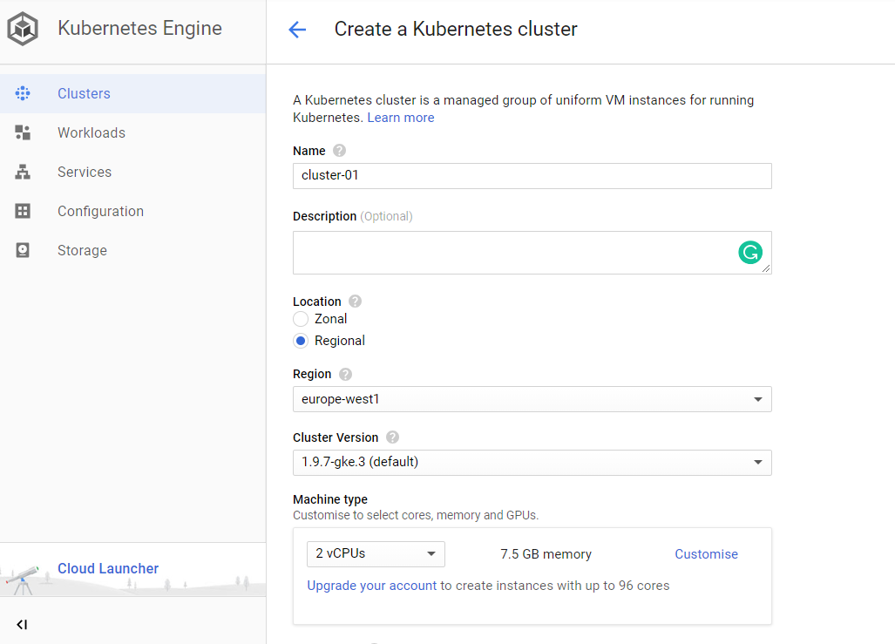

---
title: Set up your CI/CD infrastructure for SAP S/4HANA Extension application on Google Kubernetes Engine
description: Set up your system to create an SAP Cloud Platform application with the S/4HANA Cloud SDK.
primary_tag: products>sap-s-4hana
tags: [  tutorial>intermediate, products>sap-s-4hana, products>sap-cloud-platform, products>sap-s-4hana-cloud-sdk, topic>cloud, topic>Continues delivery ]
---

## Prerequisites  
 - **Proficiency:** intermediate
 - **Google Cloud Platform account:** required

## Details
For a complete overview visit the [SAP S/4HANA Cloud SDK Overview](https://blogs.sap.com/2017/05/10/first-steps-with-sap-s4hana-cloud-sdk/).

### You will learn  
In this tutorial, you will go through the steps required to install the scalable [SAP S/4HANA Cloud SDK CI/CD Toolkit ](https://www.sap.com/germany/developer/topics/s4hana-cloud-sdk.html) on Google Kubernetes engine and execute an example pipeline on the Jenkins that you have setup.

### Time to Complete
**~15 Min**

[ACCORDION-BEGIN [Step 1: ](Prepare the Infrastructure)]
### Setup Kubernetes cluster

In this step, let us create a Kubernetes cluster which we can then make use of in following steps. In your Google Cloud Platform dashboard, navigate to Kubernetes Engine and click on create cluster.

In the following page, change Machine type to use 2vCPUs. We will use default values for other parameters.

Click on create cluster. This will create cluster named ‘cluster-1’ with 3 nodes.  The creation of cluster might take few minutes.

