## Prerequisites  
 - **Proficiency:** Beginner

## Details
### You will learn  
  - How to integrate SAP S/4HANA Cloud into any Cloud-native Java application.
  - How SAP S/4HANA Cloud SDK helps build Cloud-native applications and access SAP S/4HANA APIs.
  - Why SAP Cloud Platform is the premier choice for extending SAP solutions.

### Time to Complete
**20 Min**

---

### Overview
You will use the Java virtual data model (VDM) of the SAP S/4HANA Cloud SDK to access business data stored in an SAP S/4HANA system.

The machine has already been prepared and you will find the source code for an Address Manager application in the development environment.

There is just one thing missing: The app needs to retrieve the business partners (for example, customers) from an SAP S/4HANA system. This tutorial will walk you through the steps to implement the missing functionality using the SAP S/4HANA Cloud SDK, and to deploy the application on SAP Cloud Platform.

### Setup Instructions
Install the following tools on each machine:

- Java
- Maven
- git
- `IntelliJ` IDE
- Cloud Foundry CLI
- node

Perform the following setup once on each machine:

- `git clone`
- `git checkout learning/vdm_tutorial-start`
- Open `IntelliJ` and import project
- In `IntelliJ`, open **File > Settings**, navigate to **Build, Execution, Deployment > Build Tools > Maven > Running Tests**, and uncheck **`argLine`**
- Create run environment `Run local server` with environment variables:

    ```
    destinations=[{name: 'ErpQueryEndpoint', url: 'http://localhost:3000', username: 'DUMMY', password: 'dummy'}]
    ALLOW_MOCKED_AUTH_HEADER=true
    ```


[ACCORDION-BEGIN [Step 1: ](Reset to initial state)]

Someone else may have done the tutorial on this machine before. So, let's first make sure that everything is in the initial state required for this tutorial.

From the menu bar, choose **VCS > Git > Revert** (or press **Ctrl+Alt+Z**).
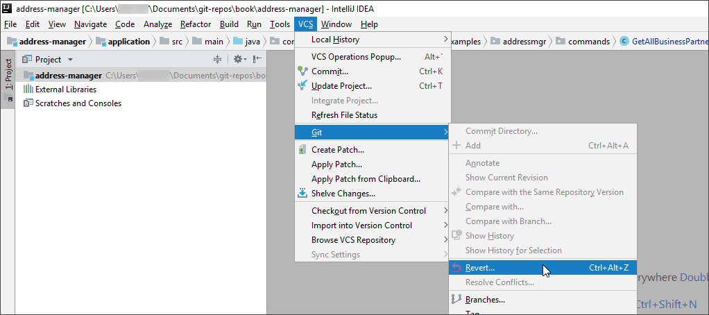

Click the checkbox next to **Default** so that all changes are marked for reverting, and click **Revert**.
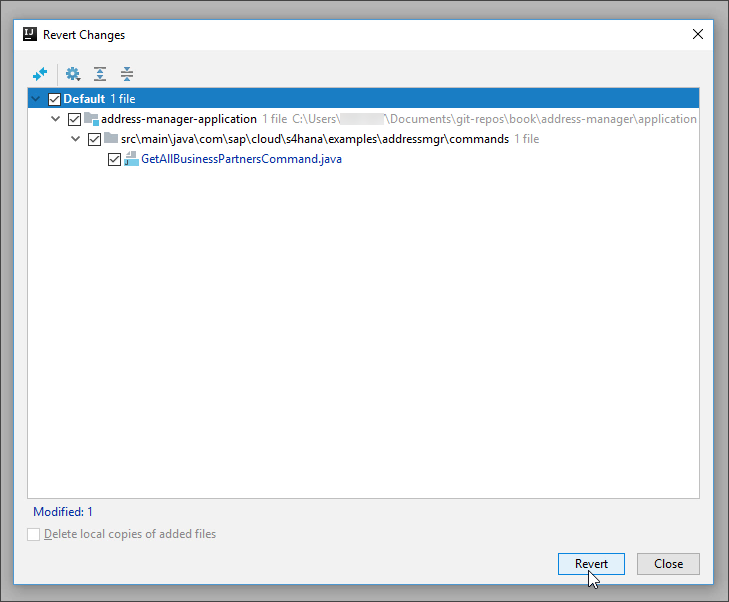

Check if the local server is still running by looking at the run icon with the green arrow next to **Run local server** in the upper right part of the screen. If the icon has a small green dot like in the following screenshot, the server is already running.
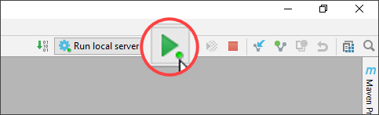

If the server is not already running, start the local server by clicking the green run icon.


[ACCORDION-END]

[ACCORDION-BEGIN [Step 2: ](Test the initial state)]

Locate the folder `address-manager/integration-tests` in  the project pane on the left.

Right-click `integration-tests` and select **Run 'All Tests'**.
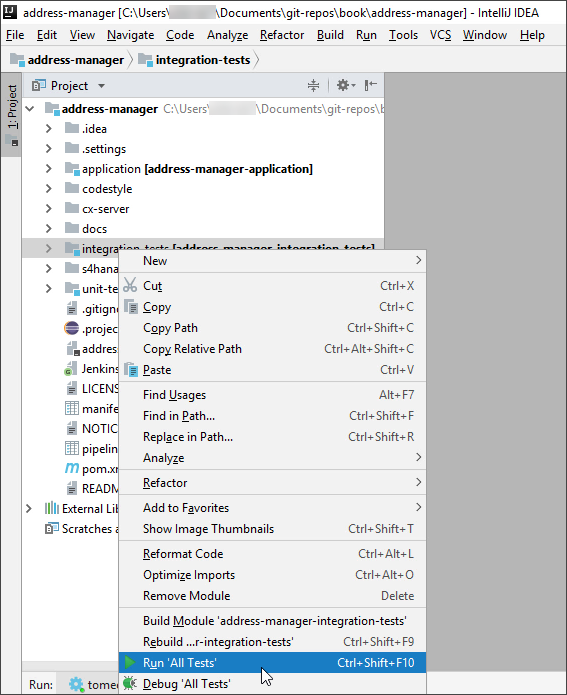

While the tests are running, visit `http://localhost:8080/address-manager/` to see the currently implemented application in action. You will notice that the list of business partners on the left is still empty, because we have not yet implemented this functionality.
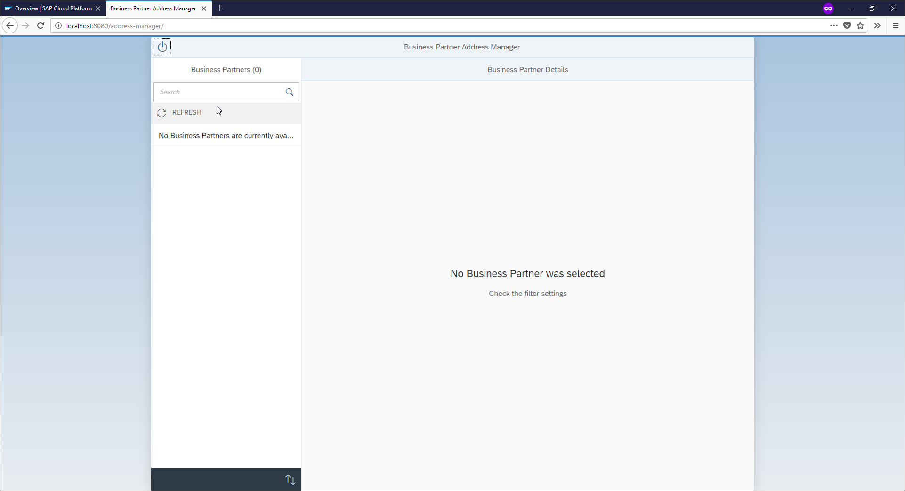

Return to the development environment, where you should now see the test results.

The `testGetAll` test will have failed, because it tests the not yet implemented functionality of retrieving the list of all business partners.
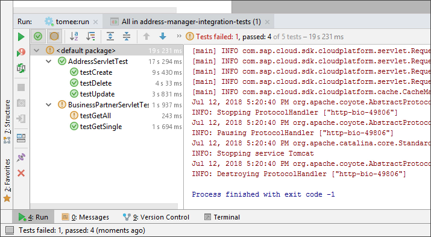

[ACCORDION-END]

[ACCORDION-BEGIN [Step 3: ](Retrieve all business partners)]

In the project pane on the left, expand the folder structure as follows:
`address-manager > application > src > main > java > com.sap.cloud.s4hana.examples.addressmgr.commands`

Open the file `GetAllBusinessPartnersCommand` by double-clicking it.
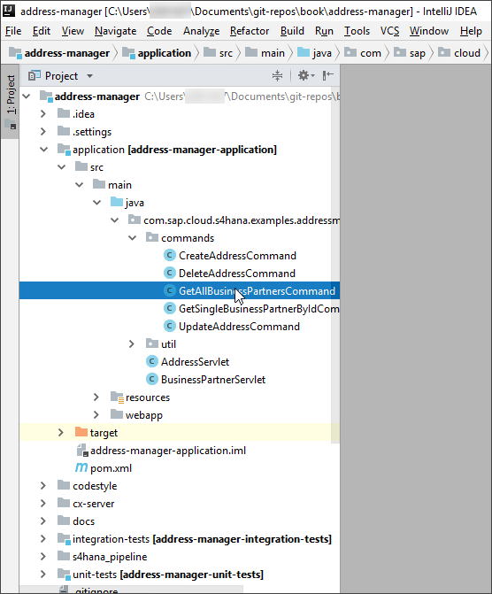

Look out for the method called `runCacheable` and select the text `Collections.emptyList()`.
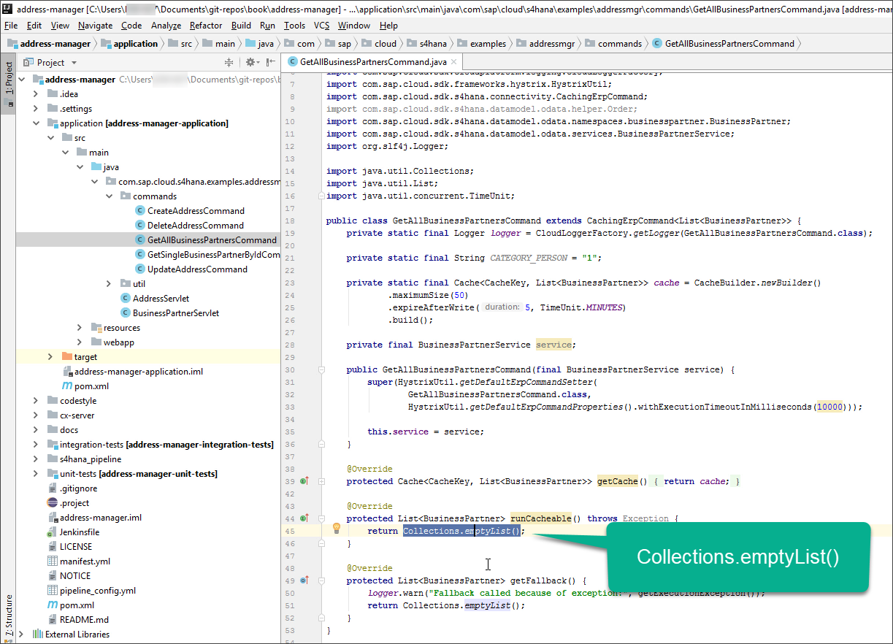

Replace the highlighted text with the following code snippet:
```java
service.getAllBusinessPartner()
    .select(BusinessPartner.BUSINESS_PARTNER,BusinessPartner.LAST_NAME, BusinessPartner.FIRST_NAME)
    .execute()
```
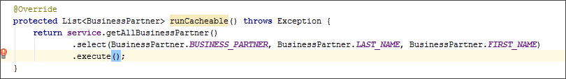

[ACCORDION-END]

[ACCORDION-BEGIN [Step 4: ](Test and re-run the project)]

Re-run the tests by clicking on the green run icon in the left side bar of the bottom pane.
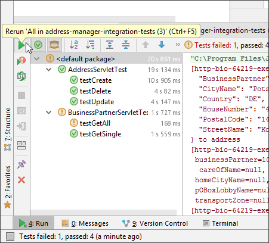

While the tests are running, wait a few seconds for the local server to refresh. Then you can already take a look at the updated app at `http://localhost:8080/address-manager/`.

You will now see the list of business partners on the left, and you can explore the app. Select a business partner to see the details of this business partner.
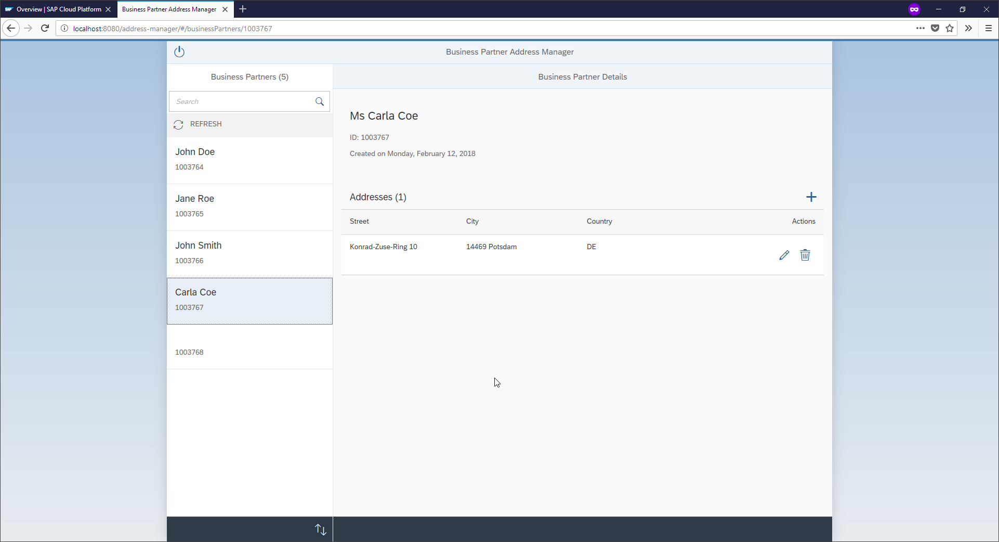

When you return to the development environment, the tests should now have all succeeded, including the previously failing `testGetAll` test.
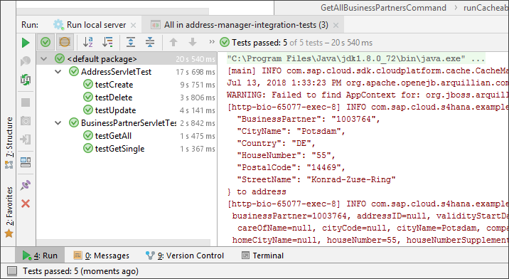

[ACCORDION-END]

[ACCORDION-BEGIN [Step 5: ](Filter for persons)]

If you look closely in the app, there is one business partner for which no first or last name is displayed. This is because this business partner is not a natural person.

Because we only want our app to display persons, we are now going to implement a filter.

In the development environment, position the cursor directly in front of the `.execute()`.
Either copy and paste the following code, or follow the step-by-step instructions below.
```java
.filter(BusinessPartner.BUSINESS_PARTNER_CATEGORY.eq(CATEGORY_PERSON))
```

If you want to experience the flow of using the SAP S/4HANA Cloud SDK, instead of copy-pasting the code above, follow these steps to build up the filter step-by-step, leveraging the suggestions and auto-completion of the development environment.

1. Type `.filter` and hit **Enter** to choose the filter method suggested by the auto-completion.
2. Type `BusinessPartner` and select the first suggestion, continue typing `.CATEGORY` and select `BUSINESS_PARTNER_CATEGORY`.
3. Type `.eq(` and `CATEGORY_PERSON` to arrive at the same state.

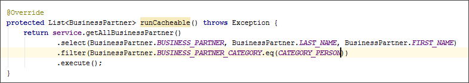

[ACCORDION-END]

[ACCORDION-BEGIN [Step 6: ](Compile and package the app)]

In order to push the application to SAP Cloud Platform, we need to package it.

In the development environment, open the terminal.


Copy and paste the following command into the terminal and execute it by hitting **Enter**.
```
mvn package -pl .\application -am
```

While the command is running, you can already continue with the next step.

[ACCORDION-END]

[ACCORDION-BEGIN [Step 7: ](Create SAP Cloud Platform trial account)]

To later deploy the app to SAP Cloud Platform Cloud Foundry, you need a trial account on SAP Cloud Platform. If you already have an account, you can skip this step.

> You need to have access to your e-mail account.

Visit <https://cloudplatform.sap.com> and click **Start your free trial**.
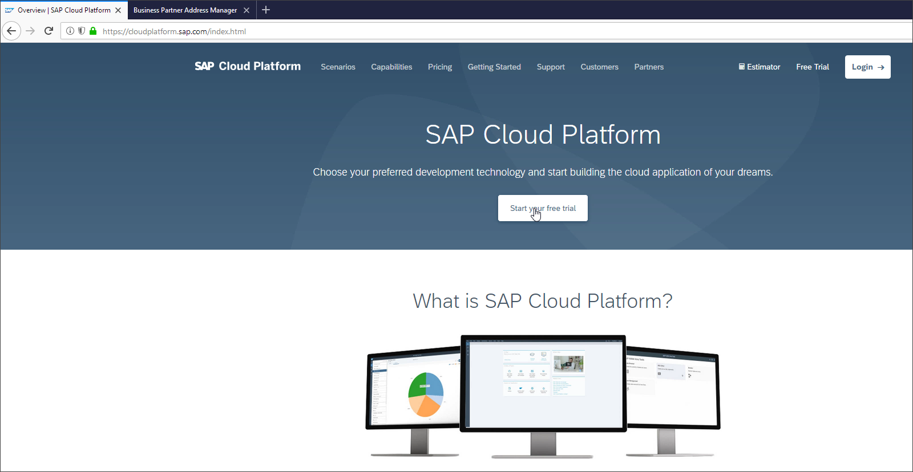

Enter your personal information. Make sure to enter a valid e-mail address so that you can later activate the account.
> **CAUTION**: Choose a password that you do *not* use for any other account.
> You later need to enter the password on the shared laptop.

Click **Submit** to finish the registration.
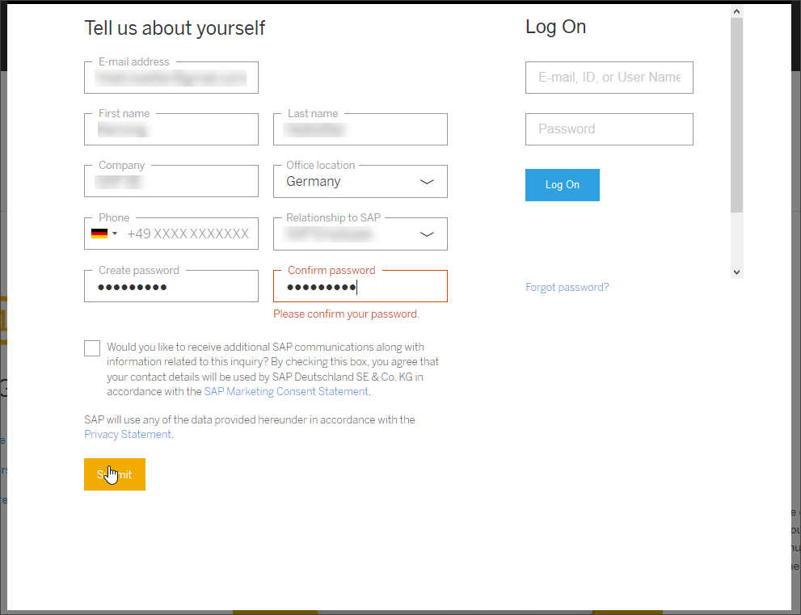

On a separate device like your smartphone, check your e-mail account for a mail from SAP Cloud Platform that contains an activation link. Visit this link to activate your account.


On <https://cloudplatform.sap.com>, click **Login**. You may need to choose a username, which has to be unique, and confirm the terms and conditions.

Afterwards, click **Register**, submit your confirmation for the end user license agreement, and click the button to start your trial.

A second form appears where you need to confirm the terms and conditions and click **Register**.
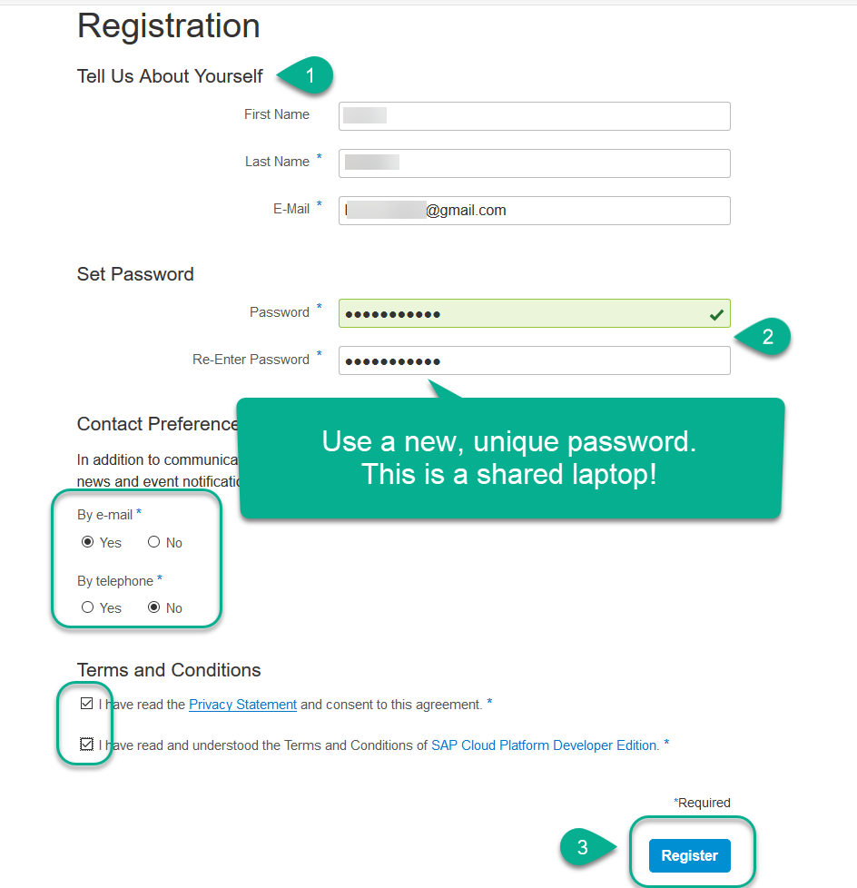

You now see the SAP Cloud Platform cockpit. Click the **Cloud Foundry Trial** tile.


In the dialog, choose **US Central (IA) - GCP** from the **Region** dropdown menu and click **OK**. The creation of the trial account may take a few seconds.
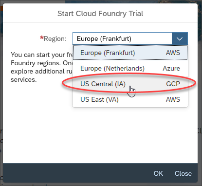
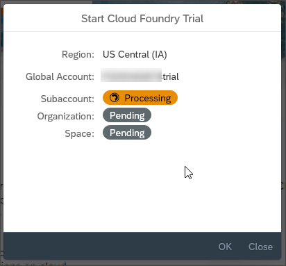

Afterwards, click **Go to Space**.
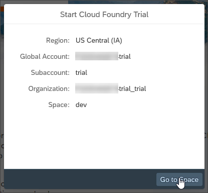

Return to the development environment.

[ACCORDION-END]

[ACCORDION-BEGIN [Step 8: ](Push application to SAP Cloud Platform)]

Look at the terminal of the development environment. The packaging of the application should have finished by now with a success message.
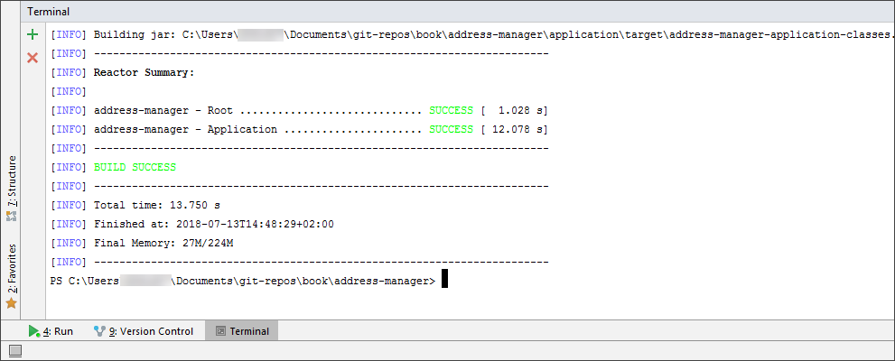

You can now push the packaged application to your Cloud Foundry account on SAP Cloud Platform.

Type `cf login` into the terminal and provide your e-mail address and the password for your SAP Cloud Platform account that you have just created.
You will see that your trial account and space have automatically been targeted.
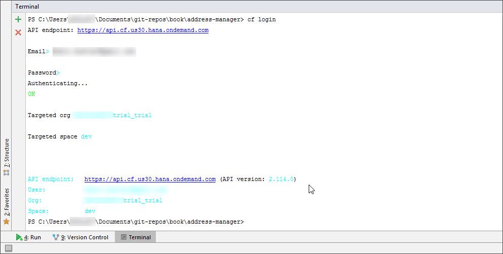

Push the application to your account and space by typing `cf push` into the terminal. This command will create the app on Cloud Foundry and upload the package.


As the command will take one or two minutes, feel free to browse the source code of the application in the development environment in the mean time.

[ACCORDION-END]

[ACCORDION-BEGIN [Step 9: ](Browse source code of application (optional))]

While the application is starting, take a look at the other Java classes in the project, for example:

  - `CreateAddressCommand` to see how easy it is to create business objects in SAP S/4HANA using the SAP S/4HANA Cloud SDK
  - `GetSingleBusinessPartnerByIdCommand` to see a more advanced OData request

Once the `cf push` command has completed, you can continue with the next step.

[ACCORDION-END]

[ACCORDION-BEGIN [Step 10: ](Visit app on SAP Cloud Platform)]

After the `cf push` command has finished, you can see the URL of the newly created application in the output of the command.

Select the URL and copy it to the clipboard.
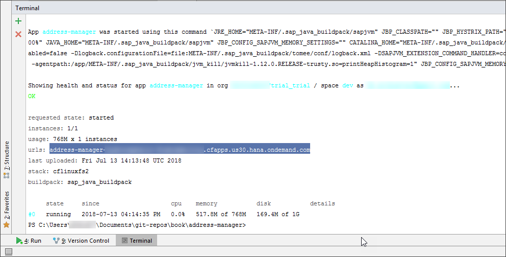

Open the browser and paste the URL that you have just copied. This will display the start page of your application.

Click the link to visit the **Address Manager**.
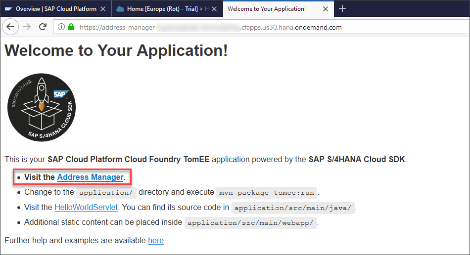

You now see the Address Manager app that was previously launched locally running on SAP Cloud Platform.

If you want to receive your gift, look for the special business partner and note down his address. Present this information to our staff at the booth to redeem your gift.


[ACCORDION-END]

[ACCORDION-BEGIN [Step 11: ](Log out from all accounts)]

This completes the tutorial.

At the end, make sure to log out from your SAP account in the browser and close the browser.

In the terminal of the development environment, type `cf logout` to log out from your SAP Cloud Platform account.

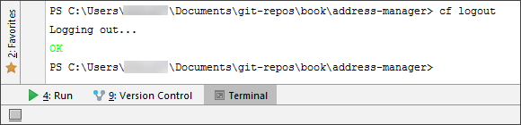

### Clean up
It would be great if you prepared the environment for the next participant that may run this tutorial.

To do so, follow these steps:

  1. Type `clear` + **Enter** in the terminal of the development environment.
  2. In the **Run** tool window on the bottom, close both tabs, that is, the local server and the tests. Click **Terminate** in the dialog window that appears, when closing the local server.
  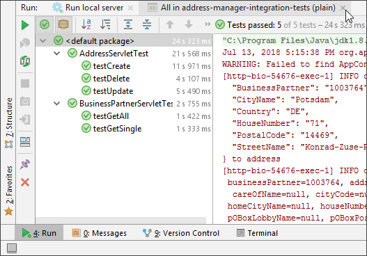
  3. Close all open editor tabs.
  4. In the **Project** structure on the left, click the **Collapse All** icon.
  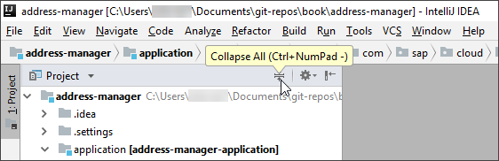

[ACCORDION-END]

---
