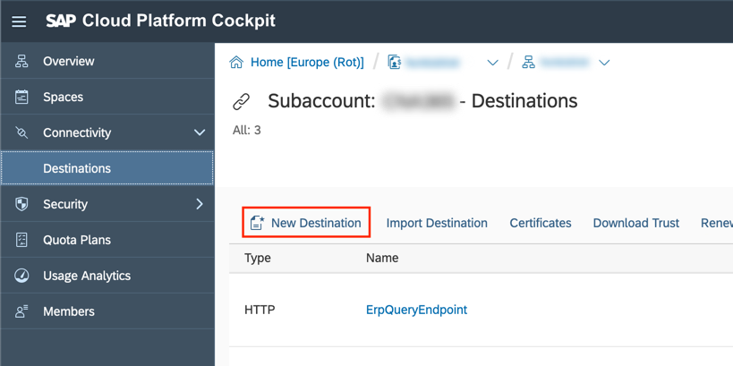

## Details
### You will learn
 - How to deploy your application to Cloud Foundry in SAP Cloud Platform
 - How to configure a destination in the SAP Cloud Platform cockpit
 - How to consume the destination in your application

---

[ACCORDION-BEGIN [Step 1: ](Deploy application to Cloud Foundry)]

Before we can deploy our application, we first need to transpile our TypeScript to JavaScript and assemble our artifact for deployment. The `package.json` already defines two scripts for this purpose: `ci-build` and `ci-package`. `ci-build` takes care of compilation and `ci-package` takes care of assembly.

In your command line, run:

```Shell
npm run ci-build && npm run ci-package
```

>**Note:** We are aware, that the `ci-package` script currently does not work when executed in Windows' CMD. Currently, the easiest workaround is to install a `bash` on your system (by default, `git` for Windows comes with [Git Bash](https://gitforwindows.org/)) and configure npm to execute scripts in that bash. This can be done by executing `npm config script-shell <P:\ath\to\your\bash.exe>`.

In order to deploy our application, we first need to login to `Cloud Foundry` in `SAP Cloud Platform` using the **`cf` CLI**. First we need to set an `API` endpoint. Depending on the region in which you have created your account, choose one of the following `API` endpoints:

 - EU: [https://api.cf.eu10.hana.ondemand.com] (https://api.cf.eu10.hana.ondemand.com)
 - US EAST: [https://api.cf.us10.hana.ondemand.com] (https://api.cf.us10.hana.ondemand.com)

For the rest of this tutorial, we will assume the region to be EU. Enter the following commands in your command line:

```Shell
cf api https://api.cf.eu10.hana.ondemand.com
cf login
```

`cf login` will prompt you for your username and your password. Should you have more then one organization or space, you will also have to select those.

Finally, if you have logged in successfully, you can call `cf push` from the root folder of the project. **`cf` CLI** will automatically pick up the `manifest.yml` of the project.

The file should look like this:

```YAML
applications:
  - name: <YOUR-APPLICATION-NAME>
    path: deployment/
    buildpacks:
      - nodejs_buildpack
    memory: 256M
    command: cd cloud-sdk-starter-app/dist/ && node index.js
```

>**Note:** If the value for name is `cloud-sdk-starter-app`, you probably forgot to call `npm run init -- <YOUR-APPLICATION-NAME>`. This might cause your deployment to fail.

Take a look at the `path` and the `command` attributes. The specified path instructs **`cf` CLI** to upload all the files from the `deployment/` folder. The command specified under the `command` attribute tells the `buildpack` what command to issue to start the application.

When everything works as expected, you should get output that looks something like this:

```Shell
Waiting for app to start...

name:              <YOUR-APPLICATION-NAME>
requested state:   started
routes:            <YOUR-APPLICATION-NAME>.cfapps.eu10.hana.ondemand.com
last uploaded:     Thu 21 Mar 14:05:32 CET 2019
stack:             cflinuxfs3
buildpacks:        nodejs

type:            web
instances:       1/1
memory usage:    256M
start command:   node index.js
     state     since                  cpu    memory        disk           details
#0   running   2019-03-21T13:05:47Z   0.0%   16M of 256M   126.8M of 1G
```

Make sure that the application works correctly by calling the `index` route or the `hello` route. Should the application not work for whatever reason, you can call the following command to access the logs:

```Shell
cf logs <YOUR-APPLICATION-NAME> --recent
```

[DONE]
[ACCORDION-END]

[ACCORDION-BEGIN [Step 2: ](Deploy the Business Partner mock server (optional))]

>**Note:** If you have access to an SAP S/4HANA Cloud system, you can skip this step.

If you have used the [`OData` Mock Service for the Business Partner `API`](https://github.com/SAP/cloud-s4-sdk-book/tree/mock-server) in the previous tutorial, you will now also have to deploy it to `Cloud Foundry in SAP Cloud Platform`. Navigate to the mock server's root folder, that already contains a `manifest.yml` and run `cf push`.

When the server has been pushed successfully, **`cf` CLI** will output the route where the server can be reached.

Copy this route, as we will need it in the next step.

[DONE]
[ACCORDION-END]

[ACCORDION-BEGIN [Step 3: ](Configure destination)]

Now that we have deployed our application, we need to configure a destination in the Cloud Cockpit so that it can be used by our application.

Start by opening the [Cloud Cockpit](https://account.hana.ondemand.com) in your browser and logging in.

Next, navigate to your respective subaccount (in case of a trial account it should be called **trial**). In the menu bar on the left, there should be a section **Connectivity** with an entry called **Destinations**. Click **Destinations**. On the page that opens, click **New Destination** and fill in the details below.



For **Name**, choose a name that describes your system. For the tutorial, we will go with **`BusinessPartnerService`**.

If you use the Business Partner mock server, enter for **URL** the URL that you have saved from the previous step and use **`NoAuthentication`** for **Authentication**. If you use an SAP S/4HANA Cloud system, enter the systems URL in the **URL** field and choose **`BasicAuthentication`** as authentication type. This will make the fields **User** and **Password** appear. Enter here the credentials of a technical user for your SAP S/4HANA Cloud system.

[DONE]
[ACCORDION-END]

[ACCORDION-BEGIN [Step 4: ](Bind destination service)]

In order to allow the application to use the destination you have just configured, you will need to bind an instance of the destination service and an instance of the `XSUAA service` to your application.

To create an instance of the destination service, execute the following command in your terminal:

```Shell
cf create-service destination lite my-destination
```

This tells `Cloud Foundry in SAP Cloud Platform` to create an instance of the destination service with service plan **lite** and make it accessible under the name **my-destination**. We can now use the name to bind this service to our application. To do this, open your `manifest.yml` and add a section called `services`, under which you can then add the name of the just created service.

The resulting `manifest.yml` should look like this:

```YAML
applications:
  - name: <YOUR-APPLICATION-NAME>
    path: dist/
    buildpacks:
      - nodejs_buildpack
    memory: 256M
    command: node index.js
    services:
      - my-destination
```

Secondly, we need an instance of the `XSUAA service`. The `XSUAA service` is responsible for issuing access tokens that are necessary to talk to other services, like the destination service. For this service, we will need a bit of extra configuration in the form of a configuration file. Create a file called `xs-security.json` with the following content:

```JSON
{
  "xsappname": "<YOUR-APPLICATION-NAME>",
  "tenant-mode": "shared"
}
```

The value for `xsappname` again has to be unique across the whole of `Cloud Foundry in SAP Cloud Platform`, so make sure to choose a unique name or prefix.

Now, execute the following command:

```Shell
cf create-service xsuaa application my-xsuaa -c xs-security.json
```

And, as before, add the newly created services to the services section of your `manifest.yml`.

The final `manifest.yml` should look like this:

```YAML
applications:
  - name: <YOUR-APPLICATION-NAME>
    path: dist/
    buildpacks:
      - nodejs_buildpack
    memory: 256M
    command: node index.js
    services:
      - my-destination
      - my-xsuaa
```

Finally, we need to adapt the `getAllBusinessPartners` function in `business-partner-route.ts` to use the destination defined in the Cloud Platform Cockpit.

The new function now looks like this:

```JavaScript / TypeScript
function getAllBusinessPartners(): Promise<BusinessPartner[]> {
  return BusinessPartner.requestBuilder()
    .getAll()
    .execute({
      destinationName: 'BusinessPartnerService'
    });
}
```

We replaced the parameter of `execute` with an object whose key `destinationName` refers to the name of the destination we defined earlier. If you chose a different name than `BusinessPartnerService`, make sure to use it here accordingly.

Now we can recompile and redeploy the application. In your command line, run `npm run ci-build && npm run ci-package && cf push`.

When you now call the `/business-partners` route of your app, the Business Partners will be retrieved from the defined destination!

[DONE]
[ACCORDION-END]

[ACCORDION-BEGIN [Step 6: ](Test yourself)]

[VALIDATE_1]

[ACCORDION-END]

[ACCORDION-BEGIN [Step 7: ](Test yourself)]

[VALIDATE_2]

[ACCORDION-END]

[ACCORDION-BEGIN [Step 8: ](Test yourself)]

[VALIDATE_3]

[ACCORDION-END]

---
