# Create your First Analytic Application
<!-- description --> Build your first application with SAP Analytics Cloud Analytics Designer

<!-- ## Prerequisites
 - Prerequisite 1
 - Prerequisite 2 -->

## You will learn
  - How to add a widget to an application
  - How to implement some logic in an application
  - How to use the script event

## Intro
<!-- Add additional information: Background information, longer prerequisites -->

---

### Create the Application


Analytic applications are like stories in the way they present information to users but provide designers with much more flexibility in terms of specialized widgets and scripting capabilities.

First, click on Analytics Application in the left navigation menu.

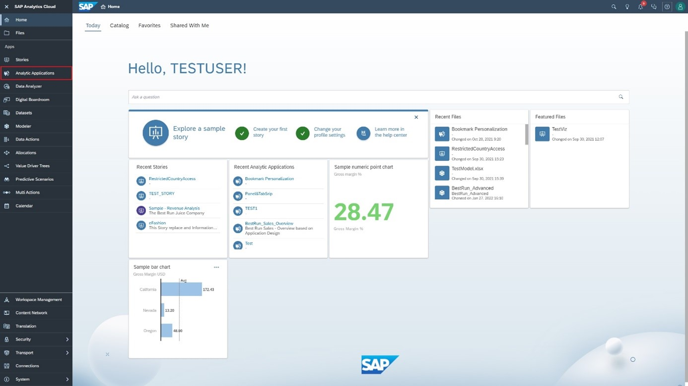

On the home page of the Analytics Application, click on **Create New**.

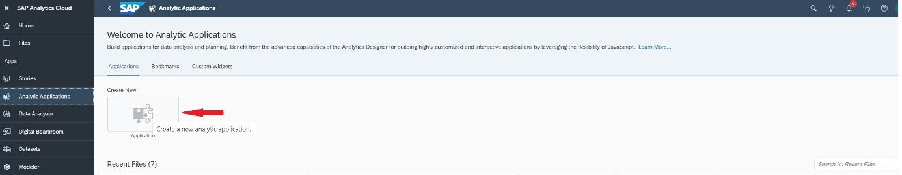

Unlike a story, which can have multiple pages, an app comprises of a single canvas where all content is configured. However, to this canvas, you can add various pop-ups. A Popup is usually a small window on top of the main page of the application. It communicates information to the user or prompts them for inputs. For instance, a Popup can show a description of the application, and another Popup can ask the user to perform configurations. Because the popup acts as a container widget, you can put any other widget into the popup, such as a table, button, or checkbox.

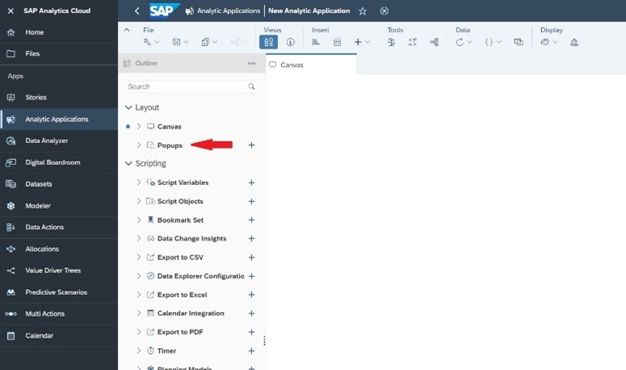

You can also play around with the visibility of widgets based on specific conditions, so you can layer them on top of each other. In addition to the canvas, you can use the **Outline panel** to help select, manage, and configure widgets and work with scripts and services. The **Info Panel** to troubleshoot the app using the Errors and Reference List tabs. We'll show you how to do each with examples below.


### Add Widgets in the Application


You can add multiple widgets to the app such as charts, tables, and other objects that are also available in stories, along with a variety of analytic application-specific controls.

In order to retrieve the right model, go to **Content Network / Samples** in the side Navigation Bar and import the **Analytics Designer** Sample Content.

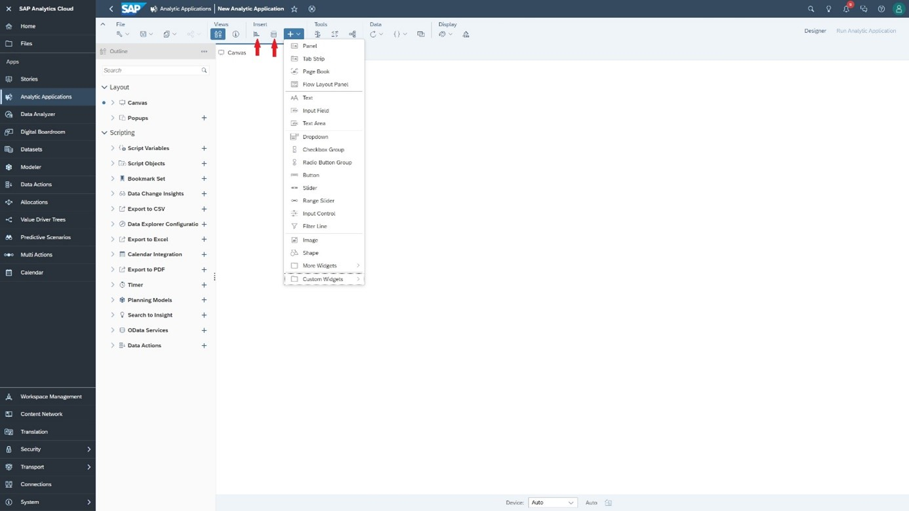

As with stories, the main way to display data in apps is by using charts and tables. You should now click on each to add both a chart and table.

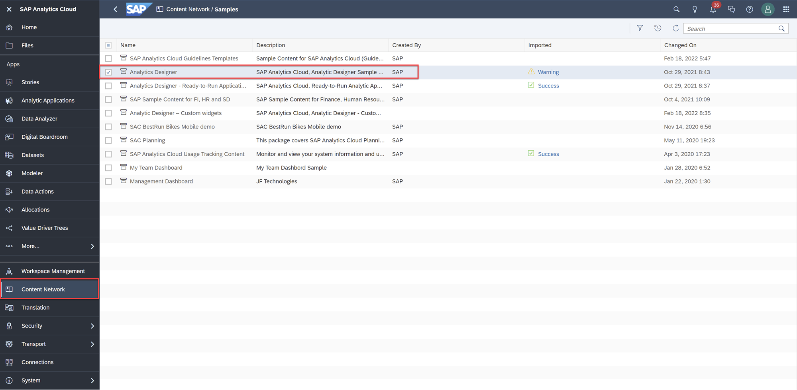

Now go back to the analytic application and create a chart and table, then select `BestRun_Advanced` as the model for both.

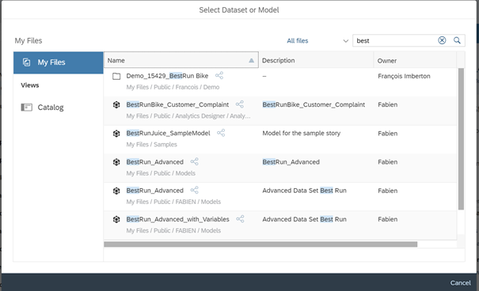

The Designer panel then opens automatically so you can configure and style the widget.  

In Builder mode, you can define the measures and dimensions you want to display. Here, let's select `Quality Sold` and `Gross Margin` as the Measures and `Location` as the Dimension for both the bar chart and table you created.  

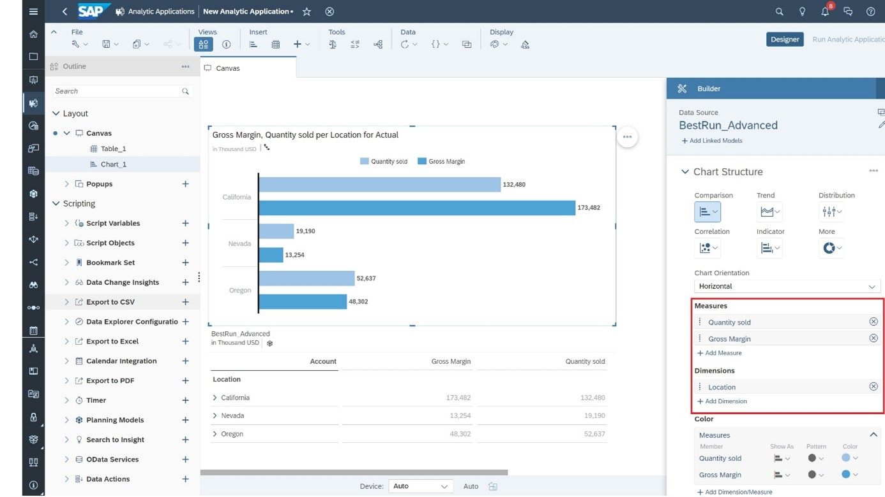

Now that the application contains data, let's add other controls and scripts to define how and when certain types of content display. Now save the application with the name `FirstApplication`.


### Add Scripting in the Application


You can add logic in the application to display either the chart or table. Add a button at the top of the canvas and name it "Show Table".

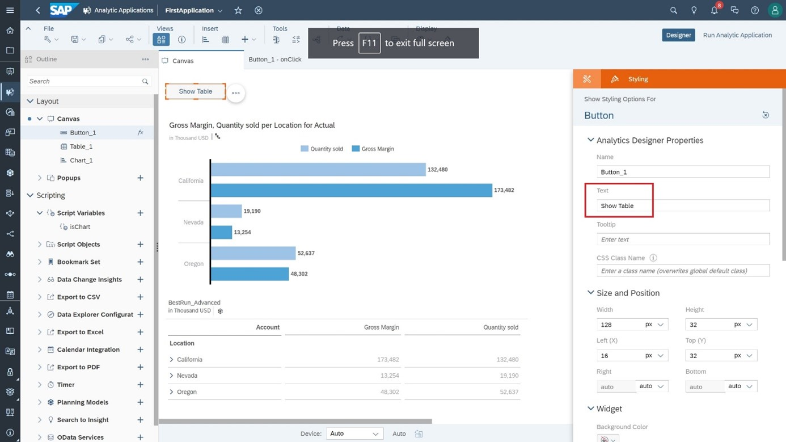

Create a script variable called `isChart` and set the type to `Boolean` and the default value to `false`.

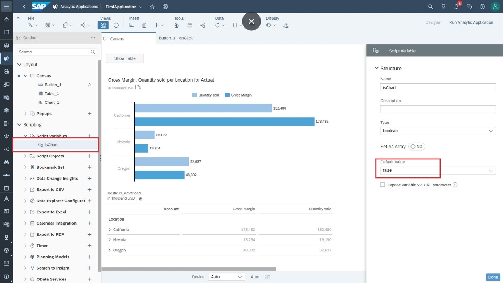

Add the following code to the `onClick` event of the button.


``` JavaScript
// function onClick() : void
if (isChart === true) {
  Chart_1.setVisible(true);
  Table_1.setVisible(false);
  isChart = false;
  Button_1.setText("Show Table");
} else {
  Chart_1.setVisible(false);
  Table_1.setVisible(true);
  isChart = true;
  Button_1.setText("Show Chart");
}
```

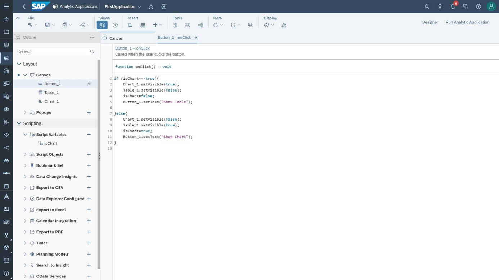

When you run the application, you only want to see the chart. To hide the table at startup time, uncheck the option "Show this item at view time".

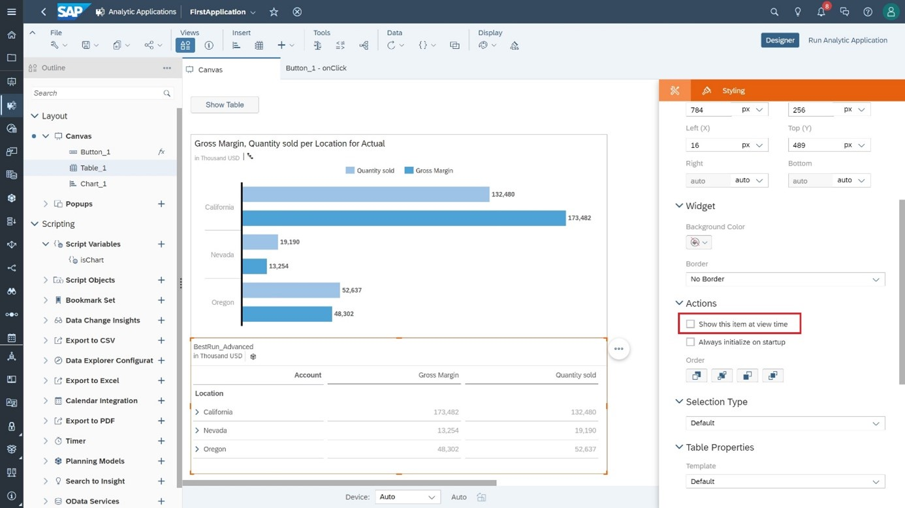

Run the application and click the button multiple times. The table or the chart are displayed alternatively.

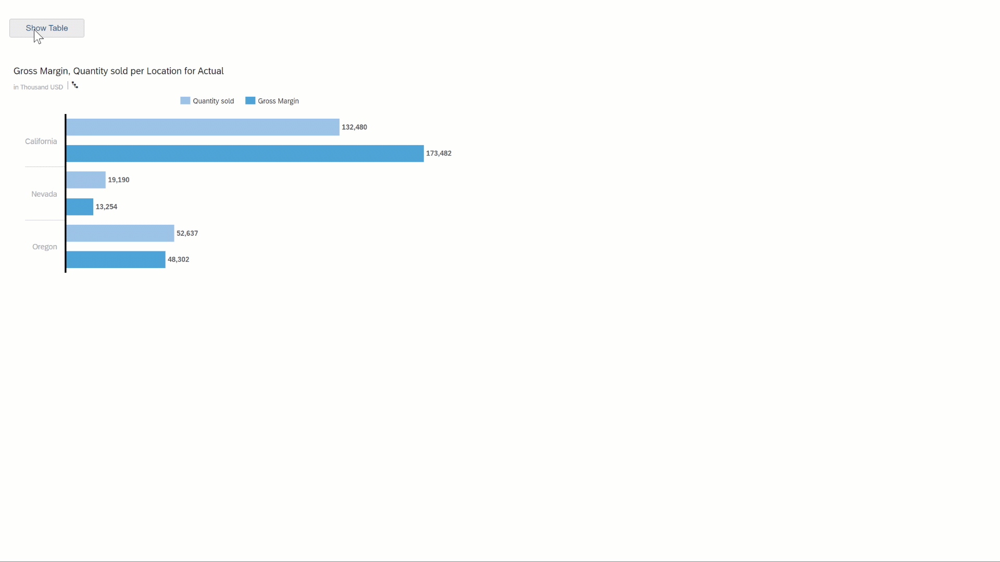


### Test Yourself


---
