# Set the Visibility of Objects in Applications
<!-- description --> Display and hide objects at runtime

<!-- ## Prerequisites
 - Prerequisite 1
 - Prerequisite 2 -->

## You will learn
  - How to display/hide objects at design time
  - How to display/hide objects at run time

## Intro
<!-- Add additional information: Background information, longer prerequisites -->

---

### Set Visible and Invisible Objects at Design Time


Go into the content network and select the **Samples** category

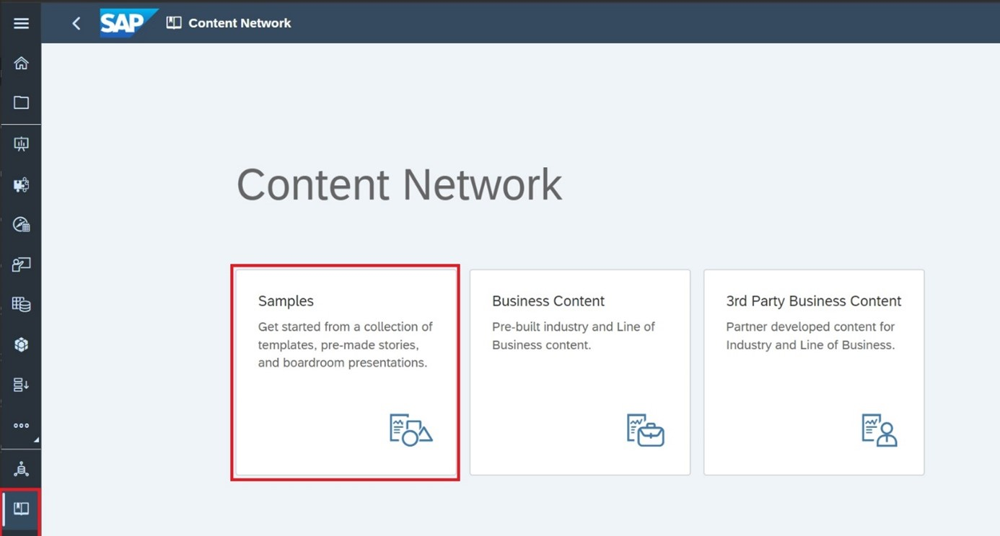

Click the **Analytics Designer** package

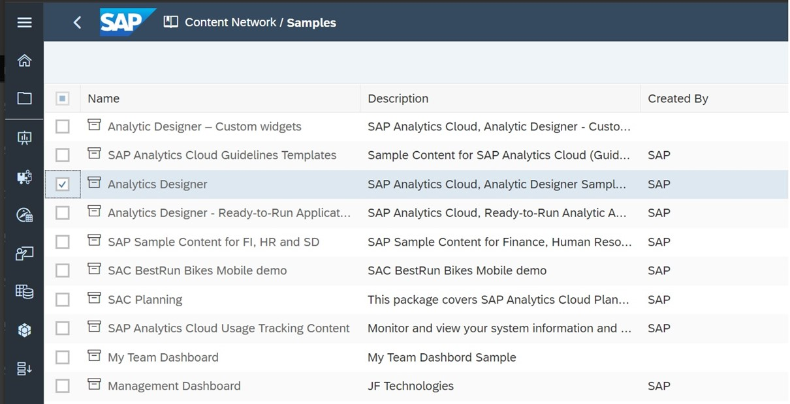

Click **Import**

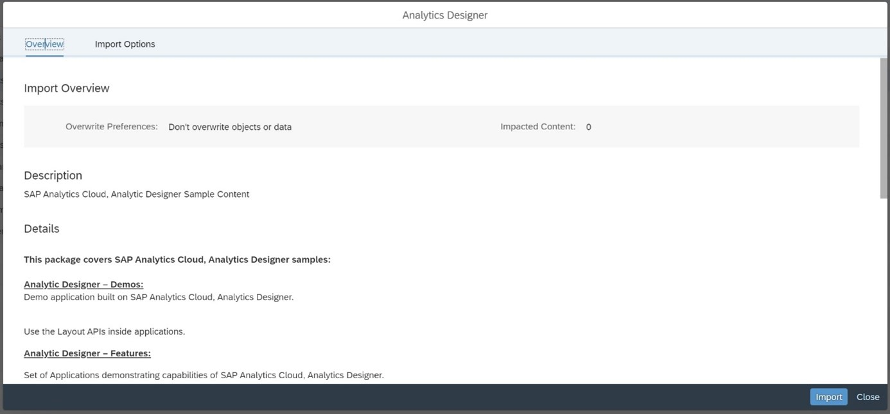

The content of the package is deployed on the Sap Analytics Cloud tenant. A new folder called **Analytic Designer** is created under the **Public** directory.

Go to "Analytics Designer/Analytics Designer – Features" and select **Feature - Switch between table and chart display**.

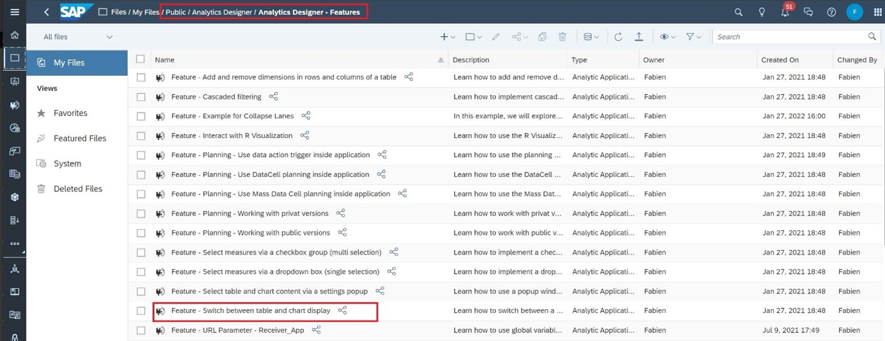

Once you have content in the application, you can choose when and how to display objects by adding scripts. In this example, let's configure the app to show either the chart or table, rather than both, as seen in the previous table. In the Designer panel, ensure that the table is set to be visible at view time.

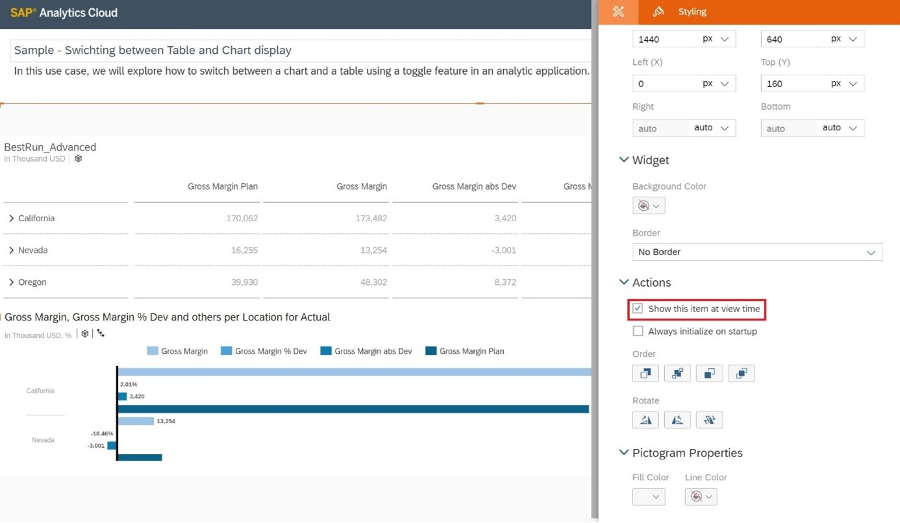

Make sure that the bar chart is NOT set to be visible at view time.

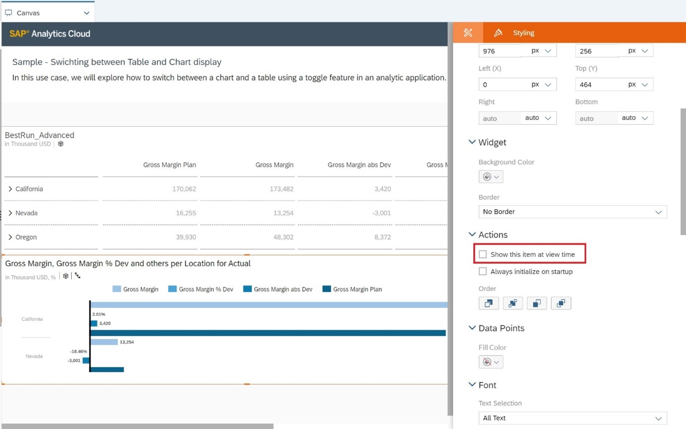


### Add Images


Next, you will add images that will act as buttons to toggle between the table and chart. You will import the files, add them to the canvas, and rename them something more meaningful in the Outline panel.

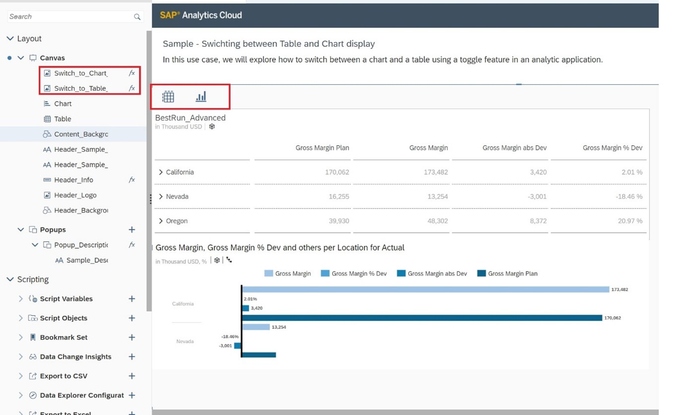


### Add Scripting to the Buttons


Now you can add scripting to the images, which you can access from the context menu for the image or in the Outline panel. A new tab opens where you can build a script to define what happens when the `onClick` event is triggered for the image. You can get assistance by pressing Ctrl + Space, which brings up a list of objects and methods we can use to build our statements. As we type, the list is filtered to match our entries. In this example, you will start by adding a statement to set the chart as visible when the image is clicked. Select the chart object, add a period, open the content assistance again to select the `setVisible` function, set the Boolean return type to True, and end the statement with a semi-colon. Next, you will add another statement to set the table as invisible using the same syntax.

``` JavaScript
// function onClick() : void

Chart.setVisible(true);
Table.setVisible(false);

Switch_to_Table_display.setVisible(true);
Switch_to_Chart_display.setVisible(false);
```

You will also add statements to change the visibility of the images themselves so that they will behave like a toggle. Here, you need to make the Switch to Chart image invisible and the Switch to Table image visible.

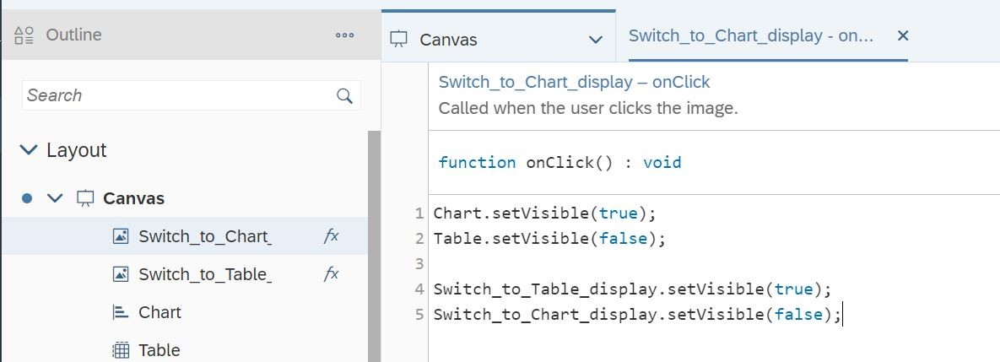

Now you will do the same thing in reverse for the Switch to Table image. Finally, set the image so that it is not visible at view time, like the chart.

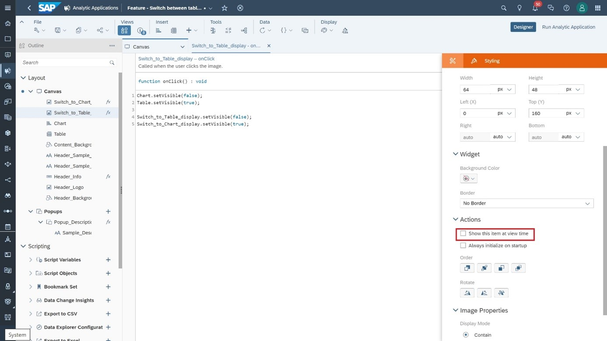


### Arrange Widgets


Now you can arrange the objects so they are layered on top of each other. Keep in mind that when objects are hidden under other objects on the canvas, they can still be selected in the Outline panel.

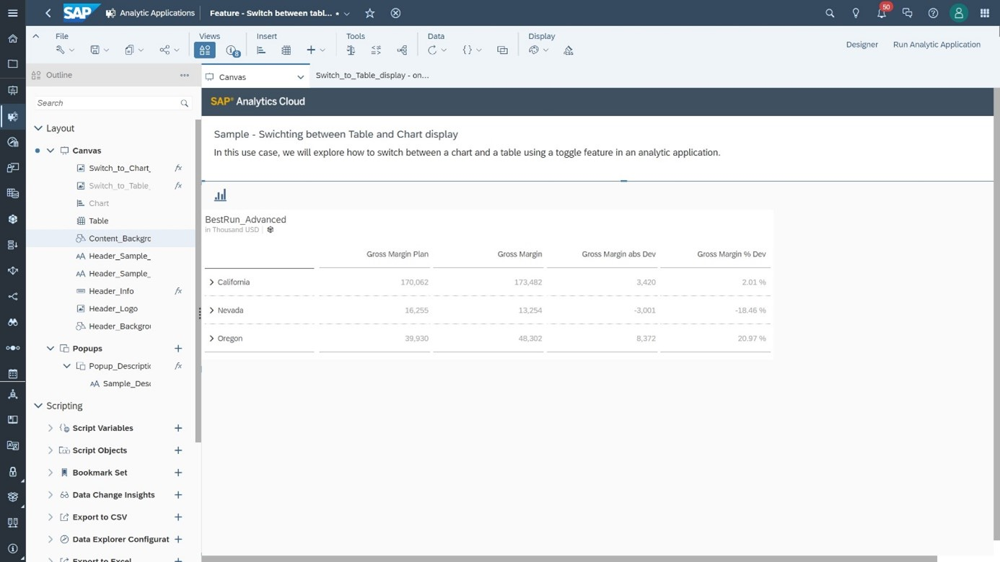


### Run the Application


Now save your changes and run the application. Initially, the Switch to Chart image and the table are visible.

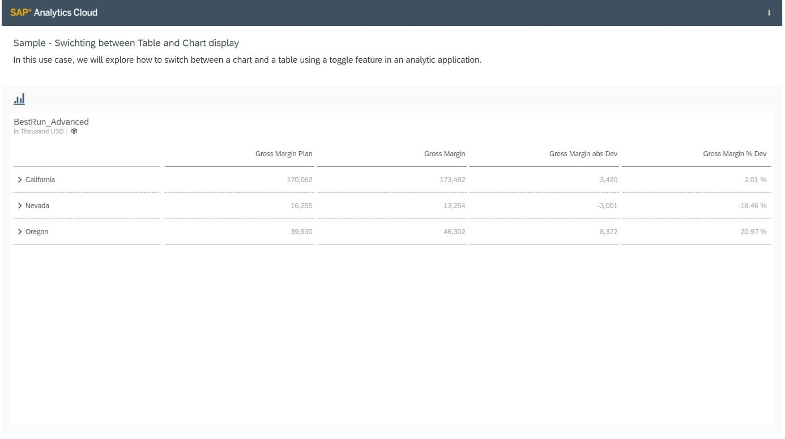

If you click the image, these objects disappear and the Switch to Table image and the chart display.

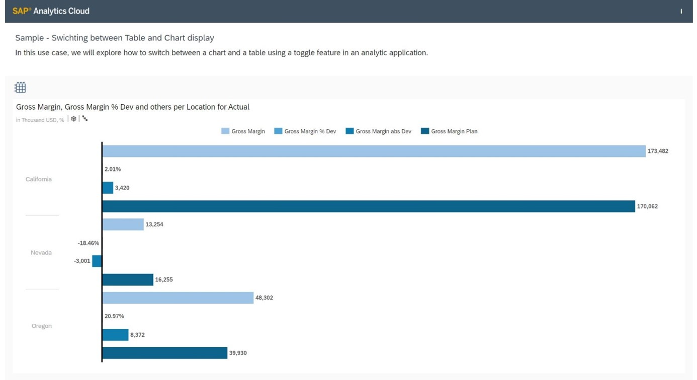


### Test Yourself


---
