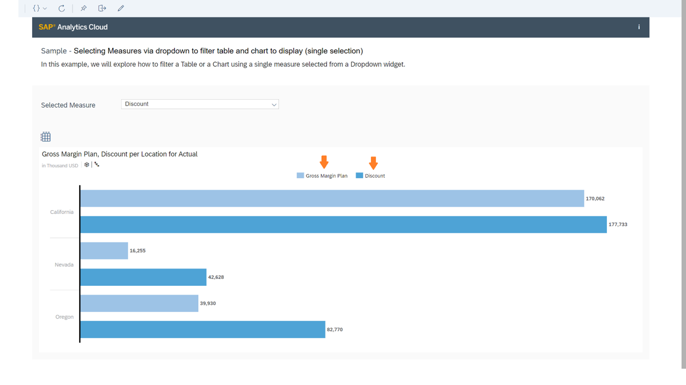

# Set Up Single Measure Filters in an Application
<!-- description --> Use the Dropdown widget to filter on a measure in a table at runtime

<!-- ## Prerequisites
 - Prerequisite 1
 - Prerequisite 2 -->

## You will learn
  - How to use a global variable script
  - How to use a script object
  - How to use the "On Initialization" event
  - How to filter dimensions with the script API

## Intro
<!-- Add additional information: Background information, longer prerequisites -->

---

### Add a Text and a Dropdown Widget


You can use dropdown widgets in our apps to change the measure displayed in tables and charts. In this example, you will load all the measures from our dataset into a dropdown so that when you select a measure, both the table and chart that have already been set up in our app, will change to reflect the selection.

Start by adding a label to prompt users to select a measure. Next, you will add a dropdown widget to the canvas. You will rename the widget in the Layout panel to `Dropdown_Measures`.


### Add Script Variable


Now you will add a script variable, which is a global variable that can be used in multiple locations in the app. This script variable will let you access the measure selected from the dropdown. Call the variable `CurrentMeasureFilterSelection` and set the default value to the Gross Margin Plan measure.

**Technical Name of the Measure**:  `[Account_BestRunJ_sold].[parentId].&[Gross_MarginActual]`


### Add Script Object


Next, create a script object to define what will happen when a measure is selected. Then, rename the folder `Utils` and the function `setMeasureFilter`. We will also add an argument to the function called `selectedId`. We will leave the type as the default of String. Now we can write the script for the function.


You will also add an argument to the function called `selectedId`. Leave the type as the default of String.


A new tab opens where you can build a script to define what happens when the function is called. You can get assistance by pressing Ctrl + Space, which brings up a list of objects and methods we can use to build our statements. In this example, start by adding a statement to remove any dimensions already set in the table. Select the table object, add a period, open the content assistance again to select the `getDataSource` function, add another period and the `removeDimensionFilter` function, specify the account dimension from the data source, and end the statement with a semi-colon.

``` JavaScript
Table.getDataSource().removeDimensionFilter("Account_BestRunJ_sold");
if (CurrentMeasureFilterSelection !== "") {
  Chart.removeMeasure(CurrentMeasureFilterSelection, Feed.ValueAxis);
}
```

Finally, add a statement to replace the measures currently displayed in the chart with the default selection, then replace the measure for the table with the one selected in the dropdown and captured as the `selectedId` argument, and add the same measure to the chart.

``` JavaScript
Table.getDataSource().setDimensionFilter("Account_BestRunJ_sold", selectedId);
Chart.addMeasure(selectedId, Feed.ValueAxis);
```

The result will be this.


### Add Script to the Dropdown Widget


Now, you will define how to pass the selected measure to the `setMeasureFilter` function through the `onSelect` event of the dropdown widget. Add a script to get the selected value of the dropdown and pass it to the `setMeasureFilter` as a parameter.

``` JavaScript
Utils.setMeasureFilter(Dropdown_Measures.getSelectedKey());
```


### Add Script to the OnInitialization Event


Finally, you will define what happens when the application is first run through the `onInitialization` event of the canvas itself. When the application initializes, load all the available measures of the table into the dropdown, set the selected key to the first measure in that list, and then set the measure filter to the same first measure.

``` JavaScript
// function onInitialization() : void

var measures = Table.getDataSource().getMeasures();

var selectedKey = "";

if (measures.length > 0) {
  for (var i = 0; i < measures.length; i++) {
    // Measure
    Dropdown_Measures.addItem(measures[i].id,measures[i].description);
    if (selectedKey === "" && i === 0) {
      selectedKey === measures[i].id;
      Dropdown_Measures.setSelectedKey(selectedKey);
      console.log(["selectedKey ", selectedKey]);
    }
    console.log(["CurrentMeasure ", measures[i]]);
  }
}

Utils.setMeasureFilter(selectedKey);
```


### Run the Application


Now save your changes and run the application. Here in the table, the original measures have been removed and replaced with the default Gross Margin Plan measure.


If you select a different measure (Discount), the table updates accordingly.


If you switch to the chart, you can see that both the default measure and the newly selected measure display.




### Test Yourself


---
