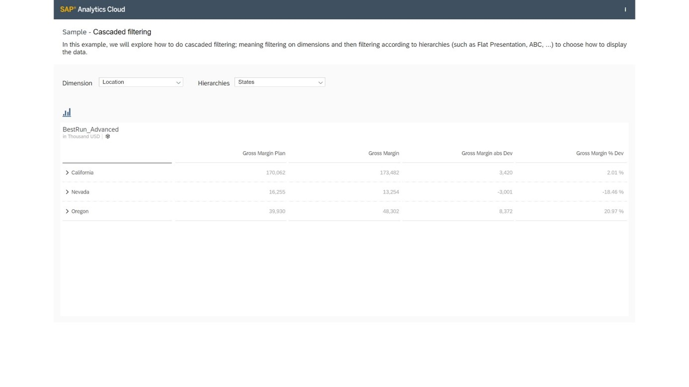

# Set Up Cascading Filters in Applications
<!-- description --> Use dropdown widgets to implement cascading filters

<!-- ## Prerequisites
 - Prerequisite 1
 - Prerequisite 2 -->

## You will learn
  - How to create cascading filters
  - How to use the `getHierarchy() / setHierarchy()` API
  - How to use a global variable script
  - How to use widget events

## Intro
<!-- Add additional information: Background information, longer prerequisites -->

---

### Add Dropdown Widgets


You can set up combinations of dropdown, radio button, and checkbox group widgets to work together in our apps as cascading filters, meaning that the user's selection in the one widget determines the available options in another.

In this example, you will set up two dropdowns. The first will determine which dimension will be visible in the table and chart. Some of these dimensions have hierarchies associated with them, so the second dropdown will determine the hierarchical format in which the selected dimension will display.


Start by adding a label to prompt users to select a dimension.


Now resize, reposition, and rename the text object. Next, add a dropdown widget to the canvas to select the dimension to display in the table and chart.


For the dimension dropdown, we will add four dimensions: `Location`, `Product`, `Store`, and `Sales Manager`.


### Add Script Variable


Now you will add a script variable, which is a global variable that can be used in multiple locations in the app.

This script variable will let us access the dimension selected from the dropdown. You will call the variable `CurrentDimension` and set the default value to the `Location` dimension.


### Add a Script to the Hierarchy Dropdown


Now we will define what happens when a value is selected from the cascading filters. We will start with the Hierarchy dropdown. A new tab opens where we can build a script to define what happens when the function is called.

> You can get assistance by pressing Ctrl + Space, which brings up a list of objects and methods we can use to build our statements.

In this example, we will start by declaring a variable, add an equal sign to initialize it, select the Hierarchy dropdown, add a period, use the content assistance to select the `getSelectedKey` function, and end the statement with a semi-colon. Note that yellow displays here to indicate that a variable has been declared but not yet used.

``` JavaScript
// function onSelect() : void
var sel = Dropdown_Hierarchies.getSelectedKey();
```


Now we will add statements to set the hierarchy for the table and the chart.

``` JavaScript
// function onSelect() : void
var sel = Dropdown_Hierarchies.getSelectedKey();

// set hierarchy for table  
Table.getDataSource().setHierarchy(CurrentDimension, sel);

// set hierarchy for Chart  
Chart.getDataSource().setHierarchy(CurrentDimension, sel);

```


### Add a Script to the Dimension Dropdown


Now, you will edit the script for the Dimension dropdown. Here, you will declare a variable and use it to store the selected dimension from the dropdown, remove all the dimensions from the table and chart, and replace them with the selected dimension. Then, get all the hierarchies that are available for that selected dimension and remove any hierarchies in the Hierarchy dropdown.

``` JavaScript
// function onSelect() : void
var sel = Dropdown_Hierarchies.getSelectedKey();

// Table  
Table.removeDimension(CurrentDimension);
Table.addDimensionToRows(sel);

// Chart  
Chart.removeDimension(CurrentDimension, Feed.CategoryAxis);
Chart.addDimension(sel, Feed.CategoryAxis);

// write filter information into the browser console
console.log(['CurrentDimension: ', CurrentDimension]);
console.log(['Selection: ', sel]);

// save the current selection (dimension) into a global variable
CurrentDimension = sel;

// get hierarchies from the current dimension
var hierarchies = Table.getDataSource().getHierarchies(CurrentDimension);
var flag = true;

// remove all current items from the Dropdown_Hierarchies
Dropdown_Hierarchies.removeAllItems();
```


Then, loop over the available hierarchies for this selected dimension, set flat presentation as the default hierarchy, and filter the table and chart with the selected dimension.

To get the hierarchy id `@FlatHierarchy` we use the following code
```
var hierarchies = Table.getDataSource().getHierarchies(CurrentDimension);
for (var i = 0; i < hierarchies.length; i++) {
  console.log(hierarchies[i].id);
}

```

``` JavaScript
// loop
for (var i = 0; i < hierarchies.length; i++) {
  if (hierarchies[i].id === '@FlatHierarchy') {
    Dropdown_Hierarchies.addItem(hierarchies[i].id, 'Flat Presentation');
  } else {
    Dropdown_Hierarchies.addItem(hierarchies[i].id, hierarchies[i].description);
    if (flag === true) {
      var hierarchy = hierarchies[i].id;
      flag = false;
    }
  }
}

// write hierarchy information to browser console
console.log(['Hierarchy: ', hierarchy]);
console.log(['Current Dimension ', CurrentDimension]);

// set flat Hierarchies as Default
Dropdown_Hierarchies.setSelectedKey('@FlatHierarchy');

// Table  
Table.getDataSource().setHierarchy(CurrentDimension, '@FlatHierarchy');

// Chart  
Chart.getDataSource().setHierarchy(CurrentDimension, '@FlatHierarchy');
```


### Add a Script to the "OnInitialization" Event


Finally, you will define what happens when the application is first run through the `onInitialization` event of the canvas itself. Load all the available hierarchies of the dimensions and set flat presentation as the default.

``` JavaScript
// function onInitialization() : void

// get hierarchies from the current dimension
var hierarchies = Table.getDataSource().getHierarchies(CurrentDimension);
var flag = true;

// loop
for (var i = 0; i < hierarchies.length; i++) {
  if (hierarchies[i].id === '@FlatHierarchy') {
    Dropdown_Hierarchies.addItem(hierarchies[i].id, 'Flat Presentation');
  } else {
    Dropdown_Hierarchies.addItem(hierarchies[i].id, hierarchies[i].description);
    if (flag === true) {
      var hierarchy = hierarchies[i].id;
      flag = false;
    }
  }
}

// write hierarchy information to browser console
console.log(['Hierarchy: ', hierarchy]);
console.log(['Current Dimension ', CurrentDimension]);

// set flat Hierarchies as Default
Dropdown_Hierarchies.setSelectedKey('@FlatHierarchy');

// Table  
Table.getDataSource().setHierarchy(CurrentDimension, '@FlatHierarchy');

// Chart  
Chart.getDataSource().setHierarchy(CurrentDimension, '@FlatHierarchy');
```


### Run the Application


Now we will save our changes and run the application.


If we keep the dimension as Location but change the hierarchy from the default flat presentation to States, the table changes to reflect the hierarchy in drill-able format.



If we change the dimension to Product, we can see that a different set of hierarchies is available.


If we switch to the chart, we can see that the selected dimension and hierarchy format are displayed here too.


### Test Yourself


---
