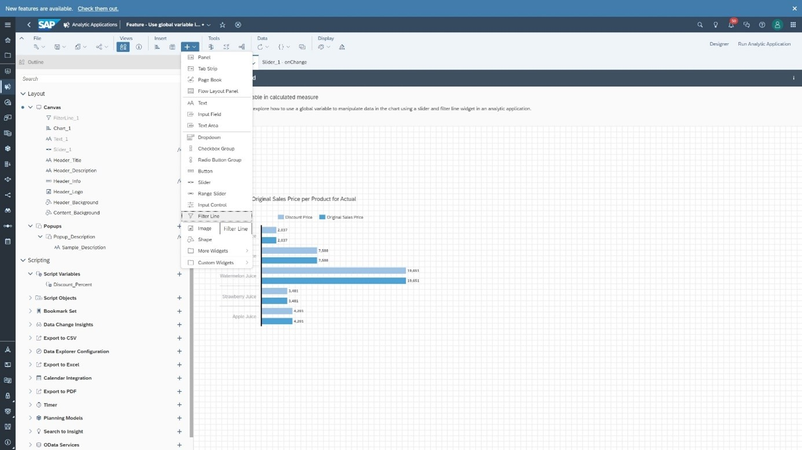
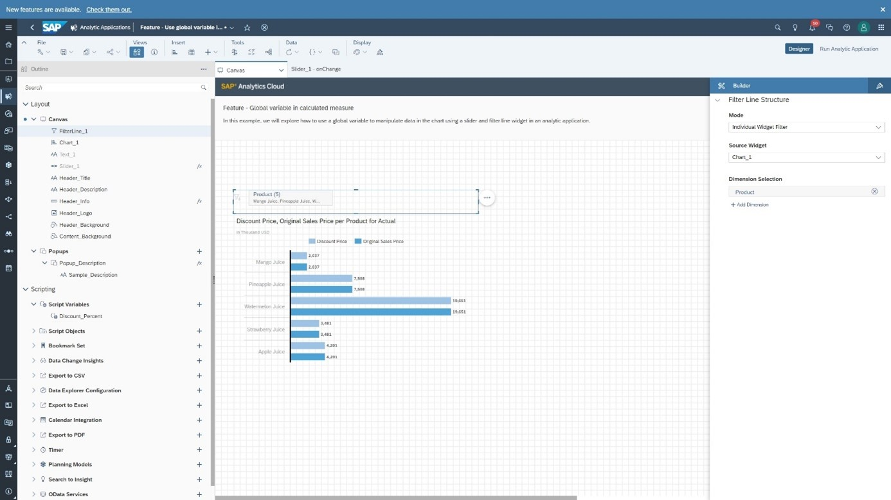
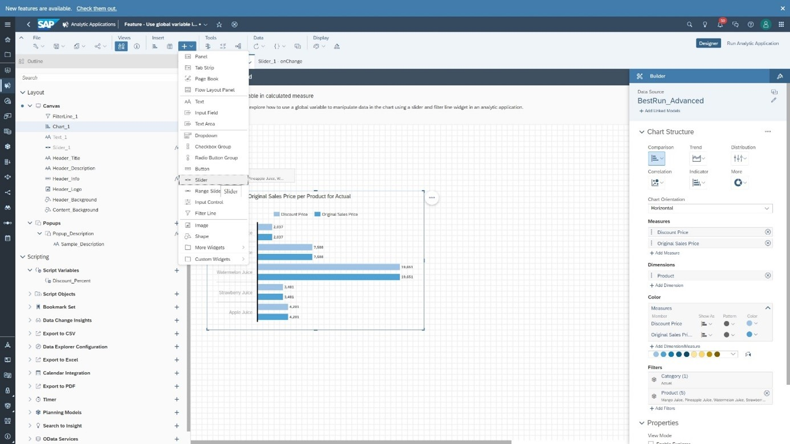
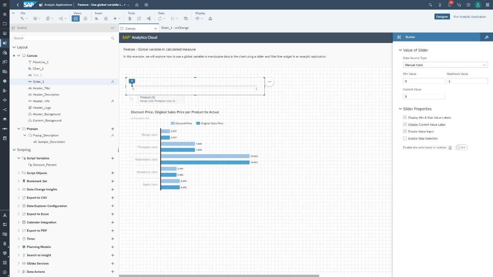
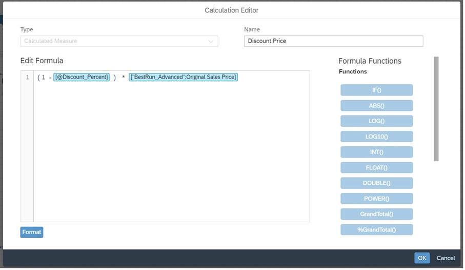
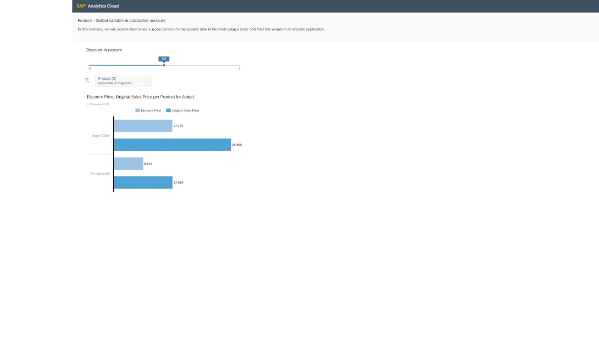

# Use a Global Variable in a Calculated Measure
<!-- description --> Create a global variable and use it in a calculated measure

<!-- ## Prerequisites
 - Prerequisite 1
 - Prerequisite 2 -->

## You will learn
  - How to use a slider widget
  - How to use a filter line widget
  - How to create a global variable
  - How to use a global variable in a calculated measure

## Intro
<!-- Add additional information: Background information, longer prerequisites -->

---

### Add a Filter Line Widget

You can add a filter line widget in an application to apply a filter on a dimension. In this example you will filter a bar chart on the "Product" dimension by using a filter line. Select the "+" symbol in the menu bar and select the filter line widget.

In the builder panel select "Chart_1" as the source widget and "Product" as the dimension selection.

### Add a Slider Widget

Next, add a slider.

Then, set the minimum value to 0 and the maximum value to 1.

### Create a Global Variable

Next, add a global variable called `Discount_Percent` with the type Number and the default value equal to 0.

### Create a Calculated Measure

From the original sales price for a product, we want to calculate the discount price. To do that, create a calculated measure called `Discount Price` with the following formula.

As you can see we retrieve the value of the global variable `Discount_Percent` in the formula. The value is defined by the slider selection.

### Run the Application

Now, save our changes and run the application. Select 0.5 in the slider and "pomegranate and apple cider" in the filter line. You can see that the Discount Price is half of the Original Sales Price.

### Test Yourself

---
