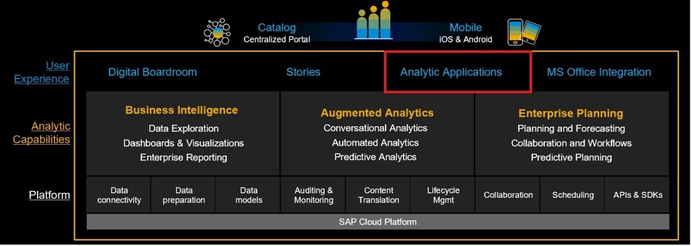
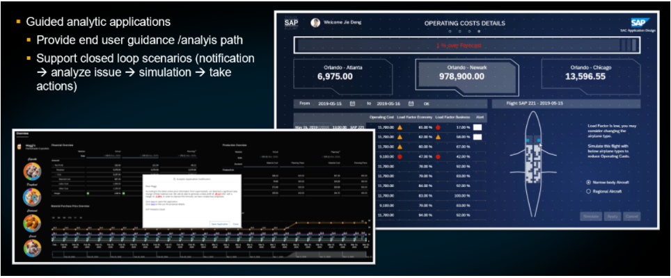
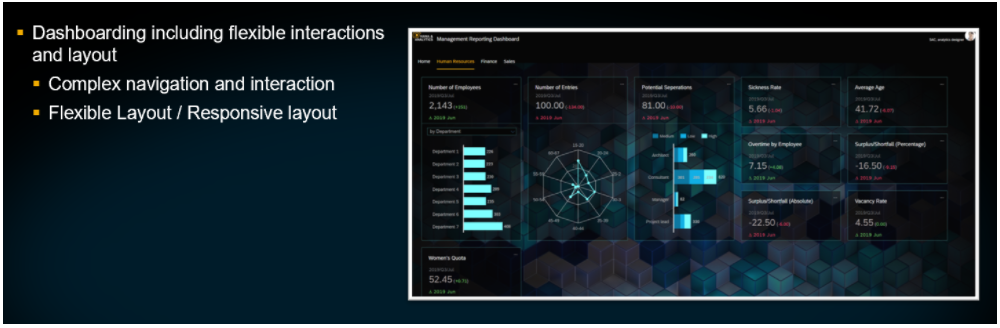

# Introduction to SAP Analytics Cloud, Analytics Designer
<!-- description --> Get an overview of SAP Analytics Cloud Analytics Designer top capabilities and features

<!--
## Prerequisites
 - Prerequisite 1
 - Prerequisite 2 -->

## You will learn
  - What SAP Analytics Cloud Analytics Designer is
  - How Analytics Designer completes SAP Analytics Cloud
  - What the typical use cases for Analytics Designer are

## Intro
<!-- Add additional information: Background information, longer prerequisites -->

---

### SAP Analytics Cloud Analytics Designer in a nutshell

Analytics Designer is a capability that you can use to build Analytical Applications within SAP Analytics Cloud. In Analytics Designer you can use scripting, extensions, `Odata`, and visual widgets to build Enterprise Dashboards, Planning Applications, and Predictive Applications. Analytics Designer leverages all the platform services already built into SAP Analytics Cloud such as, Data Connectivity, Data Preparation, Scheduling and Lifecycle Management to name a few. Analytics Designer also integrates with Business Intelligence, Augmented Analytics, and Enterprise Planning.

By using Analytics Designer to leverage all the existing services provided by SAP Analytics Cloud, you can integrate different capabilities into your Analytics Application to implement your business scenario and support your business needs. With Analytics Designer you have more flexibility to build sophisticated and interactive dashboards as well as Planning and Enterprise Analytical Applications within your company. Refer to the image below to learn about the platform services and features that can be integrated with Analytics Designer.

### Analytics Designer extends stories capabilities inside SAP Analytics Cloud

Analytics Designer sits on one analytics platform by bringing together Business Intelligence, Planning, and Predictive capabilities. Analytics Designer also has a dedicated development environment for Analytics Applications. Here you can customize your application by using capabilities such as scripting to do the integration and extension work. You can also enhance the user experience by adjusting widget behavior based on your user's expectations. With this feature you have the flexibility to enhance the user interface and cater your application to your user's needs.  

Some key features of Analytics Designer include the abilities to:

- Customize actions between different analytical applications  

- Integrate the Analytical Application into third-party solutions  

- Embed third-party web pages into your Analytical Application  

- Use custom widgets to create your own visualizations

- Provide your Analytical Application through the use of a content network

- Deploy your Analytical Application through a mobile device or through integration with the SAP Analytics Cloud iOS mobile application

### Typical Use Cases of Analytics Designer

### Generic Applications

You can use Generic Applications to analyze different models in SAP Analytics Cloud. Using this you can perform table-centric slide-dice analysis and use the navigation panel to easily add or remove dimensions in your table or chart and add hierarchies.

### Guided Analytic Applications

In some cases, you don't want to give your user too many options but rather, you want to give them guidance about how to analyze data and find a solution to the issue. With Analytics Designer you have full control of what you'd like to provide to the user. You can build buttons, alerts, and notifications which provide a visual aid to help them with a business problem. In the image below you can see an alert popping up prompting users to open the application, provide them with a simulation, and take action.

### `Dashboarding`

`Dashboarding` (spellcheck error makes me do this...will take away when we publish) includes flexible interactions between widgets and layout. You can adjust the layout and decide which parts of the screen should be fixed or responsive. You can also use the scripting capability for complex navigation.

### Planning Applications

You can integrate planning capabilities and use Analytics Designer to customize the planning workflow. You can customize your application to give your users more guidance and enhance the experience by including pop-ups and sliders.

### Embedding/Extending Applications

Using this you can embed your applications into third-party web pages and exchange information using API. Extending Applications allow for more customization by using custom widgets to create different visualizations.

### Template/Composite

By creating templates or composites, you can develop reusable parts of an application which reduces change management in the future. This feature is currently not available and will be released soon with updates to SAP Analytics Cloud.

### Test Yourself

---
