# Take a Tour of SAP Analytics Cloud, Analytics Designer Development environment
<!-- description --> Discover the SAP Analytics Cloud Analytics Designer development environment

<!-- ## Prerequisites
 - Prerequisite 1
 - Prerequisite 2 -->

## You will learn
  - How to use the script editor
  - How to create event-based scripts
  - How to create functions
  - What is the Info Panel

## Intro
<!-- Add additional information: Background information, longer prerequisites -->

---

### SAP Analytics Cloud Analytics Designer script editor


The script editor is a tool within Analytics Designer to specify the actions taking place when an event is triggered by an application user. By adding a script to a widget, you can influence the behavior of this widget and thus enable user interaction, also referred to as events, at runtime. In Analytics Designer, the scripting language is a limited subset of JavaScript. It's extended with a logical type system at design time enforcing type safety.

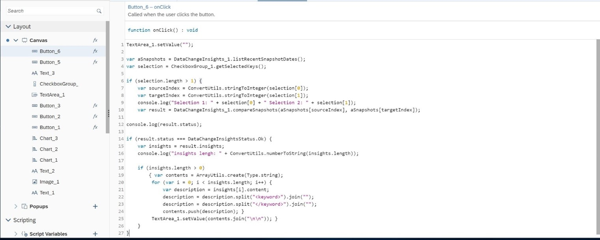

A script typically consists of several statements. A statement is a programmatic instruction within a script. The execution of a statement is typically triggered by user interaction with the widget.


### Creating and Editing Event-Based Scripts


Scripts are presented in the outline pane, at the left-hand side of the analytics designer editor environment. Find them by hovering over the widget name in the outline, or as a menu entry in the quick action menu of each widget. The icon indicates the event. By clicking on it, the script editor opens the selected function.

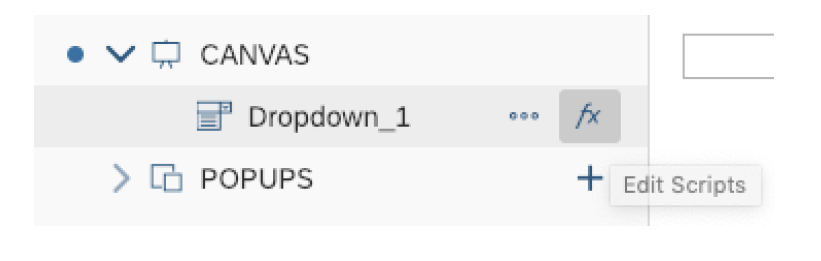

If a widget has multiple available events, you are presented with a choice in the hover menu.

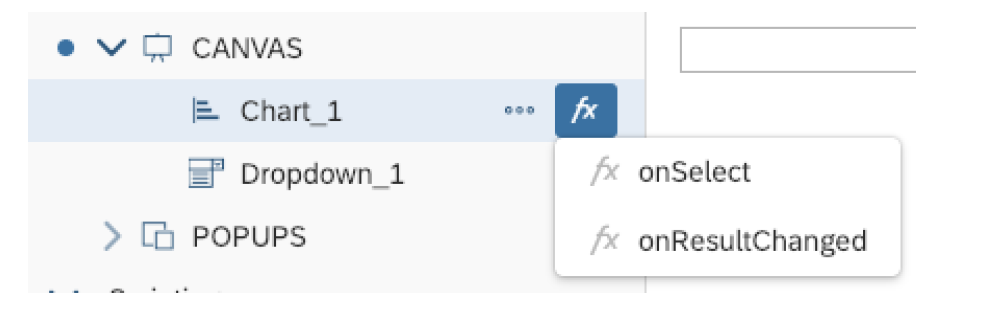

If there is an event with an attached script, you can see the icon in the outline pane. If there are no attached script, there is no visible icon. In the following figure, the `onSelect` event of `Dropdown_1` has a script, but there are no scripts attached to `Chart_1`.

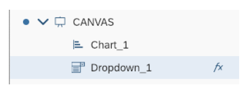

If a widget has multiple events and at least one has a script attached, then the icon will be displayed.

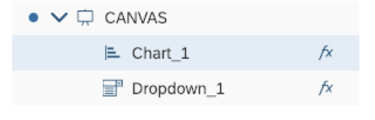

The hover menu will show which of the events have attached scripts.

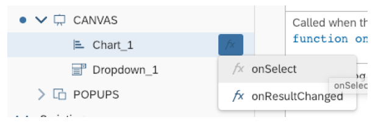


### Creating and Editing Functions in Global Scripts Objects


Functions are found under the global script objects portion of the outline pane. Before you can add functions, you will need to add your first script object. Do this by clicking the plus sign, next to the *Script Objects* header.

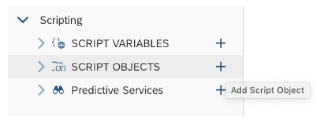

Global script objects act as containers. They allow you to maintain and organize script functions that aren't tied to any event and are invoked directly. Within a script object, you can add several functions, by invoking *Add Script Function* in the context menu. Keep in mind that the script object container is an organizational aid for you.

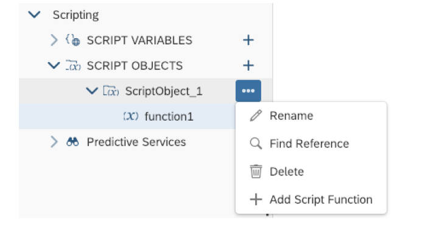

Individual functions are nested within global script objects. For example, in the figure below **Error! Reference source not found**. you see the `function1` nested within a script object called `ScriptObject_1`.

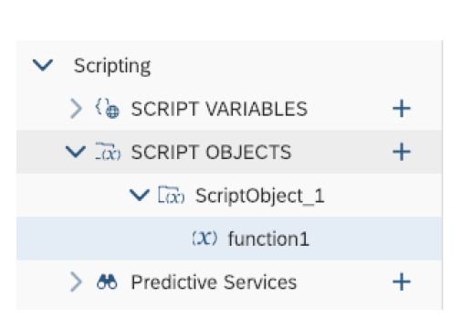

Like canvas widgets, the scripts attached to a function are created by clicking the icon in the hover menu of that function. Functions that have and don't have scripts are visible in the outline, just as with widgets.

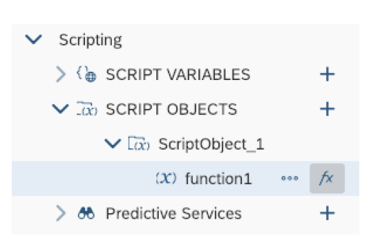

Once you have a script attached to a function, you can call it whenever you please, from any other script. The script objects are accessible by name and individual functions are accessible within the objects. If you wanted to invoke the `function1` script within `ScriptObject_1`, you would call is like this:

``` JavaScript
ScriptObject_1.function1();
```


### Understand the Script Editor Layout


Once an open script is in the editor, it shows up as a tab along the top of the canvas. You can open several script editor tabs at the same time.

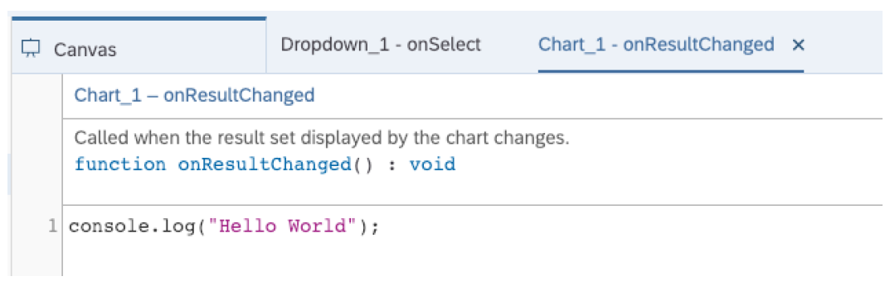

The script editor has three areas:

1. The widget and event

2. The documentation

3. The main body of the script itself

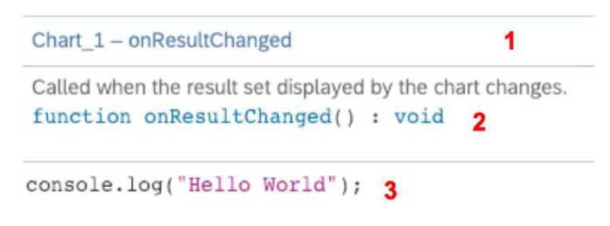

Write script in the main body using the `inbuild` help features like code completion and value help.

The script editor provides several keyboard shortcuts, which let you, for example, undo or redo your editing operations.

Find a list of keyboard shortcuts [here](https://help.sap.com/viewer/00f68c2e08b941f081002fd3691d86a7/release/en-US/68dfa2fd057c4d13ad2772825e83b491.html).


### Understand Errors and Reference List


All errors are listed in the *Errors* tab of the *Info* panel. Search for errors and filter out only warnings or errors. Double-click an error to open the script in a new tab and jump directly to the error location in the script.

Find all places where a widget or a scripting object is used with the *Find References* feature. You can find it in the context menu per object in the outline. The result is displayed in the *Reference* list tab of the *Info* Panel.

Info panel: errors and reference list

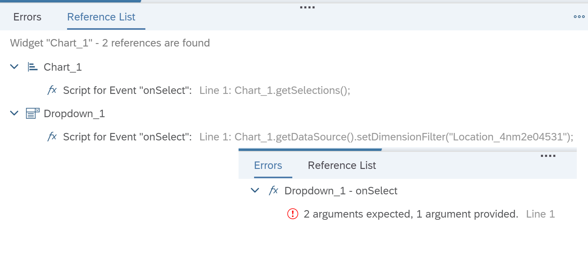


### Rename Widgets, Script Variables, and Script Functions


While creating an analytic application in analytics designer you can change the name of an analytics designer widget, script variable, script object, script object function, and script object function arguments. Analytics designer then applies the new name to all relevant places, for example in analytics designer scripts.

You can change the name of a widget, script variable, script object, or script object function by selecting it in the Outline, clicking the **More** button, selecting **Rename**, and entering a new name.

You can change the name of a widget by selecting it in the Outline, then entering in the Styling Panel a new name in the Name input field.

You can change the name of a script variable, script object, or script object function by selecting it in the Outline, entering in the Styling Panel a new name in the **Name** input field, then clicking button Done.

You can change the name of a script object function argument by selecting the script object function in the Outline, clicking the Edit button of the function argument in the Styling Panel, entering a new name in the **Name** input field, then clicking button **Done**.


### Test Yourself


---
