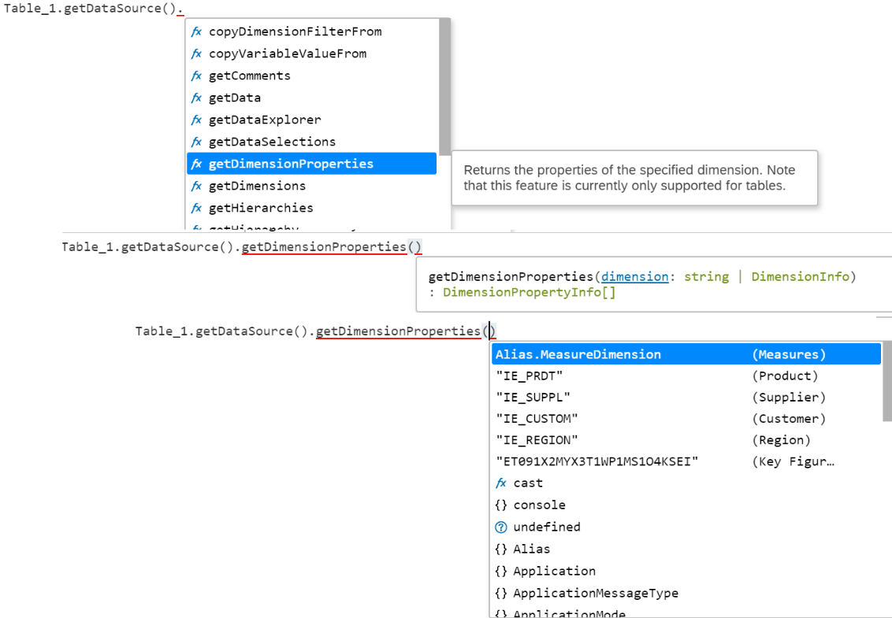
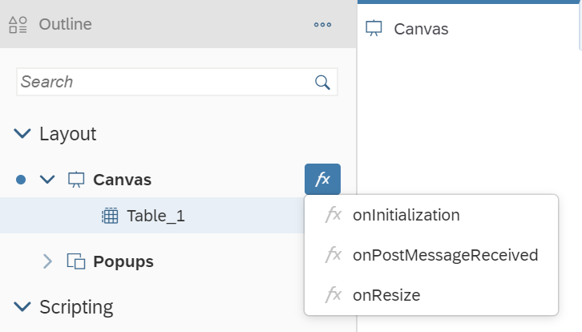
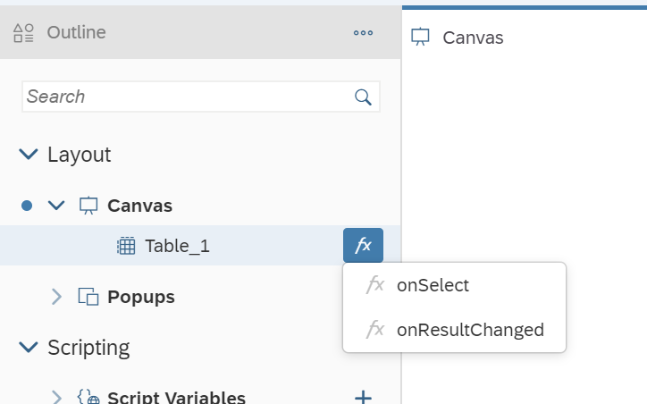
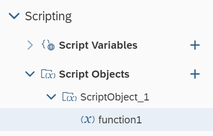
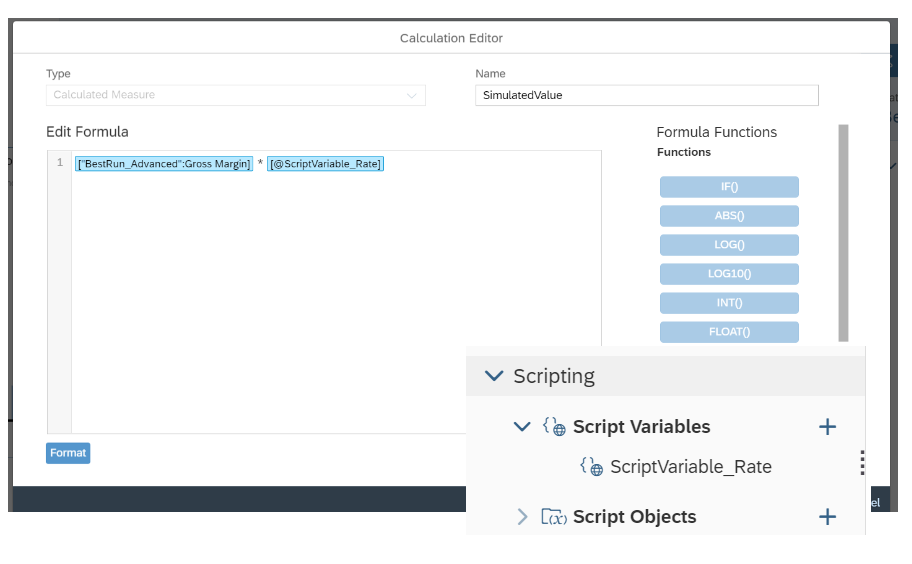
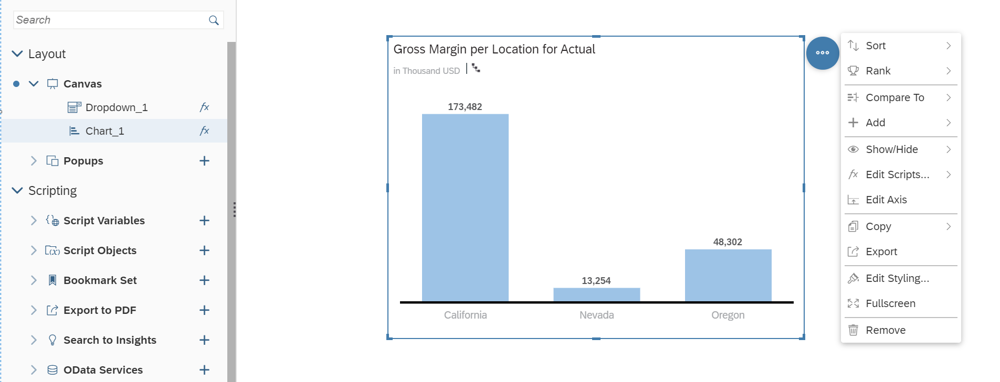

# Get familiar with the Scripting Language in SAP Analytics Cloud, Analytics Designer
<!-- description --> Get an overview of SAP Analytics Cloud Analytics Designer scripting capabilities

## You will learn
  - What is the scripting language in Analytics Designer
  - How to use the script event
  - How to use the script object and script variable
  - What are the different script statements in Analytics Designer

## Intro
<!-- Add additional information: Background information, longer prerequisites -->

---

### Learn the Analytics Designer Scripting Language


You might be wondering why you would want to script and what advantage it could possibly be.  

Most modern analytics tools avoid scripting to simplify the designer's tasks. Users may find it easier to use at first, but they quickly find themselves limited to the scenarios built into the tool.  

Scripting allows you to go beyond present narratives, to respond to user interaction in a custom way, to change data result sets, and to dynamically alter layout. Scripting frees your creativity.  

The scripting language in Analytics Designer is a limited subset of JavaScript. It is extended with a logical type system at design time enforcing type safety. Being a true JavaScript subset allows executing it in browser natively. All scripts are run and validated against strict mode. Some more advanced JavaScript features are disabled. Scripts are either tied to events or global script objects.

### Type System
The logical type system runs on top of plain JavaScript. It enforces strict types to enable more powerful tooling. The behavior at runtime doesn't change as it is still plain JavaScript.

### Tooling – Code Completion and Value Help
The Analytics Designer scripting framework exposes analytics data and metadata during script creation and editing. This enables:

- Code completion in the traditional sense like completing local or global Identifiers

- Semantic code completion by suggesting member functions or similar

- Value help in the form of context-aware value proposals like measures of a data source for function parameters

For example, when calling an API method on a Business Warehouse DataSource, the code completion can propose measures as code completion options or values to specify a filter.




### Understand Events


Scripts always run in response to something happening in the application. Application events are your hooks. There are several types of events in analytic applications. Some occur in the application itself and some occur on individual widgets.

### Application Events
The application has three events: one that fires when the app starts, one that is called in certain embedded scenarios, and another that is triggered when the application window resizes.

`onInitialization`: This event runs once when the application is instantiated by a user. It is where you script anything that you want to be done during startup. Like most events, it has no input parameters.

`onPostMessageRecieved`: If your application is embedded in an iFrame, your SAP Analytics Cloud analytic application can communicate bidirectionally with the host web app using [JavaScript `PostMessage` calls](https://developer.mozilla.org/en-US/docs/Web/API/Window/postMessage). It allows the host application to pass information into the analytic application. This event is called whenever the host application makes a post message call into the analytic application.

`onResize`: the event is cached to be dispatch every 500 ms when the application window resizes. Inside the `onResize` event, you can use the Layout API to dynamically set the size and position.

`onOrientationChange`: the event is fired when the orientation of the device has changed.

`onShake`: the event is fired on the shake gesture from a mobile device



### Individual Widget Events

Most widgets have an event that is fired when the widget is clicked by a user. However, some widgets have no events, such as text labels. Data bound widgets generally have an event that is fired when the result set of the data source changes.  

Most events have no input parameters, like `onSelect` and `onResultChanged`.




### Understand the Global Script Objects & Script Variables


Global script objects act as containers. They allow you to maintain and organize script functions that are not tied to any event and are invoked directly. You can maintain libraries of re-usable functions. These library scripts are called functions.



You can access every object in the Outline pane such as widgets, script variables, or script objects by its name when you are working on a script.

By referencing Script Variable in Calculated Measure, users can easily build a what-if simulation with query results.

For example, an analytic application developer can bind a calculated measure which references one script variable (`ScriptVariable_Rate`) to a chart.




### Learn the Core Scripting Language Features


Normal JavaScript is weakly typed and dynamically typed. Weak typing means that the script writer can implicitly coerce variables to act like different types. For example, you could have an integer value and treat it as if it was a string. Dynamic typing means that the runtime will try to guess the type from the context at that moment and the user can even change the type after the variable is already in use. For example, you could change the value of the before-mentioned integer to another type of object at will; "Dear integer, you are now a duck".  

SAP Analytics Cloud, analytics designer forbids both. Once you have a duck, it remains a duck and you can't recycle variable names as new types. If you want something else, you'll need another variable. It is also strongly typed, meaning that if you want to use an integer as a string, you'll have to explicitly cast it. Both are a consequence of enabling the rich code completion capabilities in the editing environment.  

The analytics designer scripting language is still JavaScript. You can write perfectly valid JavaScript while treating the language as if it was strongly and statically typed.

### No Automatic Type Casting
A consequence of strong typing is that you can't expect automatic conversions. The following is valid JavaScript:

``` JavaScript
var nth = 1;
console.log("Hello World, " + nth);
```

In analytics designer, you will see an error in the script editor, informing you that auto-type conversion is not possible, and the script will be disabled at runtime, until fixed. Instead, you should explicitly cast `nth` to a string.

``` JavaScript
var nth = 1;
console.log("Hello World, " + nth.toString());
```

### Accessing Objects
Every object (widget or global script object) is a global object with the same name as in the outline. Suppose you have a chart in your application, named `Chart_1` and want to check and see if it is visible. You can access `Chart_1` as a global variable and then access its functions, in this case to see if it is currently visible.

``` JavaScript
var isVis = Chart_1.isVisible();
```



### Finding Widgets with Fuzzy Matching
The application author can type in the complete name of a widget or just some first letters. By typing `CTRL+Space`, the system either:

- Completes the code automatically if there is only one valid option

- Displays a value help list from which you can select an option

Fuzzy matching helps you finding the result even if you have made a typo or the written letters are in the middle of the function. Fuzzy matching is applied automatically for the standard code completion (for example, "`cose`" → "console").
The script validation runs automatically in the background and shows errors and warnings indicated with red and orange underlying and a red or orange marker before the line number.

### External Libraries

There is no provision in SAP Analytics Cloud, analytics designer for importing external JavaScript libraries. You can use the standard JavaScript built-in objects such as:

- Math

- Date

- Number

- Array

- Functions on String

All standard functions listed in the SAP Analytics Cloud, analytics designer API Reference are supported even if some browsers don't support them natively.

For example, *String#startsWith* is not available in Microsoft Internet Explorer, but can be used in SAP Analytics Cloud with all browsers.


### Understand Loop Statements


Two types of JavaScript loops are possible in SAP Analytics Cloud, analytics designer, *for* and *while* loops. Other types, such as `foreach` iterators, are not supported.

### For loops
*For* loops are standard JavaScript *for* loops, with one caveat. You must explicitly declare the for iterator. This is valid JavaScript, but it isn't accepted in the script editor:

``` JavaScript
for (i = 0; i < 3; i++) {
console.log("Hello");
}
```

Instead, explicitly declare i with the var keyword. The example below is valid:

``` JavaScript
for (var i = 0; i < 3; i++) {
console.log("Hello");
}
```

### While loop
SAP Analytics Cloud Analytics Designer fully supports *while* loops:

``` JavaScript
var nth = 1;
while (nth < 3) {
console.log("Hello while, " + nth.toString());
nth++;
}
```

### For in loop
An additional type of loop is the *for in* iterator. Suppose you had a JavaScript object: you can iterate over the properties with the for in loop. Data selections are JavaScript objects and can be iterated over:

``` JavaScript
var selection = {
"Color": "red",
"Location": "GER"
};
for (var propKey in selection) {
var propValue = selection[propKey];
...
};
```


### Double and Triple Equals Operators


Plain JavaScript has two kinds of "equals" comparison operators, `==` (double equals) and `===` (triple equals). The main difference between these is that double equals has automatic type casting while triple equals doesn't. With triple equals, both the value and type must be the same for the result to be *true*. The triple equals is known as the strict [equality comparison operator](https://developer.mozilla.org/en-US/docs/Web/JavaScript/Equality_comparisons_and_sameness).

SAP Analytics Cloud, analytics designer has no automatic type casting. It supports

- Triple equals

- Double equals only if both sides have the same static type

The examples below show the difference between double and triple equals operators. In both cases, there is a variable `aNumber`, with an integer value and we are comparing it to the string "1".  

In the double equals case, `aNumber` is cast to string and compared. The result is *true*, and the if block is entered. In the triple equals case, `aNumber` is not cast to string and the comparison is *false*, because the values are of a different type.

This is *true*, and you can see the *if* statement is entered:
``` JavaScript
var aNumber = 1;
if (aNumber == "1") {
...
}
```

This is *false*, and you can see the *if* statement is skipped:
``` JavaScript
var aNumber = 1;
if (aNumber === "1") {
...
}
```


### Learn a Few More Statements


### If and Else Statements
The statements *if* and *else* are supported. Remember that there is no automatic type casting and double equals are valid only if both sides have the same static type:
``` JavaScript
if (nth === 1) {
console.log("if...");
} else if (nth < 3) {
console.log("else if...");
} else {
console.log("else...");
}
```

### This Keyword
The *this* keyword allows you to ignore the name of the object. It is simply the object that this script is attached to, regardless of what it is called. It doesn't matter and is merely a stylistic choice. With *this*, refer to

- The instance itself within widget scripts or script object functions

- The parent instance explicitly by its variable name, such as *Chart_1*

- The parent instance as *this*

When performing the above console print on one of the events of *Chart_1* itself, use the following variation of the code:

``` JavaScript
var theDataSource = this.getDataSource();
console.log(theDataSource.getVariables());
```

### Switch Statements
You can use a standard JavaScript switch statement in Analytics Designer:
``` JavaScript
switch (i) {
  case 0:
    day = "Zero";
    break;
  case 1:
    day = "One";
    break;
  case 2:
    day = "Two";
    break;
}
```

### Break Statement
You can use *break* to break out of loops and *switch* statements, as seen in the example above.


### Test Yourself


---
