# Create Your First Story
<!-- description --> Create your first story and import a dataset

## Prerequisites
 - You have access to an SAP Analytics Cloud account
 - Download this [sample dataset](https://d.dam.sap.com/a/fAJmXck?rc=10) that details the products, sales, and Geo codes for a fashion retail store.
 - Please use the latest version of Google Chrome or Microsoft Edge to access your SAP Analytics Cloud

## You will learn
  - How to create a story
  - How to import and add data to a story
  - How to Geo enrich and create hierarchies in a dataset

  Welcome back! Congratulations on learning how to explore a sample story in the previous tutorial group.

  For these tutorials, pretend that you are a business analyst for a retail company. You've been asked to analyze the latest sales data and decided to go a step further and create an interactive sales dashboard with the features and capabilities of SAP Analytics Cloud.

  By the end of this tutorial group, you will have a sales dashboard that looks like this:  

  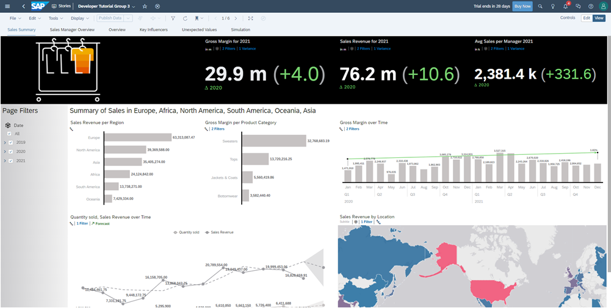

---

### Create a Story

**Stories** represent the dashboard and reporting features of SAP Analytics Cloud and provide you with a way to bring data and visualizations together to tell the story of your business.

You can create a story with a template or from scratch. With a template, the theme, branding, layout, and object placeholders are already in the story to help you build your story faster. When building from scratch, you can choose to begin blank with a Responsive page, Canvas page, Grid page, or from a Smart Discovery. Click [here](https://help.sap.com/viewer/00f68c2e08b941f081002fd3691d86a7/release/en-US/f0cc6e14392e4b18b0f1bcaab839cc2d.html) to learn more.

We will focus on creating a responsive story page.

**1.** In **Stories** from the Main Menu/Navigation bar, click **Responsive**

**2.** Select **Classic Design Experience**, then **Create New**

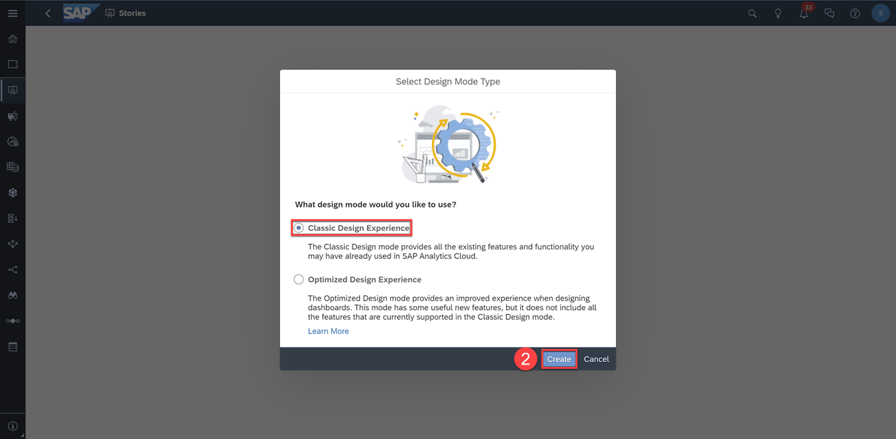

The Optimized Design Experience improves performance within SAP Analytics Cloud stories and enables content within an SAP Analytics Cloud story to load faster, but not all features and story options will be available in the Optimized Design Experience features. A new tutorial will be created in the future for Optimized Designed Experience stories.

### Import Data

The first step to creating a story is to import data.

**3.** Click the **Data** tab in the top left of your screen

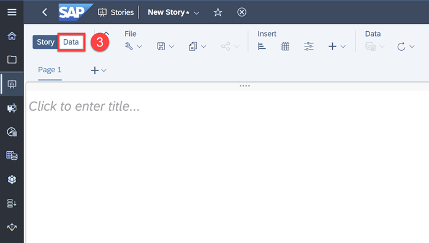

Users may choose to import data from a file, acquire data from a source/connection, or use data acquired from an existing model or dataset.

**4.** Select **Data uploaded from a file**, then import the sample dataset found above in prerequisites

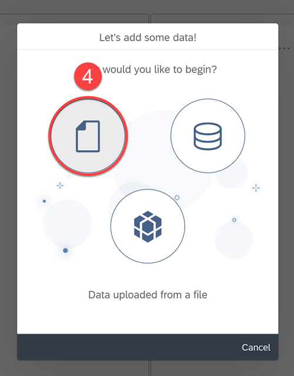

**5.** Make sure to select **Use first row as column headers**

**6.** Click **Import**

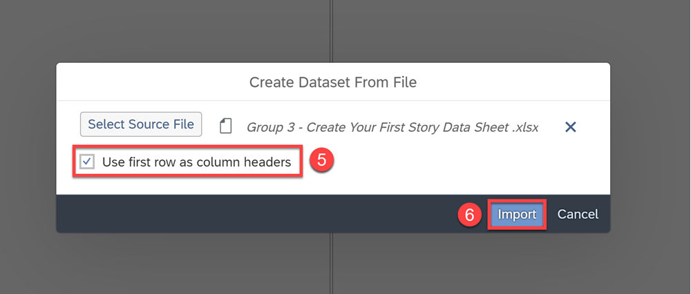

> By default, importing data directly into a story will embed the data and model into the story. The model will not appear in the folder list for use with other stories unless you explicitly select Convert to Public Dataset in the Data > Grid View. Click [here](https://help.sap.com/viewer/00f68c2e08b941f081002fd3691d86a7/release/en-US/c5d2b331c2234806ace715024e521e64.html) to learn more.

### Wrangle and Model your Data

Once your data is successfully imported, you are shown a summary of the imported data and then brought to the wrangling and modeling view, where you can further enhance your data and define your model.

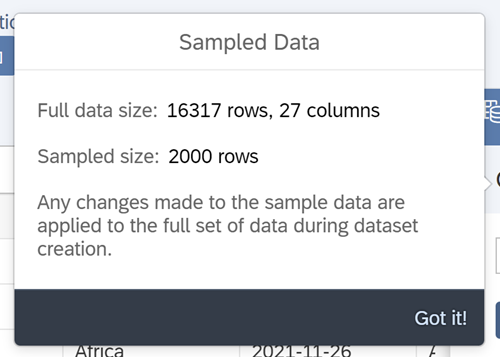

> For performance reasons, wrangling and modeling is done only with a subset of the imported dataset. A sample size of 2000 rows is used, and any changes made to the sampled data is applied to the complete dataset during dataset creation.

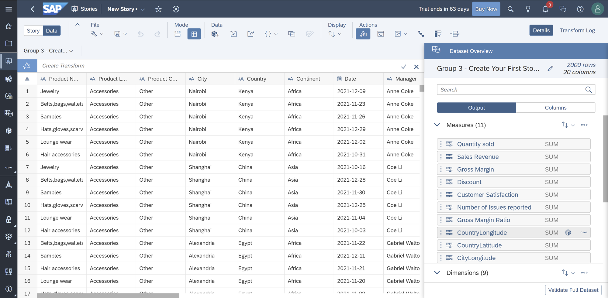

On the Dataset overview panel on the right, you will see that the measures and dimensions are automatically identified from the imported dataset. SAP Analytics Cloud automatically identifies whether a column is a measure or a dimension. However, it is always good practice to review the data to ensure the measures and dimensions are correctly identified.

In this case, we need to adjust the latitudes and longitudes from measures to dimensions.  

To change a measure to a dimension:  

**7.** Hover over the **`CountryLongitude`** measure and click on the **… menu** option

**8.** Click **Change to a Dimension**

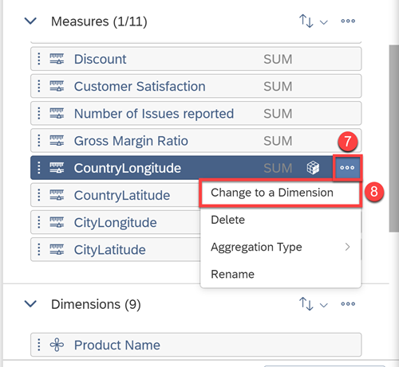

**9.** Do the same and change **`CountryLatitude`**, **`CityLongitude`**, and **`CityLatitude`** from measures to dimensions

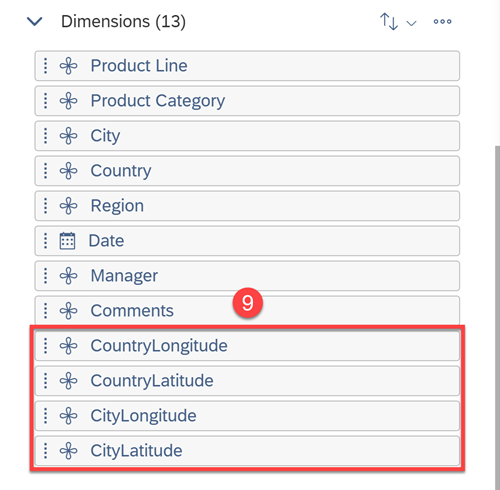

Now that they are dimensions, we can Geo enrich them. Click [here](https://help.sap.com/viewer/00f68c2e08b941f081002fd3691d86a7/release/en-US/b396a6eb42e3491aac1791e2d10de68f.html) to learn more.

### Geo Enrich your Data

Geo enriching is the process of turning raw coordinate data into identifiable geographies so that SAP Analytics Cloud can visualize the data in a Geo map.

Let's enrich and turn the Country and City coordinates into location dimensions.

**10.**	Select the **`CountryLatitude`** column, then click the **Geo Enrich By** icon > **Coordinates**  

**11.**	Rename the dimension name to **`Country_Location`**

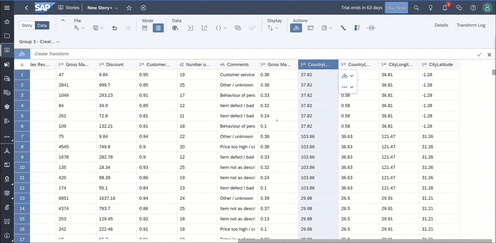

After enriching the Country coordinate, you will see a new column added with both the Country Longitude and Latitude as one dimension.

**12.** Repeat the same process for the City coordinates and call the Dimension name **`City_Location`**

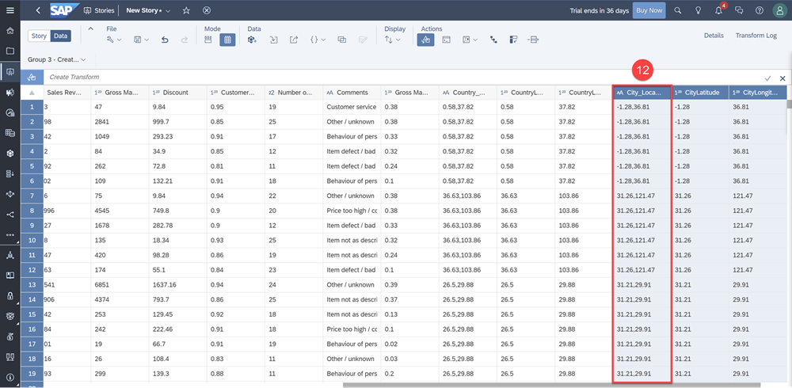

Lastly, let's enrich our Regions, Countries, and Cities by Area Name.

**13.** Click on the **Geo Enrich By** icon > **Area Name**  

**14.** Select the Geo hierarchy **Region** > **Country** > **City**

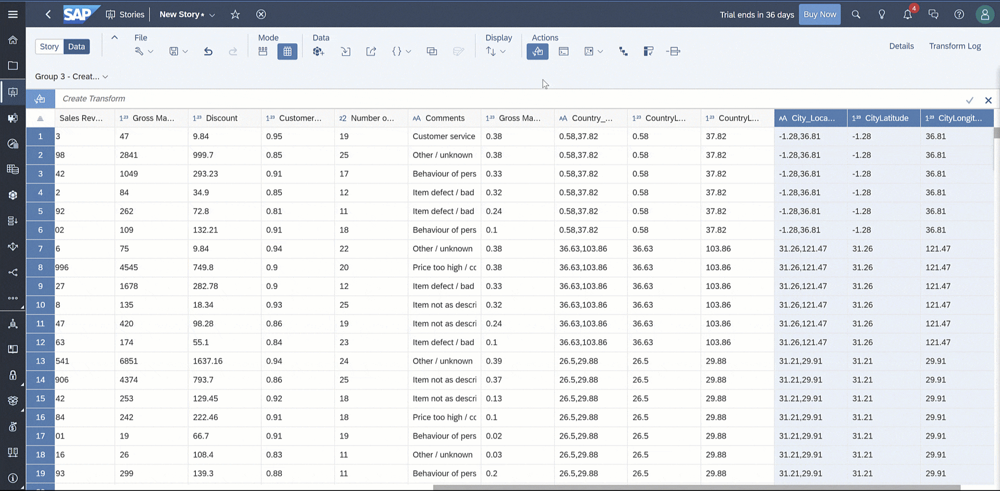

Click [here](https://help.sap.com/viewer/00f68c2e08b941f081002fd3691d86a7/release/en-US/c52a875d319b4cd1890a52f6286f96bc.html) to learn more.

### Create Hierarchies

Let's now create a product hierarchy to enable drill-down.

**15.** In the toolbar, select the **Level Based Hierarchy** icon

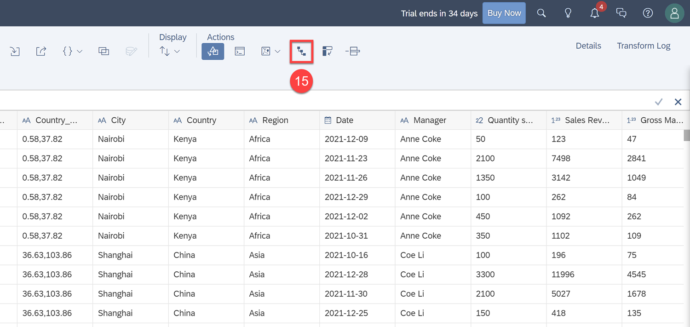

**16.** In the **Hierarchy Builder**, select **Product Category** as the first level, **Product Line** as the second, and **Product Name** as the third  

**17.** Click **OK**

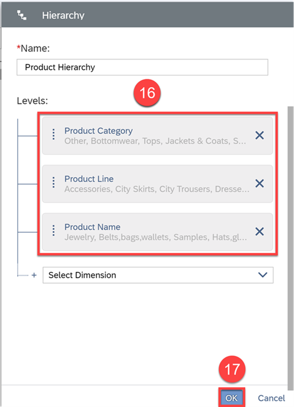

SAP Analytics Cloud then recognizes this hierarchy and allows you to drill up and down between Product Categories, Product Lines, and Product Names within charts. Click [here](https://help.sap.com/viewer/00f68c2e08b941f081002fd3691d86a7/release/en-US/a5af17fec4f1428188ea185a526873c0.html) to learn more.

> It is best practice to save regularly. Before moving on, click **Save**.

### Test Yourself

In the question area below, pick one multiple choice answer and then click **Submit Answer**.

---
