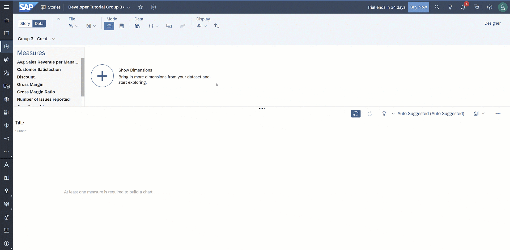
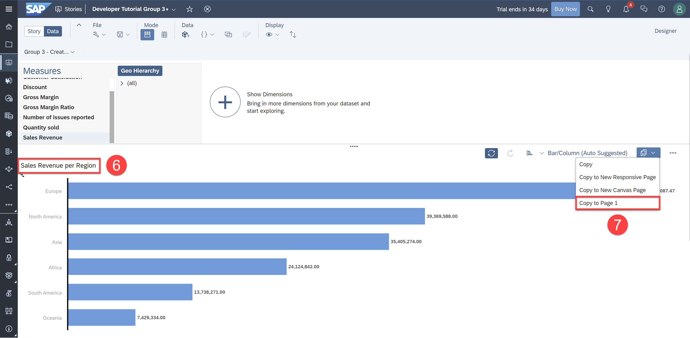
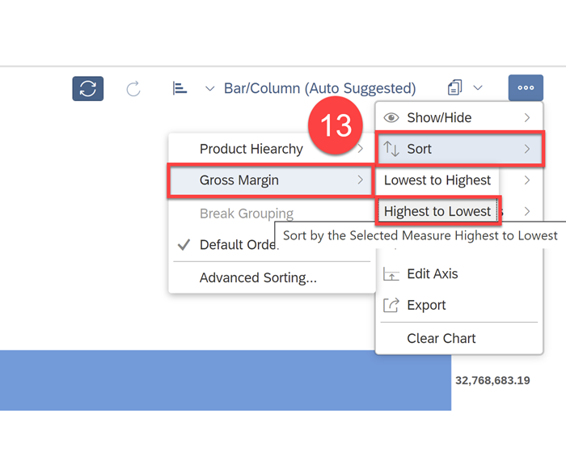
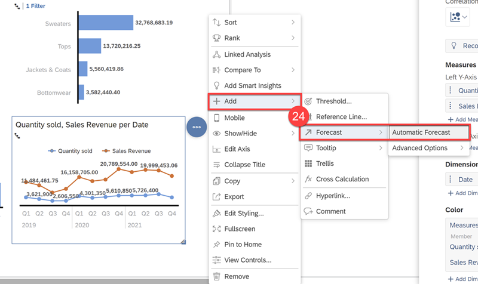
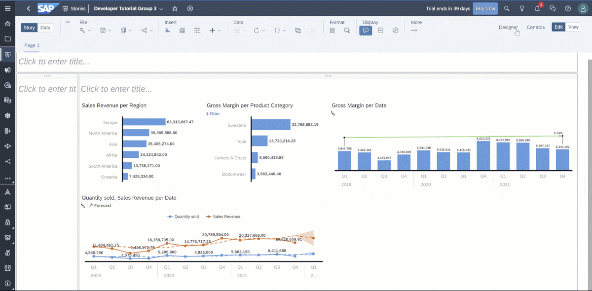
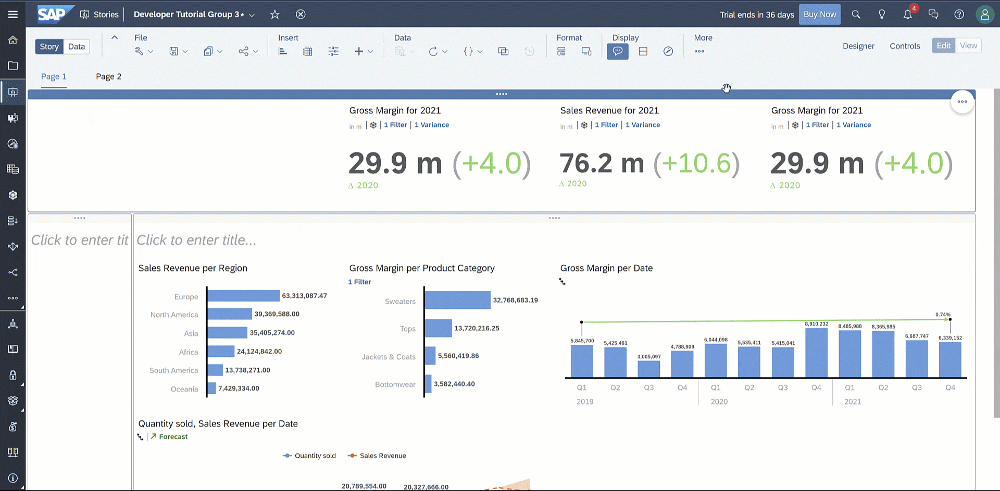

## Prerequisites
 - You have access to an SAP Analytics Cloud account
 - Download this [company logo](Best_Run_Logo.png) for our dashboard

 <!-- (https://github.com/andrewliu-SAP/Datasheet-for-Developer-Tutorial/blob/main/Best_Run_Logo.png) for our dashboard -->

## Details
### You will learn
  - How to create Bar and Line graphs
  - How to create a Custom Calculated measure
  - How to create Numeric Point charts with Search to Insight

In SAP Analytics Cloud, you can create charts with the Story Explorer, directly in the story, or with Search to Insight. We'll go through each, starting with Story Explorer.

---

[ACCORDION-BEGIN [Step 1: ](Explore and Visualize Data)]

We ended the last tutorial with a completed data model; now, we will begin exploring and visualizing the data.

**1.** Switch to **Data Exploration** mode by clicking the icon shown below

This opens the Story Explorer and lets you explore the data to understand the available measures, dimensions, and values. In the Story Explorer, you see a faceted view of your data in the top pane along with a visualization area in the lower pane. When you select measures and dimensions in the upper pane, the visualization in the lower pane updates in real-time. Once you are happy with your results, you can copy the visualization to your Story.

Let's visualize Sales Revenue by Region.  

**2.** Select **Sales Revenue** as the measure   

**3.** Click the **+ Show Dimensions** icon and select **Geo Hierarchy**  

**4.** Click the **Geo Hierarchy** header then specify drill **Level 2** for drill level to show Regions

**5.** In the **… More Options** menu, select **Sort** > **Sales Revenue** > **Highest to Lowest**

**6.** Double click the chart title and rename to "Sales Revenue per Region"  

**7.** Click the **Copy** icon and select **Copy to Page 1**

Let's try another chart, gross margin by product category, but with a filter on the "Other" category.

**8.**	In the **… More Options** menu, select **Clear Chart**

**9.**	Select **Gross Margin** as the measure  

**10.**	Click the **+ Show Dimensions** icon and select **Product Hierarchy**  

**11.**	Click the **Product Hierarchy** header then specify drill **Level 2** for drill level to show Product Categories

**12.** Click the "Other" bar and click the **exclude** icon  

**13.** In the **… More Options** menu , select **Sort** > **Gross Margin** > **Highest to Lowest**

**14.**	Double click the chart title and rename to "Gross Margin per Product Category"

**15.**	Click the **Copy** icon and select **Copy to Page 1**

[DONE]
[ACCORDION-END]

[ACCORDION-BEGIN [Step 2: ](Add Charts to the Story)]

Let's add another visualization to the story showing the Gross Margin for the past 3 years. However, we'll be creating this chart directly in the story through the Builder tab in the Designer panel. With the Builder tab, the chart dynamically updates depending on the measures and dimensions you select.

**16.**	Click **Insert** > **Chart** in the Toolbar  

**17.**	Select **Gross Margin** as the measure and **Date** as the dimension  

**18.**	Select **Date**, click the **Hierarchy** icon and specify **Level 3** for drill level to show the Date with Quarters

**19.** In the **Chart Action Menu**, select **+ Add** > **CGR**

> The Compound Growth Rate (CGR) is the ratio that provides a constant rate of return over the time period. You can add a CGR line to your Bar/Column or Stacked Bar/Column chart. Click [here](https://help.sap.com/viewer/00f68c2e08b941f081002fd3691d86a7/release/en-US/80687aa81fcf4cc7abe61d53a01f6932.html) to learn more.

Let's now create a Line Chart showing Sales Revenue and Quantity Sold over time.

**20.**	Select **Insert** > **Chart** in the Toolbar  

**21.**	Select **Line** under the Trend Chart Structure

**22.**	Select **Quantity Sold** and **Sales Revenue** as the Left Y-Axis measures and **Date** as the dimension  

**23.**	Select **Date**, click the **Hierarchy** icon and specify **Level 3** for drill level to show Date with Quarters

**24.** In the **Chart Action Menu**, select **+ Add** > **Forecast** > **Automatic Forecast**

> It is best practice to save regularly. Before moving on, click **Save**.

[DONE]
[ACCORDION-END]

[ACCORDION-BEGIN [Step 3: ](Reorganize Lanes and Resize Charts)]

Let's organize our dashboard layout to make room for more visualizations.  We want to create a top lane for Numeric Point charts and a left lane for page filters.  

**25.** Right-click on the right lane and select **Remove**  

**26.**	Right-click on the remaining lane and select **+ Add lane** > **Add lane above**  

**27.**	Right-click on the bottom lane and select **+ Add lane** > **Add lane to left**

**28.**	Resize the left lane to the far left  

**29.**	Resize the Gross Margin per Date and Quantity sold Sales Revenue per Date charts as shown

[DONE]
[ACCORDION-END]

[ACCORDION-BEGIN [Step 4: ](Query with Search to Insight)]

Search to Insight brings conversational AI to SAP Analytics Cloud, allowing you to create a story by asking questions in natural language. When you query for data, Search to Insight automatically recognizes the dimensions and measures in your query and searches through available metadata for the answer to visualize the results for you.  

Let's use Search to Insight to ask a quick question then copy the result to the story.  

**30.**	Click the Search to Insight light bulb icon on the **Shell Bar** to open Search to Insight  

**31.**	Type "Gross Margin Last Year" into the Search bar  

**32.**	Click the **Copy** icon and select **Copy To** > **Page 1**

Now let's format the Numeric Point chart by changing the scaling and decimal places.

**33.**	Open the **Styling** tab in the Designer panel

**34.**	Select **Auto-formatted** for Scale  

**35.**	Select `k`, `m`, `bn` for Scale Format  

**36.**	Select **1** for Decimal Places  

**37.**	Right-click on the empty header text object and click **Remove**

Furthermore, let's edit the chart title and hide unnecessary labels.

**38.**	In the **Chart Action Menu**, select **Show/Hide** and unselect **Primary Value Labels**  

**39.**	Resize the chart, then double-click the chart title to rename it to "Gross Margin for 2021"  

In addition to displaying a value in the chart, it would also be helpful to show variance. Variances in your charts let you show the difference between versions of a measure or the difference between time periods.

**40.**	Open the **Chart Action Menu** of the Numeric Point chart  

**41.**	Select **Compare To** > **Previous Year**  

Now, let's create two more Numeric Point Charts by duplicating the first chart twice then moving them all to the right.

**42.**	Click the **Chart Action Men**u of the Numeric Point Chart  

**43.**	Select **Copy** > **Duplicate**  

> When copying and duplicating objects, the formatting is copied along with the object, making it a convenient way to create multiple charts with the same look.

**44.**	Move each Numeric Point chart to the right  

**45.**	Select the second Numeric Point chart and open the **Builder** tab in the Designer panel  

**46.**	Select **Sales Revenue** as the measure

**47.**	Rename the chart title to "Sales Revenue for 2021"

Click [here](https://help.sap.com/viewer/00f68c2e08b941f081002fd3691d86a7/release/en-US/e1b4914ffbc8438eb1aefccf70362d39.html) to learn more. In the next step, we will create a Calculated Measure for the last Numeric Point chart.

[DONE]
[ACCORDION-END]

[ACCORDION-BEGIN [Step 5: ](Create a Custom Calculated Measure)]

Now let's show the average sales per manager in our last Numeric Point chart. However, we don't have that measure, so we'll need to create a Calculated Measure.  

**48.**	Select the third Numeric Point chart and open **Builder** tab in the Designer panel  

**49.**	Remove Gross Margin as the measure and click + **Create Calculation…**  

**50.**	Select **Aggregation** for the Type  

**51.**	Enter "Avg Sales Revenue per Manager 2021" for the Name and for the chart title  

**52.**	Select **AVERAGE** for Operation  

**53.**	Select **Sales Revenue** for the Measure  

**54.**	Select **Manager** for the Aggregation Dimension  

**55.**	Click **OK**  

Click [here](https://help.sap.com/viewer/00f68c2e08b941f081002fd3691d86a7/release/en-US/5089d7effccf45878ad0ed5a038d5ecc.html) to learn more.

[DONE]
[ACCORDION-END]

[ACCORDION-BEGIN [Step 6: ](Add an Image)]

Let's finish this tutorial by adding a company logo to the dashboard.  

**56.**	Click the **+** icon under Insert in the Toolbar  

**57.**	Select **Image**  

**58.**	Upload the Company Logo provided in prerequisites and select it in the Image Library  

**59.**	Adjust the image's size to match the other charts  

> Don't mind the white logo on the white background, as we will be changing the themes and styling in the last tutorial.

Your dashboard should now look like this.

[DONE]
[ACCORDION-END]

[ACCORDION-BEGIN [Step 7: ](Test Yourself)]

[VALIDATE_1]

[ACCORDION-END]

---
