## Prerequisites
 - You have access to an SAP Analytics Cloud account

## Details
### You will learn
  - How to create a table
  - How to use thresholds in tables

<!-- Add additional information: Background information, longer prerequisites -->

---

[ACCORDION-BEGIN [Step 1: ](Create a New Page)]

To start, let's create a new responsive page.  

**1.** On the Tab bar, click the **+** icon and select **Responsive**

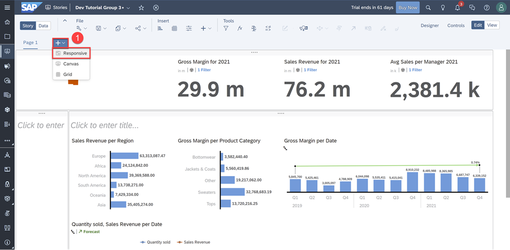

**2.** Add a top lane and left lane just like we did for Page 1 as shown below

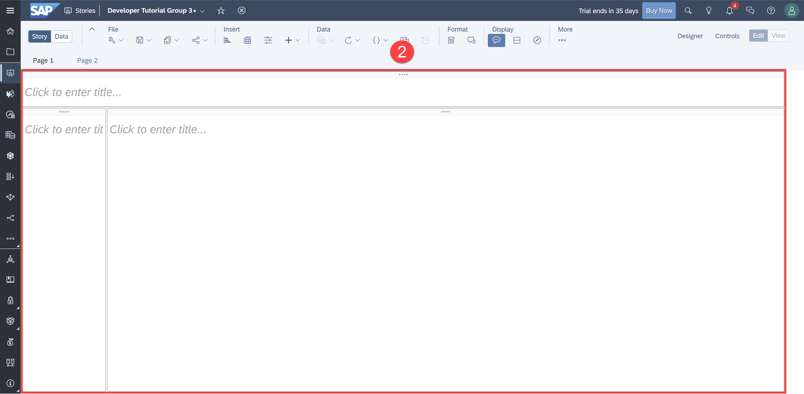

[DONE]
[ACCORDION-END]

[ACCORDION-BEGIN [Step 2: ](Create a Table)]

On this new responsive page, we will add a table to display **Customer Satisfaction**, **Number of Issues Reported**, and **Quantity Sold** for each manager in this new page.  

**3.** Click **Insert** > **Table** and open the **Builder** tab in the Designer Panel

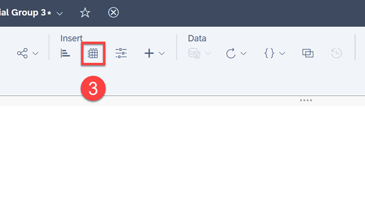

**4.**	Under Rows, add **Managers** as a dimension  

**5.**	Under Filters, select **Customer Satisfaction**, **Numbers of Issues Reported**, and **Quantity Sold** as measures then click **OK**  

**6.**	Resize the table to fit half the dashboard  

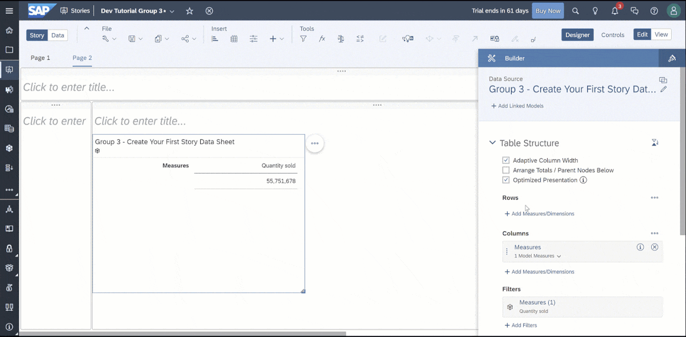

Click [here](https://help.sap.com/viewer/00f68c2e08b941f081002fd3691d86a7/release/en-US/77278faf3b3446b180d7ae9f5b873f94.html) to learn more.

[DONE]
[ACCORDION-END]

[ACCORDION-BEGIN [Step 3: ](Use Thresholds in Tables)]

Thresholds can be added to tables to compare measures to a fixed range or to other measures. In this example, we'll add thresholds to alert the managers if the Number of Issues reported become too high.

**7.**	Right-click on the **Number of Issues reported** column of the table  

**8.**	Hover over **Thresholds** and select **+ New Threshold …**

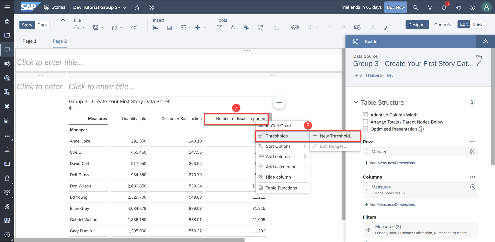

You'll then be prompted to enter values for measure threshold's number range.

**9.**	Enter the following:  

  - OK = min < 10,000

  - Warning = 10,000 < 15,000

  - Critical = 15,000 < max

**10.**	Click Apply

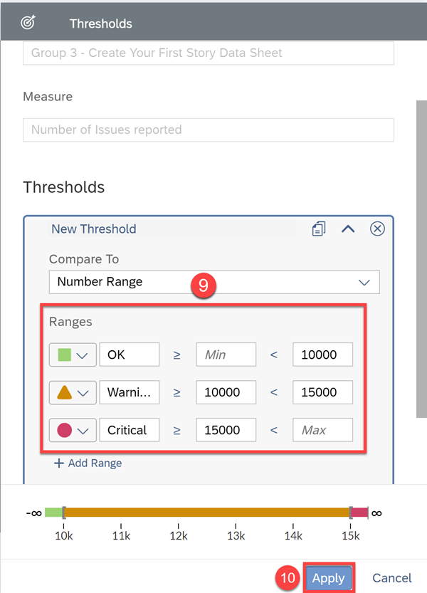

You can now immediately see each manager's number of issues reported in their respective threshold groups. Let's go further and change the threshold alert display.  

**11.**	Open the **Styling** tab in the Designer Panel.  

**12.**	Under Threshold Styles, select **Color Values**

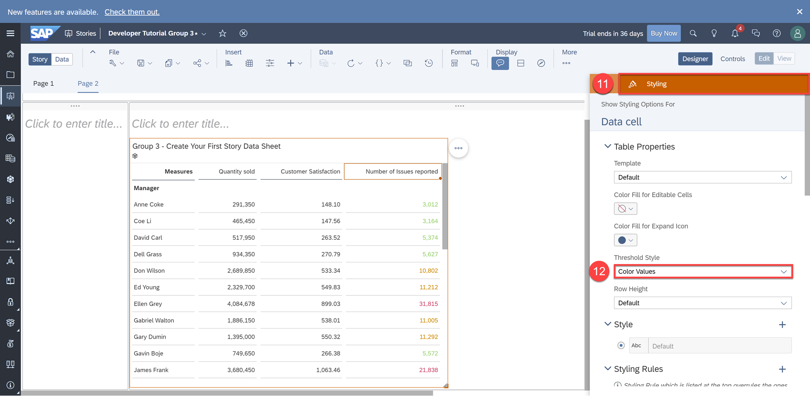

Click [here](https://help.sap.com/viewer/00f68c2e08b941f081002fd3691d86a7/release/en-US/c7adf4fd59624806b976c7f5d075f5a1.html) to learn more. Before moving on, let's sort this table from highest to lowest in Quantity sold to make it easier to understand, analyze, and visualize.  

**13.**	Right-click on the **Quantity sold** column  

**14.**	Select **Sort Options** > **Sort Descending**

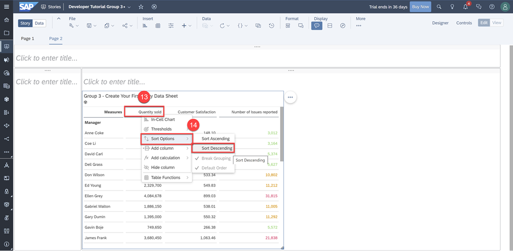

[DONE]
[ACCORDION-END]

[ACCORDION-BEGIN [Step 4: ](Visualize Correlations with a Scatterplot)]

To visualize a relationship between Quantity Sold and the Number of Issues reported, let's create a scatter plot.

**15.**	Click the **chart** icon under Insert in the Toolbar

**16.**	Select **Scatter plot** under the Correlation Chart Structure  

**17.**	Choose **Quantity sold** as the X-Axis measure, **Number of Issues reported** as the Y-measure, and **Manager** as the dimension  

**18.**	Drag the chart to fill the right half of the dashboard  

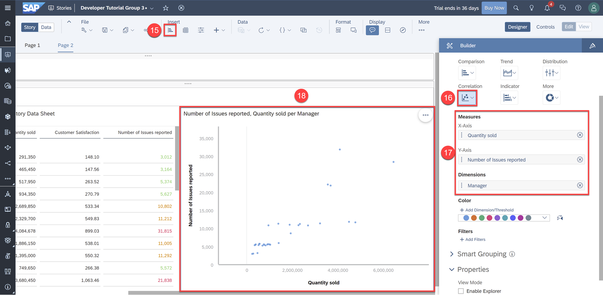

**19.**	Copy the image logo and two Numeric Point charts from Page 1 to the top lane of Page 2

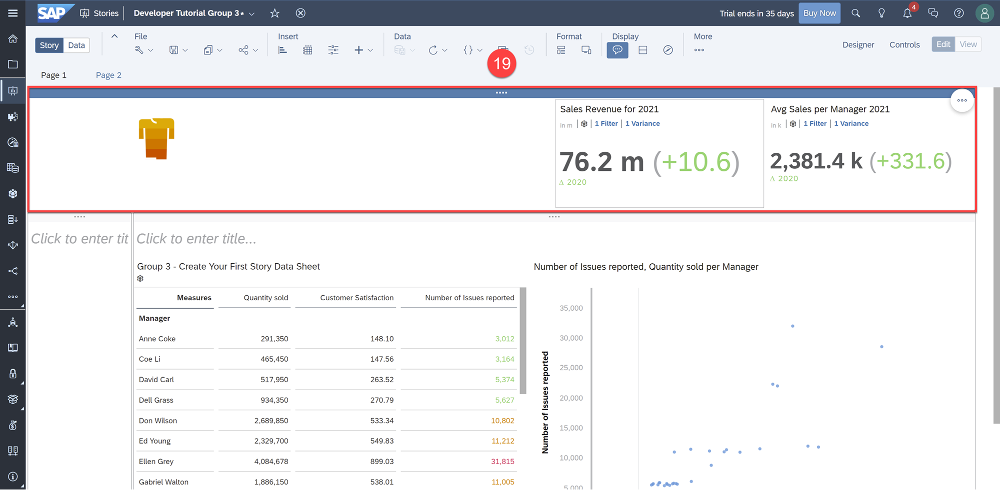

**20.**	Change the primary value measure of the first Numeric Point chart to **Customer Satisfaction**  

**21.**	Rename the chart to "Customer Satisfaction 2021"

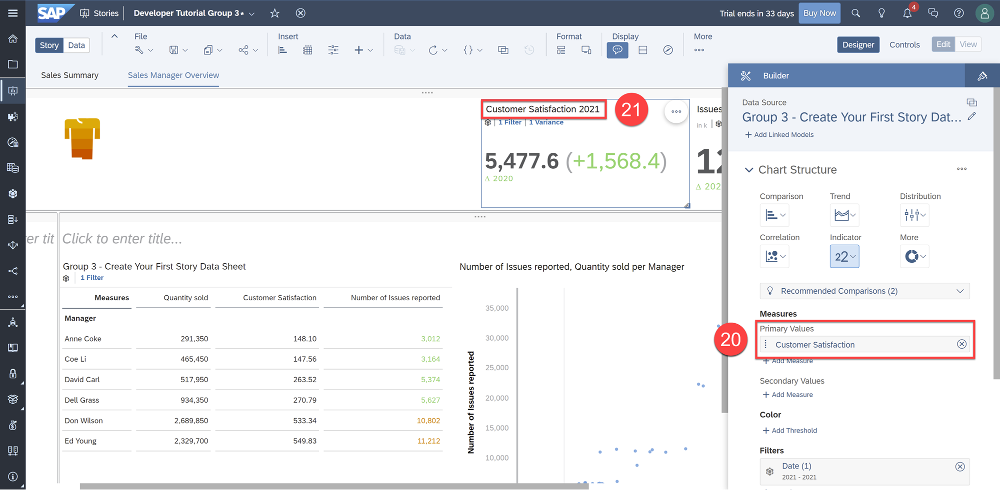

**22.** Do the same for the second Numeric Point chart with measure **Number of Issues reported** and chart title "Issues Reported 2021"

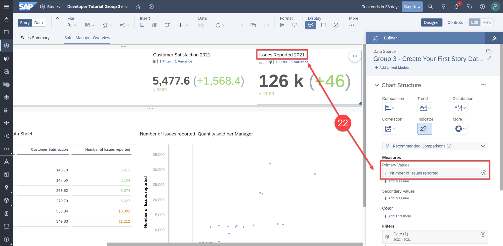

> It is best practice to save regularly. Before moving on, click **Save**.

[DONE]
[ACCORDION-END]

[ACCORDION-BEGIN [Step 5: ](Test Yourself)]

[VALIDATE_1]

[ACCORDION-END]
---
