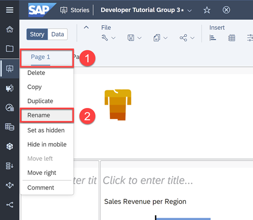
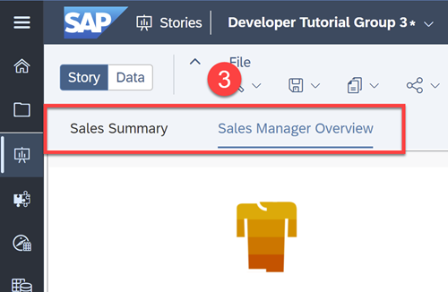
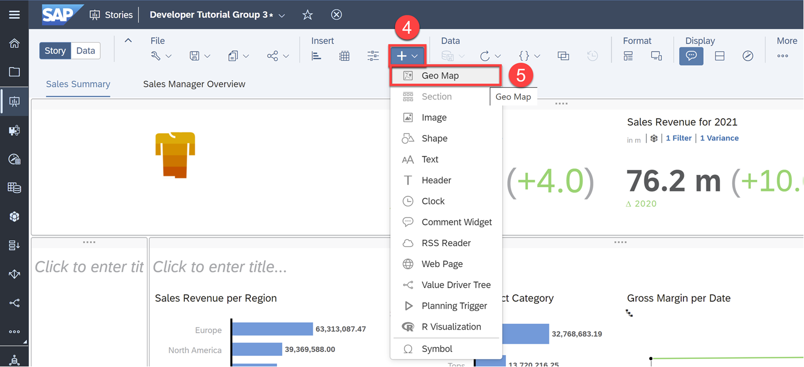
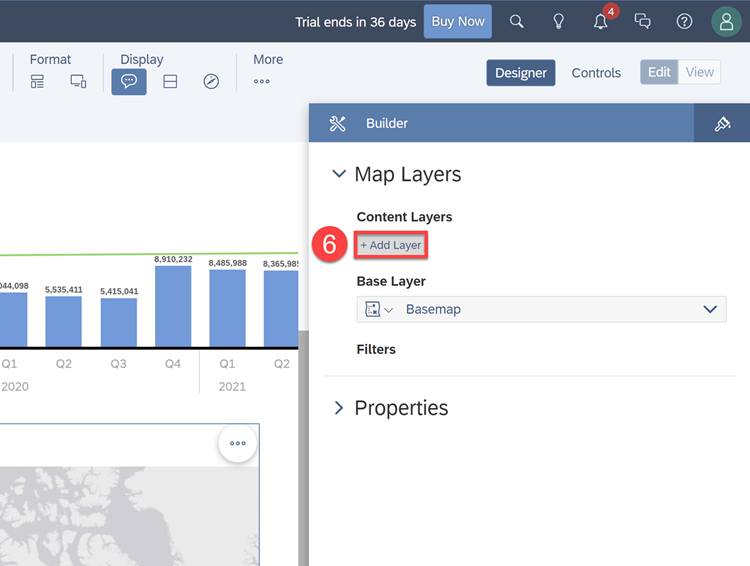
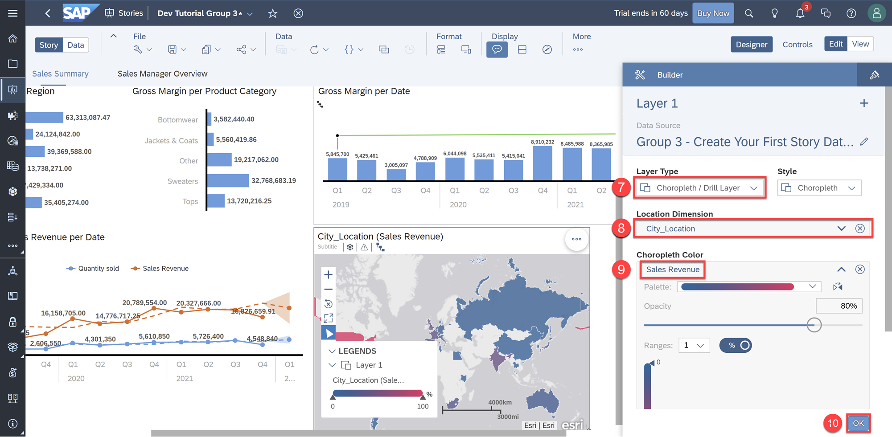
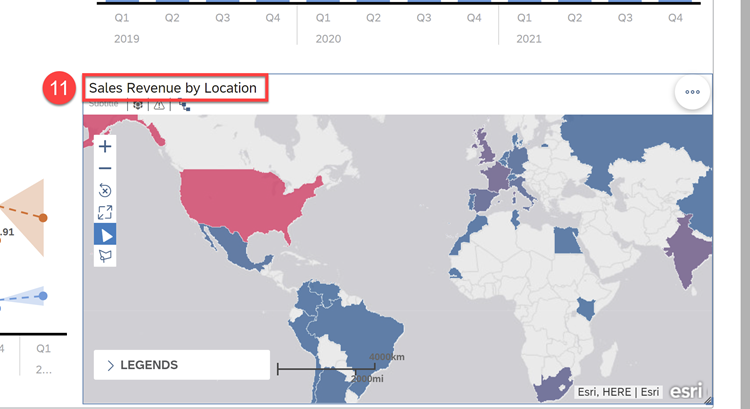
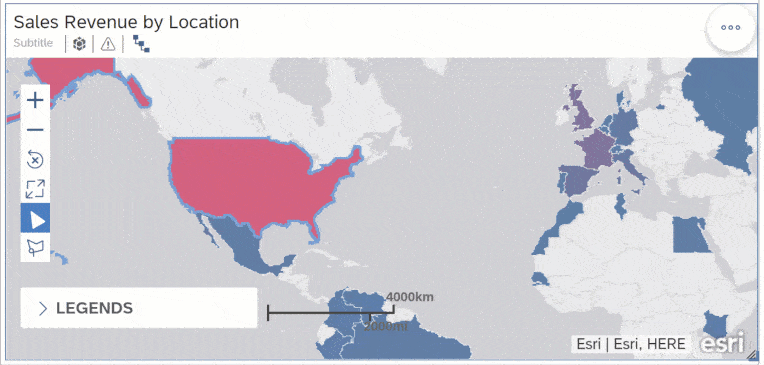
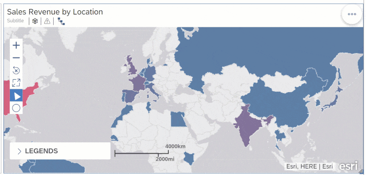
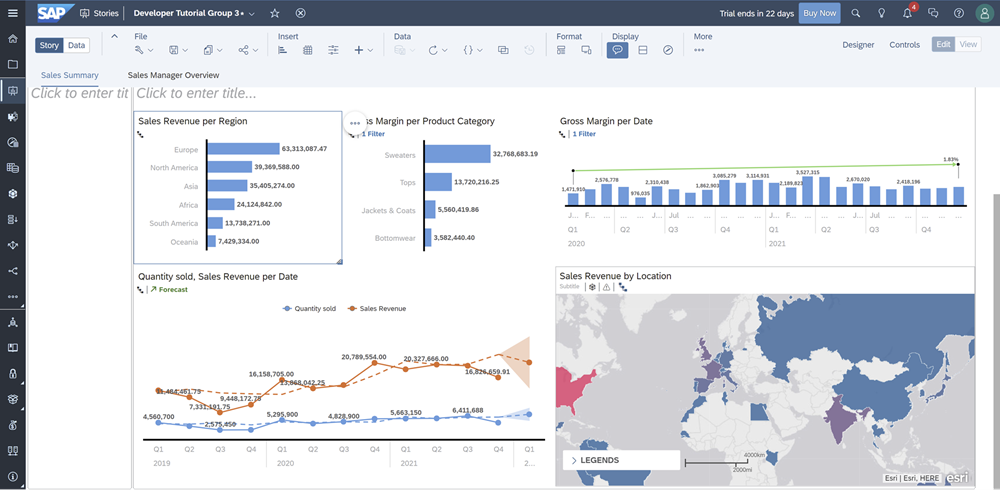

# Visualize your Data with Geo Maps
<!-- description --> Learn how to create, interact with, and filter through a Geo Map

## Prerequisites
 - You have access to an SAP Analytics Cloud account

## You will learn
  - How to create a Geo map
  - How to interact with and filter a Geo map

## Intro
<!-- Add additional information: Background information, longer prerequisites -->

---

### Rename the Pages

First, let's rename the two pages we've made so far.  

**1.** Click on each page in the Tab bar  

**2.** Select **Rename**

**3.** Rename the pages to "Sales Summary" and "Sales Manger Summary" respectively

### Create a Geo Map

A Geo map allows users to overlay multiple layers of business data on a Geo map with detailed geographic information to perform analyses on geographic data. Let's create one.

**4.** Go to the **Sales Summary** page  

**5.** Click the **+** icon and select **Geo Map** under Insert in the Tool bar

> Geo visualizations consist of one or multiple layers which can be sourced from different data sets.

**6.** Click **+ Add Layer**

**7.** Choose **`Choropleth` / Drill Layer** for the Layer Type for drill down capabilities  

**8.** Choose **`City_Location`** for the Location Dimension  

**9.** Choose **Sales Revenue** for the `Choropleth` Color (a 0-100% color scale will be generated on the Geo Map based on Sales Revenue)  

**10.** Click **OK**

**11.** Stretch out the Geo map to fill the bottom right of the dashboard and rename the Geo Map chart title to "Sales Revenue by Location"

Click [here](https://help.sap.com/viewer/00f68c2e08b941f081002fd3691d86a7/release/en-US/6ade40e98e9c4f11ab3ad28d345ab54f.html) to learn more.

### Interact with the Geo Map

The chosen `Choropleth` layer is useful for comparing and analyzing data from across locations. Furthermore, the drill layer allows you to drill up and down between a Country, its State, and the Cities within the State.

> The color represents the Sales Revenue per country with pink representing a high percentage of Sales Revenue and blue representing a low percentage.

**12.**	Hover over **United States** to see its Sales Revenue  

**13.**	Click the country and select **Drill Down**  

**14.**	Repeat the above steps on **Texas** to see the cities within the State  

Furthermore, you can also filter data directly on the map by drawing a polygon, circle, or square around the data points that we want to focus on.

**15.**	Click the **shape** icon and select the **Square** filter  

**16.**	Click and drag to create a square over an area, then select the **Filter** icon

> It is best practice to save regularly. Before moving on, click **Save**.

Before we move on, your dashboard should now look like this:

### Test Yourself

---
