## Prerequisites
 - You have access to an SAP Analytics Cloud account

## Details
### You will learn
  - How to apply filters to a table
  - How to create date specific filters
  - How to use linked analysis
  - How to create an input control filter

<!-- Add additional information: Background information, longer prerequisites -->

---

[ACCORDION-BEGIN [Step 1: ](Apply Filters to a Table)]

In a table, you can filter cells to focus on a specific set of data or exclude non-relevant cells. First, let's select specific Sales Managers in the table by using **Filter**.

**1.** Select the first six cells  

**2.** Right-click and then select the **Filter** icon

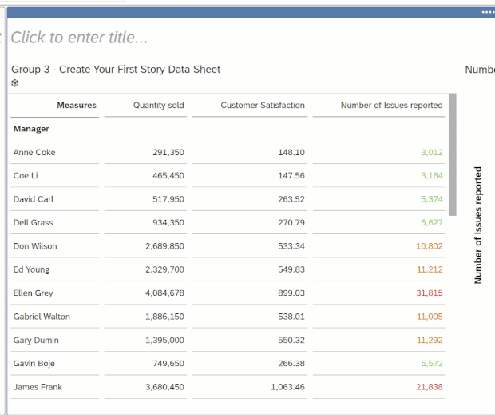

Next, let's filter out a specific Manager's sales from the "Sales Managers" chart by using Exclude.

**3.** Select the cell containing **Coe Li**  

**4.** Right-click and then select the **Exclude** icon

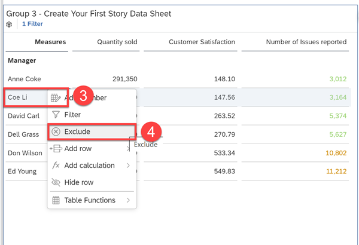

Click [here](https://help.sap.com/viewer/00f68c2e08b941f081002fd3691d86a7/release/en-US/6148ecb399634050aa6ae75e258dcc80.html) to learn more.

[DONE]
[ACCORDION-END]

[ACCORDION-BEGIN [Step 2: ](Create a Date Specific Filter)]

Let's create a date specific filter to exclude 2019 from the Gross Margin per Date chart.  

**5.** Select the Gross Margin per Date chart and open the **Builder** tab in the Designer panel

**6.** Hover over the Date dimension and click on the **Filter** icon  

**7.** Select **Filter by Member…**  

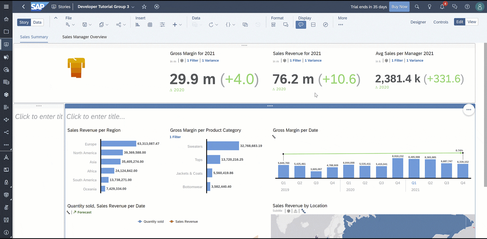

> There are two ways to filter a date dimension – Filter by Member or by Range.  

> - Filter by Member: Filter by Year, Quarter, Month, Week  

> - Filter by Range: Filter by specific dates (Ex. Jan 2019 to Dec 2020)

**8.** Select all years except for **2019**  

**9.** Click **OK**

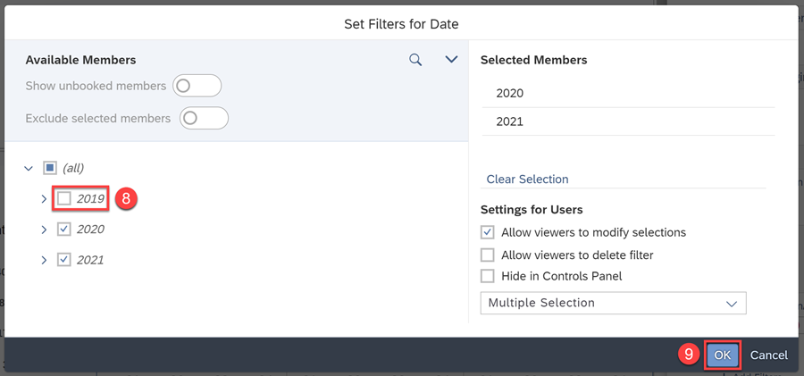

The chart will then reload and only show the data from 2020 and 2021.

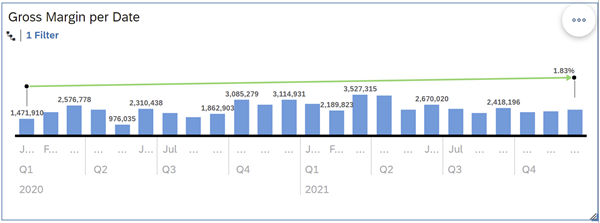

Click [here](https://help.sap.com/viewer/00f68c2e08b941f081002fd3691d86a7/release/en-US/5af47a52777e4f5d97f4a3b4c21921d0.html) to learn more.

[DONE]
[ACCORDION-END]

[ACCORDION-BEGIN [Step 3: ](Enhance functionality with Linked Analysis)]

Linked Analysis is dynamic feature that allows drilling through hierarchical data or creating filters that simultaneously update multiple charts in your story.

Let's create a Linked Analysis from the "Sales Revenue per Region" chart to dynamically interact with the rest of the charts on the page.

**10.**	Select **Linked Analysis** in the **Chart Action Menu**

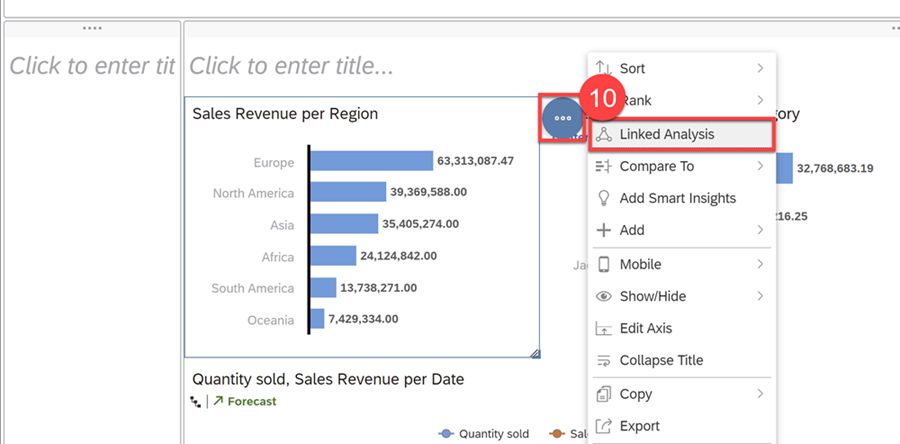

**11.**	Select **All Widgets on the Page**  

**12.**	Click **Apply**

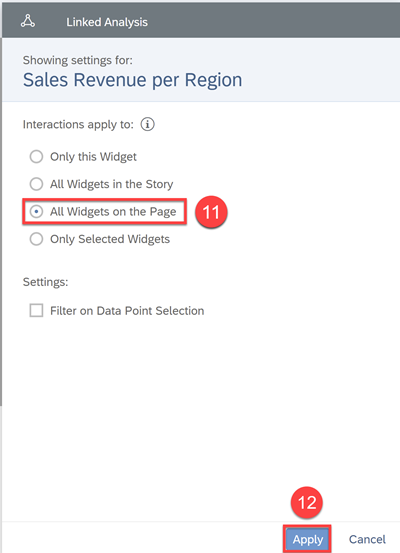

**13.**	Click on **Asia** segment of the Sales Revenue per Region chart and select the **Filter** icon

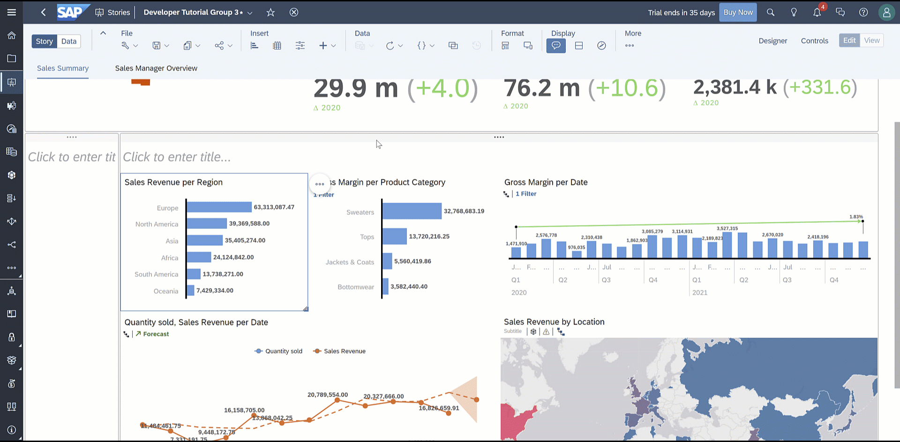

With this linked analysis created, filtering on **Asia** will simultaneously update all the other charts on this page to data within the Asia Region.

**14.**	To remove the **Asia** filter, click the **remove** icon and select Level 2 Hierarchy

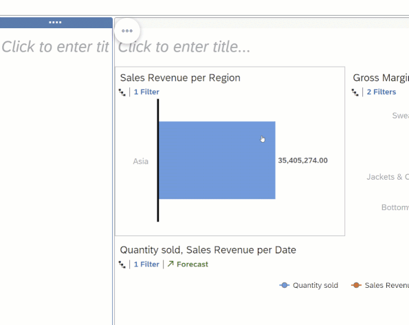

Click [here](https://help.sap.com/viewer/00f68c2e08b941f081002fd3691d86a7/release/en-US/c74d35c4218f49778d1a3a0e64dad715.html) to learn more.

[DONE]
[ACCORDION-END]

[ACCORDION-BEGIN [Step 4: ](Create an Input Control Filter)]

Input Control filters allow users to dynamically control the data displayed on the page. On each page, we've dedicated the left lane for these filters.

**15.**	Click on the left lane, then under the Insert tab, select the **Input Control** icon

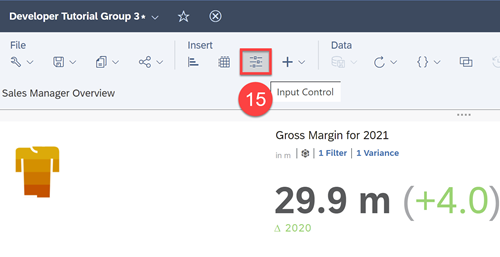

Let's create an Input Control filter where you can choose to look at the data in this page between 2019, 2020, and 2021.

**16.**	Select **Dimensions** > **Date** > **Filter by Member…**  

**17.**	Expand all and select **2019**, **2020**, **2021**  

**18.**	Click **OK**

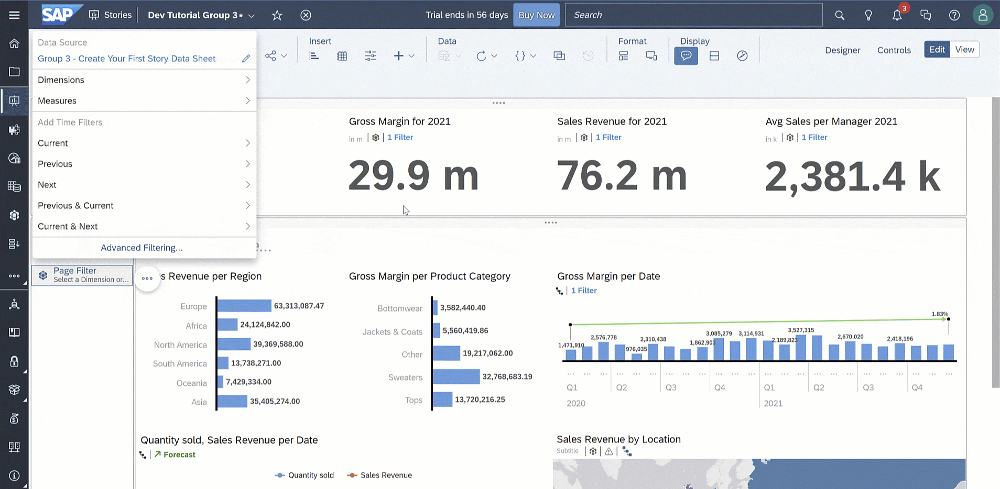

**19.**	Expand the Input Control Filter to show all the years

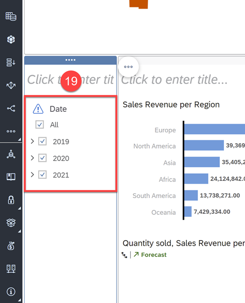

**20.**	Copy this Input Control filter to the left lane of the Sales Manager Overview page

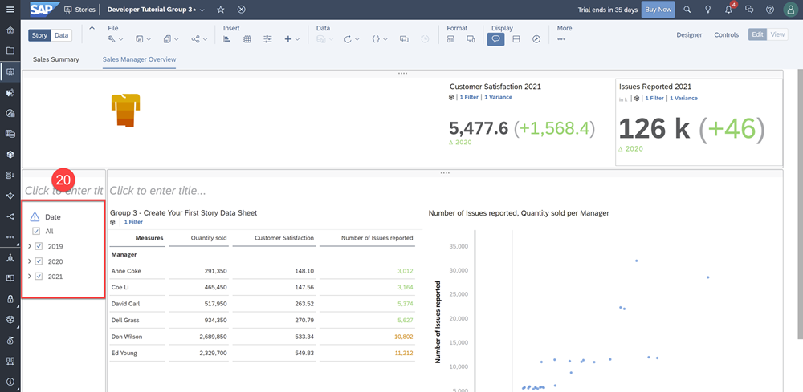

Click [here](https://help.sap.com/viewer/00f68c2e08b941f081002fd3691d86a7/release/en-US/6b8e8e8bbe5f4571886df58d9fa79127.html) to learn more.

> It is best practice to save regularly. Before moving on, click **Save**.

[DONE]
[ACCORDION-END]

[ACCORDION-BEGIN [Step 5: ](Test Yourself)]

[VALIDATE_1]

[ACCORDION-END]

---
