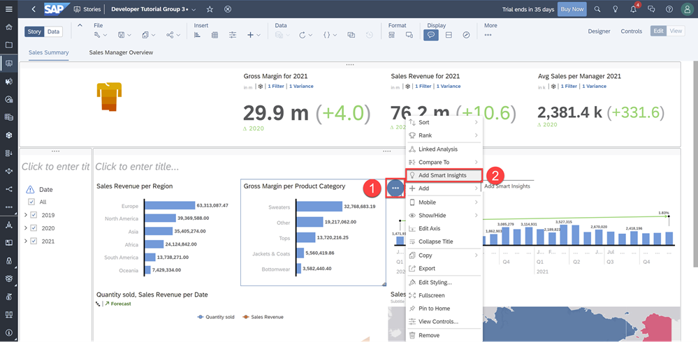
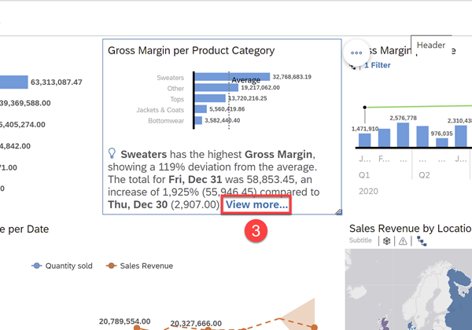
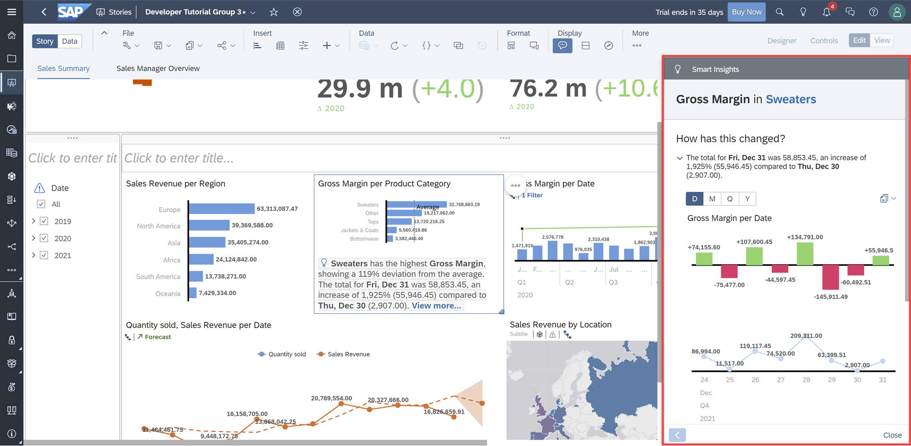
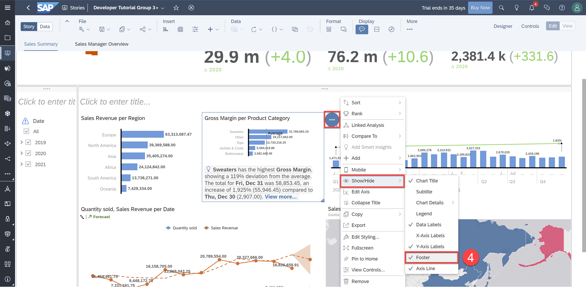
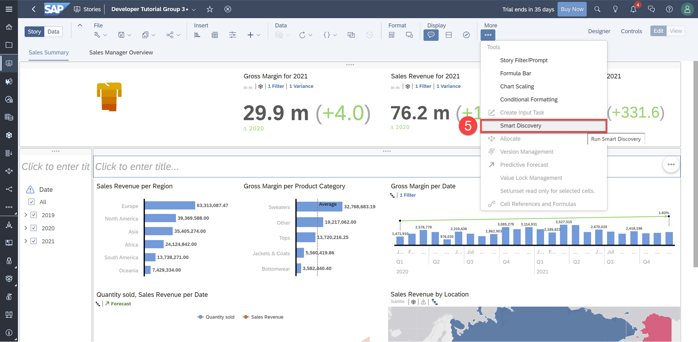
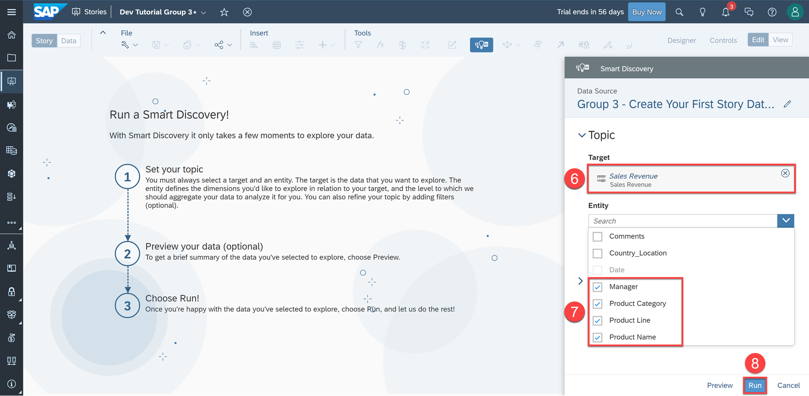
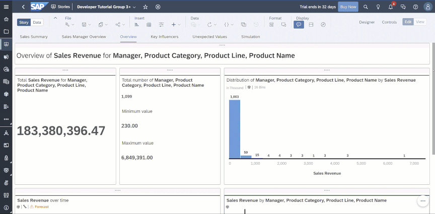
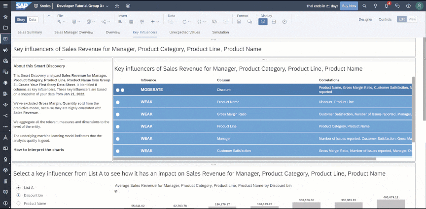
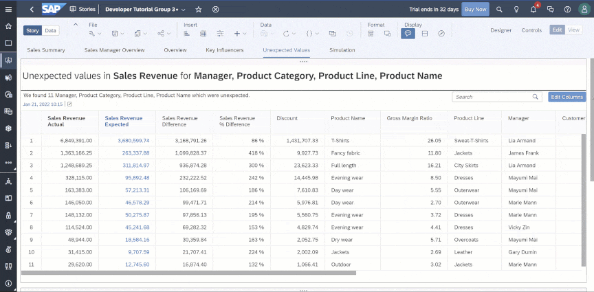
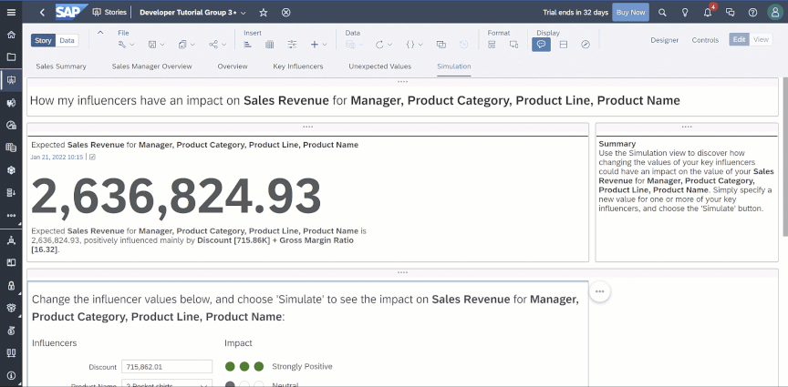

## Prerequisites
 - You have access to an SAP Analytics Cloud account

## Details
### You will learn
  - How to enable Smart Insights
  - How to enable Smart Discovery
  - How to learn more from Smart Discovery

<!-- Add additional information: Background information, longer prerequisites -->

---

[ACCORDION-BEGIN [Step 1: ](Run a Smart Insight)]

Let's run Smart Insights on the Gross Margin per Product Category chart to help us better understand the data within the chart.  

**1.** Click the **Chart Action Menu** of the Gross Margin per Product Category chart  

**2.** Click **Add Smart Insights**

Smart Insights then analyzes the underlying dataset and runs various statistical algorithms to uncover the top contributors influencing Gross Margin per Product Category.

**3.** Click **View More…**

The Smart Insights panel will then appear on the right to display insights specific to the selected data point or variance.

**4.** To remove the Smart Insights footer on the chart, go to the **Chart Action Menu** > **Show/Hide** > **Footer**

Click [here](https://help.sap.com/viewer/00f68c2e08b941f081002fd3691d86a7/release/en-US/c9eb30cc1e5b4c439cb871bf9612d2ac.html) to learn more.

[DONE]
[ACCORDION-END]

[ACCORDION-BEGIN [Step 2: ](Run a Smart Discovery)]

Smart Discovery analyzes your data by running a machine learning algorithm to help you explore your data in a specific context, to uncover new, or unknown relationships between columns within a dataset.

**5.** Click **Smart Discovery** under **More** in the Tool bar

You will then be prompted to set your topic by choosing a Target and Entity.

> - The **Target** is the measure or dimension you'd like to know more about.
> - The **Entity** defines the dimension(s) you'd like to explore in relation to the target, and the level to which Smart Discovery must aggregate your data to analyze it for you.

**6.**	Set **Sales Revenue** as the Target  

**7.**	Include **Manager**, **Product Category**, **Product Line**, and **Product Name** as the Entities to explore in relation to the Target  

**8.**	Click **Run**  

> Currently, you can't run Smart Discovery on more than one million cells. If this is a problem in your future endeavors, you can filter the data to reduce the number of cells included in your dataset.

[DONE]
[ACCORDION-END]

[ACCORDION-BEGIN [Step 3: ](Analyze and Gain New Insights)]

Smart Discovery will then generate up to four new pages that will be added to your story:  

### Overview
This page provides visualizations to summarize the results of the target, in this case, Sales Revenue.

### Key Influencers
Using classification and regression techniques, key influencers are ranked from highest to lowest based on their influence on our target, Sales Revenue.

### Unexpected Values
This page shows information on outliers in your data with a table showing the expected and actual values from the predictive model. A scatter plot and bar chart then displays these outliers.  

> This page is only displayed if there are unexpected values.

### Simulation
This page allows users to test hypothetical scenarios by toggling key influencers in an interactive what-if simulation. Let's try it out.

**9.** Increase the Discount toggle from `715,862.01` to `867,354.83`  

**10.** Click **Simulate**

With an increased discount of $151,492.82 on our products, the model simulated that our target, Sales Revenue, would increase by 18%. This is a good example of testing a hypothetical scenario to develop a sales strategy.

Click [here](https://help.sap.com/viewer/00f68c2e08b941f081002fd3691d86a7/release/en-US/2087d067329d477d96e44100c135e8e6.html) to learn more.

[DONE]
[ACCORDION-END]

[ACCORDION-BEGIN [Step 4: ](Test Yourself)]

[VALIDATE_1]

[ACCORDION-END]
---
