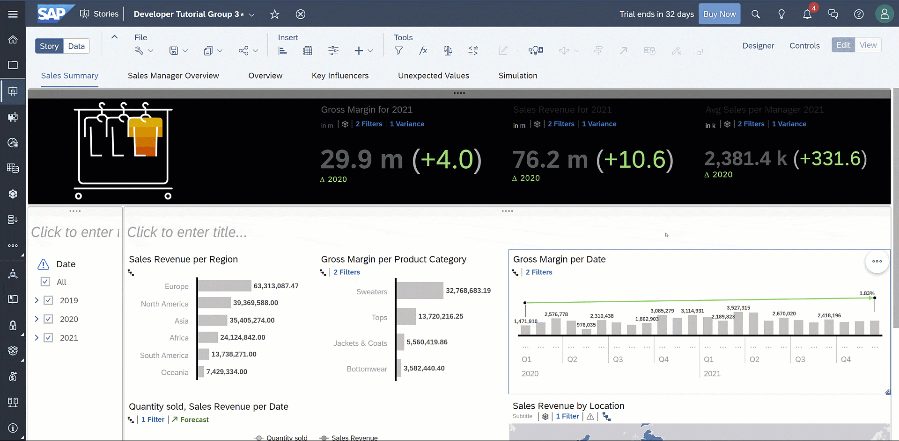
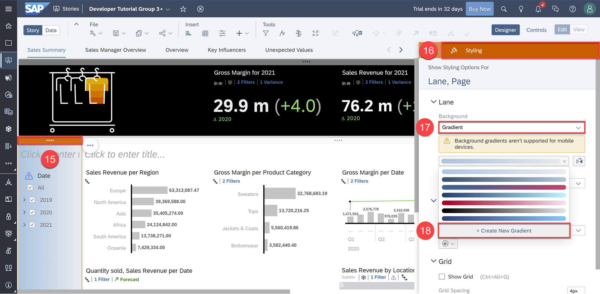
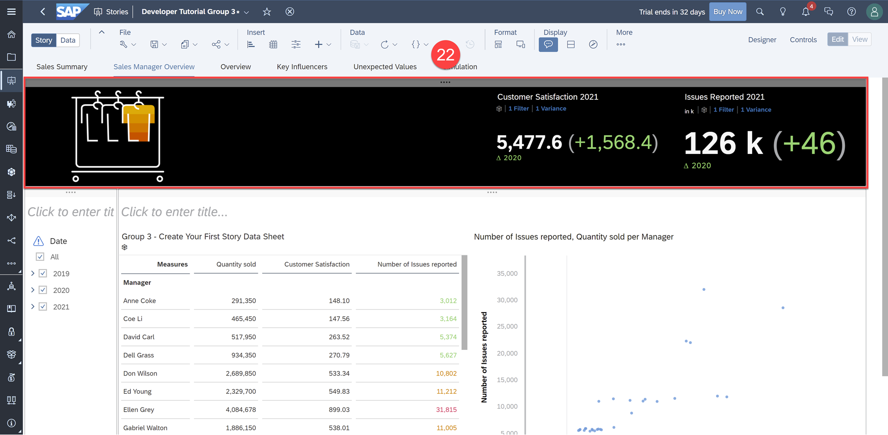

## Prerequisites
 - You have access to an SAP Analytics Cloud account

## Details
### You will learn
  - How to apply a theme and adjust styling options
  - Where to learn more about SAP Analytics Cloud

<!-- Add additional information: Background information, longer prerequisites -->

---

[ACCORDION-BEGIN [Step 1: ](Apply a Theme and Adjust Styling Options)]

In Preferences, you can apply default page properties such as page background to both responsive and canvas pages. Furthermore, you can customize the font, color, and color palettes of story tiles such as charts, tables, shapes, input controls, and others.

**1.**	To apply a theme, select **Preferences** under the File tab in the Tool bar

> Customizing your own themes and styling is useful when creating stories that adhere to your company's design standard.

Let's apply a custom color palette to our story that is based on our corporate colors.

**2.** Go to **Charts/Geo** under Tile Settings  

**3.** Under Default Color Palettes, select the **Standard** palette  

**4.** Click **+ Create New Palette**  

**5.** Change the number of swatches from 9 to 6  

**6.** Change each swatch hex color code to the following (from left to right):

    c6c2c2
    9e9ea3
    6b6363
    fc5411
    fc7928
    f9c43e

**7.** Click **Create**

**8.** Select **apply to all pages, lanes, and tiles**  

**9.** Click **OK**

> This would then apply our imported palette to all the existing pages, lanes, and tiles in the story. On the other hand, applying to new pages, lanes, and tiles would only change the palette of charts we make from here on out.

Click [here](https://help.sap.com/viewer/00f68c2e08b941f081002fd3691d86a7/release/en-US/d1ab3f5e52284e149da16a0aff691fbc.html) to learn more.

[DONE]
[ACCORDION-END]

[ACCORDION-BEGIN [Step 2: ](Format and Style Items)]

Let's further customize our story styling by making the top lane black with white text within as well as applying a grey gradient to our left lane.

### Top Lane
**10.** Select the top lane and open the **Styling** tab in the Designer panel  

**11.**	Choose black as the Background color

With a black background, let's make our Numeric Point charts more visible by changing the text white.  

**12.**	Click on a Numeric Point chart and open the **Styling** tab in the Designer panel  

**13.**	Choose white as the Font color

**14.**	Repeat Action 12-13 for the rest of the Numeric Point charts

### Left Lane

**15.**	Click on the left lane  

**16.**	Open the **Styling** tab in the Designer panel  

**17.**	In the Lane Section under Background, select **Gradient**  

**18.**	Click on the color scale and click **+ Create New Gradient**

**19.**	Change the left swatch to `ccccce`  

**20.**	Change the right swatch to `f2f2f2`  

**21.**	Click **Create**

Your dashboard should now look like this:

**22.** Apply these same color formats to the top and left lane in the Sales Manager Overview page

Click [here](https://help.sap.com/viewer/00f68c2e08b941f081002fd3691d86a7/release/en-US/a17d1b4103fb45d79199710310afb65a.html) to learn more.

[DONE]
[ACCORDION-END]

[ACCORDION-BEGIN [Step 3: ](Update Titles and Dynamic Texts)]

Let's create a dynamic text that automatically updates the text based on the source input control or filter.

**23.**	In the **Chart Action Menu** of the textbox, click **+ Add** and select **Dynamic Text**

**24.**	Select the **Dimensions** tab in the left navigation bar  

**25.**	Click **Region**  

**26.**	Click **Create**

**27.**	Add "Summary of Sales in" in front of the dynamic text to create a title like this:

Click [here](https://help.sap.com/viewer/00f68c2e08b941f081002fd3691d86a7/release/en-US/0b34d65766584dd28281a169bea8b4ee.html) to learn more. To finish off the story, let's rename the titles of a few charts.

**28.**	Update the left lane title to "Page Filters"  

**29.**	Update the "Gross Margin per Date" chart title to "Gross Margin over Time"  

**30.**	Update the "Quantity sold, Sales Revenue per Date" chart title to "Quantity sold, Sales Revenue over Time"

**31.**	In the Sales Manager Overview page, update the left lane title to "Page Filters"  

**32.**	Select **Remove** in the **Chart Action Menu** of the empty text object

> It is best practice to save regularly. Before moving on, click **Save**.

[DONE]
[ACCORDION-END]

[ACCORDION-BEGIN [Step 4: ](Next Steps)]

Congratulations on completing the last group of tutorials! You have now learned the capabilities offered in SAP Analytics Cloud and created an entire dashboard. With this knowledge, you can now interact with and create dashboards on your own.

Here are a few resources to learn more about SAP Analytics Cloud:

1. [The SAP Analytics Cloud Community](https://community.sap.com/topics/cloud-analytics) contains the most updated resources on SAP Analytics Cloud such as blogs, videos, and webinars from the most basic to advanced features.
2. [The Help Portal](https://help.sap.com/viewer/00f68c2e08b941f081002fd3691d86a7/release/en-US/0b34d65766584dd28281a169bea8b4ee.html) is your place to go to for detailed product documentation.
3. [SAP Analytics Training](https://www.youtube.com/channel/UC209-e5iXiztoTL4jSdxn3g) YouTube Channel contains various demo tutorials and is extremely effective for learning how to use specific SAP Analytics Cloud features.
4. [Introducing SAP Analytics Cloud Learning Journey](https://learning.sap.com/learning-journey/introducing-sap-analytics-cloud) introduces you to the different parts of SAP Analytics Cloud, including many demonstrations.

We wish you all the best in your journey of learning, using, and creating in SAP Analytics Cloud!

[DONE]
[ACCORDION-END]

[ACCORDION-BEGIN [Step 5: ](Test Yourself)]

[VALIDATE_1]

[ACCORDION-END]
---
