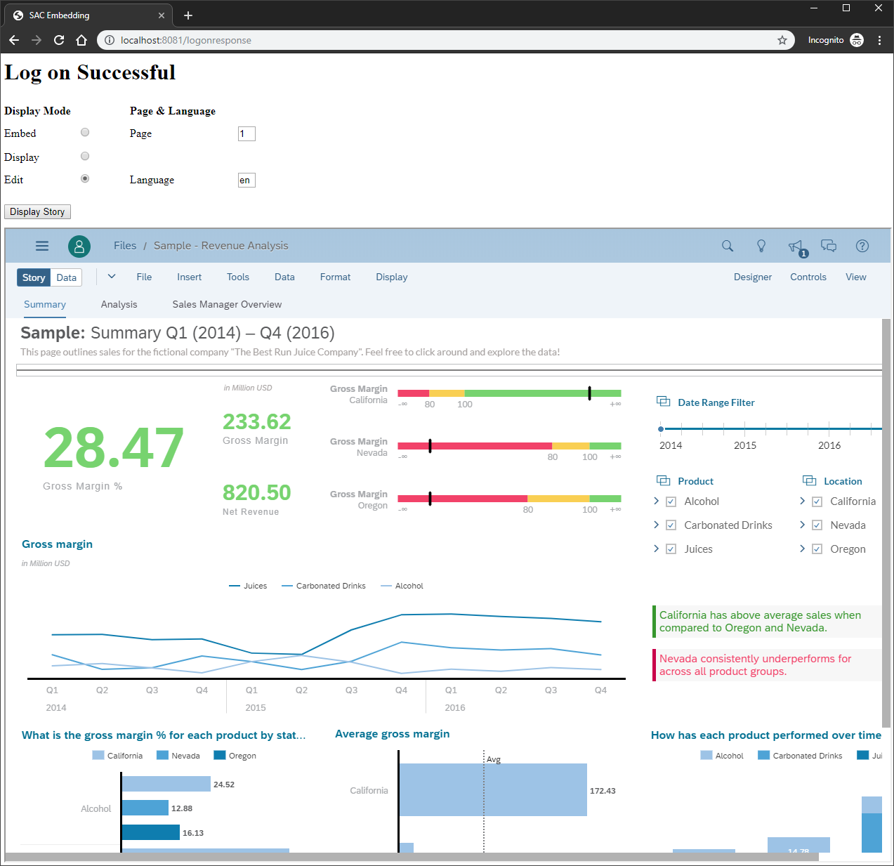
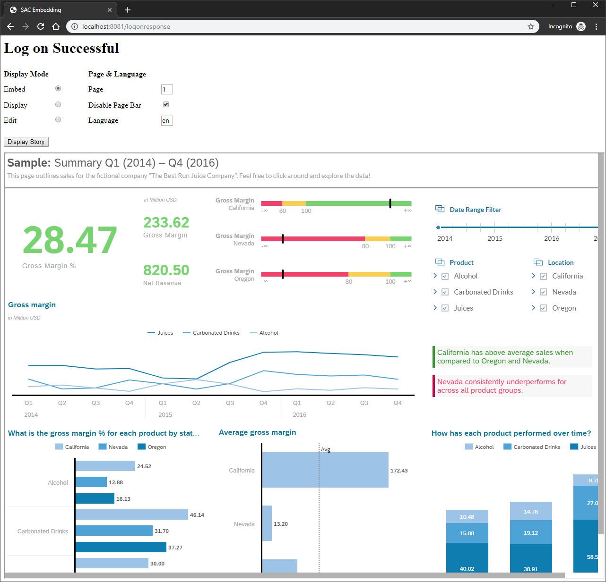
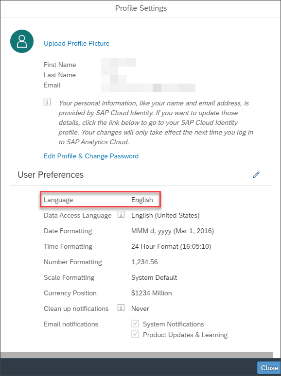
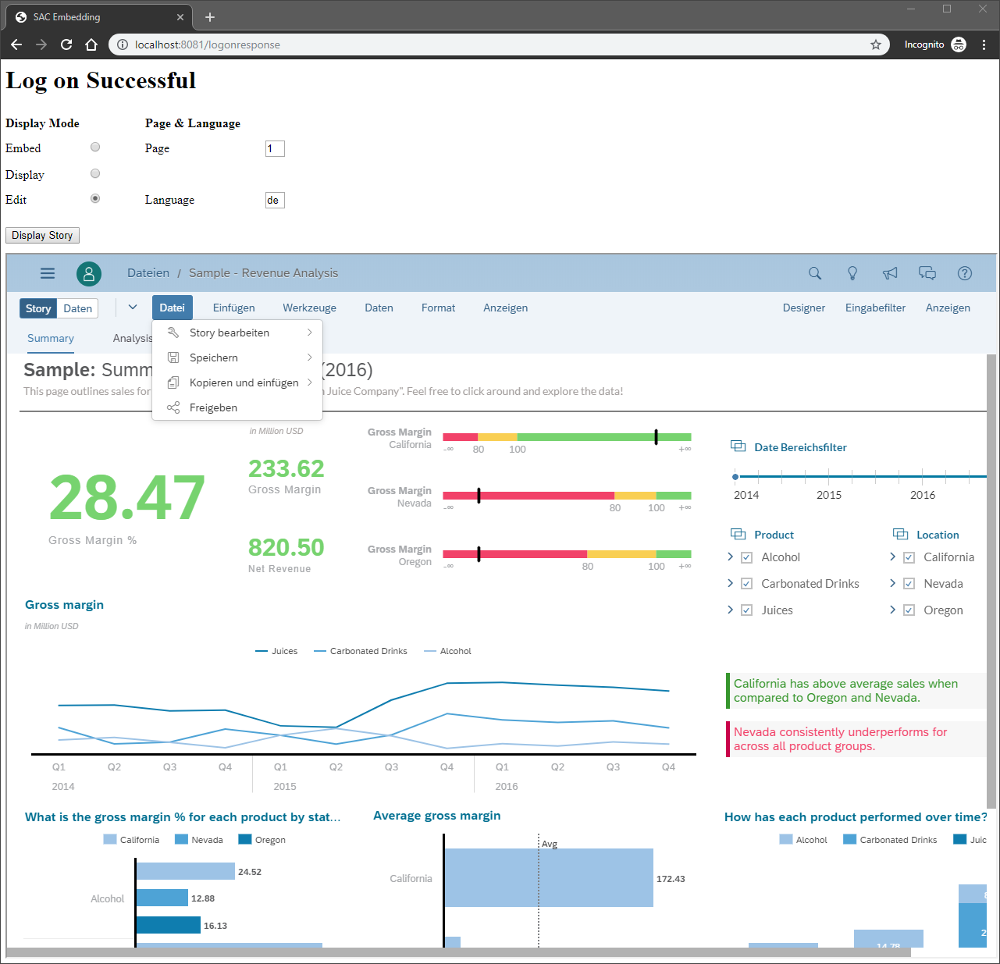

## Prerequisites
 - 1.	You have created the web app from the [previous tutorial](sac-embed-story) and you have embedded an SAP Analytics Cloud story.

## Details
### You will learn
  - How to change the mode an embedded SAP Analytics Cloud story is displayed
  - How to open a story with a specific page
  - How to change the language your story is displayed in

In the previous tutorial [Embed an SAP Analytics Cloud Story in a Simple Web App](sac-embed-story) you have learned how to apply the SAP Analytics Cloud URL API to display a specific story in an `<iframe>`. Now you can make use of the display parameters that are added to the story URL as query parameters after the story ID. The following parameters are available:

  -	`mode`: indicates the mode the story will open in. By default, "edit" is enabled. The other modes are "display" and "embed".
  -	`pageBar`: shows or disables the page bar. By default, the page bar is displayed. This parameter is only applicable to the embed mode and will be ignored in other modes.
  -	`page`: opens the story page you specify here.
  -	`lang`: defines the language your story will be displayed in.

You can find a detailed description of the parameters in the [API documentation] (https://help.sap.com/viewer/a4406994704e4af5a8559a640b496468/release/en-US/fe8d560fce4f4fdd8445455f8effd3c0.html).


---

[ACCORDION-BEGIN [Step 1: ](Enhance the web application)]

In this tutorial you extend the web app by UI elements that dynamically set the display parameters of the URL in the code. You can easily see the effect of the change in the story that is rendered in the `<iframe>`.

1.	Open the `LogResponse.html` file with an editor of your choice.

2.	Copy the following code. In file `LogResponse.html` replace the lines of code of the `<style>` element. You extend the internal CSS with the formatting of new UI elements, which are then implemented.

    ```HTML
    <style>
        * {
            margin-bottom: 12px;
        }

        iframe {
          width: 100%;
          height: 900px;
        }

        label,
        p {
          display: inline-block;
        }

        input[type="text"] {
          width: 25px;
        }

        .left {
          width: 100px;
        }

        .right {
          width: 150px;
          margin-left: 50px;
        }

        p.right {
          margin-left: 75px;
        }
    </style>
    ```

3.  Now you provide the new UI elements. Copy the following code and paste it between the header element `<h1>` and `<button>`.

    ```HTML
    <form id=displayParameter>
      <p class="left"><b>Display Mode</b></p>
      <p class="right"><b>Page & Language</b></p><br>

      <label class="left" for="r1">Embed</label>
      <input type="radio" name="displaymode" id="r1" value="embed" onclick="controlCB()">

      <label class="right" for="t1">Page</label>
      <input type="text" name="page_num" id="t1" value="1"><br>

      <label class="left" for="r2">Display</label>
      <input type="radio" name="displaymode" id="r2" value="display" onclick="controlCB()">

      <label class="right" for="cb" id="cb_label">Disable Page Bar</label>
      <input type="checkbox" name="pagedisabled" id="cb"><br>

      <label class="left" for="r3">Edit</label>
      <input type="radio" name="displaymode" id="r3" value="edit" onclick="controlCB()" checked>

      <label class="right" for="t2">Language</label>
      <input type="text" name="language" id="t2" value="en"><br>
    </form>
    ```

4.  Copy the following code and paste it before the button click event handler. It implements a function that hides the **Display Page Bar** checkbox, if the display mode is not `embed`.

    ```JavaScript
    $(document).ready(function () { controlCB() });

    function controlCB() {
       var mode = $("input[name='displaymode']:checked").val();
       var cbLabel = $('#cb_label')[0];
       var cb = $('#cb')[0];
       if (mode === "embed") {
           cbLabel.style.display = "inline-block";
           cb.style.display = "inline-block";
       } else {
           cbLabel.style.display = "none";
           cb.style.display = "none";
       }
    };
    ```

5.  The code of the `LogResponse.html` file should look something like this:

    ```JavaScript
    <html>

    <head>
    	<title>SAC Embedding</title>
    	<style>
    		* {
    			margin-bottom: 12px;
    		}

    		iframe {
    			width: 100%;
    			height: 900px;
    		}

    		label,
    		p {
    			display: inline-block;
    		}

    		input[type="text"] {
    			width: 25px;
    		}

    		.left {
    			width: 100px;
    		}

    		.right {
    			width: 150px;
    			margin-left: 50px;
    		}

    		p.right {
    			margin-left: 75px;
    		}
    	</style>
    </head>

    <body>
    	<h1>Log on Successful</h1>

    	<form id=displayParameter>
    		<p class="left"><b>Display Mode</b></p>
    		<p class="right"><b>Page & Language</b></p><br>

    		<label class="left" for="r1">Embed</label>
    		<input type="radio" name="displaymode" id="r1" value="embed" onclick="controlCB()">

    		<label class="right" for="t1">Page</label>
    		<input type="text" name="page_num" id="t1" value="1"><br>

    		<label class="left" for="r2">Display</label>
    		<input type="radio" name="displaymode" id="r2" value="display" onclick="controlCB()">

    		<label class="right" for="cb" id="cb_label">Disable Page Bar</label>
    		<input type="checkbox" name="pagedisabled" id="cb"><br>

    		<label class="left" for="r3">Edit</label>
    		<input type="radio" name="displaymode" id="r3" value="edit" onclick="controlCB()" checked>

    		<label class="right" for="t2">Language</label>
    		<input type="text" name="language" id="t2" value="en"><br>
    	</form>

    	<button type="button">Display Story</button>
    	<iframe id="attachframe"></iframe>
    	<script src="https://ajax.googleapis.com/ajax/libs/jquery/3.2.1/jquery.min.js"></script>

    	<script>

    		$(document).ready(function () { controlCB() });

    		function controlCB() {
    			var mode = $("input[name='displaymode']:checked").val();
    			var cbLabel = $('#cb_label')[0];
    			var cb = $('#cb')[0];
    			if (mode === "embed") {
    				cbLabel.style.display = "inline-block";
    				cb.style.display = "inline-block";
    			} else {
    				cbLabel.style.display = "none";
    				cb.style.display = "none";
    			}
    		};


    		$("button").click(function () {

    			var url = https://<TENANT>/sap/fpa/ui/tenants/<TENANT_ID>/bo/story/<STORY_ID>?mode=" + mode + "&pageBar=" + pageBar + "&page=" + page + "&lang=" + lang; 				//<<<<<<<<<<<<<<<<<<<<<<<< NEED TO CONFIRGURED!!!
    			var data = {};

    			var mode = $("input[name='displaymode']:checked").val();
    			var page = $('#t1').val();
    			var lang = $('#t2').val();

    			var pageBar;
    			var disabled = $("input[name='pagedisabled']:checked").val();
    			if (disabled) {
    				pageBar = "disable";
    			} else {
    				pageBar = "enable";
    			}

    			// 1.step: get the access token from session via page /getToken
    			$.ajax({
    				type: 'GET',
    				data: JSON.stringify(data),
    				contentType: 'application/json',
    				url: '/getToken',
    				success: function (data) {
    					console.log('success');
    					console.log(JSON.stringify(data));

    					var token_details = JSON.parse(data);

    					var postheaders = {
    						'Authorization': 'Bearer ' + token_details.access_token,
    					};

    					// 2. step: get the SAC story
    					$.ajax({
    						type: 'GET',
    						url: url,
    						contentType: 'application/json',
    						headers: postheaders,
    						xhrFields: {
    							withCredentials: true
    						},
    						success: function (data, status, settings) {
    							console.log(settings.getResponseHeader("X-CSRF-Token"));
    							console.log(JSON.stringify(data));

    							$("iframe").attr("src", url);
    						},

    						error: function (xhr, ajaxOptions, thrownError) {
    							alert(xhr.status);
    							alert(thrownError);
    						}
    					});
    				}
    			});
    		});

    	</script>
    </body>

    </html>
    ```

6.  Adapt the variable `url`. Add the following display parameters after the story ID:

    `https://<TENANT>/sap/fpa/ui/tenants/<TENANT_ID>/bo/story/<STORY_ID>?mode=" + mode + "&pageBar=" + pageBar + "&page=" + page + "&lang=" + lang`

    You need to substitute `<TENANT>`, `<TENANT_ID>`, and `<STOTY_ID>`.

7.  Save the file `LogResponse.html`.

[DONE]
[ACCORDION-END]

---

[ACCORDION-BEGIN [Step 2: ](Start the web application)]

Now you can start the enhanced web app. If you need support for starting the app, you can go back to step 3 of tutorial [Embed an SAP Analytics Cloud Story in a Simple Web App](sac-embed-story).

After you have successfully logged into SAP Analytics Cloud, you see some additional elements on the `logonresponse` page. All these elements control how the story is displayed in the `<iframe>`.



For example, you can set the display mode to `embed`. The URL syntax is

`https://<TENANT>/sap/fpa/ui/tenants/<TENANT_ID>/bo/story/<STORY_ID>?mode=embed`

By default the display mode is `edit`, which allows you to use the full range of editing options.

You can change the display mode of your embedded story by simply changing the value of **Display Mode** in your app. In the background, the display parameter `mode` of the URL is changed.

When you set the **Display Mode** to **`Embed`**, a new setting **Disable Page Bar** is displayed on the page. If you set this flag and click on the **Display Story** button, the page bar is not shown anymore.



In the **Page** field, you can define the page that is displayed in the `<iframe>`. Pages that are hidden are not considered here, if you set mode to  **`Embed`** or **`Display`**.

Finally, you can define the language the story is displayed in. The default is the language of your SAP Analytics Cloud user profile.



>Note: There is another language setting in the user profile, **Data Access Language**, that is used for retrieving data from live connections to remote data sources (if no language is explicitly defined for the connection). The **Data Access Language** setting is not affected by the display parameter.

You can override the **Language** with the URL API. If you, for example, set the language display parameter to **`de`** (German), all generic SAP Analytics Cloud meta data will be displayed in this language.



>It is also possible to display all data defined in the story, e.g. page names, calculated measure names, as well as model data like dimension names, dimension member names, measure names in the language defined with the URL API. However, the example story in this tutorial does not have story and model translations.


[VALIDATE_1]
[ACCORDION-END]


---
