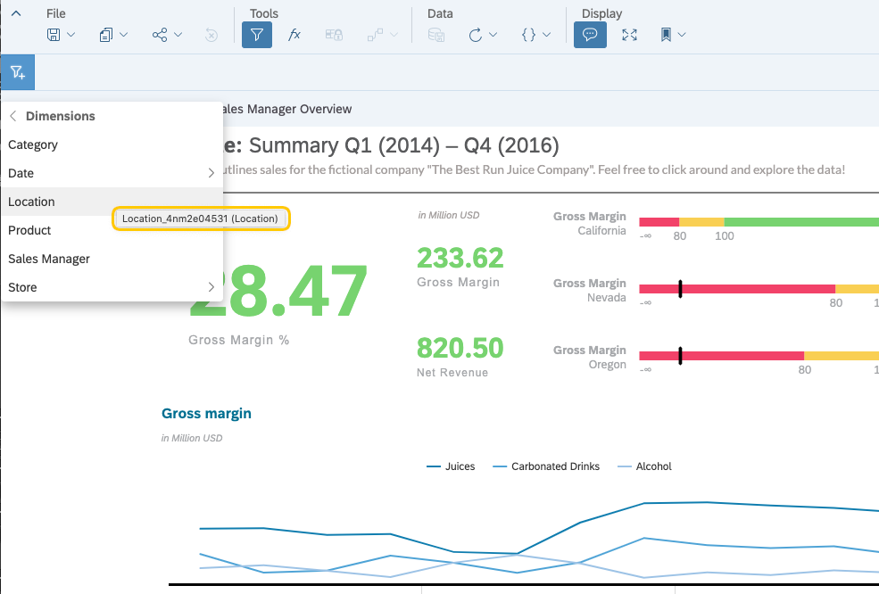

## Prerequisites
- 	You have created the web app, as described in the tutorial [Embed an SAP Analytics Cloud Story in a Simple Web App](sac-embed-story), and you have embedded an SAP Analytics Cloud story.  
- 	You have added display parameters, as described in the tutorial [Modify the Way an Embedded Story is Displayed](sac-embed-story-display-parameters), and you have embedded an SAP Analytics Cloud story.

## Details
### You will learn
- How to set a filter for a specific model of an embedded SAP Analytics Cloud story
- How to gather necessary IDs and values for filter definition
- How to make use of the SAP Analytics Cloud URL API to request all stories including their models from a tenant

In the previous tutorial, [Modify the Way an Embedded Story is Displayed](sac-embed-story-display-parameters), you have learned how to use the SAP Analytics Cloud URL API to change the look and feel of an embedded story. This is just a small part from that what the SAC Rest-based APIs can deliver in terms of functional scope. For analytical purposes, it is often necessary to look at the results for a particular period of time or calculate results for a particular group of people. These are some of the reasons why filters are required. In SAP Analytics Cloud the filter parameters can be added to the story URL as additional query parameters. This enables you to adjust even further the story you want to embed.

The following parameters are available:

- `f<XX>Model`: specifies which model of a story the filter needs to be applied to. The value has to start with the package name, followed by the model name. For example: `sap.epm:BestRunJuice_SampleModel`.
- `f<XX>Dim`: identifies the dimension to apply the filter to.
- `f<XX>Hierarchy`: indicates a hierarchy to filter (optional).
- `f<XX>Op` : filter operator `in` or `notIn` . By default the value is `in` (optional).
- `f<XX>Unbooked`: enable filtering on unbooked data. The value can be `true` or `false` and is set to false by default (optional).
- `f<XX>Val` : This is the value you want to filter on. The API expects the ID of the dimension members.

`<XX>` within a filter definition, it is a freely selected two-digit number and is used to specify which parameters belong together. This is important when more than one filter is passed. The passed filter is applied only to the embedded story and will not be persisted.

You can find a detailed description of the parameters in the [API documentation] (https://help.sap.com/viewer/a4406994704e4af5a8559a640b496468/release/en-US/0c84d524ee1c4b88836287579cae7923.html).

---

[ACCORDION-BEGIN [Step 1: ](Enhance the web application)]

Like in the previous tutorial [Modify the Way Story is Displayed](sac-embed-story-display-parameters) you extend the web app by UI elements that dynamically set the filter parameters of the URL in the code. You can easily see the effect of the change in the story that is rendered in the `<iframe>`.

1.	Open the `LogResponse.html` file with an editor of your choice.

2.	Copy the following code. In the file `LogResponse.html` replace the lines of code of the `<style>` element. You extend the internal CSS with the formatting of new UI elements, which are implemented later.

    ```HTML
    <style>
    * {
      margin-bottom: 12px;
    }

    iframe {
      width: 100%;
      height: 900px;
    }

    label,
    p {
      display: inline-block;
    }

    input[type="text"] {
      width: 150px;
    }

    .left {
      width: 150px;
    }

    .middle {
      width:  150px;
      margin-left: 100px;
    }

    .right {
      width: 150px;
      margin-left: 100px;
    }

    p.right {
      margin-left: 125px;
    }

    p.middle {
      margin-left: 250px;
    }
    </style>
    ```


3.  Now you provide the new UI elements. Copy the following code and paste it between the header element `<h1>` and `<button>` .

    ```HTML
    <form id=displayParameter>
      <p class="left"><b>Filter Properties</b></p>
      <p class="middle"><b>Display Mode</b></p>
      <p class="right"><b>Page & Language</b></p><br>

      <label class="left" for="story" >Story ID</label>
		  <input type="text" name="story" id="story" value="7E0050581E24D39CE10000000A784278"><br>

      <label class="left" for="model">Filter Model ID</label>
      <input type="text" name="filter" id="model" value="sap.epm:BestRunJuice_SampleModel">

      <label class="middle" for="r1">Embed</label>
      <input type="radio" name="displaymode" id="r1" value="embed" onclick="controlCB()">

      <label class="right" for="t1">Page</label>
      <input type="text" name="page_num" id="t1" value="1"><br>

      <label class="left" for="parameter">Filter Dimension ID</label>
      <input type="text" name="dimension" id="dimension" value="Location_4nm2e04531">

      <label class="middle" for="r2">Display</label>
      <input type="radio" name="displaymode" id="r2" value="display" onclick="controlCB()">

      <label class="right" for="cb" id="cb_label">Disable Page Bar</label>
      <input type="checkbox" name="pagedisabled" id="cb"><br>

      <label class="left" for="value">Filter Value ID</label>
      <input type="text" name="value" id="value" value="SA1">

      <label class="middle" for="r3">Edit</label>
      <input type="radio" name="displaymode" id="r3" value="edit" onclick="controlCB()" checked>

      <label class="right" for="t2">Language</label>
      <input type="text" name="language" id="t2" value="en"><br>

      <label class="left" for="operator">Filter operator</label>
      <select type="select" name="op" id="operator" value="in">
        <option>in</option>
        <option>notIn</option>
      </select><br>

      <label class="left" for="applyfilter">Apply Filter</label>
      <select type="select" name="ApplyFilter" id="applyfilter" value="yes">
        <option>yes</option>
        <option>no</option>
      </select><br>
    </form>
    ```


4.  Copy the following code and replace the button click event handler. It sets the model name, dimension, filter operator and filter value into the corresponding URL parameters. The parameters out of the previous tutorial, like mode page and lang, are set as well.

    ```JavaScript
    $("button").click(function () {

      var sStory		= $('#story').val();
      var sModel  	= $('#model').val();
      var sDimension	= $('#dimension').val();
      var sOperator	= $('#operator').val();
      var sValue 		= $('#value').val();
      var sAplFilter	= $('#applyfilter').val();
      var mode = $("input[name='displaymode']:checked").val();
      var page = $('#t1').val();
      var lang = $('#t2').val();

      var url = "<TENANT_URL>/sap/fpa/ui/bo/story/" + sStory + "?mode=" + mode + "&pageBar=" + pageBar +  "&lang=" + lang 	    //<<<<<<<<<<<<<<<<<<<<< NEEDS TO BE ADJUSTED!
      var data = {};

      if(sAplFilter === 'yes'){

				url += "&f01Model="  + sModel + "&f01Dim=" + sDimension + "&f01Val=" + sValue + "&f01Op=" + sOperator; 	    
			}


      var pageBar;
      var disabled = $("input[name='pagedisabled']:checked").val();
      if (disabled) {
        pageBar = "disable";
      } else {
        pageBar = "enable";
      }

      // 1.step: get the access token
      $.ajax({
        type: 'GET',
        data: JSON.stringify(data),
        contentType: 'application/json',
        url: '/getToken',
        success: function (data) {
          console.log('success');
          console.log(JSON.stringify(data));

          var token_details = JSON.parse(data);

          var postheaders = {
            'Authorization': 'Bearer ' + token_details.access_token,
          };

          // 2. step: get the SAC story
          $.ajax({
            type: 'GET',
            url: url,
            contentType: 'application/json',
            headers: postheaders,
            xhrFields: {
              withCredentials: true
            },
            success: function (data, status, settings) {
              console.log(settings.getResponseHeader("X-CSRF-Token"));
              console.log(JSON.stringify(data));

              $("iframe").attr("src", url);
            },

            error: function (xhr, ajaxOptions, thrownError) {
              alert(xhr.status);
              alert(thrownError);
            }
          });
        }
      });
    });
    ```

5.  The code of the `LogResponse.html` file should look something like this:

    ```JavaScript
    <html>

    <head>
    <title>SAC Embedding</title>
    <style>
    * {
      margin-bottom: 12px;
    }

    iframe {
      width: 100%;
      height: 900px;
    }

    label,
    p {
      display: inline-block;
    }

    input[type="text"] {
      width: 150px;
    }

    .left {
      width: 150px;
    }

    .middle {
      width:  150px;
      margin-left: 100px;
    }

    .right {
      width: 150px;
      margin-left: 100px;
    }

    p.right {
      margin-left: 125px;
    }

    p.middle {
      margin-left: 250px;
    }
    </style>
    </head>

    <body>
    <h1>Log on Successful</h1>
    <form id=displayParameter>
    <p class="left"><b>Filter Properties</b></p>
    <p class="middle"><b>Display Mode</b></p>
    <p class="right"><b>Page & Language</b></p><br>

    <label class="left" for="story" >Story ID</label>
		<input type="text" name="story" id="story" value="7E0050581E24D39CE10000000A784278"><br>

    <label class="left" for="model">Filter Model ID</label>
    <input type="text" name="filter" id="model" value="sap.epm:BestRunJuice_SampleModel">

    <label class="middle" for="r1">Embed</label>
    <input type="radio" name="displaymode" id="r1" value="embed" onclick="controlCB()">

    <label class="right" for="t1">Page</label>
    <input type="text" name="page_num" id="t1" value="1"><br>

    <label class="left" for="parameter">Filter Dimension ID</label>
    <input type="text" name="dimension" id="dimension" value="Location_4nm2e04531">

    <label class="middle" for="r2">Display</label>
    <input type="radio" name="displaymode" id="r2" value="display" onclick="controlCB()">

    <label class="right" for="cb" id="cb_label">Disable Page Bar</label>
    <input type="checkbox" name="pagedisabled" id="cb"><br>

    <label class="left" for="value">Filter Value ID</label>
    <input type="text" name="value" id="value" value="SA1">

    <label class="middle" for="r3">Edit</label>
    <input type="radio" name="displaymode" id="r3" value="edit" onclick="controlCB()" checked>

    <label class="right" for="t2">Language</label>
    <input type="text" name="language" id="t2" value="en"><br>

    <label class="left" for="operator">Filter operator</label>
    <select type="select" name="op" id="operator" value="in">
      <option>in</option>
      <option>notIn</option>
    </select><br>

    <label class="left" for="applyfilter">Apply Filter</label>
    <select type="select" name="ApplyFilter" id="applyfilter" value="yes">
      <option>yes</option>
      <option>no</option>
    </select><br>

    </form>
    <button type="button">Display Story</button>
    <iframe id="attachframe"></iframe>
    <script src="https://ajax.googleapis.com/ajax/libs/jquery/3.2.1/jquery.min.js"></script>

    <script>
    $(document).ready(function () { controlCB() });

    function controlCB() {
      var mode = $("input[name='displaymode']:checked").val();
      var cbLabel = $('#cb_label')[0];
      var cb = $('#cb')[0];
      if (mode === "embed") {
        cbLabel.style.display = "inline-block";
        cb.style.display = "inline-block";
      } else {
        cbLabel.style.display = "none";
        cb.style.display = "none";
      }
    };
    $("button").click(function () {

      var sStory		= $('#story').val();
      var sModel  	= $('#model').val();
      var sDimension	= $('#dimension').val();
      var sOperator	= $('#operator').val();
      var sValue 		= $('#value').val();
      var sAplFilter	= $('#applyfilter').val();
      var mode = $("input[name='displaymode']:checked").val();
      var page = $('#t1').val();
      var lang = $('#t2').val();

      var url = https://<TENANT>/sap/fpa/ui/tenants/<TENANT_ID>/bo/"+ sStory + " + mode + "&pageBar=" + pageBar +  "&lang=" + lang //<<<<<<<<<<<<<<<<<<<<< NEEDS TO BE ADJUSTED!

      if(sAplFilter === 'yes'){

				url += "&f01Model="  + sModel + "&f01Dim=" + sDimension + "&f01Val=" + sValue + "&f01Op=" + sOperator; 	    

			}

      var data = {};

      var pageBar;
      var disabled = $("input[name='pagedisabled']:checked").val();
      if (disabled) {
        pageBar = "disable";
      } else {
        pageBar = "enable";
      }

      // 1.step: get the access token
      $.ajax({
        type: 'GET',
        data: JSON.stringify(data),
        contentType: 'application/json',
        url: '/getToken',
        success: function (data) {
          console.log('success');
          console.log(JSON.stringify(data));

          var token_details = JSON.parse(data);

          var postheaders = {
            'Authorization': 'Bearer ' + token_details.access_token,
          };

          // 2. step: get the SAC story
          $.ajax({
            type: 'GET',
            url: url,
            contentType: 'application/json',
            headers: postheaders,
            xhrFields: {
              withCredentials: true
            },
            success: function (data, status, settings) {
              console.log(settings.getResponseHeader("X-CSRF-Token"));
              console.log(JSON.stringify(data));

              $("iframe").attr("src", url);
            },

            error: function (xhr, ajaxOptions, thrownError) {
              alert(xhr.status);
              alert(thrownError);
            }
          });
        }
      });
    });

    </script>
    </body>

    </html>
    ```

6. Adjust the variable `url`. Add the following filter parameters after the story ID:
The sample story `Sample - Revenue Analysis` is available in every SAC tenant. In this tutorial we use this story but you can, of course, use your own story.

- `https://<TENANT_URL>/sap/fpa/ui/bo/ + sStory + mode + "&pageBar=" + pageBar +  "&lang=" + lang + "&f01Model="  + sModel + "&f01Dim=" + sDimension + "&f01Val=" + sValue + "&f01Op=" + sOperator`

[DONE]
[ACCORDION-END]

[ACCORDION-BEGIN [Step 2: ](Gather filter information)]
To apply a filter to a model of a story, you need to set the following parameters that can be applied to a story model. To identify a model, you also need the package name is, e.g. `sap.epm:BestRunJuice_SampleModel`. In this example `sap.epm` is the package and `BestRunJuice_SampleModel` the name of the model. Setting a filter also requires the dimension ID, the filter operator and the filter value ID. The model name together with the package name can be determined by using the following API: `https://<TENANT_URL>/api/v1/stories?include=models`. The result of this call is a JSON object that lists for your tenant all stories, their models and other meta data. The metadata for our sample story looks as follows:

```JSON
{
  "name":"Sample - Revenue Analysis",
  "description":"The Best Run Juice Company",
  "createdBy":"XXXXXXX",
  "id":"7E0050581E24D39CE10000000A784278",
  "created":"2018-12-17T22:06:40.632Z",
  "changed":"2019-11-13T11:47:54.551Z",
  "isTemplate":false,"isSample":true,
  "models":[
    {
      "description":"Model for sample",
      "id":"sap.epm.Planned_Events_Sample:Planned_Events_Sample",
      "isPlanning":true
    },
    {
      "description":"Model for the sample story",
      "id":"sap.epm:BestRunJuice_SampleModel",
      "isPlanning":true
      }
    ],
  "changedBy":"XXXXXX",
  "openURL":"/sap/fpa/ui/tenants/XXXXX/bo/story/7E0050581E24D39CE10000000A784278"
}
```

The section `models` shows all models used by a story. The value of the `id` field provides the package name, followed by the model name. This is in the right format and can be used directly.

You can find a detailed description in the documentation [SAP Analytics Cloud REST API](https://help.sap.com/doc/14cac91febef464dbb1efce20e3f1613/release/en-US/index.html).

An alternative way to get the model and package name is as follows: Navigate to Menu -> Browser -Y Files, search for your model and open it. The value is displayed in the address bar of the browser as shown on the screenshot below. To get the technical names of the dimension and possible filter values this is only possible on the UI. Lets continue there.


Finding the ID of a dimension is quite easy. First open the story, then click on the Story Filter icon in the tools section (1). The ID of the dimension is shown in the filter dialog, which can be opened by clicking the filter icon (2). Select the entry `Dimensions`, where you can see all available dimensions of a model.


Hovering over a dimension brings up a tooltip, which shows the dimension ID. In this example we want to filter on the dimension `Location` with ID `Location_4nm2e04531`. We will use this later on.



Finally, the ID of the filter value needs to be identified.
Starting from where we left in the filter dialog, we click on the dimension we want to apply a filter on. This brings up the set filter dialog, where you can see the ID of each possible filter value ID by hovering over the value. In our example we want to focus on California, which has the ID: `SA1`.


[VALIDATE_1]

[ACCORDION-END]

[ACCORDION-BEGIN [Step 3: ](Start the web application)]

Now you can start the enhanced web application. If you need support for starting the app, you can go back to step 3 of the tutorial [Embed an SAP Analytics Cloud Story in a Simple Web App](sac-embed-story).

After you have successfully logged into SAP Analytics Cloud, you see some additional elements under the heading `Filter Properties` on the `logonresponse` page compared to the user interface of the app after finishing tutorial [Modify the Way an Embedded Story is Displayed](sac-embed-story-display-parameters) These new elements display the filter values and properties you want to apply. All these elements control the filter properties and whether they will be applied.


Previously in this tutorial we have collected the necessary IDs required to define a filter. These are the following:

- Filter Modeler ID: `sap.epm:BestRunJuice_SampleModel`
- Filter Dimension ID: `Location_4nm2e04531`
- Filter Value ID: `SA1`
- Filter Operator ID: `in`

With this information we can assign the IDs to the corresponding URL parameters. The key <XX> we set to `01`  . And end up with the URL bellow.

`https://<TENANT>/sap/fpa/ui/tenants/<TENANT_ID>/bo/story/7E0050581E24D39CE10000000A784278?&f01Model=sap.epm:BestRunJuice_SampleModel&f01Dim=Location_4nm2e04531&f01Val=SA1&f01Op=in`

After applying the new filter, as defined by your filter parameters, you find a corresponding entry in the filter base (highlighted by the orange frame on the screenshot). The values displayed by the story are now filtered. In our example all data displayed by the story is filtered by location, in our case that is California.


[VALIDATE_2]

[ACCORDION-END]
---
