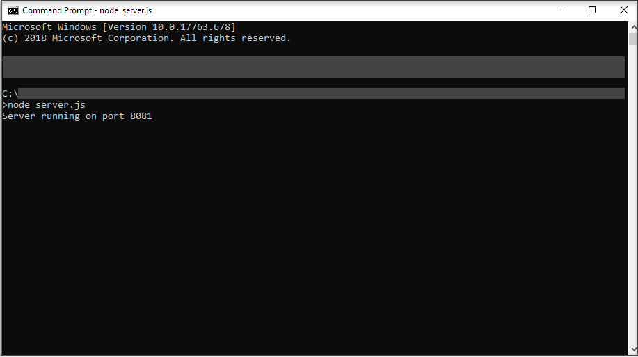
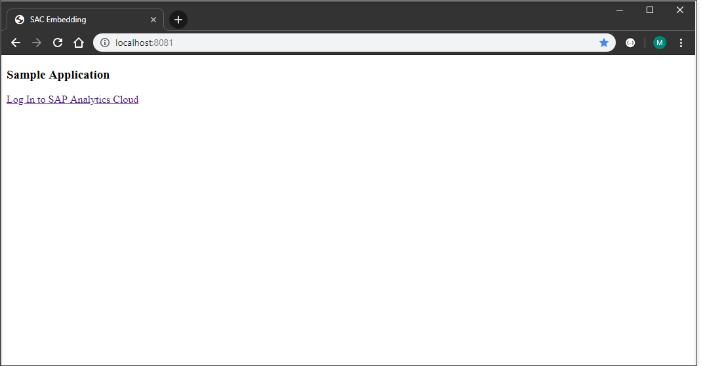
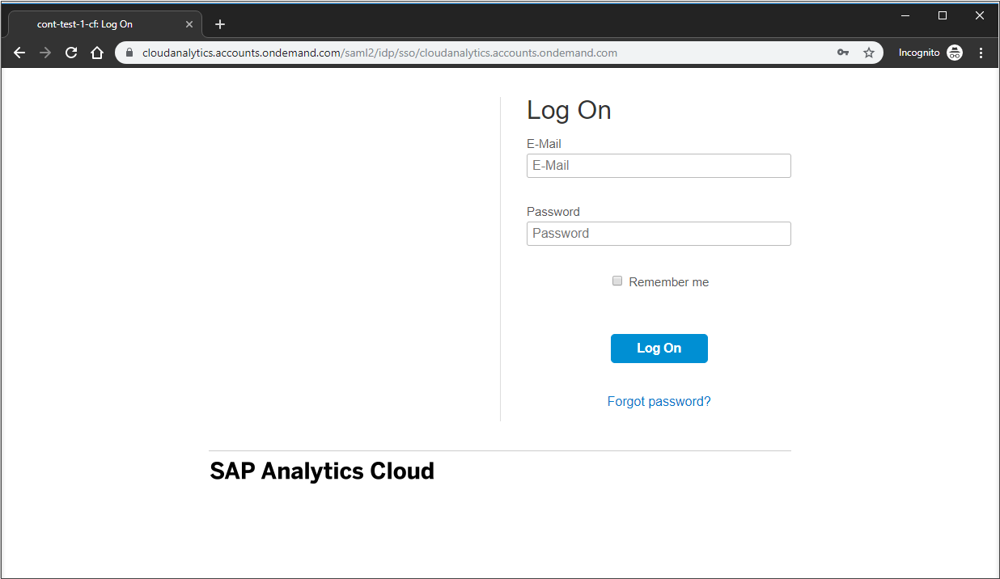
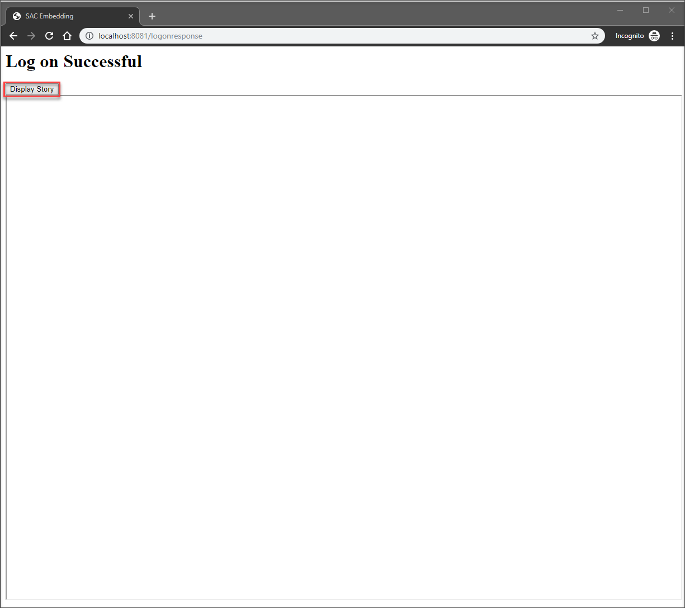
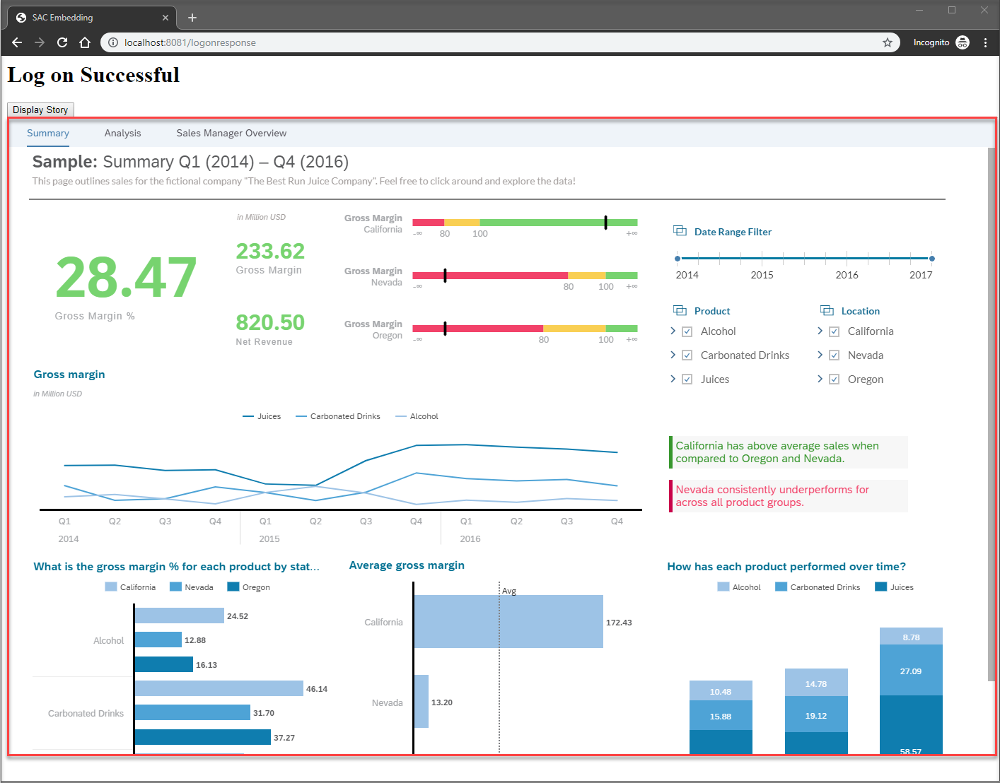

## Prerequisites
 - A user with story read permission on an SAP Analytics Cloud system
 - Access to the administration settings
 - SAP Analytics Cloud story for which you have access rights (a story that you have created, or a story that is shared with you)
 - Node.js installed on your local computer
 - A Google Chrome or a Microsoft Edge browser

## Details
### You will learn
  - How to create a simple web application hosted on your local computer
  - How to use OAuth to authorize your app to access your protected SAP Analytics Cloud data
  - How to embed an SAP Analytics Cloud story

  SAP Analytics Cloud is SAP's cloud-based analytics solution. All data visualizations are provided by so-called stories. This tutorial describes how to embed an existing SAP Analytics Cloud story into a simple external web app. It makes use of the SAP Analytics Cloud URL API that allows you to directly open stories in a URL. The embedding happens in an `<iframe>` element of a web page of the app.

  For that purpose you need:

  * A user for a non-trial SAP Analytics Cloud system. Such a system could also be a system that belongs to an instance of SAP Analytics Cloud, embedded edition. A trial account would not be sufficient as the user does not have required permissions.

  * Edit rights of the administration settings. If you do not have edit rights another user with the Admin or the BI Admin role might help you here.

  The challenging part is how to handle the login screen of the identity provider assigned to your SAP Analytics Cloud system. A mandatory step is to authenticate the user on whose behalf the app wants to access the user's protected SAP Analytics Cloud content before the story data can be rendered in the `<iframe>` element.

  SAP Analytics Cloud runs on SAP Cloud Platform which provide the environment Cloud Foundry. Cloud Foundry is supported by data centers of SAP partner vendors like AWS.

  **Cloud Foundry environment (non-SAP data centers):**
  The redirect to the identity provider happens not in the `<iframe>` but in a separate popup window, so clickjacking is not relevant. However, we want to avoid this interruption in the UI experience (separate browser window). In this scenario, we achieve a seamless experience again by separating the user authentication from the rendering of the SAP Analytics Cloud story in the `<iframe>`.

  This is the workflow of the app:

  1.	The starting page lets the user log in to their SAP Analytics Cloud system. In the background, the user gets authenticated and the app receives the authorization to access the user's SAP Analytics Cloud data leveraging an OAuth authorization workflow.

  2.	On the second page, the user requests an SAP Analytics Cloud story whose URL is preconfigured in the app code. The story is displayed on this page inside an `<iframe>`.

---

[ACCORDION-BEGIN [Step 1: ](Prepare the SAP Analytics Cloud system)]
You need to prepare SAP Analytics Cloud to enable the app to read the protected story data and to embed the story. This requires a user with Admin or BI Admin role.

1.	To enable the embedding  of SAP Analytics Cloud into an `<iframe>`, check the instructions in the corresponding chapter of the [URL API documentation](https://help.sap.com/viewer/a4406994704e4af5a8559a640b496468/release/en-US/9e147121f2254300b308c21b968a77f2.html). You enable this by adding the domain of the app to the list of **Trusted Origins** of the SAP Analytics Cloud system, which is **`localhost`** for this tutorial. Since **`localhost`** in not a valid name for this field, you need to set the flag **`Allow all origins`**.

2.	You need to create an OAuth client on SAP Analytics Cloud to give the application access to your SAP Analytics Cloud story. Please follow the below steps:

    - Log in to your SAP Analytics Cloud system and go to **Main Menu** > **System** > **Administration** > **App Integration**.

    - Under **OAuth Clients**, select **`Add a New OAuth Client`**.

    -	In the dialog, add a name for the OAuth client (for example, **`my_oauth_client`**).

    -	From the **Purpose** list, select the intended use for your OAuth client. In our case, select **`Interactive Usage`**.

    -	Specify the **Redirect URI**. For this tutorial we use `http://localhost:<port>/callback`. For `<port>` choose any free port (for example, `8081`).

    For the remaining part of the OAuth client creation please check the part of the [Managing OAuth Clients documentation](https://help.sap.com/doc/00f68c2e08b941f081002fd3691d86a7/release/en-US/4f43b54398fc4acaa5efa32badfe3df6.html) documentation.

    When you set up the OAuth client later in the `server.js` file, you need:

    - The OAuth client ID

    - The secret

    - The redirect URI

>Note that the ID and the secret are generated when saving the new OAuth client.

  If you are using the SAP Analytics Cloud, embedded edition, please refer to this [documentation](https://help.sap.com/viewer/8c9fe042688a4354876cc536267d442f/1.0/en-US/cfb3204772034009bcff19f6c753c619.html).

[DONE]
[ACCORDION-END]

[ACCORDION-BEGIN [Step 2: ](Create the web application)]
After performing the preparatory steps, you can now create the app.

1.	Download the sample code from the following Git repository and place it into a directory of your choice.

    <https://github.com/SAP-samples/analytics-cloud-api-embed-story>

    The code represents a simple example of how to embed an SAP Analytics Cloud story into a web app.

    The code consists of three files: `index.html` and `LogResponse.html` represent the client code, and `server.js` contains the Node.js server code.

    -   `index.html` is the start page of the app. It provides a link to log in to SAP Analytics Cloud.

    -   `LogResponse.html` hosts the `<iframe>` where the SAP Analytics Cloud story gets rendered.

    -   `server.js` implements a server with Node.js, leveraging the Express framework. The server listens for http requests and sends responses. This makes it possible to use a very simple, generic URL `http://localhost:<port>` to open the web app in the browser.

2.	Add additional Node.js packages. The `server.js` code uses some Node.js modules that need to be installed on your machine.

    -	Open a command-line interface (CLI, e.g. Command Prompt on Windows), navigate to the root folder of the app (that is, the folder where you have placed the three downloaded files) and initialize the Node Package Manager (npm) by running the following command:

        ```Shell
        npm init -y
        ```

        This creates a new file `package.json` in your root folder. `package.json` documents all dependencies of the node modules you will be using.

    -	Now install the Node.js modules necessary for the application into the root folder of the project. Again, open the CLI and execute the following commands from the root folder of your project.

        ```Shell
        npm install express@4.17.1 --save
        ```

        This installs Express, which is a Node.js web application framework.

        ```Shell
        npm install express-session@1.16.2 --save
        ```

        This installs the session middleware of the express framework.

        ```Shell
        npm install connect-timeout@1.9.0 --save
        ```

        The app uses this module to time out requests.

        ```Shell
        npm install simple-oauth2@2.2.1 --save
        ```

        This installs the Node.js client library for OAuth2.

        The modules are installed in a folder called `node_modules` which is generated inside the root folder. Note that `package.json` is updated by all dependent modules you have added. Additionally, a new file called `package-lock.json` is generated into the root folder.

3.	Open the file `LogResponse.html` with an editor of your choice (for example, Notepad on Windows, to name a very rudimentary editor). Edit the value of the variable `url` and assign the URL of the SAP Analytics Cloud story that you want to embed in the app. The URL has to follow the following syntax:

    `https://<TENANT>/sap/fpa/ui/tenants/<TENANT_ID>/bo/story/<STORY_ID>`

    Replace `<TENANT>` with the public SAP Analytics Cloud URL for your tenant, `<TENANT_ID>` with your tenant ID in lowercase letters, and `<STORY_ID>` with the ID of the story you want to open.

    If you want to find more please check this documentation: [URL syntax](https://help.sap.com/viewer/a4406994704e4af5a8559a640b496468/release/en-US/f0827b68d24548448060c526a8764d78.html).

    > Tip: You can use the sample story `Sample – Revenue Analysis` which is available on all SAP Analytics Cloud systems. You can find it on your SAP Analytics Cloud system under **Main Menu** > **Browse** > **Files** > **Samples**.

4.	Open the file `server.js` with your editor.

    -	Edit the value of the constant `PORT`: use the port you have specified for the definition of the Redirect URI of your OAuth client.

    - Edit the value of the session `secret`, which is used to sign the session cookie. You can use any string value. For the purpose of this tutorial you can for example take the value of the sample code. Of course, in a productive scenario you should use a strong secret.

    -	Edit the value of the variable `credentials`:

        - for the `client` object get the values for the `id` and `secret` attributes from the OAuth client you have created on the SAP Analytics Cloud system administration page in step 1 ( **Main Menu** > **System** > **Administration** > **App Integration** > **Edit OAuth Client**). Replace the placeholders in the sample code.

        - for the `auth` object get the values from the **OAuth Clients** chapter of the same SAP Analytics Cloud system administration page and replace the placeholders in the sample code.

            **`authorizePath`**

            |-|-|
            |`/oauth/authorize`|

            **`tokenPath`**

            |-|-|
            |`/oauth/token`|


    If you are using the SAP Analytics Cloud, embedded edition, please refer to this [documentation](https://help.sap.com/viewer/8c9fe042688a4354876cc536267d442f/1.0/en-US/878a785ea23a412199a9bbd1bda78482.html).

[DONE]
[ACCORDION-END]


[ACCORDION-BEGIN [Step 3: ](Start the web application)]
Now you can start the application.

1.	Start the server with your CLI tool from the root directory of our application. Start the server with the command `node server.js`.

    

2.	Open a browser window and open URL `http://localhost:<port>`. `<port>` is the port you have specified in the file `server.js`. The start page of the app is displayed.

    

3.	Click on link **Log In to SAP Analytics Cloud**. A request to the path `/authorizationcode` is made. You can find the path in the file `server.js`.

    ``` JavaScript
    app.use('/authorizationcode', function(req, res){
        console.log("inside authorizationcode");

        var authorizationUri = oauth2.authorizationCode.authorizeURL({
    	  	redirect_uri: redirecturi

    	});

    	console.log("authorizationUri: " + authorizationUri);
    	res.redirect(authorizationUri);
    });
    ```

    Now the app starts the authorization workflow. The first step in this workflow is a request to the SAP Analytics Cloud authorization server asking for permission to access your protected data with your SAP Analytics Cloud user. So, the app redirects to the authorization URL and the app logs the `authorizationUri` into the CLI.

    However, when you start the app for the first time with a browser (or any time with a new incognito browser window), a redirect to the login screen of the identity provider assigned to the SAP Analytics Cloud system is performed first. This is necessary because SAP Analytics Cloud needs to authenticate the user and their permissions.

    

4.	The user enters their credentials (e-mail and password) and presses the button to log in to SAP Analytics Cloud. The SAP Analytics Cloud authorization server identifies the user and creates a session cookie on your computer (domain of the authorization URL). If you log in later to SAP Analytics Cloud with the same browser, this cookie is read and no new user authentication is required.

    Now that the SAP Analytics Cloud user is identified, the SAP Analytics Cloud authorization server displays a screen to authorize the app or, more precisely, to authorize the OAuth client to access the user's SAP Analytics Cloud data. The user confirms this by pressing the button **Authorize**.


5.	SAP Analytics Cloud creates the authorization code (AC) and sends a response to the redirect URL `http://localhost:<port>/callback`. Again, a handler function is triggered by this request to the `/callback` path.

    ``` JavaScript
    app.use('/callback', function(req, res){
    console.log("inside callback");

	// the authorization code is sent from SAC to the /callback page.
	// the code is part of the URL parameters
    var code = req.query.code;
	console.log("Authorization Code: " + code);

	var tokenConfig = {
	  	code: code,
	  	redirect_uri: redirecturi
	};

	// get the access token:
	oauth2.authorizationCode.getToken(tokenConfig)
		.then((result) => {

		  	const token = oauth2.accessToken.create(result);
		  	console.log("Access Token: " + token.token.access_token);

		req.session["tokens"] = token;
		res.redirect("logonresponse");
		})
		.catch((error) => {
		  	console.log('Access Token Error', error.message);
	});
});
    ```

    With the AC the application now can request the authorization token (AT). It sends AC together with OAuth client ID and the secret to the SAP Analytics Cloud authorization server. The server validates the user's AC, creates the AT, and sends it back to the redirect URL of the app. The app stores the AT in the current session. Finally, the app redirects to the page `localhost:<port>/logonresponse` which renders `LogResponse.html`. Now the authentication workflow is complete.

    >In case you have troubles retrieving the access token, please double check the OAuth Client ID and Secret are set correctly in `server.js`.

6.	Page `localhost:<port>/logonresponse` hosts the `<iframe>` in which the SAP Analytics Cloud story will be rendered. The user clicks on the **Display Story** button.

    

    This triggers a request that reads the AT from the session.

    The AT is used in a second request to finally retrieve the SAP Analytics Cloud story data.

    ``` JavaScript
    // 1. step: get the access token from session via page /getToken
    $.ajax({
      type: 'GET',
      data: JSON.stringify(data),
      contentType: 'application/json',
      url: '/getToken',
      success: function (data) {
        console.log('success');
        console.log(JSON.stringify(data));

        var token_details = JSON.parse(data);

        var postheaders = {
          'Authorization': 'Bearer ' + token_details.access_token,
        };

        // 2. step: get the SAC story
        $.ajax({
          type: 'GET',
          url: URL,
          contentType: 'application/json',
          headers: postheaders,
          xhrFields: {
            withCredentials: true   //required if url is cross-domain
          },
          success: function (data, status, settings) {
            console.log(settings.getResponseHeader("X-CSRF-Token"));
            console.log(JSON.stringify(data));

            $("iframe").attr("src", URL);
          },

          error: function (xhr, ajaxOptions, thrownError) {
            alert(xhr.status);
            alert(thrownError);
          }
        });
      }
    });
    ```

    Your story gets rendered inside the iframe.

    

[VALIDATE_1]

[ACCORDION-END]


---
