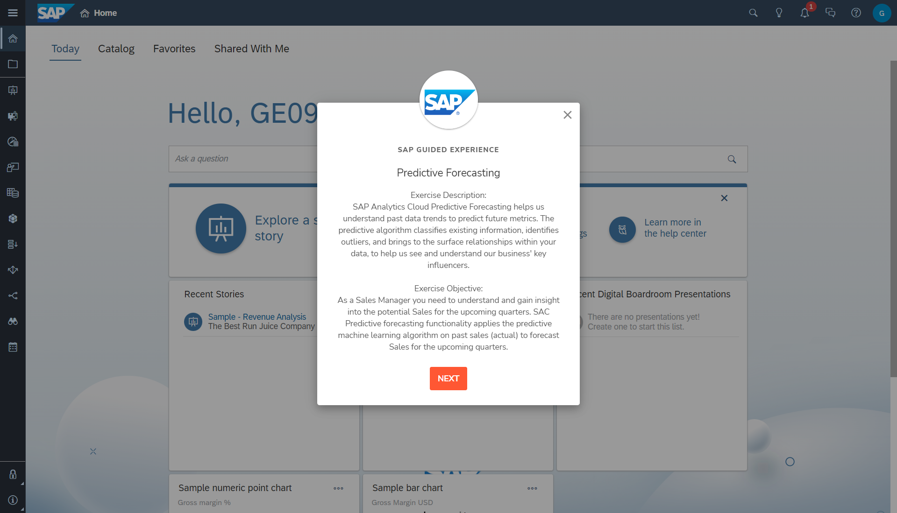

## Prerequisites
 - To register for a guided experience, all you need is a [sap.com account](https://www.sap.com/registration/protected/form-universal-reg.afl.html?generalRegistration=true).

## Details
### You will learn
  - What a guided experience is
  - How to register for a guided experience

Note: A guided experience aims to introduce important workflows and core features so not all features will be showcased in the experience.

---

[ACCORDION-BEGIN [Step 1: ](Learn about guided experiences)]

Learning a new product can often feel overwhelming when you don't know where and how to get started.

Guided experiences let new users get hands-on with a product and learn how about it by walking them through key workflows and core features in a guided manner.

Users are shown what to do and where to click, along with explanations of each action and feature.

[DONE]
[ACCORDION-END]

[ACCORDION-BEGIN [Step 2: ](Register for a guided experience)]

There are guided experiences for SAP Analytics Cloud and SAP Data Warehouse Cloud.

To register for a guided experience, click the "Experience" buttons at the top of these pages:

-	[SAP Analytics Cloud](https://www.sap.com/products/technology-platform/cloud-analytics.html)
-	[SAP Data Warehouse Cloud](https://www.sap.com/products/technology-platform/data-warehouse-cloud.html)

To register for a guided experience, all you need is a [sap.com account](https://www.sap.com/registration/protected/form-universal-reg.afl.html?generalRegistration=true). If you do not have an sap.com account yet, you will be prompted to create one.

After registering, you will immediately be shown a welcome message with your account details. You will also receive an email with a copy of your account details along with additional information about the guided experience.

To learn more about guided experiences, check this [FAQ](https://www.sap.com/documents/2022/03/7e14f83c-1e7e-0010-bca6-c68f7e60039b.html).

[DONE]
[ACCORDION-END]

[ACCORDION-BEGIN [Step 3: ](Test yourself)]

[VALIDATE_6]
[ACCORDION-END]

---
