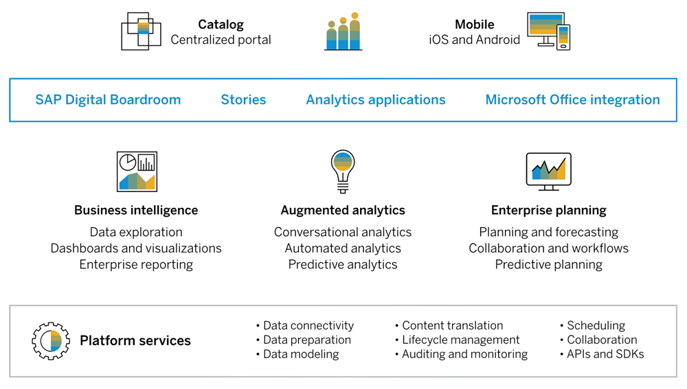
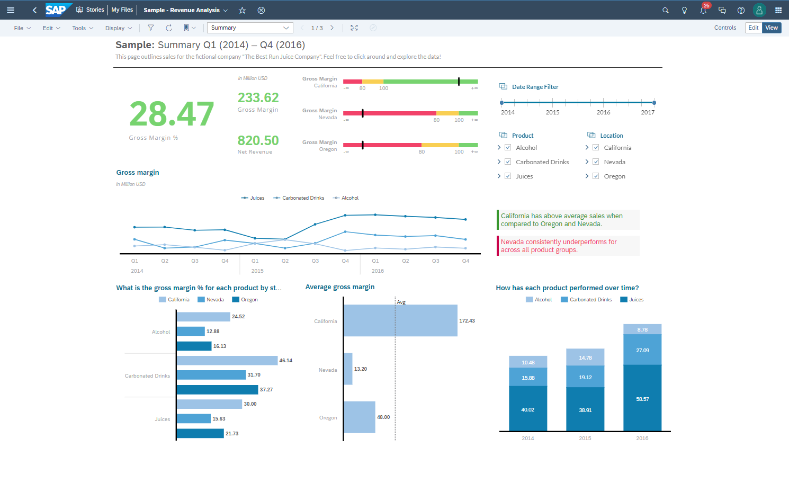
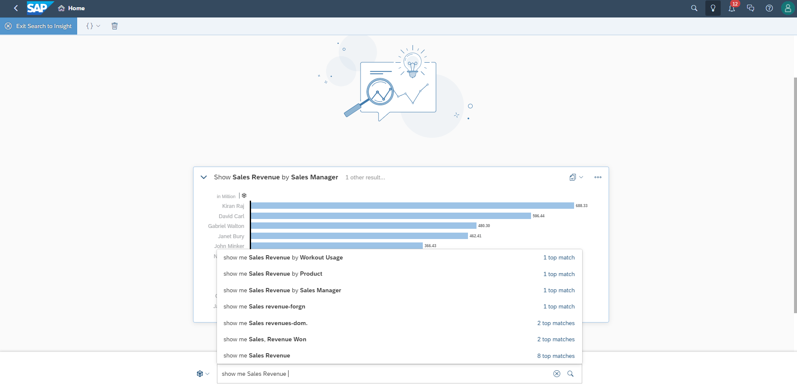
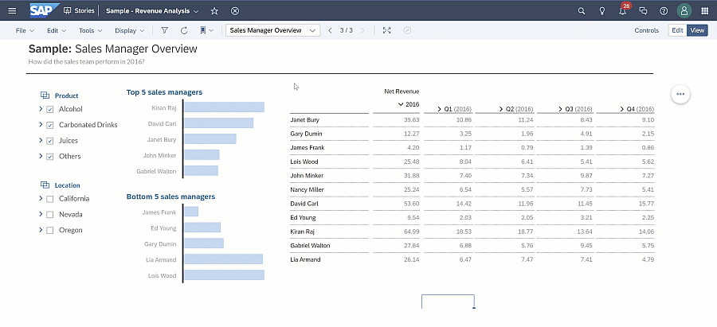
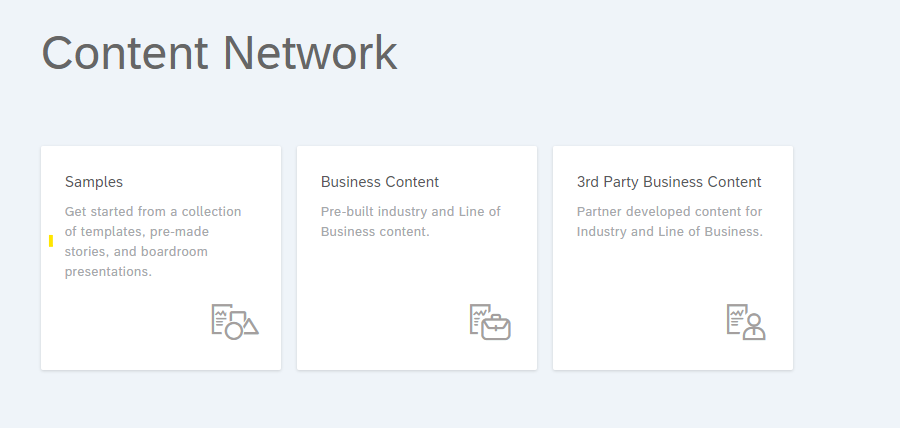
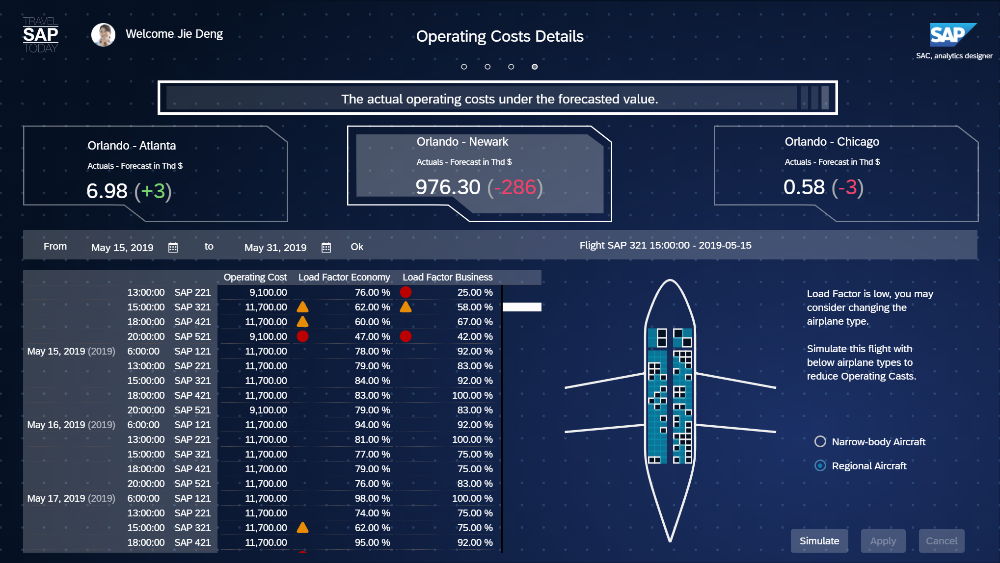
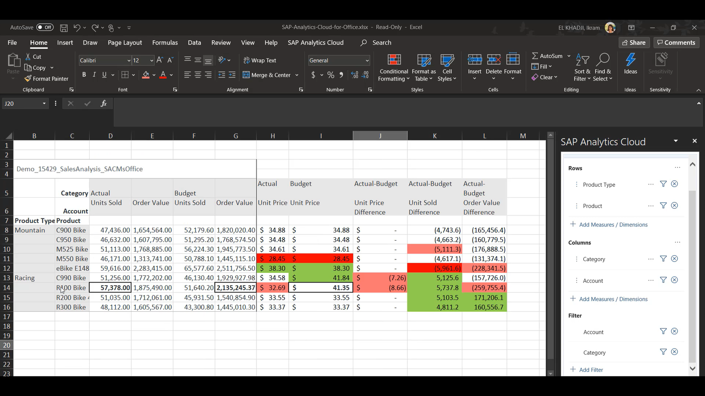

# Introduction to SAP Analytics Cloud
<!-- description --> Get an overview of SAP Analytics Cloud's top capabilities and features

<!--
## Prerequisites
 - Prerequisite 1
 - Prerequisite 2 -->

## You will learn
  - What SAP Analytics Cloud is
  - What the fundamentals are
  - What Smart features are and how they work
  - What the Enterprise Planning features are
  - What the other capabilities of SAP Analytics Cloud are

## Intro
<!-- Add additional information: Background information, longer prerequisites -->

---

### What is SAP Analytics Cloud?

SAP Analytics Cloud is a software as a service (SaaS) enterprise analytics solution that combines Business Intelligence, Augmented and Predictive Analytics, and Planning capabilities to help you understand your data to make smarter business decisions. Furthermore, you can ask, analyze, predict, plan, and report all in one end-to-end workflow.

#### Business Intelligence

SAP Analytics Cloud offers built-in self-service Business Intelligence (BI) features to help you explore, analyze, and visualize data to get actionable insights for decision making. These features include reports, dashboards, data exploration, data preparation, and data visualizations such as charts, tables, Geo maps, and other visual formats to display data in a way that can be quickly and easily understood.

#### Augmented Analytics

SAP Analytics Cloud Augmented Analytics can help users make more confident decisions faster with automated insights powered by machine learning and artificial intelligence. Spend less time analyzing data manually by leveraging these capabilities to automatically reveal top contributors, influencers, hidden patterns, and outliers in your data - no data science knowledge needed.  We will explain Smart features in more detail later in this tutorial.

#### Planning

SAP Analytics Cloud for Planning lets you analyze, predict, and plan in one application. It enables real-time Extended Planning and Analysis, to link and align all plans and people across your organization. It breaks down silos and brings teams together to collaborate on plans and drive better business outcomes.

> Planning features will be explained later in this tutorial.

### The Fundamentals

### Stories, Models, Data

SAP Analytics Cloud has three fundamental components: **data**, **models**, and **stories**.

#### Data

The first step to analytics is getting access to your **data**. This data may reside in a spreadsheet, a large database, or an application in the cloud or on-premise. SAP Analytics Cloud can connect to all these different sources of data so you can perform the analysis you need to gain valuable insights and make important data-driven decisions. You can upload spreadsheets easily into SAP Analytics Cloud for analysis but for connections to larger, more complex data sources, more steps are needed. Click [here](https://community.sap.com/topics/cloud-analytics/connectivity) to learn more.

#### Model

Once SAP Analytics Cloud has access to your data, you need to create a **data model** for the data source so that SAP Analytics Cloud knows how to query for the data and make it available for analysis. For example, your database has a great deal of information in it, but you only need Customer Name, Product Name, and Total Sales for your analysis. When creating a data model, you specify the dimensions, measures, and other semantics you need to facilitate your analysis and data storytelling.  

Measures are numeric values that can support mathematical calculations such as Total Sales or Number of Orders. Dimensions can be numeric or text and are descriptive values such as a Profit Center, Date, and Sales Manager.

Creating a model is called **data modeling** and is done using the **Modeler**, usually by advanced users with knowledge of the underlying data source. Click [here](https://community.sap.com/topics/cloud-analytics/modeling) to learn more.

#### Stories

Now you are ready to tell a story with your data. In an SAP Analytics Cloud story, you can turn your data into visualizations like charts, tables, `geo` maps, and more. Data visualization aids the analysis process by presenting data visually, making it easier to get actionable insights to help answer your business questions. A story can be designed as reports or dashboards to help with your planning or analysis. Click [here](https://community.sap.com/topics/cloud-analytics/stories-reporting-exploration) to learn more.

### Smart Features

When analyzing data in a chart or table, you probably often have questions like, "Why did this value decrease?", "What is causing this variance?" or "What is influencing this metric?". To get the insights needed to answer these questions, you would typically have to spend hours performing manual data discovery. SAP Analytics Cloud augmented analytics helps by generating automated insights powered by artificial intelligence and machine learnings to help you find the answers you need. These augmented analytics capabilities are referred to as smart features, and they allow users to:

-	Ask questions in a conversational manner with instant results explained in natural language

-	Automatically discover meaningful insights and jump-start the creation of a dashboard

-	Use machine learning algorithms to automatically reveal relationships in data, hidden     patterns, and outliers in your data

- Predict potential outcomes and forecasts, and populate results back into your plan at any level for increased accuracy

#### Search to Insight

Search to Insight allows you to search for answers to questions about your data using natural, everyday language. Simply type what you would like to know from your data – such as "Show Sales Revenue for by Sales Manager:" – into the search box, and SAP Analytics Cloud will analyze your data and return an answer.

#### Smart insights

Gain instant answers to your questions around your data with Smart Insights. Smart Insights runs statistical algorithms on the underlying data to analyze and uncover the top contributors influencing the selected data point or variance. The results are explained in natural language with visualizations to help you understand the whys of your data and help you make informed decisions.  

#### Smart Discovery

Think of Smart Discovery as your own personal business analyst. Smart Discovery automates the data exploration and discovery process to help you discover new or unknown relationships in your data. You can clearly define the context of a business question by specifying the measure or dimension you want to know more about. Story pages are generated with results to help you understand the main business drivers behind core `KPIs`. After running Smart Discovery, you can simulate numeric targets using the results of the key influencer analysis.

#### Smart Predict

Smart Predict helps you answer business questions that need predictions or predictive forecasts to plan for future business evolutions. Smart Predict automatically learns from your historical data and finds the best relationships or patterns of behavior to generate predictions for future events, values, and trends. These predictions can be used to enhance and automate decision making.

Three types of predictive scenarios are available in Smart Predict: **Classification**, **Regression**, and **Times Series** Predictive Scenarios.

|  Type           | Description                                                                     | Example
|  :------------- | :-------------                                                                  | :-------------
|  Classification | Used to rank a population and assign a probability that an event will happen    | Who is likely to buy this product with regards to buying habits
|  Regression     | Used to find relationships between variables describing events                  | How much would a customer spend on my e-commerce on average
|  Time Series    | Used to forecast future values of a measure                                     | What are the expected sales by product per region for the next 4 weeks

#### Time Series Forecasting

The Time Series Forecasting feature performs advanced statistical analysis to generate forecasts by analyzing trends, cycles, and outliers. Users can select between different time series algorithms based on their needs. This functionality assists business users in making precise data-driven decisions, especially when combined with business planning processes.

#### Smart Grouping

Smart Grouping allows you to visualize clusters of data on scatter plots and bubble charts by automatically grouping data points together based on similar properties. This feature helps you explore data points with the flexibility in defining the attributes to be considered, and tailor business decision to certain groups. Click [here](https://community.sap.com/topics/cloud-analytics/augmented-analytics) to learn more.

### Planning Features

SAP Analytics Cloud Planning features help businesses set goals and strategic plans, analyze budgets, set allocations, compare budget, actuals, and forecasts, and crowdsource plans across departments.

Here is an overview of the core Planning features in SAP Analytics Cloud:

- **Plan budget, and forecast**: Deliver timely plans, budgets, forecasts, and reports with greater speed and accuracy in one application
- **Analytics**: Make end-to-end decisions across the business in real-time with built-in business intelligence and analytics
- **Predict**: Automate forecasts at any level to save time and gain trusted results with predictive analytics and machine learning
- **Scenario Planning**: Simulate multiple outcomes to the impact of your business drivers
- **Collaboration**: Share and discuss plans across the business with built-in collaboration features
- **Process Management**: Create seamless planning workflows to streamline processes with the Calendar feature

SAP Analytics Cloud for planning provides tools for planning and analysis, collaborative budgeting, long-range strategic planning, work-force capital planning, and predictive planning and scenario modeling.

> If you are interested in learning more about SAP Analytics Cloud's planning features, register for these free online courses hosted by product experts, and get access to hands-on exercises for practical experience.

> - [Planning with SAP Analytics Cloud](https://open.sap.com/courses/sac3)
> - [Planning with SAP Analytics Cloud - Advanced Topics](https://open.sap.com/courses/sac4)

Click [here](https://community.sap.com/topics/cloud-analytics/planning#introduction-to-sap-analytics-cloud-for-planning) to learn more.

### Core Applications and Features

#### Pre-built Business Content Packages for BI and Planning

SAP Analytics Cloud has pre-built analytics content for BI and Planning by line-of-business and industry created by SAP and SAP Partners. These are free to download, customize and configure on customer tenants and accessed through the SAP Analytics Cloud Content Network. Leverage these ready-to-use technical sample templates and industry and line-of-business specific content to accelerate and inspire your content creation. Click [here](https://blogs.sap.com/2020/05/22/working-with-business-content-in-sap-analytics-cloud/) to learn more.

#### Digital Boardroom

SAP Digital Boardroom lets you create and deliver real-time interactive boardroom presentations. Dashboards are presented on large touch screens, creating a visually interactive and collaborative experience. Decision makers can adjust drivers on-screen instantly and simulate the impact of decision and predict future outcomes. It connects to SAP and non-SAP applications to provide a single source of truth about key business metrics across all lines of business, enabling executives to address ad hoc questions and act in the moment with live data. Click [here](https://help.sap.com/viewer/00f68c2e08b941f081002fd3691d86a7/release/en-US/0f677bc81cb849059920661f8c0cbce4.html) to learn more.

#### Analytic Applications

Analytic Applications enables professional designers to use advanced scripting to create custom, complex applications to satisfy unique and advanced business use-cases. Scripting allows the application designer to define the relationship between different elements on the page, and to guide users and adjust widget behavior based on users' expectations.

The major difference compared to stories is that in Analytic Applications, you can configure the behavior of the UI elements with a set of specific script API events and specify which actions should take place when events are triggered. This flexibility lets you create a variety of Analytic Applications, ranging from simple static dashboards to highly customized analytic applications with numerous options to browse and navigate data. Click [here](https://community.sap.com/topics/cloud-analytics/analytic-applications-api) to learn more.

#### Analytics Catalog

The Analytics Catalog is a single access point for content published to users and teams within SAP Analytics Cloud. Your organization's content creators can publish the stories that they'd like you to use to the Catalog, which is one of the tabs on the Home screen. Because a special permission is needed to publish content to the Catalog, you'll know that the Catalog content has been vetted by a content creator.

Each item published to the Catalog is displayed as a card that users can open to access the underlying content. The following content types can be published and displayed in the Catalog:

- Stories
- Analytic Applications
- Digital Boardroom presentations
- Models
- Datasets
- Uploaded SAP Analytics Cloud files
- Content Links

#### MS Office Integration

SAP Analytics Cloud, add-in for Microsoft Office, enables users to connect and import data from one or more models seamlessly from SAP Analytics Cloud into Microsoft Excel. The integration allows you to combine the power of Microsoft Excel and SAP Analytics Cloud analytical tools and functionalities to format, transform, and enrich your data in one platform. Click [here](https://community.sap.com/topics/cloud-analytics/ms-office-add-in) to learn more.

#### Data Analyzer

Data Analyzer allows you to query your data directly and perform ad-hoc analysis in a pivot-table style analysis view. You can analyze the data for leadership based on a business hypothesis, find insights and trends, or get a structured view of the company's financial performance across different dimensions.

A big advantage of Data Analyzer is that you can analyze the data directly without having to create a model or story in SAP Analytics Cloud. SAP Business Warehouse (BW) Live queries, SAP HANA Live views, and SAP Analytics Cloud models are supported. Click [here](https://help.sap.com/viewer/00f68c2e08b941f081002fd3691d86a7/release/en-US/3bd79ad3e58442e7a5499fd9c547cbb3.html) to learn more.

#### Mobile

SAP Analytics Cloud is available for mobile. With the SAP Analytics Cloud mobile app for iOS and Android devices, you have easy access to your analytics while on the go. Responsive story pages are optimized for mobile devices and automatically adjusts visualizations to fit any screen size to create a seamless transition from desktop to mobile. Click [here](https://help.sap.com/viewer/92a4a76cf6ae454cbf55b73df1cc2f3d/release/en-US/3b32b5ef8c2e49479cf45b50b8ff8a26.html?q=mobile) to learn more.

### Test Yourself

In the question area below, pick one multiple choice answer and then click **Submit Answer**.

