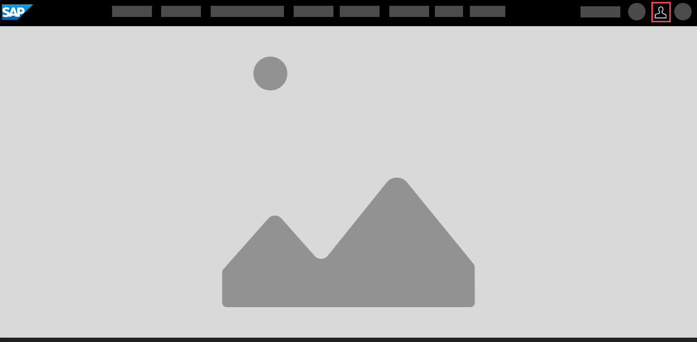
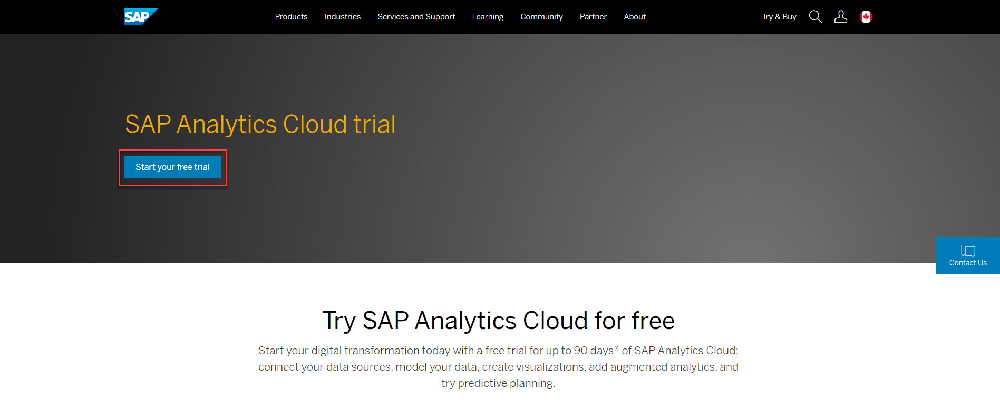

<!-- ## Prerequisites
 - Prerequisite 1
 - Prerequisite 2 -->

## Details
### You will learn
  - What is included in the trial
  - How to register an SAP.com account
  - How to register for an SAP Analytics Cloud Trial account

### SAP Analytics Cloud Trial Overview
  The free trial of SAP Analytics Cloud gives you a single-user license for SAP Analytics Cloud, with access to business intelligence, enterprise planning, and augmented analytics features. You can connect your data sources, model your data, create stories, try augmented analytics, and do predictive planning. Click [here](https://community.sap.com/topics/cloud-analytics/faq#free-trial) to learn more.

  The trial length is 30 days but can be extended for an additional 60 days after the first few weeks of activation.

[ACCORDION-BEGIN [Step 1: ](Register for an SAP.com Account)]

To access the trial, you will need to register an account on [SAP.com](https://www.sap.com/dashboard.html). An SAP.com account gives you access to free SAP Trial Software, Documents & Reports, the SAP Community, Webinars, and more.

If you have an existing SAP.com account, proceed to step 3.

If you do not have an account, visit [SAP.com](https://www.sap.com/dashboard.html) and click the profile icon in the upper right corner.

After entering your information, an account activation link will be emailed to you.

[DONE]
[ACCORDION-END]

[ACCORDION-BEGIN [Step 2: ](Register for your SAP Analytics Cloud Trial Account)]

Visit the [SAP Analytics Cloud Trial](https://www.sap.com/products/cloud-analytics/trial.html) page and click 'Start your free trial'.

You will be sent an email to activate your SAP Analytics Cloud Trial account. Select the 'Activate Account' button. You will then be re-directed to the SAP Analytics Cloud Trial.

Congratulations, you have now set up your SAP Analytics Cloud Trial account!

[DONE]
[ACCORDION-END]

[ACCORDION-BEGIN [Step 3: ](Test Yourself)]

In the question area below, pick one multiple choice answer and then click **Submit Answer**.

[VALIDATE_1]

[ACCORDION-END]
