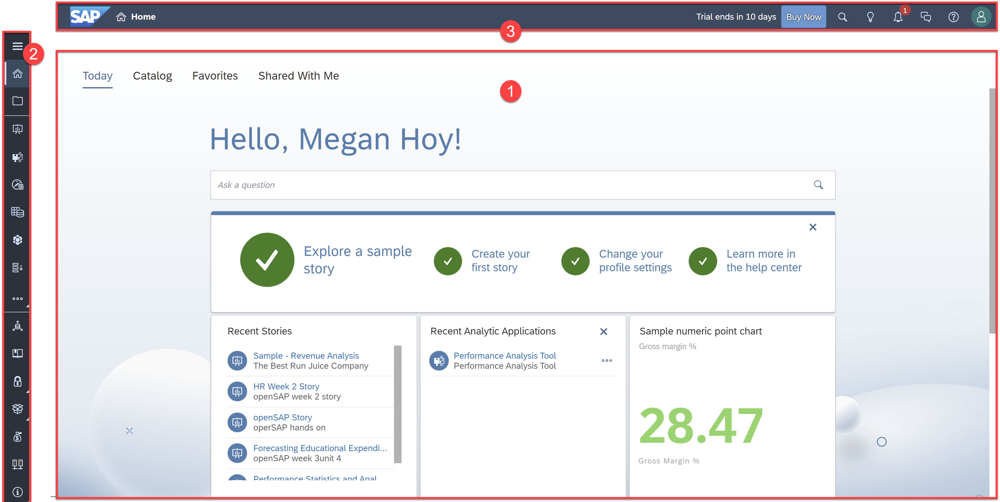
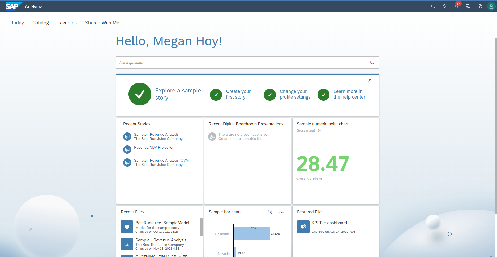
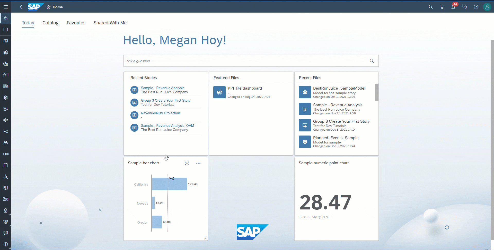
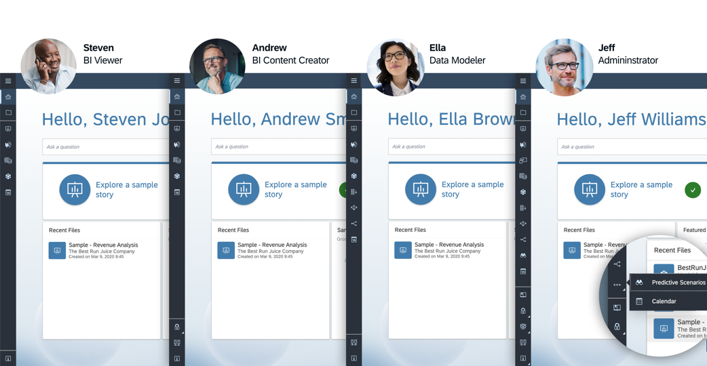
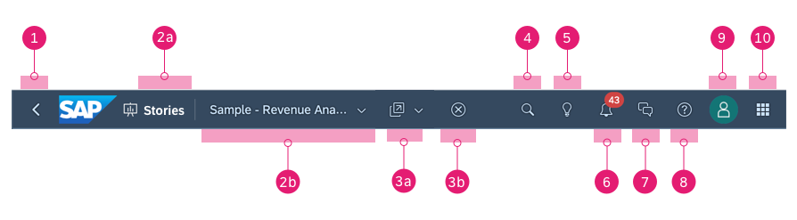
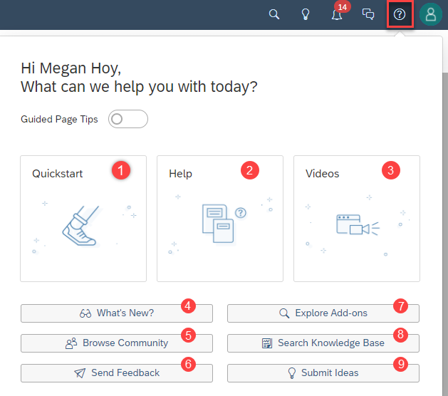

<!-- ## Prerequisites
 - Prerequisite 1
 - Prerequisite 2 -->

## Details
### You will learn
  - How to navigate the home screen
  - How to navigate the side navigation bar
  - How to navigate the shell bar

<!-- Add additional information: Background information, longer prerequisites -->

### Getting Around SAP Analytics Cloud

After signing into SAP Analytics Cloud, you will see features and applications that can help you increase your work efficiency and productivity. These tools and applications are divided into three main parts.

1. Your personal **home screen** is the first page you see after signing into to SAP Analytics Cloud. You can personalize this page to suit your work style and needs and even pin visualizations to monitor specific key performance indicators better. We'll go over the home screen in more detail in the next section.

2. The **side navigation** on the left is made up of single-click entry points, allowing you access to features such as viewing and creating content. You can collapse or expand the navigation menu or enter full-screen display for viewing certain content.

3. The **shell bar** is the uppermost horizontal section and consists of a breadcrumb navigation, allowing you to know where you are in your workspace and lets you easily navigate to any part of the folder path for your current file, and universal actions such as search, search to insight, notifications, discussions, help, and profile.

---

[ACCORDION-BEGIN [Step 1: ](Personal Home Screen)]

Your home screen makes it easy for you to access recent Stories, Files, and Analytic Applications and display Featured Files and Recent Files as tiles. You can also pin important visualizations from stories to your home screen. Pinning visualizations help you easily monitor your key performance indicators, and they also act as shortcuts back to the stories.

You can personalize your home screen by selecting tiles to display or hiding and rearranging them by dragging them around the home screen. To edit the home screen and select your tiles, click on your Profile avatar in the upper-right corner and select Home Screen Settings. You can choose a default home screen tab, customize the display background and logo displayed, and add or remove tiles from the Home screen.

> We will demonstrate how to pin visualizations to the home screen in another tutorial.

#### Today, Catalog, Favorites, and Share with Me Tabs

You can toggle between four tabs on the Home Screen:

- **Today**: This is the default tab and shows your home screen
- **Catalog**: Single access point for content published for users
- **Favorites**: Lists the resources you have "starred" as your favorite
- **Shared With Me**: Lists all the resources shared with you by other users

[DONE]
[ACCORDION-END]

[ACCORDION-BEGIN [Step 2: ](Sidebar Navigation)]

The sidebar navigation is where you access the main applications and features of SAP Analytics Cloud including Stories, Analytic Applications, Modeling, Data Analyzer, Digital Boardroom, and more. It is located on the left side of the page and can be collapsed and expanded. The navigation bar will always be present, no matter what application you are working in, making it quick and easy for you to switch between different applications.

> The options that you see in your side navigation is dependent on your standard application role and permission access. Administrators have full access to all the content creation and administration tools, whereas analytic consumers see a simpler menu with a reduced set of items.

[DONE]
[ACCORDION-END]

[ACCORDION-BEGIN [Step 3: ](The Shell Bar)]

The shell bar lets you see the breadcrumb navigation and actions relating to the active screen. It also contains universal features including search, search to insight, notifications, discussions, help, user profile settings, and the product switch. With the shell bar, you will have a consistent experience across all SAP Analytics Cloud products.

|  Number         | Feature                           | Description
|  :------------- | :-------------                    | :-------------
|  1              | **Back button**                   | Used to navigate to the previous screen you were in.
|  2a             | **Application or Tool Name**      | Lets you see where you are when working on your data, content, or configurations.
|  2b             | **File Name and Folder Path**     | Lets you see file details, including the description of the file, and the folder path. You can click on any folder in the breadcrumb to jump directly to that file location in the Files area.
|  3a             | **File Actions**                  | The Actions menu provides shortcuts to create something new based on the file that's currently opened. If you see different file actions, it's because file actions are dependent on the file you're in. **Note** - Additional actions will appear for different file types, such as making the current file as a favorite.  
|  3b             | **File Close**                    | The Close button lets you close the current file that's opened and returns you to the appropriate start page.
|  4              | **Search**                        | Search for content across the whole product such as Stories, Analytic Applications, Datasets, Models, Folder Names, and Digital Boardroom presentations.
|  5              | **Search to Insight**             | Ask questions about your data and immediately see your answers as visualizations.
|  6              | **Notifications**                 | Open your notifications, where you can see your system messages informing you of files that have been shared with you, comments added to your story, when you've been added to a discussion, calendar tasks and processes, and other administrative reminders.
|  7              | **Discussion**                    | Opens the Discussion panel where you can send messages and collaborate with other users
|  8              | **Help**                          | Opens the Help Center where you can find contextual help articles, and links to videos and additional learning resources.
|  9              | **Profile**                       | Change your user profile preferences, customize your Home Screen appearance, request additional roles, and sign out.
|  10             | **Product Switch**                | If you have multiple products, you can quickly navigate between your SAP Analytics Cloud, SAP Data Warehouse Cloud, and SAP Analytics Hub tenants.

#### The Help Center

You can access the SAP Analytics Cloud help topics, release notes, and instructional videos in the Help Center.

1.	**Quick Start**: Resources for the basics to get started with SAP Analytics Cloud
2.	**Help**: Tailored help for a specific topic. A small window will pop up for you to search or scroll and click on the subject you are interested in
3.	**Videos**: Short how-to videos
4.	**What's New**: Latest information on new features introduced for each wave release
5.	**Browse Community**: Explore the [SAP Analytics Cloud Community](https://community.sap.com/topics/cloud-analytics) page where you can connect with experts, ask questions, post blogs, and more
6.	**Send Feedback**: Send your feedback on how to improve the user experience
7.	**Explore Add-ons**: Re-direct to the SAP Store for SAP Partner Solutions where you can find a full range of extensions and add-on features to enhance the capabilities of SAP Analytics Cloud
8.	**Knowledge Base**: Access product support SAP Notes and Knowledge Base Articles
9.	**Submit Ideas**: Submit product enhancement ideas or vote and comment on existing ideas for SAP Analytics Cloud

[DONE]
[ACCORDION-END]

[ACCORDION-BEGIN [Step 4: ](Test Yourself)]

In the question area below, pick one multiple choice answer and then click **Submit Answer**.

[VALIDATE_1]

[ACCORDION-END]
