## Prerequisites  
 - An administrator account on an SAP Analytics Cloud tenant
 - An administrator account in the SAP Cloud Identity Authentication service tenant
 - An administrator account on SAP Cloud Platform

## Details

### You will learn  
- How to configure secure access to SAP Analytics Cloud resources with a two-legged OAuth flow
- The roles involved in the two- and three-legged OAuth flows

SAP Analytics Cloud (SAC) leverages the OAuth 2.0 framework to provide secure access to its resources exposed via REST APIs, for example, story APIs. SAC provides support for both two-legged and three-legged OAuth flows.

Both flows involve the following roles:

  - **Resource Owner: User**     

    The resource owner is the user who authorizes an application to access his or her account. The application's access to the user account is limited to the "scope" of the authorization granted -- for example, read or write access.

  - **Client: Application**     

    The client is the application that wants to access the user account. Before it can do so, the user must authorize the access, and the API must validate the authorization.

  - **Resource / Authorization Server: API**   

    The resource server hosts the protected user accounts.  The authorization server verifies the identity of the user and, then, issues access tokens to the application.

#### Three-Legged versus Two-Legged OAuth 2.0 Flows####
In the three-legged flow, all three roles are _actively_ involved. For example, the user must explicitly authorize the client application to access the resources that the user owns.

In the two-legged flow, on the other hand, the user is not actively involved. Instead, the SAML bearer assertion token obtained during the login to the client application is exchanged with the SAP Analytic Cloud OAuth token behind the scenes.

An important factor to consider when you choose between the three-legged and two-legged flows is the customer landscape. Typically, you find a central IDP in an enterprise landscape. The purpose of a central IDP within an enterprise is to manage Identity federation and provide an SSO experience to end users across different applications. With this landscape, you should implement the two-legged flow to ensure a seamless OEM experience.

#### Overview of the Two-Legged Flow####
The two-legged flow requires heavy configuration so before you start, review the following diagram and description for an overview of what you want to accomplish:
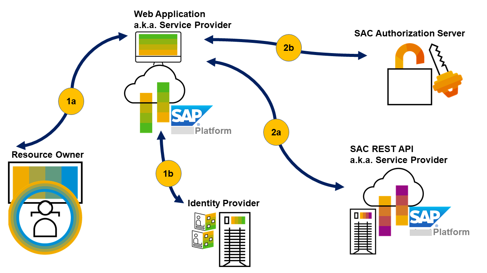

<ol type=1><li>Fetch the SAML bearer assertion token.

<ol type="a"><li>The user tries to access the sample web application. The web application (or service provider) redirects the user to the IDP (Identity Provider).

</li><li>The IDP provides a login page where the user enters access credentials.
   After validating the credentials, the IDP generates a SAML bearer assertion token and sends it to the service provider.</li></ol></li>

<li>Exchange the SAML bearer assertion token with the OAuth token.

<ol type="a"><li>The service provider that embeds the SAP Analytics Cloud resources via REST API acts as an OAuth Client and sends the SAML bearer assertion token to fetch the OAuth token.

</li><li>The web application requests the protected resource from SAP Analytics Cloud by presenting the access token. SAC validates the access token, and, if valid, serves the request. The access token is sent in the authorization request header field using bearer authentication scheme.</li></ol></li></ol>

---
[ACCORDION-BEGIN [Step 1: ](Create a web application)]

Start by creating a sample web application and deploying it in SAP Cloud Platform.

1. Download the application from the following git repository:

      [https://github.com/SAP/analytics-cloud-api-embedsac-oauth-saml/](https://github.com/SAP/analytics-cloud-api-embedsac-oauth-saml/)

2. To create the war file, run the following command: 'maven clean install'.

3. Deploy the war file in SAP Cloud Platform.

    Log into your SAP Cloud Platform account and go to **Applications > Java Applications**. Click **Deploy Application**.

      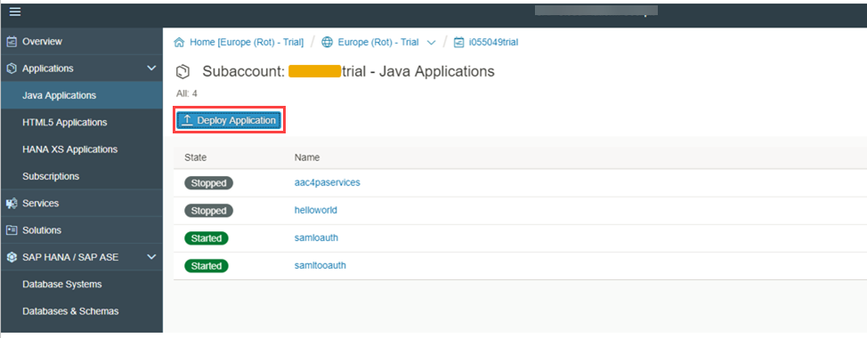

4. Select the war file from your local folder and the runtime **Java Web**.

     Then, click **Deploy**.      

     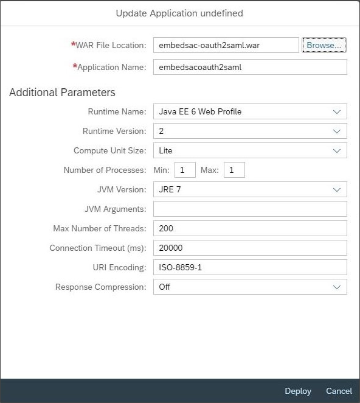

[DONE]

[ACCORDION-END]

[ACCORDION-BEGIN [Step 2: ](Fetch the SAML bearer assertion token)]

With the sample web application deployed, you can now configure authentication via an Identity Provider.

For the purposes of this example, you configure SAP Cloud Platform to act as a Service Provider and the SAP Cloud Platform Identity Authentication tenant as an Identity Provider.

For more information about this configuration, see [Configuring SAML SSO for SAP Cloud Platform Using Custom Identity Provider](https://blogs.sap.com/2017/04/13/configure-saml-sso-for-sap-cloud-platform-using-an-external-identity-provider/).

1. Log into the SAP Cloud Platform cockpit, go to **Security > Trust**, and click **Edit**.

2. Select the configuration type **Custom**.

     The **Local Provider Name** is populated automatically. If not, use a URI as the local provider name.

3. Click **Generate Key Pair** and click **Save**.     

     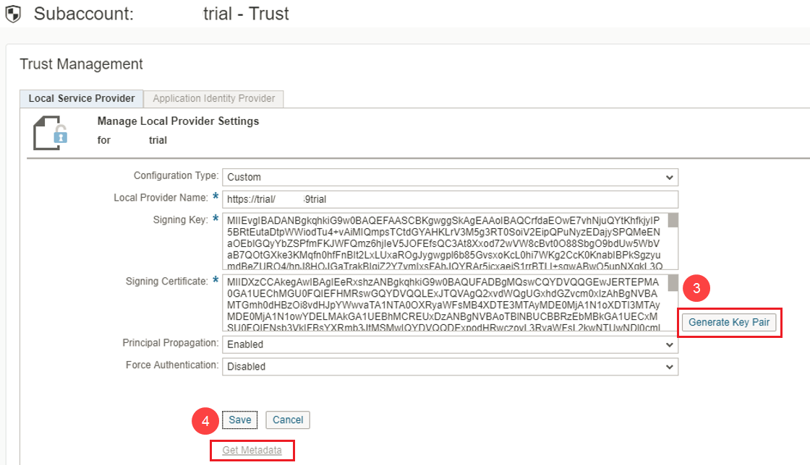

4. To establish trust between the Service Provider and Identity Provider, exchange their respective metadata files.

      Click **Get Metadata** to download the Service Provider Metadata file and save it in a local folder.

5. Log into the SAP Cloud Platform Identity Authentication Tenant, with your administrator account, and go to **Application & Resources > Applications**.       

      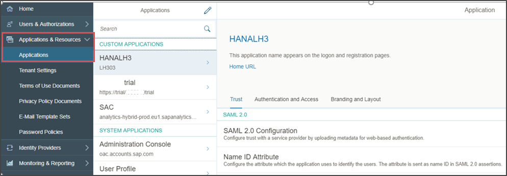

6. Click **Add** to add the Service Provider as an application.  

     To configure trust, select the application created and go to **Trust > SAML 2.0 Configuration**.
     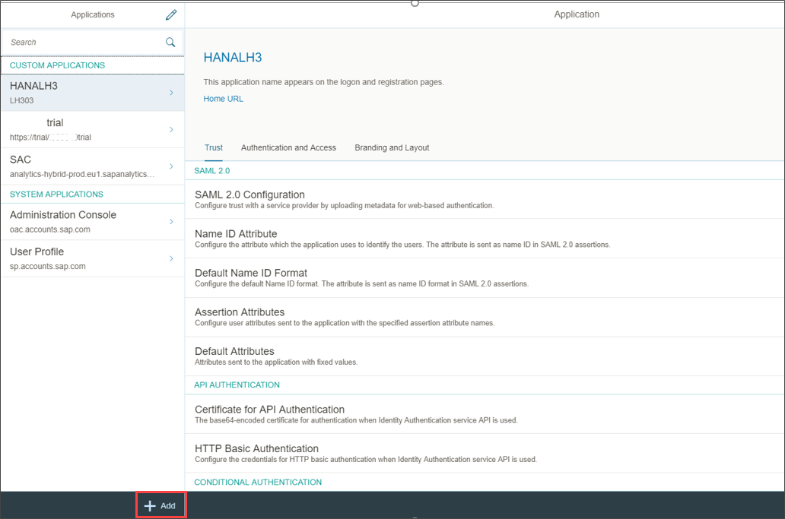

7. Next to the **Metadata File** field, click **Browse**, select the Service Provider Metadata file for upload, and click **Save**.

     

8. Go to **Name ID Attribute** and select **E-Mail**. Click **Save**.

     This saves your configuration.

     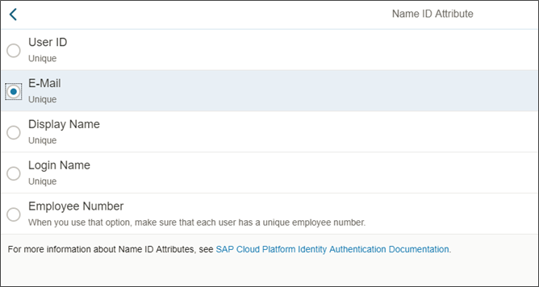

9. To exchange the IDP metadata with the Service Provider, you need to download the metadata in XML format.

     In your browser, enter the IDP URL and add the suffix:
     `/saml2/metadata`

      

      Execute the link and save the metadata in `xml` format in a local folder.

     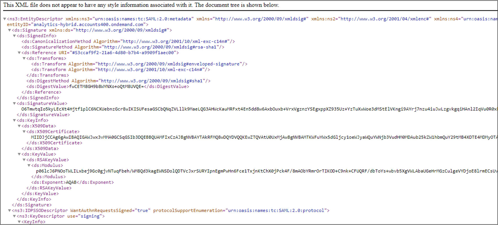

10. In the SAP Cloud Platform Cockpit go to **Security > Trust** and click the **Application Identity Provider** tab.

      Then, click **Add Trusted Identity Provider.**

      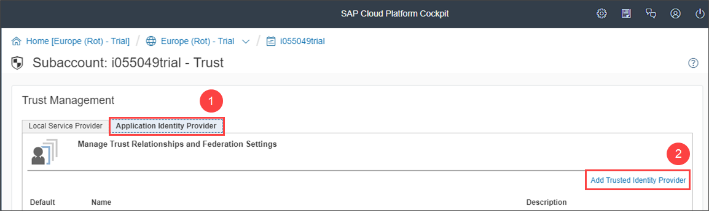

11. Next to the **Metadata File** field, click **Browse**  and select the IDP metadata `xml`.

      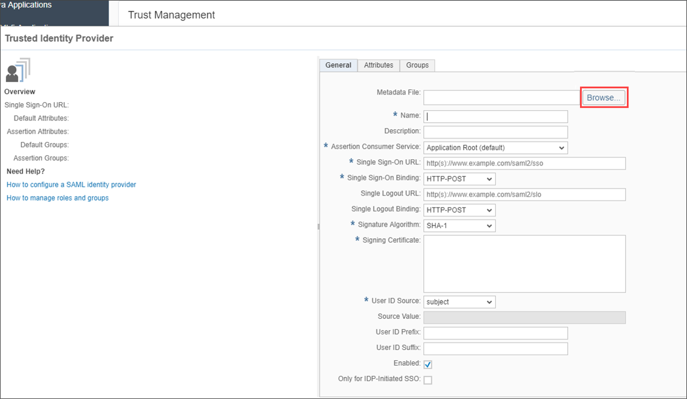

      Change the signature algorithm from `SHA-1` to `SHA-256`.

12. Select the newly created Trusted Identity Provider as the default and click **Save**.

    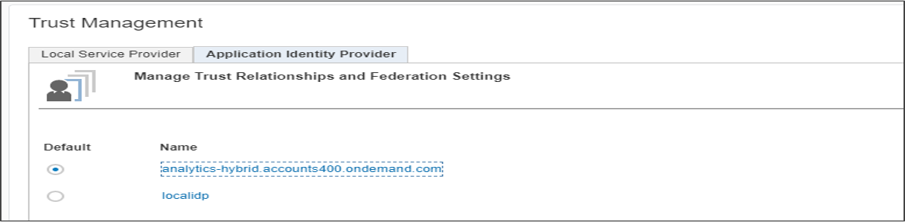

At this point, you can verify if all the configurations were done properly by launching the sample web application.

If the browser redirects you to the IDP to offer the login page to the user, then you've done everything correctly.

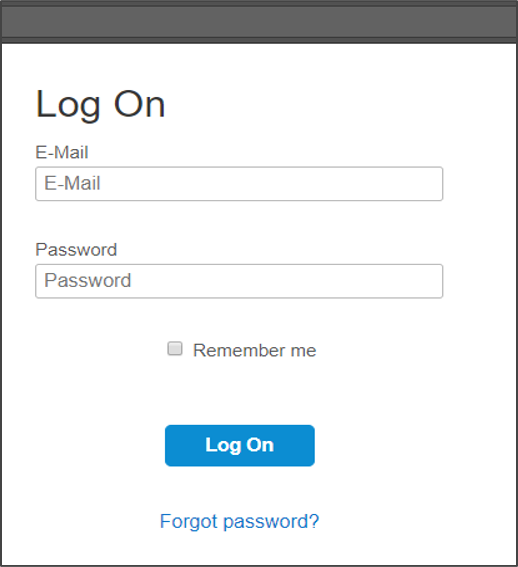

This concludes the first part (Fetch SAML Bearer Assertion Token) of setting up the OAuth two-legged flow.

[DONE]

[ACCORDION-END]

[ACCORDION-BEGIN [Step 3: ](Exchange the assertion token with the OAuth token)]

The sample web application that you created needs to get the OAuth token to access the protected resources on SAP Analytics Cloud so the administrator should create an OAuth client on the SAP Analytics Cloud tenant.

For more information, see [Managing OAuth Clients and Trusted Identity Providers](https://help.sap.com/doc/00f68c2e08b941f081002fd3691d86a7/release/en-US/4f43b54398fc4acaa5efa32badfe3df6.html).

### Create a new OAuth Client with a Grant Type

1. Log into SAP Analytics Cloud and, from the menu, select **System > Administration**.

     Select **App Integration** for managing OAuth.

     To create a new OAuth Client, click **Add a New OAuth Client**.

     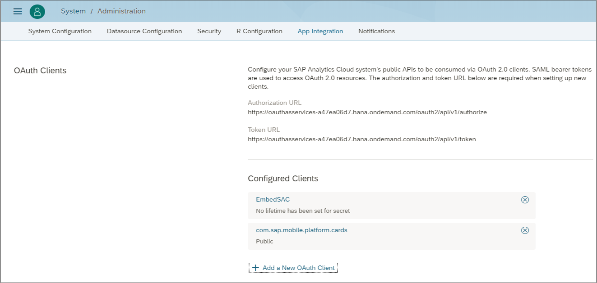

2. Enter the OAuth name and client ID.

      In **Authorization Grant**, select **Client Credentials**.

     Enter the token lifetime and details and click **Save**.

     

3. On the **App Integration** tab.

     Take note of the Token URL end point. You'll need it later on.

     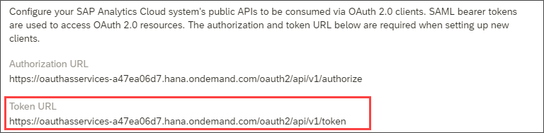

### Maintain the Trusted Identity Provider for the SAML Bearer Assertion###

   You also need to maintain the Trusted Identity Provider for the SAML bearer assertion flow to maintain trust between SAP Cloud Platform and SAP Analytics Cloud to pass SAML bearer assertion token.

1. Log into SAP Cloud Platform and go to **Security > Trust**.

     Copy the information from the **Signing Certificate** field for your local Service Provider.

      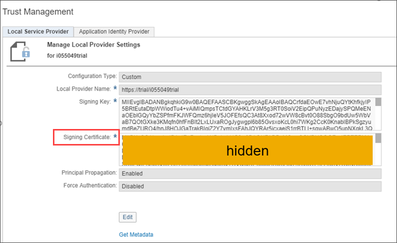

2. Log into SAP Analytics Cloud and, from the menu, select **System > Administration**.

      Select **App Integration for managing OAuth**.

       To create a new Trusted Identity Provider, click **Add a Trusted Identity Provider**.

     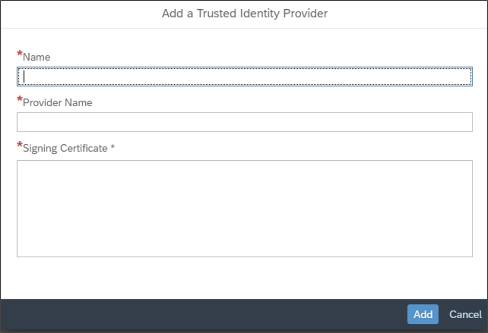

3. Enter the name, provider name, and the signing certificate.

      Enter the same provider name as the one specified in SAP Cloud Platform and the signing certificate information that you copied previously.

     Save the settings.   

     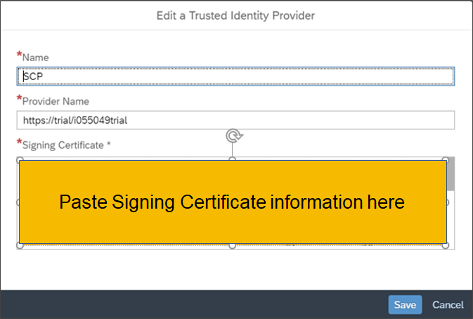

4. Provide a Trusted Origin.

     Click **Add a Trusted Origin** and enter the domain of the web application as the Trusted Origin.

     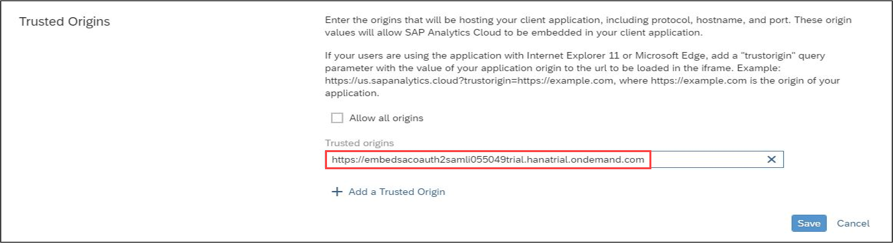

5. Provide Custom IDP within SAP Analytics Cloud.

      For instructions on doing this, see: [Embedding SAP Analytics Cloud Story with URL API and SAML2 SSO based on WSO2 Identity Server](https://blogs.sap.com/2017/09/30/embedding-sap-analytics-cloud-story-with-url-api-and-saml2-sso-based-on-wso2-identity-server/).

### Create a new connectivity destination in SAP Cloud Platform

Finally, because the sample web application will consume REST APIs, you need to create a new connectivity destination in SAP Cloud Platform.

You can use the connectivity destination to connect the sample web application to an internet service which, in this case, happens to be provided by SAP Analytics Cloud.

1. In the the SAP Cloud Platform Cockpit, go to **Connectivity > Destinations**.

       Click **New Destinations**.

     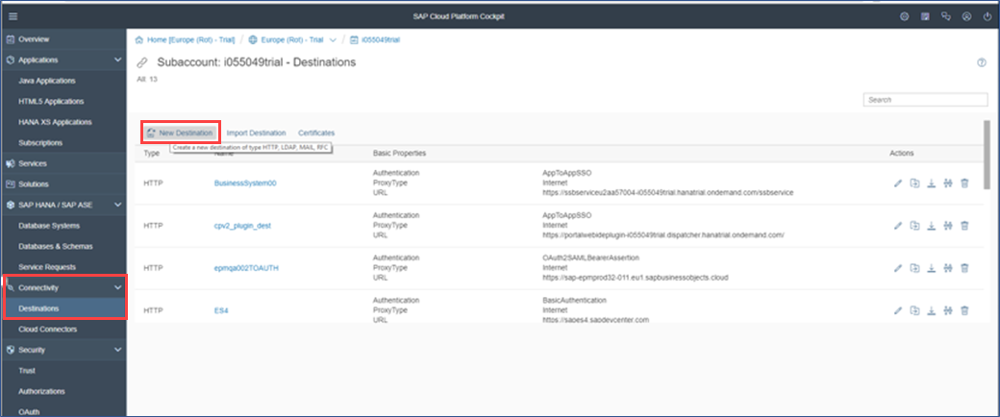

2. Enter the following details:

    - Authentication method: `OAuth2SAMLBearerAssertion`
    - URL: Your SAC tenant URL
    - Client key: The OAuth client ID created earlier
    - Token Service URL: Available on system via **Administration > App Integration** tab.
    - Token Service User: OAuth client ID
    - Token Service Password: OAuth Client Secret   

       Then, to set up some additional properties, click the **New Property** button. Namely, add the following:

    - `authnContextClassRef:urn:oasis:names:tc:SAML`
    - TrustAll : true   

       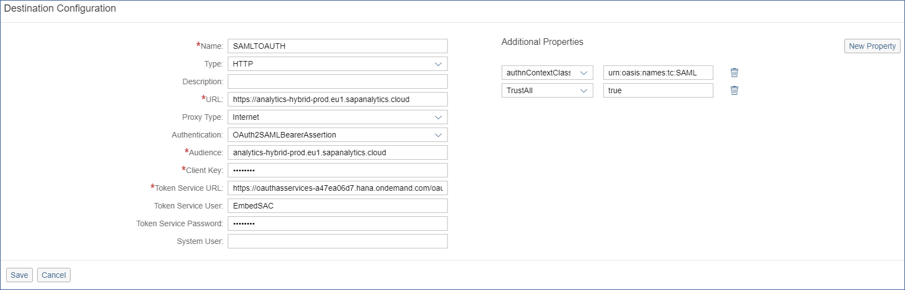

3. Click **Save**.

### Verify Results

Before you test the entire flow, remember to set the browser to accept cookies from SAP Analytics Cloud by specifying the tenant URL in the Allow cookies section of the browser settings.

1. Launch the application.

2. Once the application is rendered in the browser, click **My Stories** to display an SAP Analytics Cloud Story within the `Iframe`.

     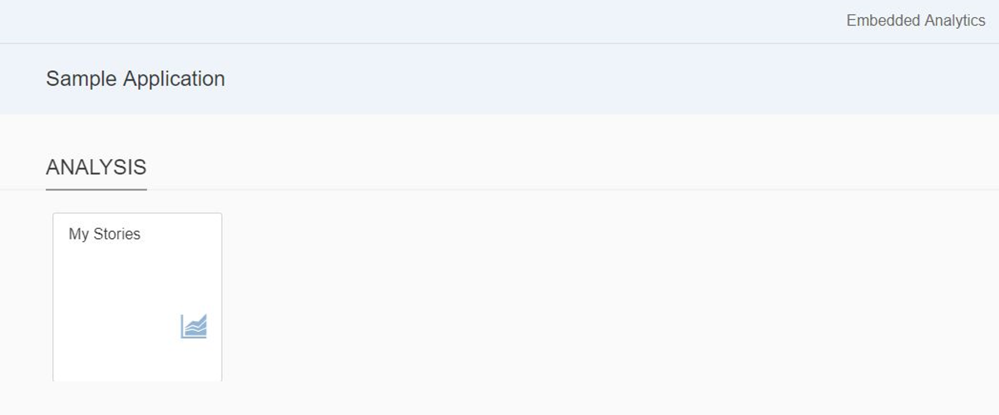

   The **My Stories** tile launches a Master Detail UI where the list of Stories that the user is authorized to view. Selecting a story from the list renders it.

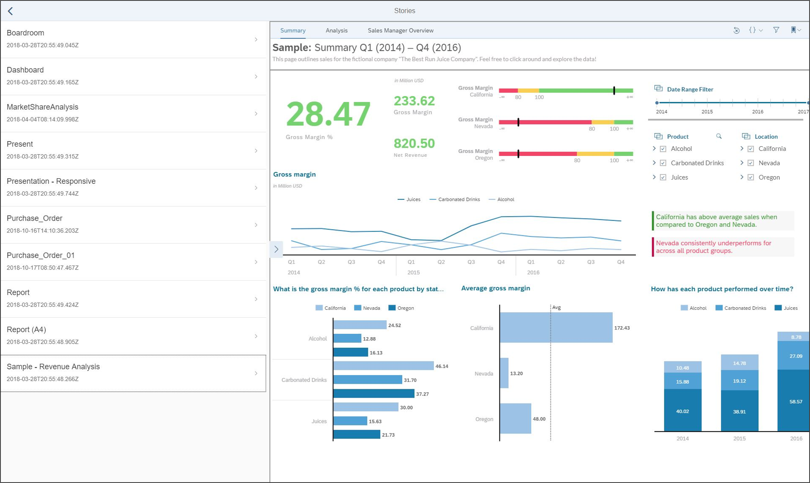

[VALIDATE_1]

[ACCORDION-END]

---
