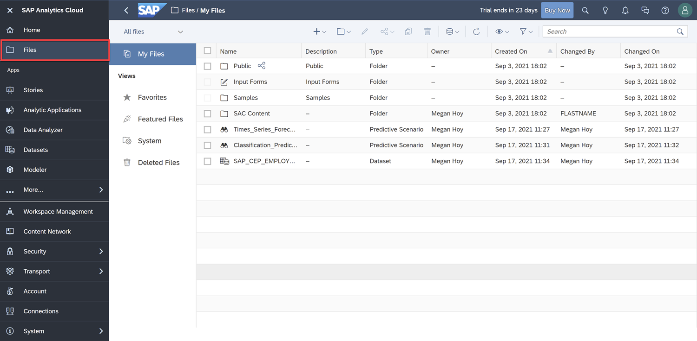
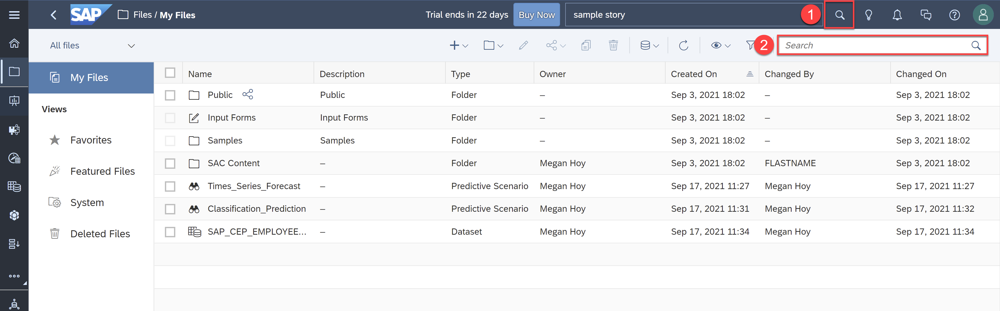
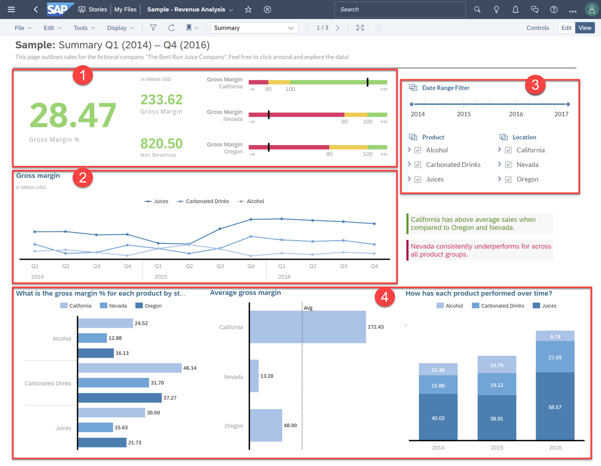

## Prerequisites
 - You have completed the Get to know SAP Analytics Cloud Group of Tutorials (Link Later)
 - You have access to an SAP Analytics Cloud account
 - Please use the latest version of Chrome or Edge to access your Sap Analytics Cloud

## Details
### You will learn
  - How to navigate files and folders within SAP Analytics Cloud
  - Where to find the "Sample – Revenue Analysis" story provided to all users
  - What the components of a story are

Welcome back and congratulations on learning the different capabilities offered in SAP Analytics Cloud and setting up your trial account. For this set of tutorials, you should follow along step by step with your own SAP Analytics Cloud tenant.

Let's get started and explore SAP Analytics Cloud stories.

---

[ACCORDION-BEGIN [Step 1: ](Browse through your Files and Folders)]
Before you open your first story, let's look at the navigation path through files and folders that lead you to the story. To start, expand the navigation panel on the left and click on **Files**.

<!--  -->

Here you'll find **My Files**, which contain files and folders created by you or shared with you by others.

|  Files/Folder   | Description
|  :------------- | :-------------
|  **Personal Files** | Your private files
|  **Samples**        | Sample models and stories provided by the system
|  **Public**         | Files publicly available to everyone in your organization
|  **Input forms**    | Input tasks related to planning workflows

Below **My Files**, you'll find a subcategory of your SAP Analytics Cloud files.

|  Folder     | Description
|  :------------- | :-------------
|  **Favorites**  | Files and folders marked as your favorites
|  **Featured**   | Files marked as featured, and also seen in the Featured Files tile on the Home screen for quick access
|  **System**     | Administration view, which is available to users who have Manage rights on either the Private Files or Public Files application privilege
|  **Deleted**    | Files and folders that have been deleted. Deleted content is permanently deleted after 30 days by default, but administrators can configure the number of days that deleted content is stored for. Users with Manage rights on the Deleted Files application privilege can also manage other users' deleted files.

Last feature to note here are the Search options available for finding content.

  1. The **search** icon located on the Shell Bar is used for content across the whole SAP Analytics Cloud product. The Shell Bar is always visible at the top, making it easy for you to search while in a story.
  2. The **search bar** below the Shell Bar allows you to find content within any of the folders or subfolders of **My Files**. For example, use this and search for "Sample – Revenue Analysis" to find the sample story.

[DONE]
[ACCORDION-END]

[ACCORDION-BEGIN [Step 2: ](Open and Explore the Sample Story)]
Now that you understand the files and folders system, open the **"Sample - Revenue Analysis"** Sample Story within the **Samples** folder or search for it using the Search bar.

Let's quickly revisit what stories are and why they're important. Stories are much like an analytics dashboard or report that allow stakeholders to analyze, report, and plan with the historical data of a business. Furthermore, it provides instant access and augmented analysis for monitoring and measuring business performance and metrics.

This Story shows the "data story" of a beverage business called "The Best Run Juice Company" and demonstrates the performance of the business with different visualizations and features:

| Number          |  Visualization / Feature         | Description
|  :------------- |  :-------------                  | :-------------
|1                |  **Numeric Point and Bullet Charts** | Visualizes the status of Key Performance Indicators (KPI).  You can immediately see the current KPI value compared to your business's performance thresholds.
|2                |  **Time Series Chart**               | Displays trends in any kind of numeric data over time.  Is your business trending positively?  
|3                | **Input Control Filters**            | Allows you to focus in on data segments.  Slide the Date Range filter to select your dates for analysis and the filter checkboxes helps you be precise in your analysis.
|4                |  **Bar Charts**                      | Visualizes values across a Series of data.  As an example, the first chart on the left shows Gross Margin % by the Product and Location dimensions. They're easy to understand and interact with by drilling down, sorting, or analyzing with Smart Insights.  We'll use these together in the later tutorials.

[DONE]
[ACCORDION-END]

[ACCORDION-BEGIN [Step 3: ](Test Yourself)]
In the question area below, pick one multiple choice answer and then click **Submit Answer**.

[VALIDATE_1]

[ACCORDION-END]
---
