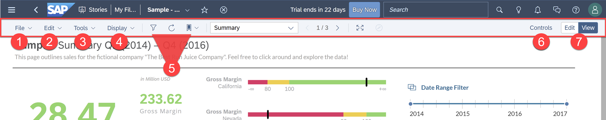
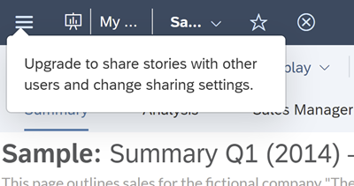
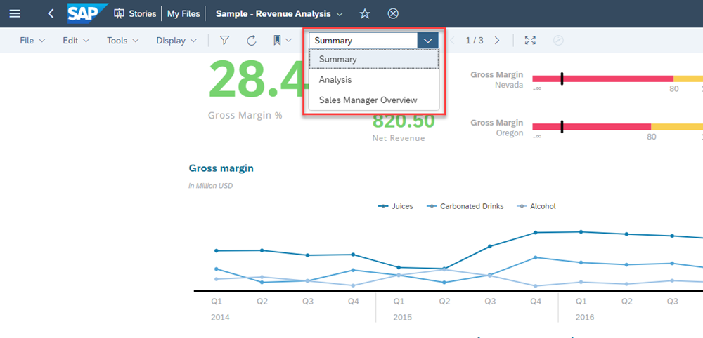
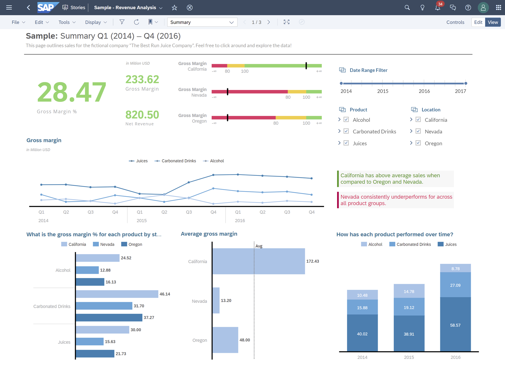
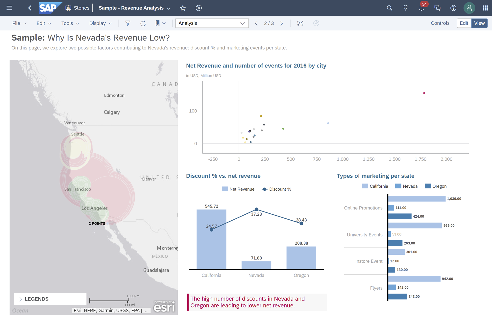
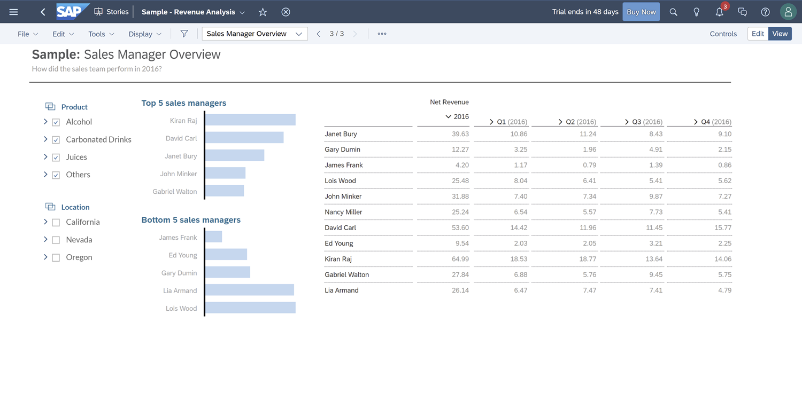

## Prerequisites
- You have access to an SAP Analytics Cloud account

## Details
### You will learn
  - How to use the features in the toolbar
  - How to navigate the pages of a story

<!-- Add additional information: Background information, longer prerequisites -->
---

[ACCORDION-BEGIN [Step 1: ](Understand the Toolbar)]
Let's first look at the toolbar. In the toolbar, you can save a copy, share with other users, add filters, navigate pages, toggle between View and Edit modes, and more.

|  Number         | Name                    | Description
|  :------------- | :-------------          | :-------------
|  1              | **File**                | Go here to export, share, schedule, and publish your story to the catalog.
|  2              | **Edit**                | Reset your story to its original view state, refresh your story data, copy, and paste widgets.
|  3              | **Tools**               | Edit Prompts for your data models, bookmark the current state of your story, run formulas on table cells, and  create Story Filters that filter data story-wide.
|  4              | **Display**             | Toggle Comment Mode and Tab Display (page navigation option) on or off. We'll use these in Step 2.
|  5              | **Quick Access Icons**  | Apply story filters, refresh data, and add bookmarks with just one click.
|  6              | **Controls**            | View all filters applied to the page and widgets.
|  7              | **Edit/View**           | Toggle between Edit and View modes. Edit mode enables a Design panel and a larger toolbar filled with features and capabilities that you can use to build stunning and interactive dashboards and reports.  Note that Edit mode is available only if you have rights to edit the story.

>If you have a Trial account, the File menu is not shown when in View mode for the Sample Story due to stricter permissions.

>

[DONE]
[ACCORDION-END]

[ACCORDION-BEGIN [Step 2: ](Explore the Pages of a Story)]

To start, let's explore the options for Page Navigation. As seen below, the default mode lets you navigate the story pages through a drop-down menu.

If you'd like quicker access to all the pages, you can click on **Display** > **Tab Bar**. The screenshot below shows you an example of **Tab Bar** display in a story. Let's go through each page.

### **Summary**  

On this page, you will find a summary and overview of this fictitious beverage business. Their key performance indicator, gross margin, is analyzed across multiple data segments with visualizations.

### **Analysis**  

This page analyzes the net revenue of this business in Nevada. The Geo map on the left displays and analyzes geographical data by the region. The scatter plot on the top right helps determine correlation between net revenue and the number of events held, while the bar charts below analyze past discounts and marketing events.

### **Sales Manager Overview**  

This page gives an overview of the performance for each sales manager.  The bar chart displays the ranking of the sales managers while the table provides detailed data into each quarter. The Input Control filters on the left help you "slice and dice" the data, allowing you to see their performance by different Products and Locations.

[DONE]
[ACCORDION-END]

[ACCORDION-BEGIN [Step 3: ](Test Yourself)]
In the question area below, pick one multiple choice answer and then click **Submit Answer**.

[VALIDATE_1]

[ACCORDION-END]

---
