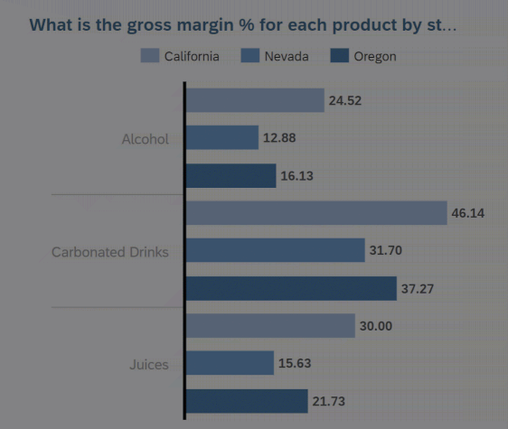
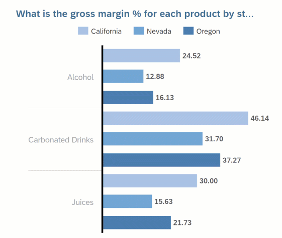
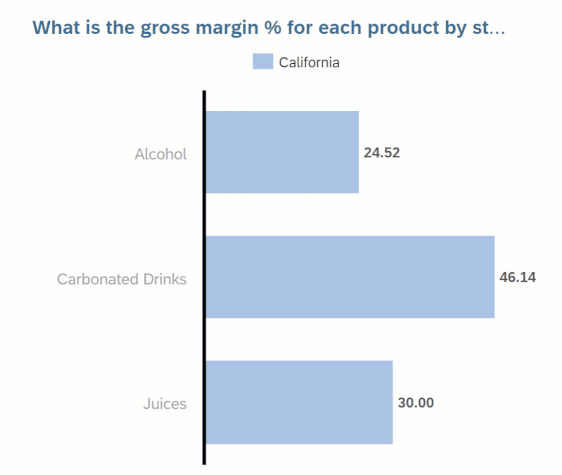
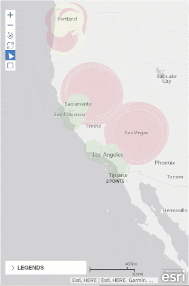
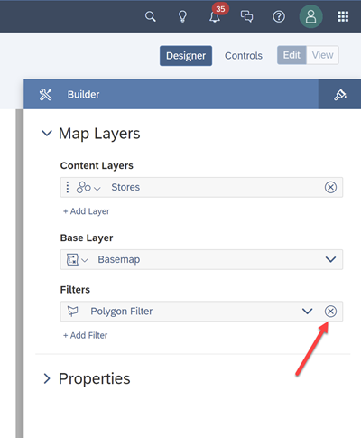
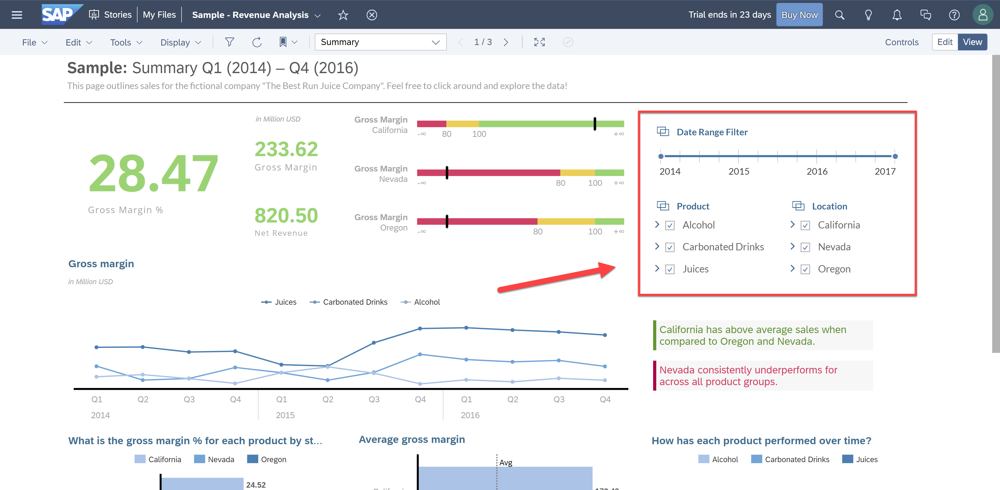
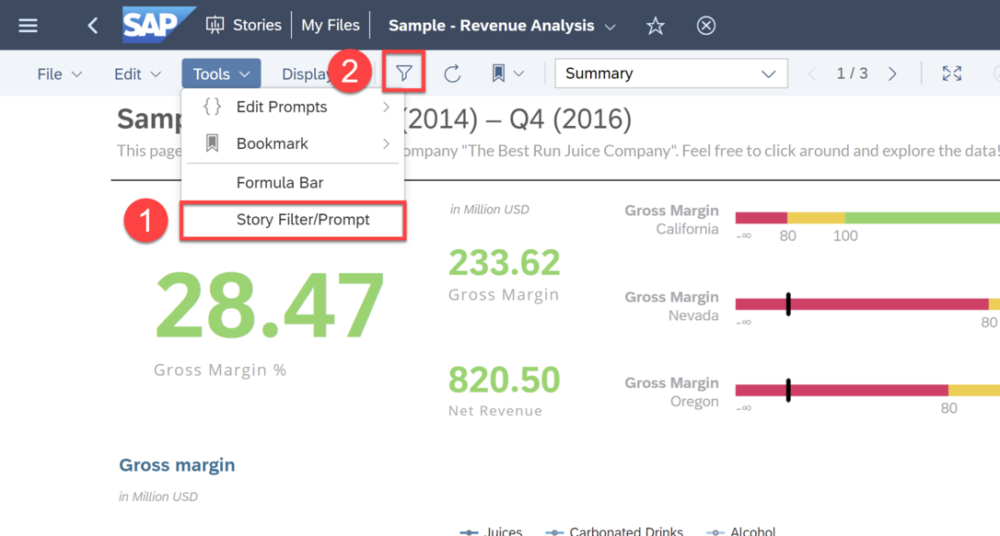
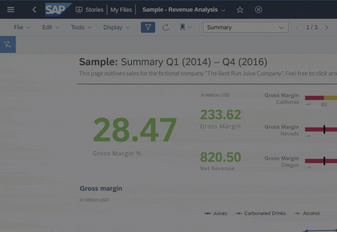
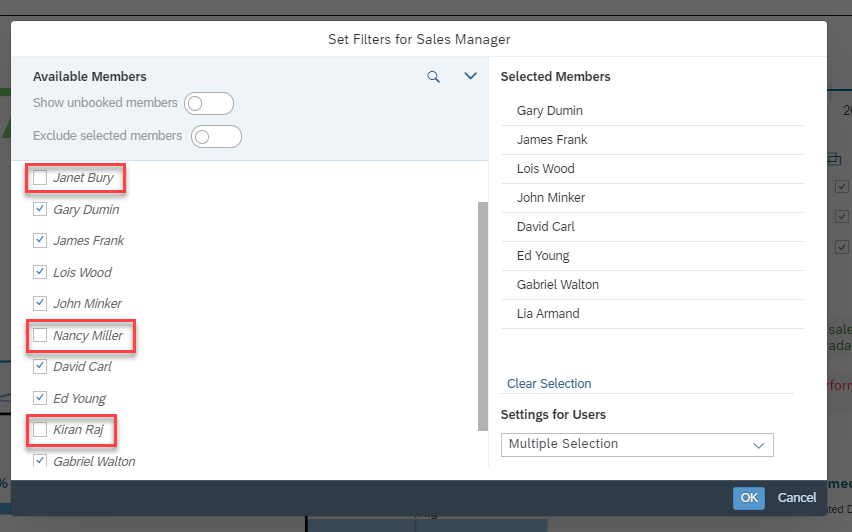
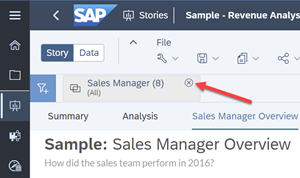

# Apply Filters to the Story
<!-- description --> Analyze the charts in your Stories with filters

## Prerequisites
- You have access to an SAP Analytics Cloud account

## You will learn
  - How to filter charts
  - How to filter your story with Input Control page filters
  - How to create story-wide filters with a story filter

## Intro
<!-- Add additional information: Background information, longer prerequisites -->

---

### Applying Filters to your Story

Filters help you focus your analysis, investigate specific data segments and dive deeper into selected data points.  In SAP Analytics Cloud stories, there are three different filter options:

|  Filter         | Description
|  :------------- | :-------------
|  Chart Filter   | Within stories, you can directly filter charts and tables by dimensions and measure members.
|  Page Filter    | All charts within a page can be applied to filters through Input Control Filters.
|  Story Filter   | All charts within a story can be applied to filters through a Story Filter.

In this tutorial, you will learn more about each of these filters and how to use them with your story.

### Filter Data in Charts

With chart filters, you can exclude non-relevant data points or filter data points to focus a chart on a specific set of data. Chart filters apply only to the data displayed in that chart. There are different ways to filter charts:

1. **Filter on Data Points**

    Click on a single data point or filter on multiple data points by pressing `Ctrl + click` for windows or `Cmd + click` for mac on the data points to select them. A filter icon then appears and clicking on it allows you to filter on the selected data point(s).  

    

  2. **Filter on Dimension Members**  

      You can filter on a dimension by either clicking on the Legend or by clicking on a chart label.  See both examples below.

      ***On Legend:***  

      

      ***On a Chart Label:***  

      

  3. **Filter on Geo Maps**

      Lastly, you can also filter on Geo maps. This is done by using the Polygon filter to select the map area you wish to filter on. The example below shows how we filtered on the Geo map found on the Analysis page of this sample story.  

      

To remove these filters, open the **Builder** tab in the Designer panel and remove the filter in the **Filters** section.

### Filter your Page with Input Controls

Input Control filters allow users to interact with stories and control the data displayed on the page. On the Summary page of this sample story, the Input Controls enables you to filter the entire page by the **Date**, **Product**, and **Location** dimensions.  

Select the **California** location and notice how the charts change to display only the data for California.

### Filter your entire story with Story Filters

Story Filters allow you to apply filters for all charts and tables in a Story based on the same model. Unlike Input Controls that need to be pre-defined in the story, story filters can be added to the story at any time for any dimension or measure.

To enable the Story Filter bar, you can either click on Story Filter/Prompt under **Tools** or click the Filter icon (easier). Both ways will enable the Filter bar.

Now that the Filter bar is enabled, let's go over the following scenario:  

**Scenario**: Analyze the performance of all sales managers except `Janet Bury`, `Nancy Miller`, and `Kiran Raj`.    

1. Since you want to only see specific sales managers and exclude the rest, you need to filter on the Sales Manager dimension as seen below.  

      

2. In the filter, select all sales managers except `Janet Bury`, `Nancy Miller`, and `Kiran Raj`.  Alternatively, you can also enable the "Exclude selected members" toggle and select the sales managers you want to exclude.  

      

Click **OK** and see how the results in the Story has changed. To remove this filter, click the **X** symbol in the Sales Manager filter you made.

### Test Yourself

In the question area below, pick one multiple choice answer and then click **Submit Answer**.

---
