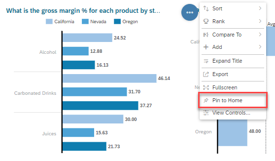

# Analyze Data in Charts and Tables
<!-- description --> Discover more from your charts with analytical features provided in SAP Analytics Cloud stories

## Prerequisites
- You have access to an SAP Analytics Cloud account

## You will learn
  - How to analyze difference between segments within charts
  - How to drill down on specific segments
  - How to sort data in charts
  - How to rank data in charts

## Intro
You've now gained a solid understanding of stories and learned how to interact with a story through filters. Now, go through some analytical features within SAP Analytics Cloud stories.

---

### View the Difference between Segments

When analyzing data, you will often need to compare values between different data points. To quickly see the difference between two data points, you can click to select the first data point then hover over the second data point.

The difference is then displayed in absolute value and percentage. If you would like to see the difference longer, you can simply click the second data point instead of hovering.

### Drill down on a Specific Segment

Next, let's look at how you can drill up and down the data in the charts. If hierarchical dimensions are included in a chart, you can drill up or down through dimensions to explore the data at different levels.

<!-- For example, in most data models for sales data, you would have hierarchies defined for Dates and Locations. These hierarchies may look like this: Year > Month > Day and Country > Region > City. Below is an example of drilling into a hierarchy of a Location.    -->

As an example, let's say you want to dig deeper into the average gross margin of the Cities within Nevada to understand why Nevada has the lowest gross margin. Here, you can drill down into the Nevada location dimension.

Consequently, you can see the average gross margin for the cities within the Nevada state.

> Date hierarchies may look like Year > Month > Day while Geo hierarchies may look like Country > Region > City.

### Apply Sorting to your Charts

Next, is the ability to sort your data. You can specify the sort order for data in your chart for measures and dimensions: alphabetical ascending or descending, highest to lowest, and so on. Simply right click the chart and select sort, then choose the measure or dimension you want to sort by and the sort direction.
<!-- Let's look at the example below. You can even sort on multiple dimensions within the chart. -->

In the example above, the chart is immediately updated and shows the Locations sorted from the Highest to Lowest Gross Margin % within each Product group.

You can also sort dimension and measure values within tables. Sorting your tables can give you a better understanding of your data and intuitively provides a rank of your data. Within the table of the Sales Manager Overview page, right click the **2016 column** > **Sort Options** > **Sort Descending**.

### Apply Ranking to your Charts

In addition to sorting, you may also want to show your data ranked from top to bottom, or vice versa, for your analysis. The Rank feature allows you to choose rank options such as Top 5, Bottom 5, or Top N (any number) in your charts and tables. Let's look at how this works with an example.

You can apply the same ranking to All Dimensions or you can select one dimension and apply ranking to it. The ranking options available are:

-	Top 5
-	Bottom 5
-	Top N Options:
    - Mode - Top or bottom
    - Value - used as the number of values you want to include in the filters
    - Dimension - Select all dimensions or a specific dimensions
    - Measure
    - Cross Calculation
    - Version

### Other Useful SAP Analytics Cloud Features

Lastly, let's explore a few more useful features that are included in SAP Analytics Cloud stories.

1.  **Compound Growth Rate** (Represented as CGR)

    **CGR** is a measure of the average rate of growth experienced over a multi-year period. It is often used to evaluate and compare how different projects, investments, or categories have performed over time. Here, SAP Analytics Cloud provides an easy way to add **CGR** evaluations into your visualizations.

    In the **Chart Action Menu** of the chart, select **+ Add** > **CGR**.

    

2.  **Pin to Home**

    **Pin to Home** allows you to pin visualizations to your home screen for easier access to monitor your key metrics.  The pinned visualization keeps the original context and data connectivity so that the latest data is always displayed.  

    To pin a chart to your homepage, select the **Chart Action Menu** > **Pin to Home**.

    

    Consequently, the chart you pinned will show up on your Home page.

    

3.  **Export Chart Data**

    Lastly, you might want to export data from certain charts and view them through a Comma Separated Value (CSV) data sheet. This is possible and simple to execute. Select **Chart Action Menu** > **Export**.

    

    In the "Export as CSV" window, you can specify the **Name** of the file download, select to **Include Formatting**, and change the field separator of the **CSV** through the **CSV Delimiter**.

    

### Test Yourself

In the question area below, pick one multiple choice answer and then click **Submit Answer**.

