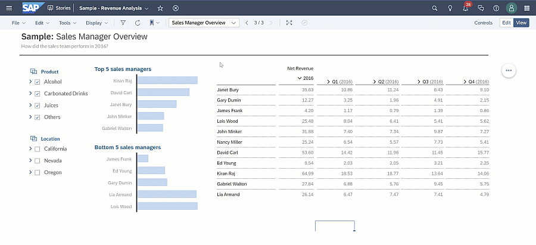
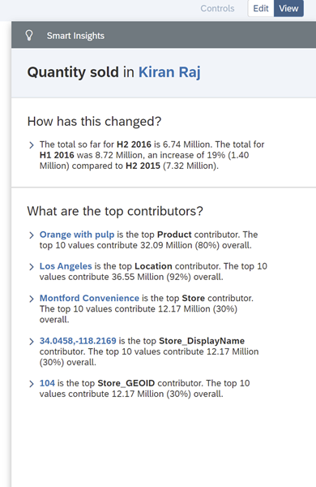
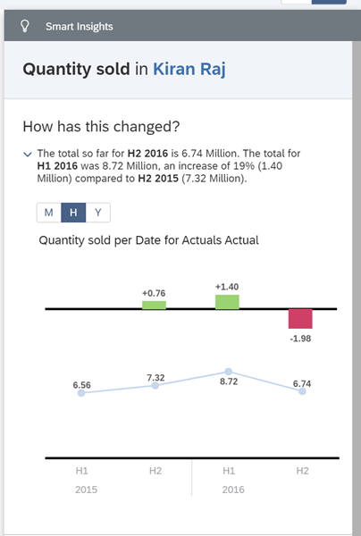
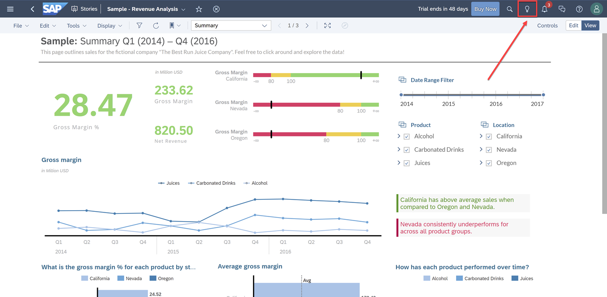
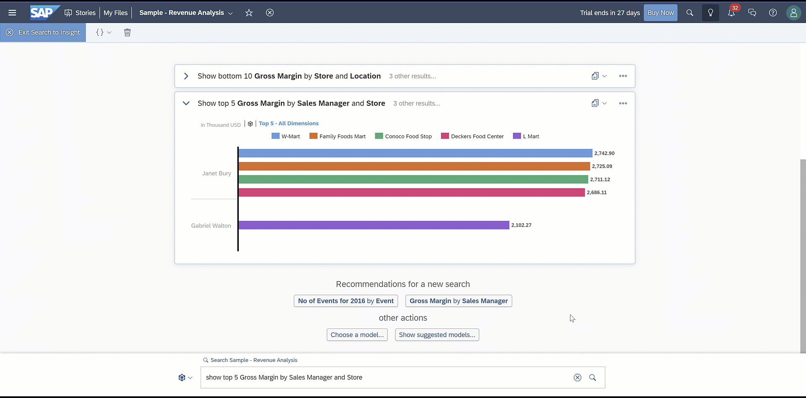

## Prerequisites
- You have access to an SAP Analytics Cloud account

## Details
### You will learn
  - How to discover new insights within your data with Smart Insights
  - How to get answers quickly with Search to Insight

Smart Insights and Search to Insight are two powerful features within SAP Analytics Cloud that use machine learning to find hidden insights in your data displayed in auto-generated charts.

---

[ACCORDION-BEGIN [Step 1: ](Understand Top Contributors Easily with Smart Insights)]
Understanding the top contributors within your dataset used to take manually slicing and dicing into different measures and dimensions. There are many challenges with this approach and it can result in inaccurate insights because you can understand only what your eyes can see.

Now with Smart Insights, anyone can get statistically accurate insights into top contributors with a single click. It saves you hours of effort and helps give you more confidence when it comes time to make decisions.

You can get immediate insights into questions like "What contributed to our decrease in Phone sales last month?" or "What contributed to the increase in product returns?".  

### Use-case example: Understand what is contributing to the performance of a top Sales Manager###

In this example, you'll learn how to use Smart Insights to explain the top contributor to the Quantity sold of the top Sales Manager and see what makes he or she a manager with such high results.

**Steps:**

1. Go to the "Sales Manager Overview" page

2. Right click on `Kiran Raj` in the "Top 5 sales managers" bar chart

3. Click **Smart Insights**

A tab will appear on the right displaying the contributors to the sales manager's performance, `Kiran Raj`. The information is displayed in natural language and accompanying visualizations to help the viewer better understand the insights generated.

The first Insight summarizes the sales manager's performance over the most recent time period. The rest of the Insights for Quantity sold by `Kiran Raj` is listed clearly in the panel as well. It shows  that the top contributors driving Quantity sold for `Kiran Raj` is the product `Orange Juice with Pulp`, the city of `Los Angeles`, and the `Montford Convenience` store. To learn more about this insight, click on ">" to expand the section.

It shows that `Kiran Raj's` quantity sold increased in the last two half-years but dipped in the second half-year.

> Smart Insights may not be enabled for all visualizations because this feature is dependent on the story design and data source.

To learn more, here are more in-depth resources on Smart Insights:

- [Smart Insights Community Content Page](https://community.sap.com/topics/cloud-analytics/augmented-analytics#smart-insights-smart-discovery)

- [Smart Insights Help Guide](https://help.sap.com/viewer/00f68c2e08b941f081002fd3691d86a7/release/en-US/c9eb30cc1e5b4c439cb871bf9612d2ac.html)

[DONE]
[ACCORDION-END]

[ACCORDION-BEGIN [Step 2: ](Get Answers Faster with Search to Insight)]

Search to Insight is a feature that enables users to search for quick answers to questions directly through SAP Analytics Cloud stories using natural, everyday language. Simply type what you would like to know from your data – such as "Net Revenue for the last quarter" – into the search box, and SAP Analytics Cloud will create an appropriate visualization to your query.

Search to Insight is available from any story from the top right corner in the **Shell Bar**. Click on the light bulb icon, and SAP Analytics Cloud will bring up a new tab for you to query data with Natural Language.

To demonstrate Search to Insight, let's dive into another scenario: **Decide which Sales Manager should be promoted to Regional Sales Manager**.

For this, you should take a look at our top performing sales managers. Let's type in "Show top 5 Gross Margin by Sales and Store".

It turns out that 4 out of the 5 stores with the highest gross margins are handled by `Janet Bury`. Thus, you learned that even though `Kiran Raj` has the most quantity sold out of the Sales Managers, `Janet Bury` sells to the 4 stores with highest Gross Margin.

Furthermore, within Search to Insight, you can alter the mode, value, dimension, measure, cross calculation, and version of the chart that Search to Insight generated. In the above example, you changed the value of 5 to 10 to change the ranking from Top 5 to Top 10. Again, from here, you can filter, exclude, drill down, and copy the chart to your story.

To learn more, here are more in-depth resources on Search to Insight:

- [Search to Insight Community Content Page](https://community.sap.com/topics/cloud-analytics/augmented-analytics#search-to-insight)

- [Search to Insight Help Guide](https://help.sap.com/viewer/00f68c2e08b941f081002fd3691d86a7/release/en-US/e1b4914ffbc8438eb1aefccf70362d39.html)

[DONE]
[ACCORDION-END]

[ACCORDION-BEGIN [Step 3: ](Test Yourself)]
In the question area below, pick one multiple choice answer and then click **Submit Answer**.

[VALIDATE_1]

[ACCORDION-END]
