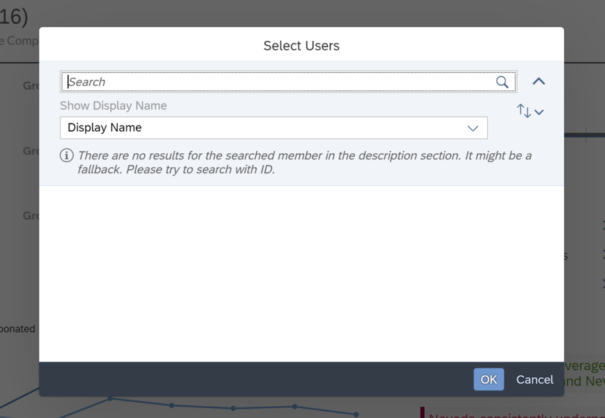

## Prerequisites
- You have access to an SAP Analytics Cloud account

## Details
### You will learn
  - How to create bookmarks
  - How to start a discussion
  - How to use comments
  - How to share your story

<!-- Add additional information: Background information, longer prerequisites -->

---

[ACCORDION-BEGIN [Step 1: ](Bookmark the State of the Story)]

You can bookmark the state of a story to include the current selections in story filters, input controls, prompts, explorer views, and variances so that you don't need to make these selections repeatedly each time you open the story.

If you were only responsible for the performance of sales in Oregon, your manager would most likely share a bookmarked version of the story containing only Oregon data. To create a bookmark, click on **Tools** > **Bookmark** > **Bookmark Current State**.

Let's try an example by creating a bookmark with just Oregon data for an Oregon regional Sales Manager.  

To open a saved bookmark, click **Tools** > **Bookmark** > **Open Saved Bookmarks**. Then, open a previously saved bookmark. In this example, open our previously saved bookmark **Oregon Analysis**.

[DONE]
[ACCORDION-END]

[ACCORDION-BEGIN [Step 2: ](Collaborate with Discussions)]

Discussions are useful for communicating and collaborating across teams on analytics. To start a discussion, click on the collaboration icon on the top right corner of the SAP Analytics Cloud **Shell Bar**.

> A full account (non-trial account) is required to start a discussion.

From there, you simply need to invite participants to the discussion. Some more advanced features for discussions would be assigning roles to participants, adding attachments, and creating tasks.

[DONE]
[ACCORDION-END]

[ACCORDION-BEGIN [Step 3: ](Communicate with Comments)]

Another feature used for collaboration in SAP Analytics Cloud are comments. They are useful for giving feedback and communicating on specific areas of your stories such as data points. To insert a comment, right click within an area of a chart. Then click **+ Add** > **Comment**. It can also be accessed through the **Chart Action Menu**.

Your team members will then get notified via email of your comment and vice versa. This way, you're always notified of recent comments and replies from others.

[DONE]
[ACCORDION-END]

[ACCORDION-BEGIN [Step 4: ](Share your Story)]

The ability to share content with others is an important collaborative feature of SAP Analytics Cloud.

You can do this in a few ways within SAP Analytics Cloud:

1. Share your stories or global bookmarks to stakeholders. When viewing a story, you can share stories or change the story sharing settings. As a story designer, you can also share a global bookmark of the story.

    Click here to learn [how to share stories or global bookmarks](https://help.sap.com/viewer/00f68c2e08b941f081002fd3691d86a7/release/en-US/a9ecd401c9424a3e983a0a0f72bcba2f.html).

2. Publish your content to the Catalog. The Catalog is a tab on the Home screen that users can publish content to so that other users or team members have a single location where they can discover relevant content.

    Click here to learn [how to publish and share content to the catalog](https://help.sap.com/viewer/00f68c2e08b941f081002fd3691d86a7/release/en-US/5b11e19ce34f4d10abe6261fee47304b.html).

3. Schedule a publication. You can set up a schedule to periodically deliver content to a group of users. This is particularly useful if a team depends on you for regular updates with the latest information.

    Click here to learn [how to schedule a publication](https://help.sap.com/viewer/00f68c2e08b941f081002fd3691d86a7/release/en-US/86c2d7d88b134e45907453612c4f559a.html).

As you share content, it is best practice to share your content with the appropriate access to content. You may want to configure read access or edit access to those you share your stories with.

> All features above require a full account (non-trial account) for SAP Analytics Cloud.

[DONE]
[ACCORDION-END]

[ACCORDION-BEGIN [Step 5: ](Test Yourself)]
In the question area below, pick one multiple choice answer and then click **Submit Answer**.

[VALIDATE_1]

[ACCORDION-END]
