# SAP ALM API & Integration: Extension of SAP Cloud ALM with SAP Build (Part 1)
<!-- description --> This tutorial describes how to setup your SAP Build environment and the connectivity to your SAP Cloud ALM tenant.

## You will learn
- How to setup SAP Build Apps environment
- How to connect your SAP Build tenant to your SAP Cloud ALM tenant
- How to create a Data Entity based on SAP Cloud ALM REST resources

## Prerequisites
- You need Administrator rights into your SAP Build sub-account in order to create Destinations.
- You need to obtain the SAP Cloud ALM Service Key to connect to your SAP Cloud ALM account.
- You must have "Space Developer" access for the space in which the instance was created in your SAP Cloud ALM sub-account.

## Intro
**SAP Cloud ALM API**

SAP Cloud ALM APIs make it simple to extend SAP Cloud ALM functionality to deliver new features, services and applications for your SAP application lifecycle.

**SAP Build**

SAP Build is a unified low-code solution portfolio that empowers anyone of any the skill level to automate processes and tasks with drag-and-drop simplicity.

SAP Build brings together:

- SAP Build Apps (formerly SAP AppGyver),
- SAP Build Process Automation (formerly SAP Process Automation), and
- SAP Build Work Zone (formerly SAP Work Zone and SAP Launchpad service)

into a unified development experience with new innovations to rapidly build apps, automate processes, and create business sites.

**SAP Build Apps**

[SAP Build Apps](https://www.sap.com/products/technology-platform/no-code-app-builder.html) is a professional application development solution designed for anyone to quickly create apps without code regardless of role or skill level.

- Build user interfaces easily: Compose enterprise-grade custom apps with drag-and-drop ease.
- Create data models and business logic visually: Build cloud services without code .
- Integrate seamlessly: Connect to SAP and non-SAP solutions securely with pre-built components, connectors, and integrations.

### Setup SAP Build environment

1.  Install SAP Build Apps
   
     For the installation of SAP Build Apps on your SAP BTP account please follow the steps in this blog: [How to set up SAP Build Apps](https://blogs.sap.com/2021/12/16/how-to-set-up-appgyver-in-your-business-technology-platform-subaccount/).

2.  Connect to the SAP Cloud ALM API
   
     Once all these steps are done, before creating a new application, you need to connect it to the SAP Cloud ALM API. To do this you need to create a SAP BTP destination linking to your API between SAP Build and SAP Cloud ALM.

3.  Connect to your SAP BTP sub-account

     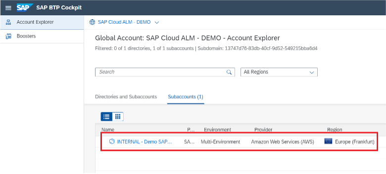

4.  Open the Destinations view

     On the tool bar on the left side, you should be able to click on `Connectivity`, then `Destinations`.

     Here you will be able to create the new destination that will link to our API.

     

5.  Create the Destination
    
     After having clicked on `New Destination`, you must give the information that links to the API.

     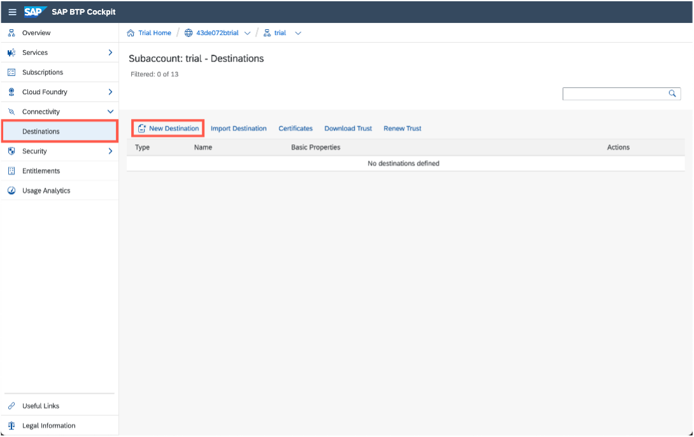

     Here you need to enter all the fields to configure our destination.

      - The <tenant> in these links should be replaced by the tenant we want access to with these API’s.
      -  The URL is the Service URL of the API:
        - Service URL = http://<tenant>.<region>.alm.cloud.sap/api
      - The Token Service URL is the URL we use to get the token that allows you to access the API
        - Token URL = http://<tenant>.authentication.<region>.hana.ondemand.com/oauth/token

     Once these two have been added you need to replace the Client ID with the correct **client ID** that will allow us to login. The same has to be done for the **client secret**.

     All other parameters should be the same as the picture above.

     The two additional properties **AppgyverEnabled** and **HTML5.DynamicDestination** should be set to true. These allow us to access this destination in our SAP Build Apps.

     Once this is done you can check if the API is well connected following this tutorial: [Tutorial – Testing SAP BTP Destinations](https://community.sap.com/media/sap-tech-bytes/tutorial---testing-sap-btp-destinations)

6.  Create an application in SAP Build

     Once the installation is finished, you can create a new application with SAP Build Apps to link to our API. Please follow these steps to do so: [Create an Application with SAP Build Apps](appgyver-create-application)

     You now have a working destination that can access our API. With this done the next step is to create a link to this destination in our SAP Build application we had created previously.

### Connect your SAP Build tenant to your SAP Cloud ALM tenant

1. Enable the BTP destinations in SAP Build

     - Start the SAP Build Application

    To consume BTP destinations in SAP Build, you go directly to the AUTH tab at the top of the UI.

    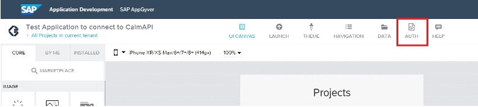

2.  Click on `Enable Authentication`
  
    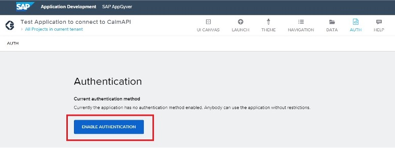

3. After this you click on `SAP BTP Authentication`

    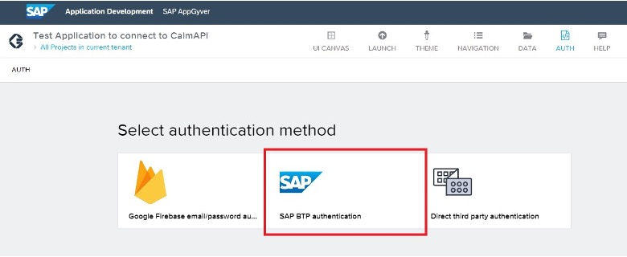

4. You should now end up with an Authentication page like this:

    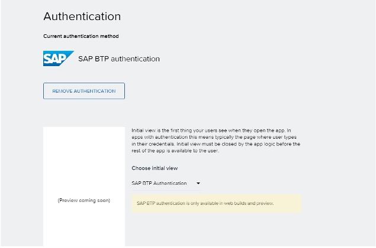

    Now you have authenticated BTP and can use BTP destinations as data sources.

###Create Data Entity based on SAP Cloud ALM REST resources

Adding the destination in your **SAP Build** Data

Data entity are used to model the data manipulated in your SAP Build application.  SAP Cloud ALM entities are based on REST access.

1. Navigate to the `Data` tab at the top of your page

    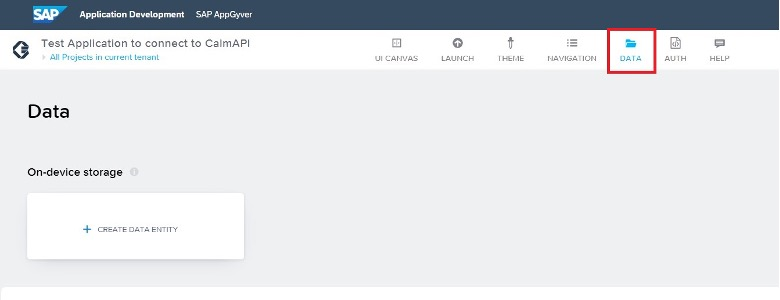

2. On this page, click on `Create Data Entry` and open the `SAP BTP Destination *REST* API integration` page

    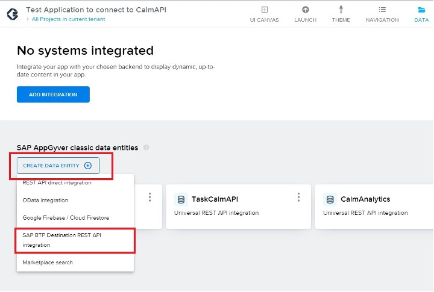

3. Once clicked on, this page should appear on your screen:

    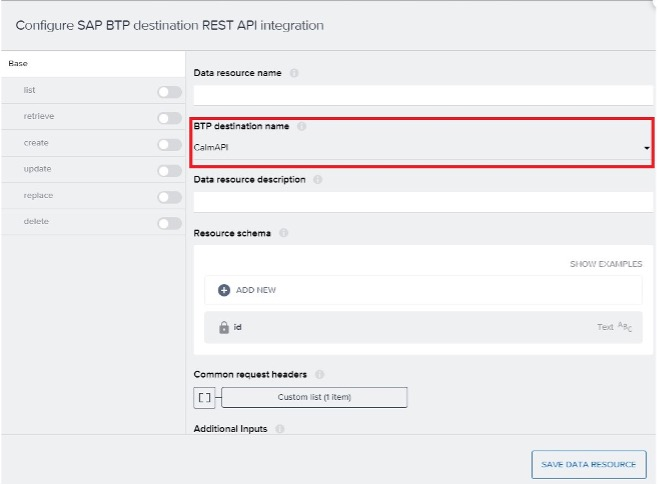

4. Configure Data Entity end-points

    Here in the BTP destination name you can scroll through all your destinations and choose the one we have created above.

    You can then enable any method you need on the side tab.

    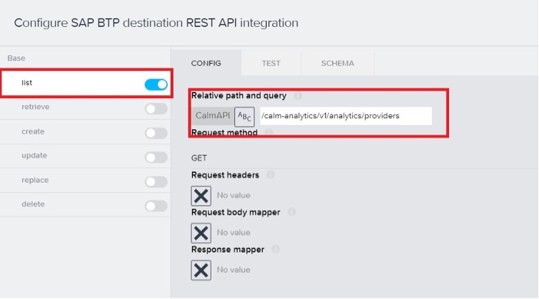

5.  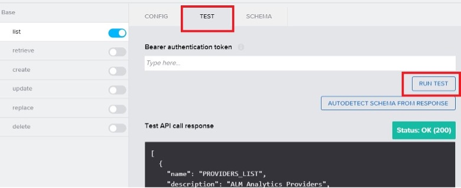

Through those methods you should be able to test to see if your API can send back data. Here you test a GET to your SAP Cloud ALM analytics provider. The answer from the API contains the providers information and answers with a status 200. This means you are connected to your API and can now use it in Build Apps to create a business application.

In the next tutorial, you will create an SAP Build application using different data entities.
