# SAP ALM API & Integration: Extension of SAP Cloud ALM with SAP Build (Part 2)
<!-- description --> Develop a simple Build Apps app where you can interact with your SAP CLoud ALM projects and tasks inside a given destination linking to your SAP Cloud ALM API.

## You will learn
- How to build a simple **Build Apps** application to interact with SAP Cloud ALM entities

## Prerequisites
- You need to have the connectivity setup between SAP Build Apps and SAP Cloud ALM.
- Check the previous [tutorial](https://developers.sap.com/tutorials/sap-cloud-alm-sap-build-process-automation-1.html) to setup your SAP Build and SAP Cloud ALM environments.

## Intro
In the end of this tutorial you will finish with a Projects and a Tasks page as shown below:

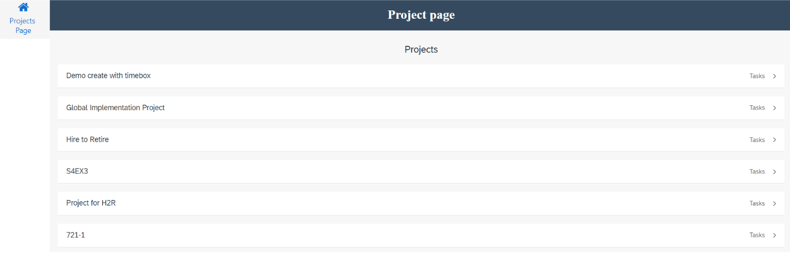

Clicking on a project should send you to its Tasks page showing all tasks in this project.

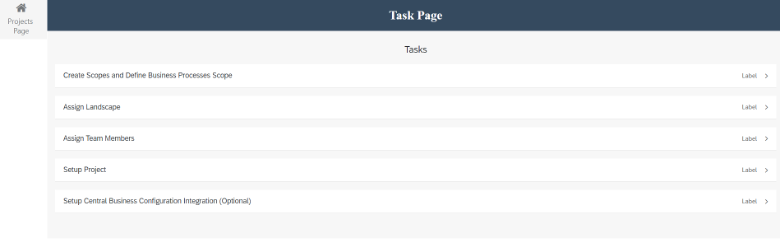

### Create a data entity linking to the Projects endpoint.
In the last tutorial you enabled the SAP BTP Authentication necessary for the next steps and you saw how to create a simple data entity linking to your main API. Here you will create a new one and link it to your projects endpoint.

1.  Navigate to the data tab at the top of the page. 
2.  Click on **Create Data Entity**.
3.  Choose **Sap BTP Destination REST API integration**. 
4.  A configuration tab for your data entity should open:
   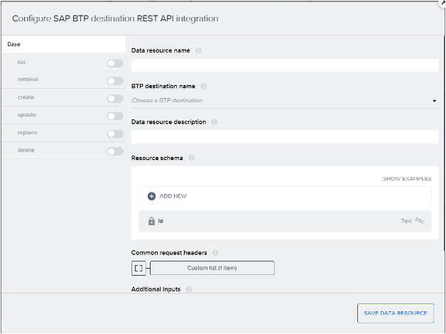
5. Choose the BTP destination name to link it to your Sap Cloud ALM API destination:
   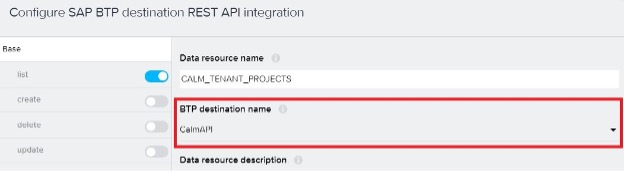
6. Activate one of the operations that will be executed on this destination. As you are looking to retrieve all the projects that exist in your tenant you will need to activate the **list** operation. 
   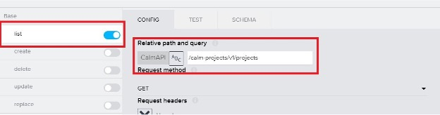
7. Enable your list operation on the left tab of the data entity configuration. Give the relative path to your projects endpoint.
8. Now you can use the RUN TEST tab to test the linking to your API. When running the test you should end up with a **Status:OK (200)**.
   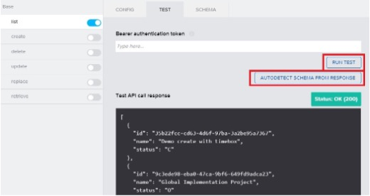

### Create the Data Variable
You now have a working connection to your SAP Cloud ALM projects endpoint of your API. To access the information from your API inside the canvas, it needs to be linked to a data variable.

1. Look at the variables tab on your page.
   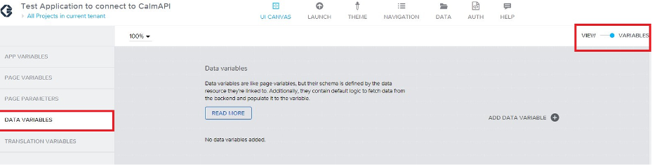
2. Select the variable view in the top right of the page.
3. Click on **Data variables**. Here you can create variables in your page that will let you interact with your data entity. This will allow you to call your defined operations in that entity.
3. Click on **Add Data Variable** to create this variable. 
4. Select the data entity that you created in Step 1. (for example "CALM_TENANT_PROJECTS”). When selected you end up with the data variable on the screen and you then have access to its logic chart.
   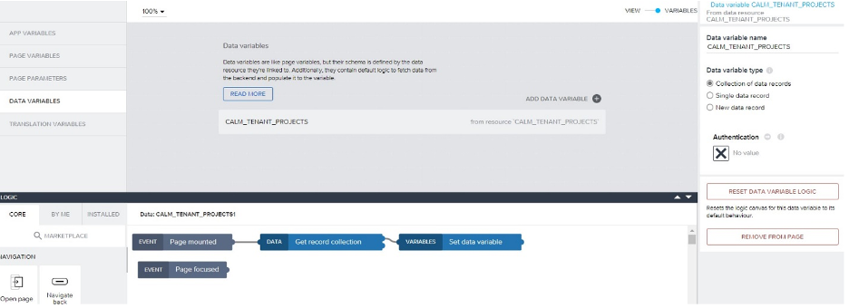
5. On the right side of the page are the characteristics of your variable. Here as you are getting all projects then it is a **Collection of data records** type of variable. This should be already selected, and no changes need to be done to this configuration.

You now have a link to your API and a way to access it on your Page. 

 
### Create the Projects list
Next, you create a list that will show all the Projects.

1. Add a “List Item” onto your page. 
2. Link it to your **Data variable** to show off all the projects.
3. The link to your Data variable is done with the **Repeat with** parameter of the list.
   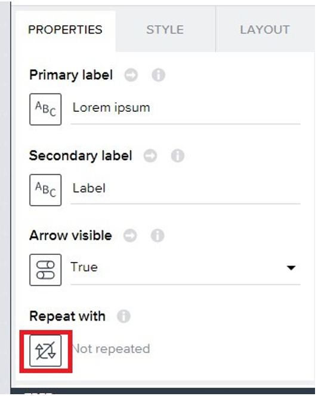
4. Click on the little symbol under the **Repeat with**. This will allow us to make your list repeat and show all the info on a certain item.
5. Continue to navigate towards your Data variable.
   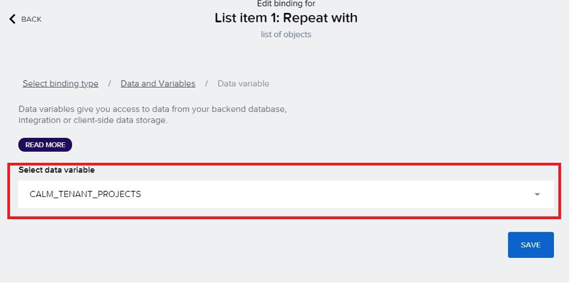
6. Our list is now going to be repeated on your **Data variable** to display all the variables from your API.
7. Link your list **Primary Label** to your Project names to be able to show the Project names.
   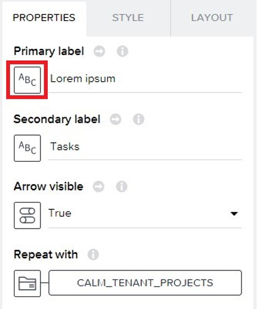
8. Click on the little button under the **Primary label** property. This is done to set the value that will appear on each square inside your list.
9.  Use the data item in repeat.
    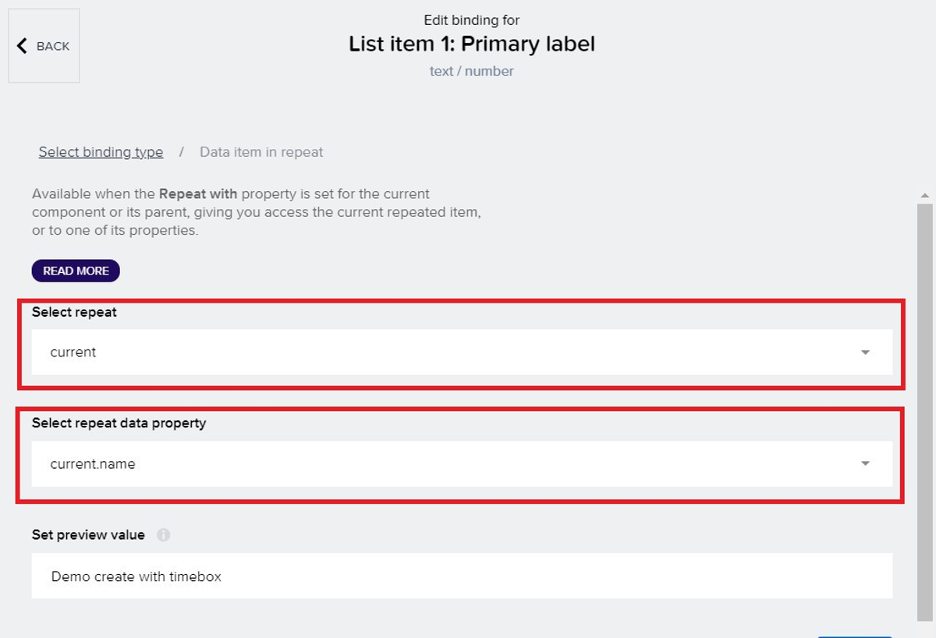
10. Select **current** as your Select repeat and then current.name as your **Select repeat data property**. This will make your list show every project name that you have in your tenant. 
11.  Click on **save** and you now have a list that will show all your Projects names!
12. To make this page a bit nicer you can use your Headline box to add a **Projects** as a title.

Once the page opened you see all the projects in your current tenant appear in a list format like follows:

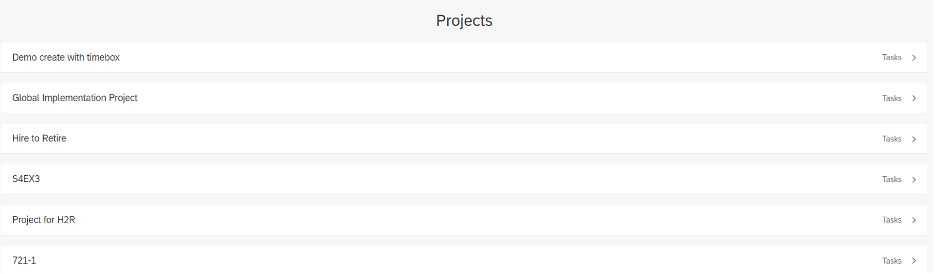
 

### Create the data variable for the Task endpoint
You now have a page with all the projects of your current tenant listed. Now you will link to click on one of those projects and have all the tasks of that projects show up.

1. Create a new data entity linking to your task endpoint.
2. Navigate to your data page.
3. Scroll down and click on create data entity.  
4. Choose **SAP BTP Destination REST API integration**. 
5. On the selection of Destination choose the destination you created in the previous tutorial.
6. Connect it to your endpoint:
   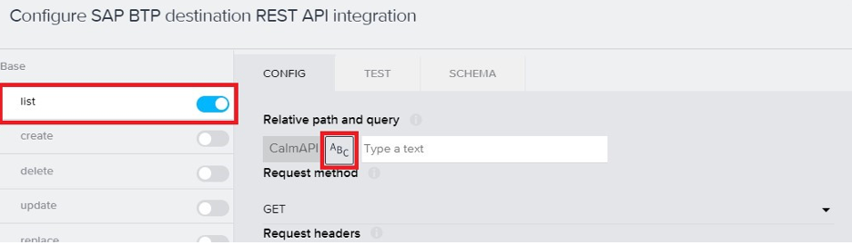
7. Enable your list operation to be able to list all of the tasks. 
8. . Click on the little **ABC** to set your relative path to a SAP Build formula.
   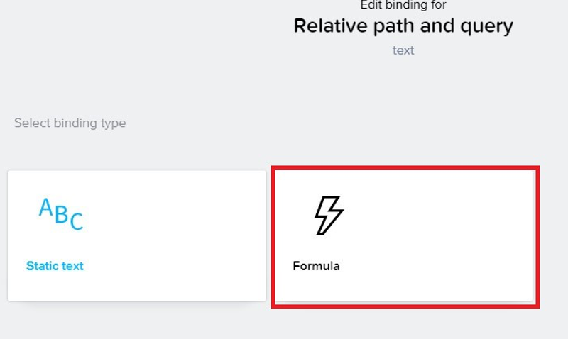
9.  Write the following text into the editing section of the formula editing page.
    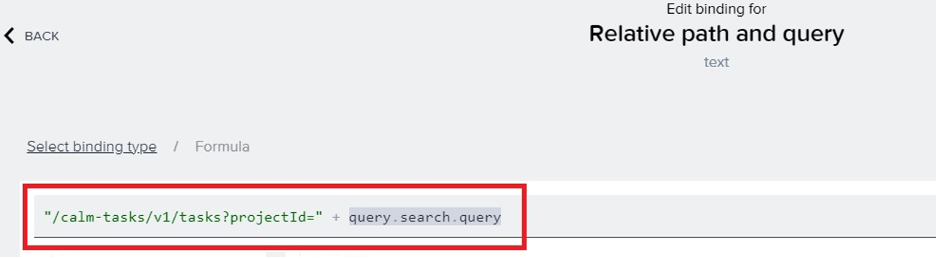
10. The string part is the link to your **Task** endpoint, the **query.search.query** to get tasks that are specific to a certain Project. 
    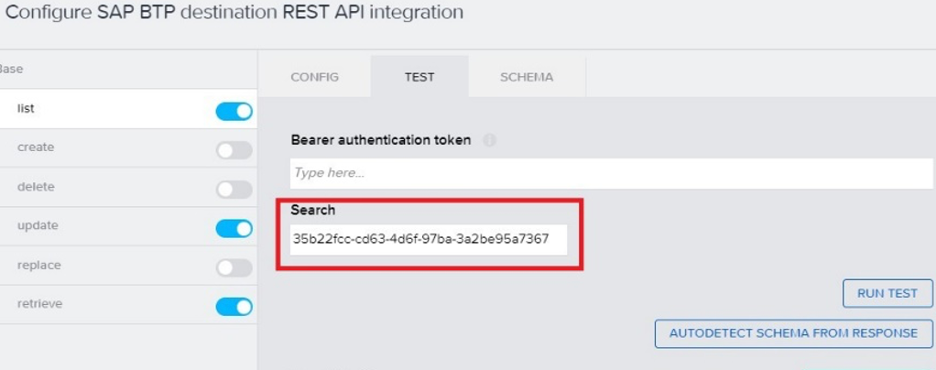

Once the relative path is given, you can test out to see if the connection to your endpoint is possible. 

1. Give it a projectId in the search part of the test page. 
2. With this parameter given you can click on **RUN TEST** and see if you have a “Status: OK” response.
3. Once you have this response click on **AUTODETECT SCHEMA FROM RESPONSE** to be able to define the variables you will interact with.

### Create your data variable for the Task data entity
When you are done creating your data entity, you now need to create a data variable on a new page to be able to get the information to display.

To create the connection between the two pages you first need to create a **Page parameter** on your new task page.

1. Navigate to the variables section of your page.
2. Navigate to page parameters.
3. Click on **Add parameter**.
   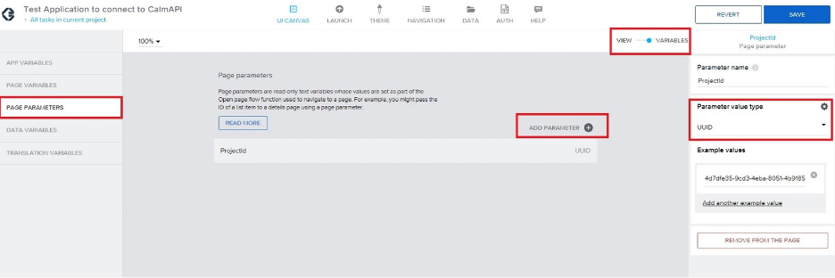
4. Name the page parameter ProjectId.
5. Set its value type to UUID. This will be the variable that will hold the ProjectId of the project you clicked on to display its tasks.

Once the page parameter created, you can now make your data variable. 

1. Navigate to the Data variable tab.
2. Click on **Add data variable**.
3. Choose the data entity you created for your Task Endpoint.
   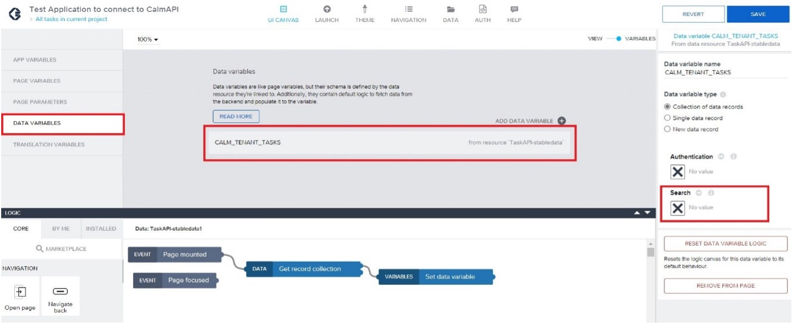
 
This variable is a “search variable” to indicate which project you want the tasks from.

1. Click on the little **X** under the Search parameter to navigate towards the formula edit screen.
2. Once in the formula edit screen add the following. This will pass the ProjectId parameter that you created before to your API to tell it which project you want the tasks from.
   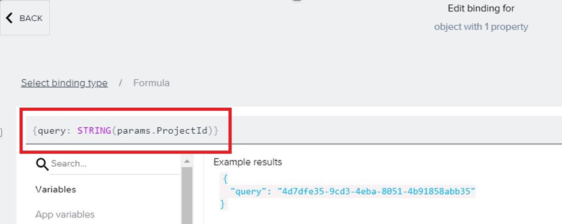
3. Save the data variable.

 
### Create the list of Tasks
You can now navigate back to your page view and create the list that will show all the tasks.

In the same way that you connected your Project list to the data variable you had created: 

1. Click on the repeated data.
2. Click on Data.
3. Click on variables then data variable.
4. Choose the variable you have created previously.
   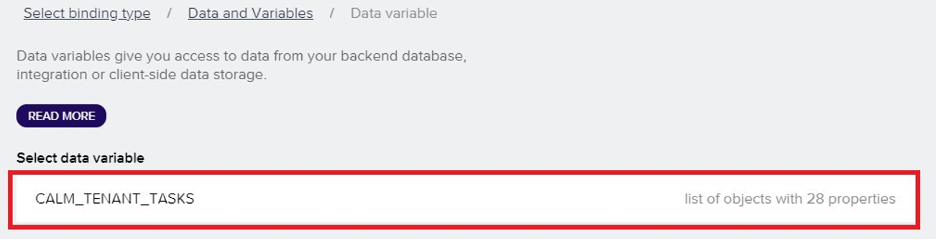

### Link the Project page and the Task Page
The last step to complete is the link between the Project page and the Task page.

1. Click on the list item.
2. Open the logic function of this item.
3. Add the **Open Page** item from the tab on the bottom left.
4. Drag this item onto your logic canvas.
   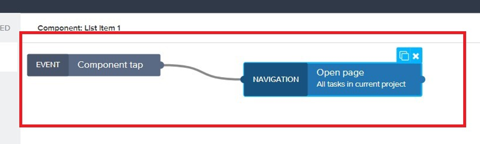
5. Connect the **Component tap** to the Open page item. This will allow us to open the task page when you click on a certain project.
   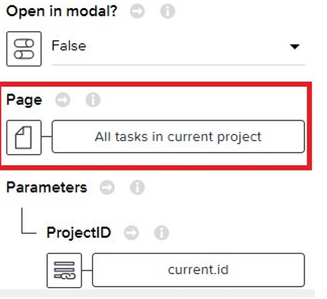

You can now link the page that you want opened when the item will be clicked on. Normally your project only having 2 pages, your task page should be directly set at the page that will open. If not, then you need to click on the little page and then choose your task page.

Give it a ProjectID parameter as you created a page parameter on your TaskPage:

1. Click on the **X** to change what variable it will give. 
2. Click on **Data item in repeat**
3. Choose **current** and then ID. This will allow to pass the ID of the project you have clicked on to the next page.
   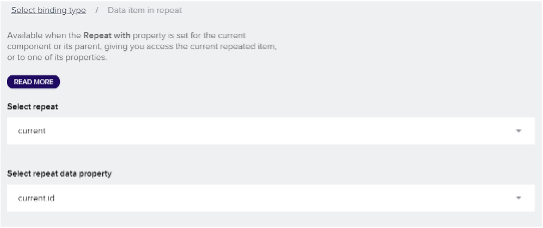

You should end up with the same parameters that were shown above. Now the linking to these pages is done!

When you open your application the Project page should open, and when a project is clicked on then the Task page showing all the titles of the tasks should appear!

