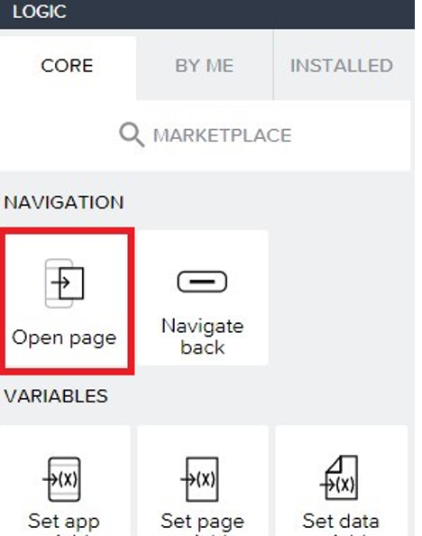

# SAP ALM API & Integration: Extension of SAP Cloud ALM with SAP Build (Part 2)
<!-- description --> You will be developing a simple Build Apps app where you can interact with your projects and tasks inside a given destination linking to your SAP Cloud ALM API.

## You will learn
- How to build a simple **Build Apps** application to interact with SAP Cloud ALM entities

## Prerequisites
- You need to have the connectivity setup between SAP Build Apps and SAP Cloud ALM.
- Check the previous [blog](https://developers.sap.com/tutorials/sap-cloud-alm-sap-build-process-automation-1.html
 ) to setup your SAP Build and SAP Cloud ALM environments

## Intro
In the end of this blog you will finish with a Projects and a Tasks page as shown below:

Clicking on a project it should send you to its Tasks page showing all tasks in this project.

### Creating a data entity linking to the Projects endpoint.
In the last tutorial you saw how to create a simple data entity linking to your main API. Here you will create a new one and link it to your projects endpoint.

In the last tutorial you also enabled the SAP BTP Authentication necessary for the next steps.

Navigate to the data tab at the top of the page. There you will be able to click on “Create Data Entity” and choose “Sap BTP Destination REST API integration”. After having done this a configuration tab for your data entity should open:

Once on this page you need to choose the BTP destination name to link it to your Sap Cloud ALM API destination:

You then need to activate one of the operations that will be executed on this destination.

As you are looking to retrieve all the projects that exist in your tenant you will need to activate the list operation. This will allow us to execute a GET on the API.

 
You enable your list operation on the left tab of the data entity configuration. To be able to extract the data want the relative path to your projects endpoint has to be given.

Now you can use the RUN TEST tab to test the linking to your API. When running the test you should end up with a  “Status:OK (200)”.

### Creating the Data Variable
You now have a working connection to your SAP Cloud ALM projects endpoint of your API. To access the information from your API inside the canvas, it needs to be linked to a data variable.

To do this you need to have a look at the variables tab on your page:

 
In the top right of the page, you select the variable view. you then click on Data variables. Here you can create variables in your page that will let us interact with your data entity. This will allow us to call your defined operations in that entity.

To create this variable you need to click on “Add Data Variable” and then select the data entity that you created in Step 1. (for example CALM_TENANT_PROJECTS”).

When selected you end up with the data variable on the screen and you then have access to its logic chart.

 
On the right side of the page are the characteristics of your variable. Here as you are getting all projects then it is a “Collection of data records” type of variable. This should be already selected, and no changes need to be done to this configuration.

You should end up with a data variable that looks like the screenshot above.

You now have a link to your API and a way to access it on your Page. Next, you should create a list that will show all the Projects.

 
### Creating the Projects list
To create a list containing all your projects you first must add a “List Item” onto your page.

Now that you have your list on the page you need to link it to your Data variable to show off all the projects.

The link to your Data variable is done with the “Repeat with” parameter of the list.

Here you click on the little symbol under the “Repeat with”. This will allow us to make your list repeat and show all the info on a certain item.

Continue to navigate towards your Data variable.

Our list is now going to be repeated on your Data variable and this allows us to display all the variables from your API.

To be able to show the Project names you need to link your list “Primary Label” to your Project names.

 
Click on the little button under the “Primary label” property. This is done to set the value that will appear on each square inside your list.

The next step is to use the data item in repeat.

Select “current” as your Select repeat and then current.name as your “Select repeat data property”. This will make your list show every project name that you have in your tenant. Follow this by clicking on save and you now have a list that will show all your Projects names!

To make this page a bit nicer you can use your Headline box to add a “Projects” as a title.

Once the page opened you should be able to see all the projects in your current tenant appear in a list format like follows:

 
### Creating the data variable for the Task endpoint
You now have a page with all the projects of your current tenant listed. What you want now is to able to click on one of those projects and have all the tasks of that projects show up.

To do this you first have to create a new data entity linking to your task endpoint.

In the same way you created your first data entity, you navigate to your data page, scroll down and click on create data entity. You choose “SAP BTP Destination REST API integration”. On the selection of Destination you do the same thing as step1, you choose the destination you created in the previous tutorial.

Now you need to connect it to your endpoint:

First enable your list operation to be able to list all of the tasks. After you need to click on the little “ABC”, here you will set your relative path to a SAP Build formula.

 
This opens up the formula editing page that allows us to add functions or text. You need to write the following text into the editing section:

The string part is the link to your Task endpoint, the “query.search.query” is what will allow us to get tasks that are specific to a certain Project. This will be a variable that will be given when you click on a project.

Once the relative path is given, you can test out to see if the connection to your endpoint is possible. To do this you need to give it a projectId in the search part of the test page. With this parameter given you can click on “RUN TEST” and see if you have a “Status: OK” response.

Once you have this response click on “AUTODETECT SCHEMA FROM RESPONSE” to be able to define the variables you will interact with.

### Creating your data variable for the Task data entity
When you are done creating your data entity, you now need to create a data variable on a new page to be able to get the information to display.

To create the connection between the two pages you first need to create a “Page parameter” on your new task page.

To do this you need to navigate to the variables section of your page, then page parameters and click on “Add parameter”

Here you named the page parameter ProjectId, and set its value type to UUID.

This will be the variable that will hold the ProjectId of the project you clicked on to display its tasks.

Once the page parameter created, you can now make your data variable. In the same way you created the last one for the projects page, you navigate to the Data variable tab, click on “Add data variable” and then choose the data entity you created for your Task Endpoint.

 
This variable is a “search variable” to indicate which project you want the tasks from.

Click on the little “X” that should be under the Search parameter to navigate towards the formula edit screen.

Once in the formula edit screen you want to add the following:

This will pass the ProjectId parameter that you created before to your API to tell it which project you want the tasks from.

Once this is done you can save the data variable.

 
### Creating the list of Tasks
You can now navigate back to your page view and create the list that will show all the tasks.

To do this you can add the list item in your canvas the same way you did for the project list.

In the same way that you connected your Project list to the data variable you had created, you need to click on the repeated data, then Data and variables, then data variable and then choose the variable you have created previously.

### Linking the Project page and the Task Page
The last step to complete is the link between
 the Project page and the Task page.

Click on the list item and open the logic function of this item.

You must then add the “Open Page” item from the tab on the bottom left.

Drag this item onto your logic canvas to be able to use it.

Connect the “Component tap” to the Open page item. This will allow us to open the task page when you click on a certain project.

You can now link the page that you want opened when the item will be clicked on. Normally your project only having 2 pages, your task page should be directly set at the page that will open. If not, then you need to click on the little page and then choose your task page.

You now need to give it a ProjectID parameter as you created a page parameter on your TaskPage.

To do this click on the “X” to change what variable it will give. you then click on “Data item in repeat” and then you choose “current” and then ID. This will allow us to pass the ID of the project you have clicked on to the next page.

You should end up with the same parameters that were shown above. Now the linking to these pages is done!

When you open your application the Project page should open, and when a project is clicked on then the Task page showing all the titles of the tasks should appear!

