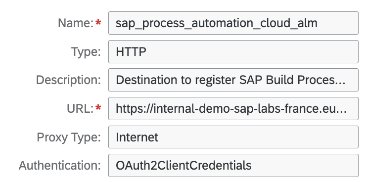
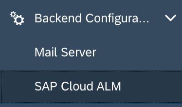
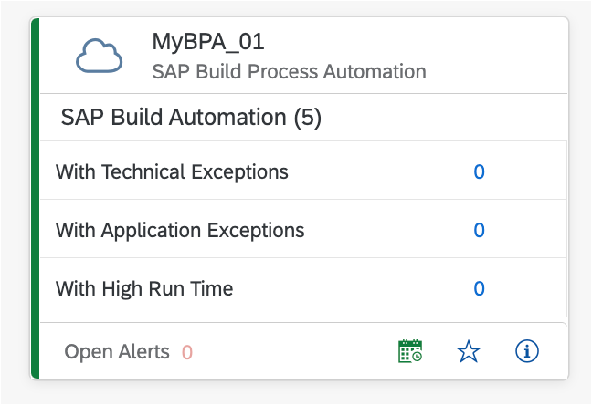
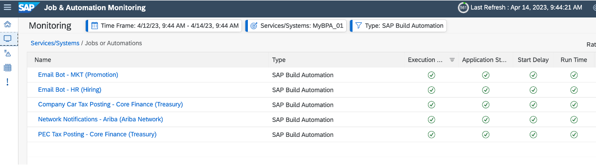
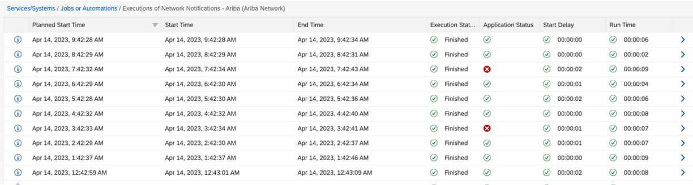

# SAP Cloud ALM: Activate SAP Build Process Automation Monitoring
<!-- description --> This tutorial describes how to activate SAP Build Process Automation Monitoring in SAP Cloud ALM.

## You will learn
- How to connect your SAP Build Process Automation tenant to your SAP Cloud ALM tenant.
- How to activate the monitoring of your SAP Build Process Automation with SAP Cloud ALM.

## Prerequisites
- You need a user with the "Destination Administrator" authorizations in the SAP BTP sub-account in which SAP Build Process Automation is subscribed.
- You need to obtain the SAP Cloud ALM Service Key to connect to the SAP Cloud ALM system.
- An instance for SAP Cloud ALM API has been created. Find more information [here](https://support.sap.com/en/alm/sap-cloud-alm/operations/expert-portal/integration-monitoring/calm-connect.html).
- You must have "Space Developer" access for the space in which the instance was created in your SAP Cloud ALM sub-account in the SAP Business Technology Platform.

## Introduction
**SAP Build Process Automation**

SAP Build Process Automation enables everyone no matter the skill level to automate processes and tasks with drag-and-drop simplicity: https://community.sap.com/topics/process-automation.

SAP Build Process Automation is a citizen developer solution to adapt, improve, and innovate business processes with no-code workflow management and robotic process automation capabilities.

SAP Build Process Automation brings together in one platform a **workflow management** and a **robotic process automation** capabilities.

**SAP Cloud ALM**

SAP Cloud ALM helps you to **implement** and **operate** intelligent cloud and hybrid business solutions: https://support.sap.com/en/alm/sap-cloud-alm.html.

You benefit from an out-of-the-box, native cloud solution, designed as the central entry point to manage your SAP landscape with content-driven guided implementation and highly automated operations.

SAP Cloud ALM is included in your cloud subscription and in SAP Enterprise Support.

### Obtain SAP Cloud ALM Service Key

You need to obtain the SAP Cloud ALM Service Key to connect to the SAP Cloud ALM system.

1. Log on to the **SAP BTP cockpit**.
2. Click on your SAP Cloud ALM global account, then on your **SAP Cloud ALM sub-account**.
3. In the navigation panel, choose **Services > Instances and Subscriptions**.
4. Under **Instances** click on the relevant instance of the service SAP Cloud ALM API
5. In the area that opens, choose **Service Keys**.
6. You see your service key in JSON format. The key includes the `application URL` (**endpoints.Api**), `token URL` (**uaa.url**), `client ID`, and `client secret`.

Check the [support portal](https://support.sap.com/en/alm/sap-cloud-alm/operations/expert-portal/integration-monitoring/calm-connect.html) for more information

### Create Destination in BTP Cockpit
To enable SAP Build Process Automation to send monitoring data to SAP Cloud ALM, you need to create a BTP destination to your SAP Cloud ALM tenant in the SAP BTP sub-account in which SAP Build Process Automation is subscribed.

The SAP BTP Destination should be named: **sap_process_automation_cloud_alm**.

1. Log on to SAP BTP Cockpit and navigate to the sub-account for your SAP Build Process Automation.
Go to **Connectivity > Destinations**.
2. Click on **New Destination**.
   - Name: Enter a name for the destination as `sap_process_automation_cloud_alm`,
   - Type: `HTTP`,
   - URL: SAP Cloud ALM service key parameter `endpoints.Api` without api (make sure to keep the / at the end),
   - Authentication: Select `OAuth2ClientCredentials`,
   - Client ID: SAP Cloud ALM service key parameter `clientid`,
   - Client Secret: SAP Cloud ALM service key parameter `clientsecret`
   - Token Service URL: SAP Cloud ALM service key parameter `uaa.url` url + `/oauth/token`.
3. **Save** the destination.
   

Check the [support portal](https://support.sap.com/en/alm/sap-cloud-alm/operations/expert-portal/setup-managed-services/setup-spa.html) for more information on how to set SAP Build Process Automation monitoring in SAP Cloud ALM.

### Activate Monitoring Use-Cases 
1. Connect to the SAP Build Process Automation lobby.
2. Navigate to the **Setting** tab
3. Goto **Backend Configuration** and select **SAP Cloud ALM**:
   
    
4. Register your SAP Build Process Automation service into your SAP Cloud ALM:
   - Enter a **service name** and a **service description**
    
   -   Click **Register**
5.  Activate the data collection for the following use-cases:
    - Jobs Monitoring
    - Health Monitoring
6. **Save** the configuration.

### Adjust Monitoring in SAP Cloud ALM 
After setting up the monitoring data push to SAP Cloud ALM in your SAP Build Process Automation service, the data collection for the use-cases will be activated automatically with the default monitoring configurations. 

You can adjust the monitoring setup within the monitoring application: 
- Jobs Monitoring, 
- Health Monitoring.

Find more information on the configuration on the **Setup & Configuration** pages for each application. 

### Check Results in SAP Cloud ALM 
The `Jobs and Automation Monitoring` application reports the jobs activities of your SAP Build Process Automation tenant. 

    

The **details view** gives you access to the status of single `jobs` triggered by your workflows instances.

    

Finally, each single `jobs instances` can also be controlled with the possibility to trigger alerts.

    

In the next tutorial, we will create a SAP Cloud ALM subscription for SAP Build Process Automation.

